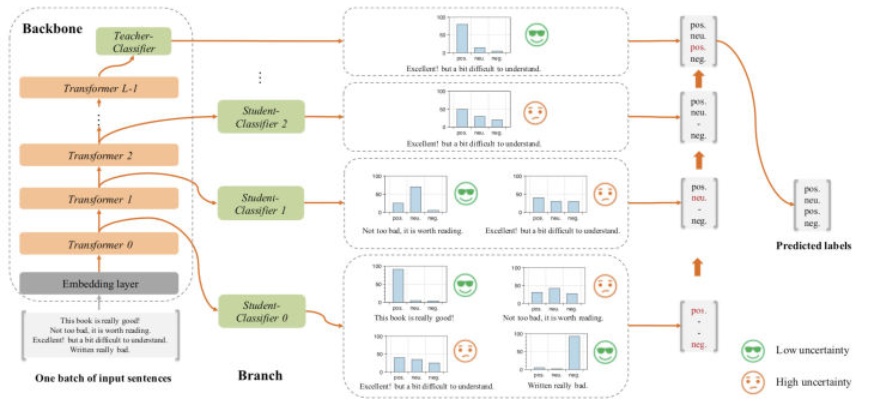
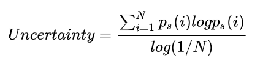

# 【关于 FastBERT 实现】那些你不知道的事

> 作者：杨夕 </br>
> 
> 个人github：https://github.com/km1994/nlp_paper_study </br>
> 
> 【注：手机阅读可能图片打不开！！！】

> 论文地址：https://arxiv.org/abs/2004.02178
> 
> github：https://github.com/autoliuweijie/FastBERT

## 目录

- [【关于 FastBERT 实现】那些你不知道的事](#关于-fastbert-实现那些你不知道的事)
  - [目录](#目录)
  - [一、动机](#一动机)
  - [二、模型结构介绍](#二模型结构介绍)
    - [2.1 模型结构介绍](#21-模型结构介绍)
    - [2.2 样本自适应机制（Sample-wise adaptive mechanism）](#22-样本自适应机制sample-wise-adaptive-mechanism)
    - [2.3 自蒸馏（Self-distillation）](#23-自蒸馏self-distillation)
    - [2.4 模型训练与推理](#24-模型训练与推理)
  - [三、模型实现](#三模型实现)
    - [3.1 BERT 类似模块](#31-bert-类似模块)
    - [3.2 FastBert 每层Transformer 分类器实现](#32-fastbert-每层transformer-分类器实现)
    - [3.3 FastBert 整体框架 FastBERTGraph 实现](#33-fastbert-整体框架-fastbertgraph-实现)
  - [参考资料](#参考资料)


## 一、动机

- 计算资源 占用问题，eg：BERT Large、GPT2、Megatron-LM...;
- BERT 瘦身来提升速度
  - trick：
    - 剪枝：剪掉多余的连接、多余的注意力头、甚至LayerDrop[1]直接砍掉一半Transformer层
    - 量化：把FP32改成FP16或者INT8；
    - 蒸馏：用一个学生模型来学习大模型的知识，不仅要学logits，还要学attention score；
  - 问题：
    - 精度的下降
      - 剪枝会直接降低模型的拟合能力；
      - 量化虽然有提升但也有瓶颈；
      - 蒸馏的不确定性最大，很难预知你的BERT教出来怎样的学生；

## 二、模型结构介绍

### 2.1 模型结构介绍



> 原BERT模型称为主干（Backbone）;
> 每个分类器称为分支（Branch）

### 2.2 样本自适应机制（Sample-wise adaptive mechanism）

- 思路：
  - 在每层Transformer后都去预测样本标签，如果某样本预测结果的置信度很高，就不用继续计算了，就是自适应调整每个样本的计算量，容易的样本通过一两层就可以预测出来，较难的样本则需要走完全程。
- 操作：
  - 给每层后面接一个分类器，毕竟分类器比Transformer需要的成本小多了

### 2.3 自蒸馏（Self-distillation）

- 思路：
  - 在预训练和精调阶段都只更新主干参数；
  - 精调完后freeze主干参数，用分支分类器（图中的student）蒸馏主干分类器（图中的teacher）的概率分布
- 优点：
  - 非蒸馏的结果没有蒸馏要好
  - 不再依赖于标注数据。蒸馏的效果可以通过源源不断的无标签数据来提升

### 2.4 模型训练与推理

了解模型结构之后，训练与推理也就很自然了。只比普通的BERT模型多了自蒸馏这个步骤：

1. Pre-training：同BERT系模型是一样的；
2. Fine-tuning for Backbone：主干精调，也就是给BERT最后一层加上分类器，用任务数据训练，这里也用不到分支分类器，可以尽情地优化；
3. Self-distillation for branch：分支自蒸馏，用无标签任务数据就可以，将主干分类器预测的概率分布蒸馏给分支分类器。这里使用KL散度衡量分布距离，loss是所有分支分类器与主干分类器的KL散度之和；
4. Adaptive inference：自适应推理，及根据分支分类器的结果对样本进行层层过滤，简单的直接给结果，困难的继续预测。这里作者定义了新的不确定性指标，用预测结果的熵来衡量，熵越大则不确定性越大：



## 三、模型实现

### 3.1 BERT 类似模块

这部分内容和 Bert 类似，这里不做介绍

```s
class BertConfig(object):
    """Configuration class to store the configuration of a `BertModel`.
    """
    def __init__(self,
                vocab_size,
                hidden_size=768,
                num_hidden_layers=12,
                num_attention_heads=12,
                intermediate_size=3072,
                hidden_act="gelu",
                hidden_dropout_prob=0.1,
                attention_probs_dropout_prob=0.1,
                max_position_embeddings=512,
                type_vocab_size=16,
                initializer_range=0.02):
        """Constructs BertConfig.

        Args:
            vocab_size: Vocabulary size of `inputs_ids` in `BertModel`.
            hidden_size: Size of the encoder layers and the pooler layer.
            num_hidden_layers: Number of hidden layers in the Transformer encoder.
            num_attention_heads: Number of attention heads for each attention layer in
                the Transformer encoder.
            intermediate_size: The size of the "intermediate" (i.e., feed-forward)
                layer in the Transformer encoder.
            hidden_act: The non-linear activation function (function or string) in the
                encoder and pooler.
            hidden_dropout_prob: The dropout probabilitiy for all fully connected
                layers in the embeddings, encoder, and pooler.
            attention_probs_dropout_prob: The dropout ratio for the attention
                probabilities.
            max_position_embeddings: The maximum sequence length that this model might
                ever be used with. Typically set this to something large just in case
                (e.g., 512 or 1024 or 2048).
            type_vocab_size: The vocabulary size of the `token_type_ids` passed into
                `BertModel`.
            initializer_range: The sttdev of the truncated_normal_initializer for
                initializing all weight matrices.
        """
        self.vocab_size = vocab_size
        self.hidden_size = hidden_size
        self.num_hidden_layers = num_hidden_layers
        self.num_attention_heads = num_attention_heads
        self.hidden_act = hidden_act
        self.intermediate_size = intermediate_size
        self.hidden_dropout_prob = hidden_dropout_prob
        self.attention_probs_dropout_prob = attention_probs_dropout_prob
        self.max_position_embeddings = max_position_embeddings
        self.type_vocab_size = type_vocab_size
        self.initializer_range = initializer_range

    @classmethod
    def from_dict(cls, json_object):
        """Constructs a `BertConfig` from a Python dictionary of parameters."""
        config = BertConfig(vocab_size=None)
        for (key, value) in six.iteritems(json_object):
            config.__dict__[key] = value
        return config

    @classmethod
    def from_json_file(cls, json_file):
        """Constructs a `BertConfig` from a json file of parameters."""
        with open(json_file, "r") as reader:
            text = reader.read()
        return cls.from_dict(json.loads(text))

    def to_dict(self):
        """Serializes this instance to a Python dictionary."""
        output = copy.deepcopy(self.__dict__)
        return output

    def to_json_string(self):
        """Serializes this instance to a JSON string."""
        return json.dumps(self.to_dict(), indent=2, sort_keys=True) + "\n"


class BERTLayerNorm(nn.Module):
    def __init__(self, config, variance_epsilon=1e-12):
        """Construct a layernorm module in the TF style (epsilon inside the square root).
        """
        super(BERTLayerNorm, self).__init__()
        self.gamma = nn.Parameter(torch.ones(config.hidden_size))
        self.beta = nn.Parameter(torch.zeros(config.hidden_size))
        self.variance_epsilon = variance_epsilon

    def forward(self, x):
        u = x.mean(-1, keepdim=True)
        s = (x - u).pow(2).mean(-1, keepdim=True)
        x = (x - u) / torch.sqrt(s + self.variance_epsilon)
        return self.gamma * x + self.beta

class BERTEmbeddings(nn.Module):
    def __init__(self, config):
        super(BERTEmbeddings, self).__init__()
        """Construct the embedding module from word, position and token_type embeddings.
        """
        self.word_embeddings = nn.Embedding(config.vocab_size, config.hidden_size)
        self.position_embeddings = nn.Embedding(config.max_position_embeddings, config.hidden_size)
        self.token_type_embeddings = nn.Embedding(config.type_vocab_size, config.hidden_size)

        # self.LayerNorm is not snake-cased to stick with TensorFlow model variable name and be able to load
        # any TensorFlow checkpoint file
        self.LayerNorm = BERTLayerNorm(config)
        self.dropout = nn.Dropout(config.hidden_dropout_prob)

    def forward(self, input_ids, token_type_ids=None):
        seq_length = input_ids.size(1)
        position_ids = torch.arange(seq_length, dtype=torch.long, device=input_ids.device)
        position_ids = position_ids.unsqueeze(0).expand_as(input_ids)
        if token_type_ids is None:
            token_type_ids = torch.zeros_like(input_ids)

        words_embeddings = self.word_embeddings(input_ids)
        position_embeddings = self.position_embeddings(position_ids)
        token_type_embeddings = self.token_type_embeddings(token_type_ids)

        embeddings = words_embeddings + position_embeddings + token_type_embeddings
        embeddings = self.LayerNorm(embeddings)
        embeddings = self.dropout(embeddings)
        return embeddings


class BERTSelfAttention(nn.Module):
    def __init__(self, config, hidden_size=None, num_attention_heads=None):
        super(BERTSelfAttention, self).__init__()
        if hidden_size == None:
            hidden_size = config.hidden_size
        if num_attention_heads == None:
            num_attention_heads = config.num_attention_heads

        if hidden_size % num_attention_heads != 0:
            raise ValueError(
                "The hidden size (%d) is not a multiple of the number of attention "
                "heads (%d)" % (hidden_size, num_attention_heads))

        self.num_attention_heads = num_attention_heads
        self.attention_head_size = int(hidden_size / self.num_attention_heads)
        self.all_head_size = self.num_attention_heads * self.attention_head_size

        self.query = nn.Linear(hidden_size, self.all_head_size)
        self.key = nn.Linear(hidden_size, self.all_head_size)
        self.value = nn.Linear(hidden_size, self.all_head_size)

        self.dropout = nn.Dropout(config.attention_probs_dropout_prob)

    def transpose_for_scores(self, x):
        new_x_shape = x.size()[:-1] + (self.num_attention_heads, self.attention_head_size)
        x = x.view(*new_x_shape)
        return x.permute(0, 2, 1, 3)

    def forward(self, hidden_states, attention_mask, use_attention_mask=True):
        mixed_query_layer = self.query(hidden_states)
        mixed_key_layer = self.key(hidden_states)
        mixed_value_layer = self.value(hidden_states)

        query_layer = self.transpose_for_scores(mixed_query_layer)
        key_layer = self.transpose_for_scores(mixed_key_layer)
        value_layer = self.transpose_for_scores(mixed_value_layer)

        # Take the dot product between "query" and "key" to get the raw attention scores.
        attention_scores = torch.matmul(query_layer, key_layer.transpose(-1, -2))
        attention_scores = attention_scores / math.sqrt(self.attention_head_size)
        # Apply the attention mask is (precomputed for all layers in BertModel forward() function)
        if use_attention_mask: 
            attention_scores = attention_scores + attention_mask

        # Normalize the attention scores to probabilities.
        attention_probs = nn.Softmax(dim=-1)(attention_scores)

        # This is actually dropping out entire tokens to attend to, which might
        # seem a bit unusual, but is taken from the original Transformer paper.
        attention_probs = self.dropout(attention_probs)

        context_layer = torch.matmul(attention_probs, value_layer)
        context_layer = context_layer.permute(0, 2, 1, 3).contiguous()
        new_context_layer_shape = context_layer.size()[:-2] + (self.all_head_size,)
        context_layer = context_layer.view(*new_context_layer_shape)
        return context_layer


class BERTSelfOutput(nn.Module):
    def __init__(self, config):
        super(BERTSelfOutput, self).__init__()
        self.dense = nn.Linear(config.hidden_size, config.hidden_size)
        self.LayerNorm = BERTLayerNorm(config)
        self.dropout = nn.Dropout(config.hidden_dropout_prob)

    def forward(self, hidden_states, input_tensor):
        hidden_states = self.dense(hidden_states)
        hidden_states = self.dropout(hidden_states)
        hidden_states = self.LayerNorm(hidden_states + input_tensor)
        return hidden_states


class BERTAttention(nn.Module):
    def __init__(self, config):
        super(BERTAttention, self).__init__()
        self.self = BERTSelfAttention(config)
        self.output = BERTSelfOutput(config)

    def forward(self, input_tensor, attention_mask):
        self_output = self.self(input_tensor, attention_mask)
        #print(self_output.shape)
        attention_output = self.output(self_output, input_tensor)
        return attention_output


class BERTIntermediate(nn.Module):
    def __init__(self, config):
        super(BERTIntermediate, self).__init__()
        self.dense = nn.Linear(config.hidden_size, config.intermediate_size)
        self.intermediate_act_fn = ACT2FN[config.hidden_act] \
            if isinstance(config.hidden_act, str) else config.hidden_act

    def forward(self, hidden_states):
        hidden_states = self.dense(hidden_states)
        hidden_states = self.intermediate_act_fn(hidden_states)
        return hidden_states


class BERTOutput(nn.Module):
    def __init__(self, config):
        super(BERTOutput, self).__init__()
        self.dense = nn.Linear(config.intermediate_size, config.hidden_size)
        self.LayerNorm = BERTLayerNorm(config)
        self.dropout = nn.Dropout(config.hidden_dropout_prob)

    def forward(self, hidden_states, input_tensor):
        hidden_states = self.dense(hidden_states)
        hidden_states = self.dropout(hidden_states)
        hidden_states = self.LayerNorm(hidden_states + input_tensor)
        return hidden_states


class BERTLayer(nn.Module):
    def __init__(self, config):
        super(BERTLayer, self).__init__()
        self.attention = BERTAttention(config)
        self.intermediate = BERTIntermediate(config)
        self.output = BERTOutput(config)

    def forward(self, hidden_states, attention_mask):
        attention_output = self.attention(hidden_states, attention_mask)
        intermediate_output = self.intermediate(attention_output)
        layer_output = self.output(intermediate_output, attention_output)
        return layer_output
```


### 3.2 FastBert 每层Transformer 分类器实现

FastBert 每层Transformer 分类器实现

```s
class FastBERTClassifier(nn.Module):
    def __init__(self, config, op_config):
        super(FastBERTClassifier, self).__init__()

        cls_hidden_size = op_config["cls_hidden_size"]
        num_attention_heads = op_config['cls_num_attention_heads']
        num_class = op_config["num_class"]

        self.dense_narrow = nn.Linear(config.hidden_size, cls_hidden_size)
        self.selfAttention = BERTSelfAttention(config, hidden_size=cls_hidden_size, num_attention_heads=num_attention_heads)
        self.dense_prelogits = nn.Linear(cls_hidden_size, cls_hidden_size)
        self.dense_logits = nn.Linear(cls_hidden_size, num_class)

    def forward(self, hidden_states):
        states_output = self.dense_narrow(hidden_states)
        states_output = self.selfAttention(states_output, None, use_attention_mask=False)
        token_cls_output =  states_output[:, 0]
        prelogits = self.dense_prelogits(token_cls_output)
        logits = self.dense_logits(prelogits)
        return logits
```

### 3.3 FastBert 整体框架 FastBERTGraph 实现

FastBert 整体框架 FastBERTGraph 实现，具体可以查看代码实现：

```s
class FastBERTGraph(nn.Module):
    def __init__(self, bert_config, op_config):
        super(FastBERTGraph, self).__init__()
        # step 1：定义 Transformer 层
        bert_layer = BERTLayer(bert_config)
        self.layers = nn.ModuleList([copy.deepcopy(bert_layer) for _ in range(bert_config.num_hidden_layers)])    

        # step 2：定义 Transformer 层 分类器
        self.layer_classifier = FastBERTClassifier(bert_config, op_config)
        self.layer_classifiers = nn.ModuleDict()
        ## 分支（Branch）分类器
        for i in range(bert_config.num_hidden_layers - 1):
            self.layer_classifiers['branch_classifier_'+str(i)] = copy.deepcopy(self.layer_classifier)
        ## 主干（Backbone）分类器
        self.layer_classifiers['final_classifier'] = copy.deepcopy(self.layer_classifier)
        # step 3：交叉熵损失函数
        self.ce_loss_fct = nn.CrossEntropyLoss()
        self.num_class = torch.tensor(op_config["num_class"], dtype=torch.float32)


    def forward(self, hidden_states, attention_mask, labels=None, inference=False, inference_speed=0.5, training_stage=0):
        #-----Inference阶段,第i层student不确定性低则动态提前返回----#
        if inference:
            uncertain_infos = [] 
            for i, (layer_module, (k, layer_classifier_module)) in enumerate(zip(self.layers, self.layer_classifiers.items())):
                hidden_states = layer_module(hidden_states, attention_mask)
                logits = layer_classifier_module(hidden_states)
                prob = F.softmax(logits, dim=-1)
                log_prob = F.log_softmax(logits, dim=-1)
                uncertain = torch.sum(prob * log_prob, 1) / (-torch.log(self.num_class))
                uncertain_infos.append([uncertain, prob])

                #提前返回结果
                if uncertain < inference_speed:
                    return prob, i, uncertain_infos
            return prob, i, uncertain_infos
        #------训练阶段, 第一阶段初始训练, 第二阶段蒸馏训练--------#
        else:
            #初始训练，和普通训练一致
            if training_stage == 0:
                for layer_module in self.layers:
                    hidden_states = layer_module(hidden_states, attention_mask)
                logits = self.layer_classifier(hidden_states)
                loss = self.ce_loss_fct(logits, labels)
                return loss, logits
            #蒸馏训练，每层的student和teacher的KL散度作为loss
            else:
                all_encoder_layers = []
                for layer_module in self.layers:
                    hidden_states = layer_module(hidden_states, attention_mask)
                    all_encoder_layers.append(hidden_states)

                all_logits = []
                for encoder_layer, (k, layer_classifier_module) in zip(all_encoder_layers, self.layer_classifiers.items()):
                    layer_logits = layer_classifier_module(encoder_layer)
                    all_logits.append(layer_logits)
                    
                #NOTE:debug if freezed
                #print(self.layer_classifiers['final_classifier'].dense_narrow.weight)

                loss = 0.0
                teacher_log_prob = F.log_softmax(all_logits[-1], dim=-1)
                for student_logits in all_logits[:-1]:
                    student_prob = F.softmax(student_logits, dim=-1)
                    student_log_prob = F.log_softmax(student_logits, dim=-1)
                    uncertain = torch.sum(student_prob * student_log_prob, 1) / (-torch.log(self.num_class))
                    #print('uncertain:', uncertain[0])

                    D_kl = torch.sum(student_prob * (student_log_prob - teacher_log_prob), 1)
                    D_kl = torch.mean(D_kl)
                    loss += D_kl 
                return loss, all_logits
```

## 参考资料

1. [FastBERT：又快又稳的推理提速方法](https://zhuanlan.zhihu.com/p/127869267)
2. [ACL2020论文阅读笔记-FastBERT: a Self-distilling BERT with Adaptive Inference Time](https://blog.csdn.net/ljp1919/article/details/107578008)
