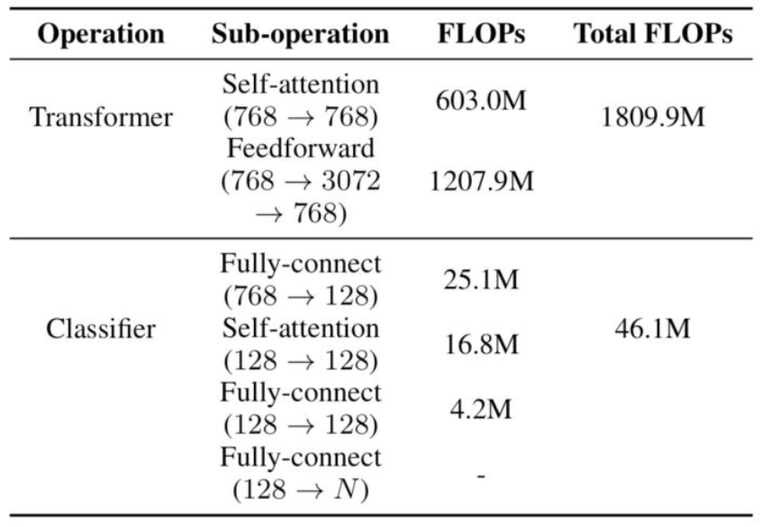

# 【关于 FastBERT 那些的你不知道的事

> 作者：杨夕
> 论文地址：https://arxiv.org/abs/2004.02178
> github：https://github.com/autoliuweijie/FastBERT

## 目录

- [【关于 FastBERT 那些的你不知道的事](#关于-fastbert-那些的你不知道的事)
  - [目录](#目录)
  - [背景](#背景)
  - [动机](#动机)
  - [模型介绍](#模型介绍)
  - [模型训练与推理](#模型训练与推理)
  - [总结](#总结)
  - [参考](#参考)

## 背景

自从BERT问世以来，大多数NLP任务的效果都有了一次质的飞跃。BERT Large在GLUE test上甚至提升了7个点之多。但BERT同时也开启了模型的“做大做深”之路，普通玩家根本训不起，高端玩家虽然训得起但也不一定用得起。

## 动机

- 计算资源 占用问题，eg：BERT Large、GPT2、Megatron-LM...;
- BERT 瘦身来提升速度
  - trick：
    - 剪枝：剪掉多余的连接、多余的注意力头、甚至LayerDrop[1]直接砍掉一半Transformer层
    - 量化：把FP32改成FP16或者INT8；
    - 蒸馏：用一个学生模型来学习大模型的知识，不仅要学logits，还要学attention score；
  - 问题：
    - 精度的下降
      - 剪枝会直接降低模型的拟合能力；
      - 量化虽然有提升但也有瓶颈；
      - 蒸馏的不确定性最大，很难预知你的BERT教出来怎样的学生；

## 模型介绍

- 思路：
  - 样本自适应机制（Sample-wise adaptive mechanism）
    - 思路：
      - 在每层Transformer后都去预测样本标签，如果某样本预测结果的置信度很高，就不用继续计算了，就是自适应调整每个样本的计算量，容易的样本通过一两层就可以预测出来，较难的样本则需要走完全程。
    - 操作：
      - 给每层后面接一个分类器，毕竟分类器比Transformer需要的成本小多了

- 模型结构

> 原BERT模型称为主干（Backbone）;
> 每个分类器称为分支（Branch）

- 自蒸馏（Self-distillation）
  - 思路：
    - 在预训练和精调阶段都只更新主干参数；
    - 精调完后freeze主干参数，用分支分类器（图中的student）蒸馏主干分类器（图中的teacher）的概率分布
  - 优点：
    - 非蒸馏的结果没有蒸馏要好
    - 不再依赖于标注数据。蒸馏的效果可以通过源源不断的无标签数据来提升

## 模型训练与推理

了解模型结构之后，训练与推理也就很自然了。只比普通的BERT模型多了自蒸馏这个步骤：

1. Pre-training：同BERT系模型是一样的，网上那么多开源的模型也可以随意拿来～
2. Fine-tuning for Backbone：主干精调，也就是给BERT最后一层加上分类器，用任务数据训练，这里也用不到分支分类器，可以尽情地优化
3. Self-distillation for branch：分支自蒸馏，用无标签任务数据就可以，将主干分类器预测的概率分布蒸馏给分支分类器。这里使用KL散度衡量分布距离，loss是所有分支分类器与主干分类器的KL散度之和
4. Adaptive inference：自适应推理，及根据分支分类器的结果对样本进行层层过滤，简单的直接给结果，困难的继续预测。这里作者定义了新的不确定性指标，用预测结果的熵来衡量，熵越大则不确定性越大：

## 总结

FastBERT是一个在工程上十分实用的模型，通过提前输出简单样本的预测结果，减少模型的计算负担，从而提高推理速度。虽然每层都多了一个分类器，但分类器的计算量也比Transformer小了两个数量级，对速度影响较小。后续的分支自蒸馏也设计的比较巧妙，可以利用无监督数据不断提升分支分类器的效果。

另外，Sample-wise adaptive mechanism和Self-distillation这两个idea也是在本文首次提出，相信会起到抛玉引玉的作用，衍生更多此类工作。论文本身也还有一些想象空间，比如分别优化每层分类器，因为在主干被freeze的情况下各个分支是独立的；或者自蒸馏后unfreeze主干，再加上有标签数据自蒸馏一把，说不定还会有性能提升。

## 参考

1. [FastBERT：又快又稳的推理提速方法](https://zhuanlan.zhihu.com/p/127869267)
2. [ACL2020论文阅读笔记-FastBERT: a Self-distilling BERT with Adaptive Inference Time](https://blog.csdn.net/ljp1919/article/details/107578008)