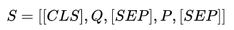
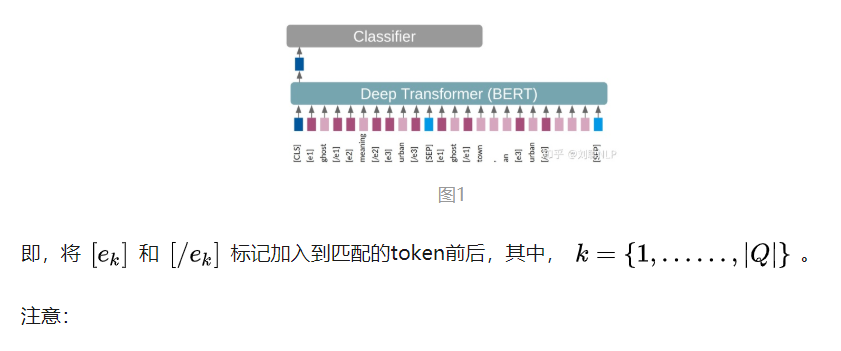
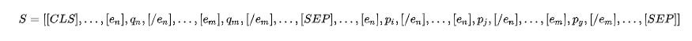

# MarkedBERT: Integrating Traditional IR Cues in Pre-trained Language Models for Passage Retrieval

> 编辑：杨夕
> 
> 项目地址：https://github.com/km1994/nlp_paper_study
> 
> 个人介绍：大佬们好，我叫杨夕，该项目主要是本人在研读顶会论文和复现经典论文过程中，所见、所思、所想、所闻，可能存在一些理解错误，希望大佬们多多指正。
> 
> 论文链接：https://dl.acm.org/doi/10.1145/3397271.3401194
> 
> 代码链接：https://github.com/BOUALILILila/markers_bert
> 
> 【注：手机阅读可能图片打不开！！！】

## 前言

目前，将预训练语言模型（BERT等）应用到信息检索领域（Information Retrieval，IR）任务中，已经取得了较好的效果。主流的方法是“Retrieve+Rerank”的pipline机制，**Retrieve模块一般使用传统的BM25等检索算法进行文档集合的粗排序得到一个较小的文档集合；Rerank模块一般使用BERT模型对retrieve模块检索出的文档进行精排序，通常是将问题和检索到的每个文档进行拼接后，作为BERT模型的输入，最后进行选择**。

> Q：上述描述的pipline机制中Rerank模块与Retrieve模块是脱节的，Rerank模块仅仅使用了Retrieve模块检索到的文档集合。那么如何将两个模块融合起来呢？
> 
> A：在Retrieve模块中，可以提取出问题与每个文档的一些特征，例如：最大公共子串长度、词匹配个数、词匹配率等。在Rerank模块，可以将Retrieve模块提取到的特征拼接到bert模型的输出向量上，最后进行排序。

加入手工提取特征是可以将Rerank模块与Retrieve模块融合，但是特征如何构建、选择是一个至关重要的问题。

而MarkedBERT模型，提出将精确匹配线索加入到BERT模型中，最终提高rerank模块效果。它受到2019年一篇关系提取论文（Matching the Blanks: Distributional Similarity for Relation Learning）的启发，使用marker tokens来突出实体（key tokens）可以极大地提高了BERT的性能。MarkedBERT模型，使用marker tokens来突出Retrieve模块阶段得到的问题与每个文档匹配的实体，加入到fine-tuning阶段，以提升排序效果。

## 方法介绍

### 基础介绍

模型以问题Q为Segment A ，以段落P为Segment B构建BERT的输入序列；在微调阶段，使用[CLS]向量作为关联分类向量构建passage-level point-wise classification。

### MarkedBERT

MarkedBERT模型的核心在于，在问题Q和段落P完全匹配的token前后，加入特殊token进行mask标记，如图1所示。

（1）不标记在document中未出现的query的term。

（2）如果某个term在query中重复出现，那么它将具有与第一次出现相同的标识符。

（3）如果document中的term，与query的term标识符一致。

## 参考资料

1. [SIGIR 2020之MarkedBERT模型：加入传统检索线索的Rerank模型](https://zhuanlan.zhihu.com/p/175981489)
