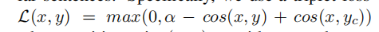
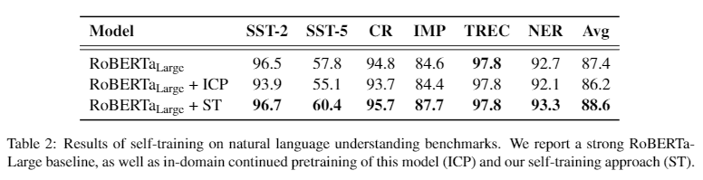
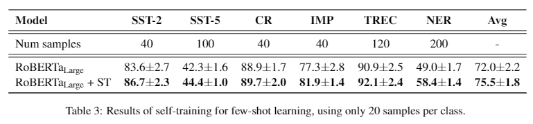
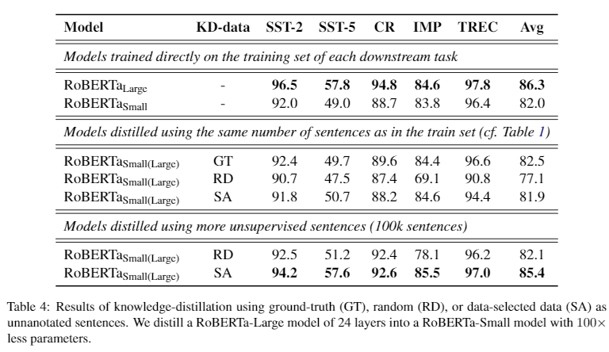
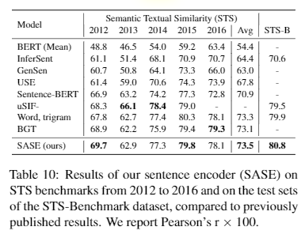
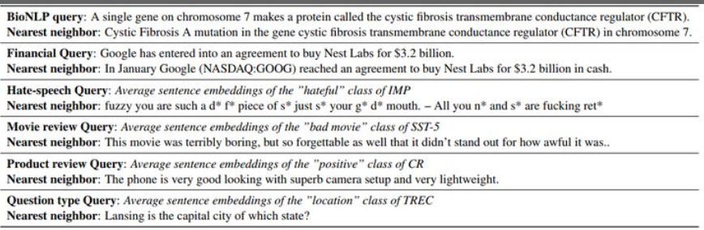

# 【关于自训练 + 预训练 = 更好的自然语言理解模型 】 那些的你不知道的事

> 作者：杨夕 
> 
> 个人github：https://github.com/km1994/nlp_paper_study 
> 
> 论文标题：Self-training Improves Pre-training for Natural Language Understanding
> 
> 论文代码 SentAugment ：https://github.com/facebookresearch/SentAugment
> 
> 论文地址：https://arxiv.org/abs/2010.02194
> 
> 个人介绍：大佬们好，我叫杨夕，该项目主要是本人在研读顶会论文和复现经典论文过程中，所见、所思、所想、所闻，可能存在一些理解错误，希望大佬们多多指正。
> 
> 【注：手机阅读可能图片打不开！！！】

## 目录

- [【关于自训练 + 预训练 = 更好的自然语言理解模型 】 那些的你不知道的事](#关于自训练--预训练--更好的自然语言理解模型--那些的你不知道的事)
  - [目录](#目录)
  - [一、摘要](#一摘要)
  - [二、前期知识](#二前期知识)
    - [2.1 预训练](#21-预训练)
    - [2.2 自训练](#22-自训练)
    - [2.3 区别](#23-区别)
  - [三、问题提出](#三问题提出)
  - [四、论文方法](#四论文方法)
  - [五、论文贡献](#五论文贡献)
  - [六、论文思路](#六论文思路)
    - [6.1 自训练处理流程](#61-自训练处理流程)
    - [6.2 SentAugment: data augmentation forsemi-supervised learning](#62-sentaugment-data-augmentation-forsemi-supervised-learning)
      - [6.2.1 Large-scale sentence bank【大型句子库 构建】](#621-large-scale-sentence-bank大型句子库-构建)
      - [6.2.2 Downstream task embeddings 【下游任务编码 构建】](#622-downstream-task-embeddings-下游任务编码-构建)
      - [6.2.3 Unsupervised data retrieval](#623-unsupervised-data-retrieval)
    - [6.3  Semi-supervised learning for naturallanguage understanding](#63--semi-supervised-learning-for-naturallanguage-understanding)
  - [七、实验结果分析](#七实验结果分析)
    - [7.1 自训练](#71-自训练)
    - [7.2 少样本学习与知识蒸馏](#72-少样本学习与知识蒸馏)
    - [7.3 Ablation study of data augmentation](#73-ablation-study-of-data-augmentation)
    - [7.4 Sentence embeddings (SASE) 句子编码的影响](#74-sentence-embeddings-sase-句子编码的影响)
    - [7.5 Examples of large-scale similarity search](#75-examples-of-large-scale-similarity-search)
  - [参考](#参考)

## 一、摘要

Unsupervised pre-training has led to much recent progress in natural language understanding. In this paper, we study self-training as another way to leverage unlabeled data through semi-supervised  learning. To  obtain  additional  data  for  a  specific  task,  we  introduce SentAugment,  a  data  augmentation  method which  computes  task-specific  query  embeddings from labeled data to retrieve sentences from a bank of billions of unlabeled sentences crawled from the web.  Unlike previous semi-supervised methods, our approach does not require  in domain  unlabeled  data  and  is  therefore more generally applicable.   Experiments show  that  self-training  is  complementary  tostrong  RoBERTa  baselines  on  a  variety  oftasks.    Our  augmentation  approach  leads  to scalable  and  effective  self-training  with  improvements  of  up  to  2.6%  on  standard  text classification  benchmarks.    Finally,  we  also show  strong  gains  on  knowledge-distillation and few-shot learning.

无监督的预训练导致自然语言理解方面的最新进展。

在本文中，我们将自训练作为通过半监督学习利用未标记数据的另一种方法。

为了获得针对特定任务的其他数据，我们引入了SentAugment，这是一种数据增强方法，可从标记的数据计算特定于任务的查询嵌入，以从网上爬行的数十亿个未标记的句子中检索句子。

与以前的半监督方法不同，我们的方法不需要域内未标记的数据，因此更通用。

实验表明，自训练是在各种任务上的强RoBERTa基线的补充。我们的扩充方法可实现可扩展且有效的自我训练，并在标准文本分类基准上提高了2.6％。最后，我们还显示出在知识提炼和少量学习方面的巨大收获。

## 二、前期知识

### 2.1 预训练

预训练（Pre-training）从广义上来讲，是指先在较大规模的数据上对模型训练一波，然后再在具体的下游任务数据中微调。大多数情况下，预训练的含义都比较狭窄：在大规模无标注语料上，用自监督的方式训练模型。这里的自监督方法一般指的是语言模型。

### 2.2 自训练

自训练是说有一个Teacher模型Ft和一个Student模型Fs，首先在标注数据上训练Ft，然后用它对大规模无标注数据进行标注，把得到的结果当做伪标注数据去训练Fs。

### 2.3 区别

预训练和自训练都用到了大规模无标注的数据，只是二者的处理过程不同。而且，其中非常重要的一点是，预训练始终对针对一个模型进行操作，而自训练却用到了两个模型，前者是直接从无标注数据中学习，而后者是间接地从数据中学习。

## 三、问题提出

- 问题一: do  pre-training and self-training capture the same information,  or  are  they  complementary? 【预训练和自训练会捕获相同的信息，还是它们是互补的？】
- 问题二: how can we obtain large amounts of unannotated data from specific domains?【如何从特定域中获取大量未注释的数据？】

## 四、论文方法

- 问题二解决方法：提出 SentAugment 方法 从 web 上获取有用数据；
- 问题一解决方法：使用标记的任务数据训练一个 teacher 模型，然后用它对检索到的未标注句子进行标注，并基于这个合成数据集训练最终的模型。

## 五、论文贡献

- 结合自训练与预训练，比单纯的预训练取得了大幅度的效果提升；
- 为了使伪标注数据更加契合下游的具体任务，提出了 SentAugment ，一种特定领域的数据抽取方法，减少通用语料造成的噪声干扰；
- 在知识蒸馏和小样本学习任务上也取得了突出的结果，证明自训练+预训练的优越性。

## 六、论文思路

### 6.1 自训练处理流程

1. 将一个预训练模型（本文使用RoBERTa_Large）在标注数据上训练，作为 Teacher 模型 Ft；
2. 使用 Ft 从海量通用语料中提取相关领域的数据；
3. 用 Ft 对提取的数据作标注；
4. 用伪标注语料训练学生模型Fs。

其中的1,3,4步都是确定的，所以我们重点关注如何使用Ft从海量通用语料库D中抽取出领域相关的语料D'。

### 6.2 SentAugment: data augmentation forsemi-supervised learning

#### 6.2.1 Large-scale sentence bank【大型句子库 构建】

- 数据来源：依赖于大规模的无监督语句语料库，这些语料库是从爬网的数据中得出的（Wenzeket等人，2019）。
- 思路：

1. 对 语料库中的文档进行 分句；
2. 利用 句子编码器 将 句子 编码为 句向量；
3. 利用 句向量 检索与特定任务相关的句子库的子集，所用的 损失函数：

> 注：其中 positive pairs(x,y) 是复述或平行句子（Wieting等人，2019a）和 $b_c$ are in-batch hard negatives (Wieting et al., 2016)

#### 6.2.2 Downstream task embeddings 【下游任务编码 构建】

- 动机：在 第 6.2.1 节 所构建的 句子编码，虽然能表示 通用语料库 D 中每个句子 s 的意义，但是无法 区别 这些句子 所属领域；
- 针对该问题，论文提出了一种思路：

1. 对于每个下游任务，使用相同的伪随机模型构建代表该任务的嵌入；
2. 使用这些任务嵌入从句子存储库中检索相似的句子，即 计算句子编码和任务编码的余弦值

- 余弦值 计算方法：
  - All-Average: 将训练 $f_T$ 所用的所有句子编码平均起来作为任务编码；
  - Label-Average: 将训练 $f_T$ 所用的每个类别的所有句子编码平均起来作为各个类别的任务编码；
  - Per-Sentence：将训练 $f_T$ 所用的每个句子都作为一个单独的任务编码。

#### 6.2.3 Unsupervised data retrieval

1. 相关领域数据召回：在获取任务编码后，根据余弦值大小，从通用语料库中抽取相关的句子，这可以减少通用语料对下游特定任务的噪声干扰。对于每个类别，只抽取Top-K个句子，并且对提取的句子，还要满足 $f_T$ 能取得较高的置信度。
2. 伪标签数据集 $D' = {(x,y)}$ 构建：利用 $f_T$ 对每个句子 x 进行预测，得到其软标签或者one-hot硬标签；

### 6.3  Semi-supervised learning for naturallanguage understanding

- 思路：利用 第 6.2.3 节 得到的 伪标签数据集 $D' = {(x,y)}$ 训练 $f_S$；
- 训练方式：
  
1. 自训练（Self-Training）：将另一个预训练的RoBERTa_Large作为 $f_S$，使用one-hot硬标签在 D’ 上训练；
2. 知识蒸馏（Knowledge-Distillation）：将一个预训练的RoBERTa_Small作为 $f_S$，使用软标签在 D’ 上训练；
3. 少样本学习（Few-Shot）：训练 $f_T$ 所使用的标注数据是少样本，伪标注语料的大小是标注数据的2~3个数量级，$f_S$ 是RoBERTa_Large，使用one-hot硬标签在 D‘+D 上训练。

## 七、实验结果分析

### 7.1 自训练

> 结论：没有伪标注数据，单纯的预训练不能很好地实现领域知识迁移，还要借助标注数据

### 7.2 少样本学习与知识蒸馏

> 结论：领域内自训练可以大幅提升少样本场景下的效果

### 7.3 Ablation study of data augmentation

> 结论：对知识蒸馏来说，自训练带来的数据增广也是很重要的

### 7.4 Sentence embeddings (SASE) 句子编码的影响

> 结论：复述与多语言掩码语言模型任务对于训练句子编码是很有帮助的

### 7.5 Examples of large-scale similarity search

> 注：如果是用Per-Sentence，那么抽取的句子就基本上是询问的转述；如果是用Label-Average，抽取的句子就符合该类别。基于句子编码与任务编码的抽取方法有能力得到满足条件的句子。

## 参考

1. [香侬读 | 自训练 + 预训练 = 更好的自然语言理解模型](https://zhuanlan.zhihu.com/p/268770394)
