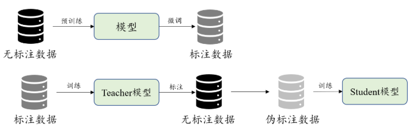
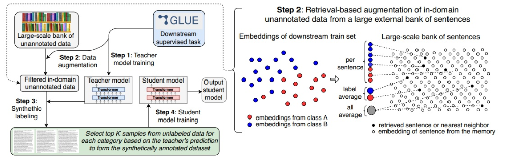

# 【关于自训练 + 预训练 = 更好的自然语言理解模型 】 那些的你不知道的事

> 作者：杨夕 
> 
> 个人github：https://github.com/km1994/nlp_paper_study 
> 
> 论文标题：Self-training Improves Pre-training for Natural Language Understanding
> 
> 论文地址：https://arxiv.org/abs/2010.02194
> 
> 个人介绍：大佬们好，我叫杨夕，该项目主要是本人在研读顶会论文和复现经典论文过程中，所见、所思、所想、所闻，可能存在一些理解错误，希望大佬们多多指正。
> 
> 【注：手机阅读可能图片打不开！！！】

## 目录

- [【关于自训练 + 预训练 = 更好的自然语言理解模型 】 那些的你不知道的事](#关于自训练--预训练--更好的自然语言理解模型--那些的你不知道的事)
  - [目录](#目录)
  - [摘要](#摘要)
  - [前期知识](#前期知识)
    - [预训练](#预训练)
    - [自训练](#自训练)
    - [区别](#区别)
  - [问题提出](#问题提出)
  - [论文方法](#论文方法)
  - [论文贡献](#论文贡献)
  - [论文思路](#论文思路)
    - [自训练处理流程](#自训练处理流程)
  - [参考](#参考)

## 摘要

Unsupervised pre-training has led to much recent progress in natural language understanding. In this paper, we study self-training as another way to leverage unlabeled data through semi-supervised  learning. To  obtain  additional  data  for  a  specific  task,  we  introduce SentAugment,  a  data  augmentation  method which  computes  task-specific  query  embeddings from labeled data to retrieve sentences from a bank of billions of unlabeled sentences crawled from the web.  Unlike previous semi-supervised methods, our approach does not require  in domain  unlabeled  data  and  is  therefore more generally applicable.   Experiments show  that  self-training  is  complementary  tostrong  RoBERTa  baselines  on  a  variety  oftasks.    Our  augmentation  approach  leads  to scalable  and  effective  self-training  with  improvements  of  up  to  2.6%  on  standard  text classification  benchmarks.    Finally,  we  also show  strong  gains  on  knowledge-distillation and few-shot learning.

无监督的预训练导致自然语言理解方面的最新进展。

在本文中，我们将自训练作为通过半监督学习利用未标记数据的另一种方法。

为了获得针对特定任务的其他数据，我们引入了SentAugment，这是一种数据增强方法，可从标记的数据计算特定于任务的查询嵌入，以从网上爬行的数十亿个未标记的句子中检索句子。

与以前的半监督方法不同，我们的方法不需要域内未标记的数据，因此更通用。

实验表明，自训练是在各种任务上的强RoBERTa基线的补充。我们的扩充方法可实现可扩展且有效的自我训练，并在标准文本分类基准上提高了2.6％。最后，我们还显示出在知识提炼和少量学习方面的巨大收获。

## 前期知识

### 预训练

预训练（Pre-training）从广义上来讲，是指先在较大规模的数据上对模型训练一波，然后再在具体的下游任务数据中微调。大多数情况下，预训练的含义都比较狭窄：在大规模无标注语料上，用自监督的方式训练模型。这里的自监督方法一般指的是语言模型。

### 自训练

自训练是说有一个Teacher模型Ft和一个Student模型Fs，首先在标注数据上训练Ft，然后用它对大规模无标注数据进行标注，把得到的结果当做伪标注数据去训练Fs。

### 区别

预训练和自训练都用到了大规模无标注的数据，只是二者的处理过程不同。而且，其中非常重要的一点是，预训练始终对针对一个模型进行操作，而自训练却用到了两个模型，前者是直接从无标注数据中学习，而后者是间接地从数据中学习。

## 问题提出

- 问题一: do  pre-training and self-training capture the same information,  or  are  they  complementary?
- 问题二: how can we obtain large amounts of unannotated data from specific domains?

## 论文方法

- 问题二解决方法：提出 SentAugment 方法 从 web 上获取有用数据；
- 问题一解决方法：使用标记的任务数据训练一个 teacher 模型，然后用它对检索到的未标注句子进行标注，并基于这个合成数据集训练最终的模型。

## 论文贡献

- 结合自训练与预训练，比单纯的预训练取得了大幅度的效果提升；
- 为了使伪标注数据更加契合下游的具体任务，提出了SentAugment，一种特定领域的数据抽取方法，减少通用语料造成的噪声干扰；
- 在知识蒸馏和小样本学习任务上也取得了突出的结果，证明自训练+预训练的优越性。

## 论文思路

### 自训练处理流程

1. 将一个预训练模型（本文使用RoBERTa_Large）在标注数据上训练，作为教师模型Ft；
2. 使用Ft从海量通用语料中提取相关领域的数据；
3. 用Ft对提取的数据作标注；
4. 用伪标注语料训练学生模型Fs。

其中的1,3,4步都是确定的，所以我们重点关注如何使用Ft从海量通用语料库D中抽取出领域相关的语料D'。

## 参考

1. [香侬读 | 自训练 + 预训练 = 更好的自然语言理解模型](https://zhuanlan.zhihu.com/p/268770394)
