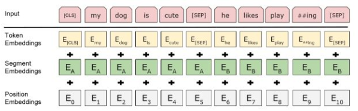
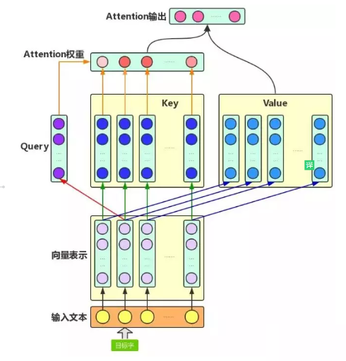

# 【关于 Bert 源码解析I 之 主体篇 】 那些的你不知道的事

> 作者：杨夕
> 
> 论文链接：https://arxiv.org/pdf/1810.04805.pdf
> 
> 本文链接：https://github.com/km1994/nlp_paper_study
> 
> 个人介绍：大佬们好，我叫杨夕，该项目主要是本人在研读顶会论文和复现经典论文过程中，所见、所思、所想、所闻，可能存在一些理解错误，希望大佬们多多指正。
> 
> 【注：手机阅读可能图片打不开！！！】

## 目录

- [【关于 Bert 源码解析I 之 主体篇 】 那些的你不知道的事](#关于-bert-源码解析i-之-主体篇--那些的你不知道的事)
  - [目录](#目录)
  - [一、动机](#一动机)
  - [二、本文框架](#二本文框架)
  - [三、前言](#三前言)
  - [四、配置类 BertConfig](#四配置类-bertconfig)
  - [五、获取 词向量 （Embedding_lookup）](#五获取-词向量-embedding_lookup)
  - [六、词向量 的后处理 （embedding_postprocessor）](#六词向量-的后处理-embedding_postprocessor)
    - [6.1 介绍](#61-介绍)
    - [6.2 特点](#62-特点)
    - [6.3 代码实现](#63-代码实现)
  - [七、创建 attention mask （attention_mask）](#七创建-attention-mask-attention_mask)
    - [7.1 作用](#71-作用)
    - [7.2 代码](#72-代码)
  - [八、注意力层（attention layer）](#八注意力层attention-layer)
    - [8.1 自注意力层（self-attention）](#81-自注意力层self-attention)
      - [8.1.1 动机](#811-动机)
      - [8.1.2 传统 Attention](#812-传统-attention)
      - [8.1.3 核心思想](#813-核心思想)
      - [8.1.4 目的](#814-目的)
      - [8.1.5 公式](#815-公式)
      - [8.1.6 步骤](#816-步骤)
    - [8.2 多头自注意力  （Multi-Headed Attention）](#82-多头自注意力--multi-headed-attention)
      - [8.2.1 思路](#821-思路)
      - [8.2.2 步骤](#822-步骤)
    - [8.3 代码讲解](#83-代码讲解)
    - [8.4 代码流程总结](#84-代码流程总结)
    - [8.5 对比总结](#85-对比总结)
  - [九、Transformer](#九transformer)
    - [9.1 介绍](#91-介绍)
    - [9.2 模型实现](#92-模型实现)
    - [9.3 思路分析](#93-思路分析)
  - [十、入口函数 BertModel()](#十入口函数-bertmodel)
    - [10.1 模型实现](#101-模型实现)
    - [10.2 流程介绍](#102-流程介绍)
  - [十一、总结](#十一总结)
  - [参考](#参考)

## 一、动机

之前给 小伙伴们 写过 一篇 【[【关于Bert】 那些的你不知道的事](https://github.com/km1994/nlp_paper_study/tree/master/bert_study/T1_bert)】后，有一些小伙伴联系我，说对 [【Bert】](https://arxiv.org/abs/1810.04805)  里面的很多细节性问题都没看懂，不清楚他怎么实现的。针对该问题，小菜鸡的我 也 意识到自己的不足，所以就 想 研读一下 [【Bert】](https://github.com/google-research/bert/blob/master/) 的 源码，并针对 之前小伙伴 的一些 问题 进行 回答和解释，能力有限，希望对大家有帮助。


## 二、本文框架

本文 将 [【Bert】](https://github.com/google-research/bert/blob/master/) 的 源码分成以下模块：

1. 【关于 Bert 源码解析 之 主体篇 】 那些的你不知道的事
2. [【关于 Bert 源码解析 之 预训练篇 】 那些的你不知道的事](https://github.com/km1994/nlp_paper_study/blob/master/bert_study/T1_bert/bertCode2_pretraining.md)
3. [【关于 Bert 源码解析 之 微调篇 】 那些的你不知道的事](https://github.com/km1994/nlp_paper_study/blob/master/bert_study/T1_bert/bertCode3_fineTune.md)
4. [【关于 Bert 源码解析 之 输入数据篇 】 那些的你不知道的事]()
5. [【关于 Bert 源码解析 之 任务篇 】 那些的你不知道的事]()

分模块 进行解读。

## 三、前言

本文 主要 解读 Bert 模型的 主体代码 modeling.py。

## 四、配置类 BertConfig

首先，解读一下 Bert 的 BertConfig 配置类，该类定义了 模型的一些默认参数，以及一些处理函数，代码如下：

```s
class BertConfig(object):
  """ 配置类 BertConfig """
  def __init__(self,
               vocab_size,                                      
               hidden_size=768,                                 
               num_hidden_layers=12,                            
               num_attention_heads=12,                          
               intermediate_size=3072,                          
               hidden_act="gelu",                               
               hidden_dropout_prob=0.1,                         
               attention_probs_dropout_prob=0.1,                
               max_position_embeddings=512,
               type_vocab_size=16,
               initializer_range=0.02):
    """Constructs BertConfig.
    Args:
      vocab_size: 词表大小 
      hidden_size: 隐藏层神经元
      num_hidden_layers: Transformer encoder中的隐藏层数
      num_attention_heads: multi-head attention 的head数
      intermediate_size: encoder的“中间”隐层神经元数（例如feed-forward layer）
      hidden_act: 隐藏层激活函数
      hidden_dropout_prob: 隐层dropout率
      attention_probs_dropout_prob: 注意力部分的dropout
      max_position_embeddings: 最大位置编码
      type_vocab_size: token_type_ids 的词典大小
      initializer_range: truncated_normal_initializer初始化方法的 stdev
    """
    self.vocab_size = vocab_size
    self.hidden_size = hidden_size
    self.num_hidden_layers = num_hidden_layers
    self.num_attention_heads = num_attention_heads
    self.hidden_act = hidden_act
    self.intermediate_size = intermediate_size
    self.hidden_dropout_prob = hidden_dropout_prob
    self.attention_probs_dropout_prob = attention_probs_dropout_prob
    self.max_position_embeddings = max_position_embeddings
    self.type_vocab_size = type_vocab_size
    self.initializer_range = initializer_range

  # 功能：从 Python 词典中加载 配置参数 
  @classmethod
  def from_dict(cls, json_object):
    """Constructs a `BertConfig` from a Python dictionary of parameters."""
    config = BertConfig(vocab_size=None)
    for (key, value) in six.iteritems(json_object):
      config.__dict__[key] = value
    return config

  # 功能：从 Json 文件中加载 配置参数 
  @classmethod
  def from_json_file(cls, json_file):
    """Constructs a `BertConfig` from a json file of parameters."""
    with tf.gfile.GFile(json_file, "r") as reader:
      text = reader.read()
    return cls.from_dict(json.loads(text))

  def to_dict(self):
    """Serializes this instance to a Python dictionary."""
    output = copy.deepcopy(self.__dict__)
    return output

  def to_json_string(self):
    """Serializes this instance to a JSON string."""
    return json.dumps(self.to_dict(), indent=2, sort_keys=True) + "\n"
```

## 五、获取 词向量 （Embedding_lookup）

```s
def embedding_lookup(input_ids,                                  
                     vocab_size,                                  
                     embedding_size=128,
                     initializer_range=0.02,
                     word_embedding_name="word_embeddings",
                     use_one_hot_embeddings=False):
  """Looks up words embeddings for id tensor.

  Args:
    input_ids: 输入序列 的 id， int32 Tensor of shape [batch_size, seq_length] containing word
      ids.
    vocab_size: embedding词表， int. Size of the embedding vocabulary.
    embedding_size: embedding维度， int. Width of the word embeddings.
    initializer_range: embedding初始化范围， float. Embedding initialization range.
    word_embedding_name: embeddding table命名，string. Name of the embedding table.
    use_one_hot_embeddings: 是否使用one-hotembedding， bool. 
          If True, use one-hot method for word embeddings. 
          If False, use `tf.nn.embedding_lookup()`. One hot is better for TPUs.
  Returns:
    float Tensor of shape [batch_size, seq_length, embedding_size].
  """
  # 该函数默认输入的形状为【batch_size, seq_length, input_num】
  #
  # 如果输入为2D的【batch_size, seq_length】，则扩展到【batch_size, seq_length, 1】
  if input_ids.shape.ndims == 2:
    input_ids = tf.expand_dims(input_ids, axis=[-1])

  embedding_table = tf.get_variable(
      name=word_embedding_name,
      shape=[vocab_size, embedding_size],
      initializer=create_initializer(initializer_range))

  if use_one_hot_embeddings:                 # one-hotembedding 取值
    flat_input_ids = tf.reshape(input_ids, [-1])
    one_hot_input_ids = tf.one_hot(flat_input_ids, depth=vocab_size)
    output = tf.matmul(one_hot_input_ids, embedding_table)
  else:                                      # 按索引取值
    output = tf.nn.embedding_lookup(embedding_table, input_ids)

  input_shape = get_shape_list(input_ids)

  output = tf.reshape(output,
                      input_shape[0:-1] + [input_shape[-1] * embedding_size])
  return (output, embedding_table)
```

## 六、词向量 的后处理 （embedding_postprocessor）

### 6.1 介绍

Bert 模型的输入主要分三部分：
- Token embedding;
- Segment embedding;
- Position embedding;



### 6.2 特点

- 在30000个词上使用了WordPiece嵌入，把拆分的词片段(word pieces)用"##"标注；
  - eg：在图中"playing"-"play ##ing"；
- 最大长度：使用了学习过的位置嵌入，支持序列长度达512的 Token;
- 特殊分类嵌入([CLS])：位于句首，在最终的隐藏层中（也就是转换器的输出）对应的是分类任务中序列标识的聚合表征。非分类任务中这一标记将被忽略；
- 区分句子对在 序列 中位置的方式：
  - s1：用特殊词块([SEP])将它们分开；
  - s2：给第一句的每一个标记添加一个学习到的句子 A 的嵌入，给第二句的每个标记添加一个学习到的句子 B 的嵌入；
- 对于单句输入，我们只使用句子A嵌入

### 6.3 代码实现

```s
def embedding_postprocessor(input_tensor,
                            use_token_type=False,
                            token_type_ids=None,
                            token_type_vocab_size=16,
                            token_type_embedding_name="token_type_embeddings",
                            use_position_embeddings=True,
                            position_embedding_name="position_embeddings",
                            initializer_range=0.02,
                            max_position_embeddings=512,
                            dropout_prob=0.1):
  """Performs various post-processing on a word embedding tensor.

  Args:
    input_tensor: float Tensor of shape [batch_size, seq_length,
      embedding_size].
    use_token_type: bool. Whether to add embeddings for `token_type_ids`.
    token_type_ids: (optional) int32 Tensor of shape [batch_size, seq_length]. Must be specified if `use_token_type` is True.
    token_type_vocab_size: token_type_ids 的词典大小， int. The vocabulary size of `token_type_ids`.
    token_type_embedding_name: token_type_embedding 名称，string. The name of the embedding table variable for token type ids.
    use_position_embeddings: 是否使用 position embedding，bool. Whether to add position embeddings for the position of each token in the sequence.
    position_embedding_name: position embedding 名称， string. The name of the embedding table variable for positional embeddings.
    initializer_range: embedding初始化范围， float. Range of the weight initialization.
    max_position_embeddings: 最大位置编码，必须大于等于max_seq_len, int. Maximum sequence length that might ever be  used with this model. This can be longer than the sequence length of input_tensor, but cannot be shorter.
    dropout_prob: float. Dropout probability applied to the final output tensor.

  Returns:
    float tensor with same shape as `input_tensor`.

  Raises:
    ValueError: One of the tensor shapes or input values is invalid.
  """
  input_shape = get_shape_list(input_tensor, expected_rank=3)  # 【batch_size,seq_length,embedding_size】
  batch_size = input_shape[0]
  seq_length = input_shape[1]
  width = input_shape[2]

  output = input_tensor
  # Token embedding 信息
  if use_token_type:
    if token_type_ids is None:
      raise ValueError("`token_type_ids` must be specified if"
                       "`use_token_type` is True.")
    # Token 定义
    token_type_table = tf.get_variable(
        name=token_type_embedding_name,                              # token 变量的名称
        shape=[token_type_vocab_size, width],                        # token 变量的维度
        initializer=create_initializer(initializer_range))           # token 初始化的方式
    # 由于token-type-table比较小，所以这里采用one-hot的embedding方式加速
    flat_token_type_ids = tf.reshape(token_type_ids, [-1])
    one_hot_ids = tf.one_hot(flat_token_type_ids, depth=token_type_vocab_size)
    token_type_embeddings = tf.matmul(one_hot_ids, token_type_table)
    token_type_embeddings = tf.reshape(token_type_embeddings,
                                       [batch_size, seq_length, width])
    output += token_type_embeddings

  # Position embedding 信息
  if use_position_embeddings:
    # 确保seq_length小于等于max_position_embeddings
    assert_op = tf.assert_less_equal(seq_length, max_position_embeddings)
    with tf.control_dependencies([assert_op]):
      full_position_embeddings = tf.get_variable(
          name=position_embedding_name,
          shape=[max_position_embeddings, width],
          initializer=create_initializer(initializer_range))

      # 这里position embedding是可学习的参数，[max_position_embeddings, width]
      # 但是通常实际输入序列没有达到max_position_embeddings
      # 所以为了提高训练速度，使用tf.slice取出句子长度的embedding

      # for position [0, 1, 2, ..., max_position_embeddings-1], and the current
      # sequence has positions [0, 1, 2, ... seq_length-1], so we can just
      # perform a slice.
      position_embeddings = tf.slice(full_position_embeddings, [0, 0],
                                     [seq_length, -1])
      num_dims = len(output.shape.as_list())

      # word embedding之后的tensor是[batch_size, seq_length, width]
      # 因为位置编码是与输入内容无关，它的shape总是[seq_length, width]
      # 我们无法把位置Embedding加到word embedding上
      # 因此我们需要扩展位置编码为[1, seq_length, width]
      # 然后就能通过broadcasting加上去了。
      position_broadcast_shape = []
      for _ in range(num_dims - 2):
        position_broadcast_shape.append(1)
      position_broadcast_shape.extend([seq_length, width])
      position_embeddings = tf.reshape(position_embeddings,
                                       position_broadcast_shape)
      output += position_embeddings

  output = layer_norm_and_dropout(output, dropout_prob)
  return output

```

## 七、创建 attention mask （attention_mask）

### 7.1 作用

由于每个已经 padding 的样本 在 进行 self-attention 时，padding 部分 会 attend到其他部分上，所以 需要 构造attention可视域的attention_mask，避免该问题。

### 7.2 代码

```s
def create_attention_mask_from_input_mask(from_tensor, to_mask):
  """Create 3D attention mask from a 2D tensor mask.

  Args:
    from_tensor: padding 好的 input_ids，2D or 3D Tensor of shape [batch_size, from_seq_length, ...].
    to_mask: mask 标记向量，int32 Tensor of shape [batch_size, to_seq_length].

  Returns:
    float Tensor of shape [batch_size, from_seq_length, to_seq_length].
  """
  from_shape = get_shape_list(from_tensor, expected_rank=[2, 3])
  batch_size = from_shape[0]
  from_seq_length = from_shape[1]

  to_shape = get_shape_list(to_mask, expected_rank=2)
  to_seq_length = to_shape[1]

  to_mask = tf.cast(
      tf.reshape(to_mask, [batch_size, 1, to_seq_length]), tf.float32)

  # We don't assume that `from_tensor` is a mask (although it could be). We
  # don't actually care if we attend *from* padding tokens (only *to* padding)
  # tokens so we create a tensor of all ones.
  #
  # `broadcast_ones` = [batch_size, from_seq_length, 1]
  broadcast_ones = tf.ones(
      shape=[batch_size, from_seq_length, 1], dtype=tf.float32)

  # Here we broadcast along two dimensions to create the mask.
  mask = broadcast_ones * to_mask

  return mask
```

## 八、注意力层（attention layer）

### 8.1 自注意力层（self-attention）
#### 8.1.1 动机
- CNN 所存在的长距离依赖问题；
- RNN 所存在的无法并行化问题【虽然能够在一定长度上缓解 长距离依赖问题】；
#### 8.1.2 传统 Attention
- 方法：基于源端和目标端的隐向量计算Attention，
- 结果：源端每个词与目标端每个词间的依赖关系 【源端->目标端】
- 问题：忽略了 远端或目标端 词与词间 的依赖关系
#### 8.1.3 核心思想
- 介绍： self-attention的结构在计算每个token时，总是会考虑整个序列其他token的表达；
- 举例：“我爱中国”这个序列，在计算"我"这个词的时候，不但会考虑词本身的embedding，也同时会考虑其他词对这个词的影响
#### 8.1.4 目的
学习句子内部的词依赖关系，捕获句子的内部结构。
#### 8.1.5 公式


#### 8.1.6 步骤
> 建议阅读 [Transformer#self-attention-长怎么样](https://github.com/km1994/nlp_paper_study/tree/master/transformer_study/Transformer#self-attention-长怎么样)

### 8.2 多头自注意力  （Multi-Headed Attention）

#### 8.2.1 思路
- 相当于 $h$ 个 不同的 self-attention 的集成
- 就是把self-attention做 n 次，取决于 head 的个数；论文里面是做了8次。
#### 8.2.2 步骤
- step 1 : 初始化 N 组 $Q，K，V$矩阵(论文为 8组)；
- step 2 : 每组 分别 进行 self-attention;
- step 3：
  - 问题：多个 self-attention 会得到 多个 矩阵，但是前馈神经网络没法输入8个矩阵；
  - 目标：把8个矩阵降为1个
  - 步骤：
    - 每次self-attention都会得到一个 Z 矩阵，把每个 Z 矩阵拼接起来，
    - 再乘以一个Wo矩阵，
    - 得到一个最终的矩阵，即 multi-head Attention 的结果；


### 8.3 代码讲解

下面代码主要介绍 multi-head attention的实现。考虑key-query-value形式的attention，输入的from_tensor当做是query， to_tensor当做是key和value，当两者相同的时候即为self-attention。

```s
def attention_layer(from_tensor,
                    to_tensor,
                    attention_mask=None,
                    num_attention_heads=1,
                    size_per_head=512,
                    query_act=None,
                    key_act=None,
                    value_act=None,
                    attention_probs_dropout_prob=0.0,
                    initializer_range=0.02,
                    do_return_2d_tensor=False,
                    batch_size=None,
                    from_seq_length=None,
                    to_seq_length=None):
  """Performs multi-headed attention from `from_tensor` to `to_tensor`.

  This function first projects `from_tensor` into a "query" tensor and
  `to_tensor` into "key" and "value" tensors. These are (effectively) a list
  of tensors of length `num_attention_heads`, where each tensor is of shape
  [batch_size, seq_length, size_per_head].

  Then, the query and key tensors are dot-producted and scaled. These are
  softmaxed to obtain attention probabilities. The value tensors are then
  interpolated by these probabilities, then concatenated back to a single
  tensor and returned.

  In practice, the multi-headed attention are done with transposes and
  reshapes rather than actual separate tensors.

  Args:
    from_tensor: float Tensor of shape [batch_size, from_seq_length, from_width].
    to_tensor: float Tensor of shape [batch_size, to_seq_length, to_width].
    attention_mask: (optional) int32 Tensor of shape [batch_size,  from_seq_length, to_seq_length]. The values should be 1 or 0. The attention scores will effectively be set to -infinity for any positions in the mask that are 0, and will be unchanged for positions that are 1.
    num_attention_heads: 自注意力的数量， int. Number of attention heads.
    size_per_head: int. 每个 head 的大小， Size of each attention head.
    query_act: query变换的激活函数，(optional) Activation function for the query transform.
    key_act: key变换的激活函数，(optional) Activation function for the key transform.
    value_act: value变换的激活函数，(optional) Activation function for the value transform.
    attention_probs_dropout_prob: attention层的dropout，(optional) float. Dropout probability of the attention probabilities.
    initializer_range: 初始化取值范围，float. Range of the weight initializer.
    do_return_2d_tensor:是否返回2d张量  bool. 
        如果True，输出形状【batch_size*from_seq_length,num_attention_heads*size_per_head】
        如果False，输出形状【batch_size, from_seq_length, num_attention_heads*size_per_head】
    batch_size: (Optional) int.
       If the input is 2D, this might be the batch size of the 3D version of the `from_tensor` and `to_tensor`.
    from_seq_length: (Optional) If the input is 2D, this might be the seq length
      of the 3D version of the `from_tensor`.
    to_seq_length: (Optional) If the input is 2D, this might be the seq length
      of the 3D version of the `to_tensor`.

  Returns:
    float Tensor of shape [batch_size, from_seq_length,
      num_attention_heads * size_per_head]. (If `do_return_2d_tensor` is
      true, this will be of shape [batch_size * from_seq_length,
      num_attention_heads * size_per_head]).

  Raises:
    ValueError: Any of the arguments or tensor shapes are invalid.
  """
  # 转化成 multi-head 函数
  def transpose_for_scores(input_tensor, batch_size, num_attention_heads,
                           seq_length, width):
    output_tensor = tf.reshape(
        input_tensor, [batch_size, seq_length, num_attention_heads, width])

    output_tensor = tf.transpose(output_tensor, [0, 2, 1, 3])
    return output_tensor

  from_shape = get_shape_list(from_tensor, expected_rank=[2, 3])
  to_shape = get_shape_list(to_tensor, expected_rank=[2, 3])

  if len(from_shape) != len(to_shape):
    raise ValueError(
        "The rank of `from_tensor` must match the rank of `to_tensor`.")
  # step 1：对输入的tensor进行形状校验，提取batch_size、from_seq_length 、to_seq_length；
  if len(from_shape) == 3:
    batch_size = from_shape[0]
    from_seq_length = from_shape[1]
    to_seq_length = to_shape[1]
  elif len(from_shape) == 2:
    if (batch_size is None or from_seq_length is None or to_seq_length is None):
      raise ValueError(
          "When passing in rank 2 tensors to attention_layer, the values "
          "for `batch_size`, `from_seq_length`, and `to_seq_length` "
          "must all be specified.")

  # 为了方便备注shape，采用以下简写:
  #   B = batch size (number of sequences)
  #   F = `from_tensor` sequence length
  #   T = `to_tensor` sequence length
  #   N = `num_attention_heads`
  #   H = `size_per_head`
  
  # step 2：把from_tensor和to_tensor压缩成2D张量，经过一层全连接层后得到query_layer、key_layer 、value_layer
  from_tensor_2d = reshape_to_matrix(from_tensor)      # 【B*F, hidden_size】
  to_tensor_2d = reshape_to_matrix(to_tensor)          # 【B*T, hidden_size】

  # step 3：from_tensor作为query， to_tensor作为key和value
  # 将from_tensor输入全连接层得到query_layer
  # `query_layer` = [B*F, N*H]
  query_layer = tf.layers.dense(
      from_tensor_2d,
      num_attention_heads * size_per_head,
      activation=query_act,
      name="query",
      kernel_initializer=create_initializer(initializer_range))

  # 将from_tensor输入全连接层得到query_layer
  # `key_layer` = [B*T, N*H]
  key_layer = tf.layers.dense(
      to_tensor_2d,
      num_attention_heads * size_per_head,
      activation=key_act,
      name="key",
      kernel_initializer=create_initializer(initializer_range))

  # 将from_tensor输入全连接层得到value_layer
  # `value_layer` = [B*T, N*H]
  value_layer = tf.layers.dense(
      to_tensor_2d,
      num_attention_heads * size_per_head,
      activation=value_act,
      name="value",
      kernel_initializer=create_initializer(initializer_range))
  
  # step 4：将上述张量通过transpose_for_scores转化成multi-head
  # query_layer转成多头：[B*F, N*H]==>[B, F, N, H]==>[B, N, F, H]
  query_layer = transpose_for_scores(query_layer, batch_size,
                                     num_attention_heads, from_seq_length,
                                     size_per_head)


  # key_layer转成多头：[B*T, N*H] ==> [B, T, N, H] ==> [B, N, T, H]
  key_layer = transpose_for_scores(key_layer, batch_size, num_attention_heads,
                                   to_seq_length, size_per_head)

  # step 5：根据论文公式计算attention_score以及attention_probs
  # 将query与key做点积，然后做一个scale，公式可以参见原始论文
  # `attention_scores` = [B, N, F, T]
  attention_scores = tf.matmul(query_layer, key_layer, transpose_b=True)
  attention_scores = tf.multiply(attention_scores,
                                 1.0 / math.sqrt(float(size_per_head)))
  # attention mask 操作
  if attention_mask is not None:
    # `attention_mask` = [B, 1, F, T]
    attention_mask = tf.expand_dims(attention_mask, axis=[1])

    # 如果attention_mask里的元素为1，则通过下面运算有（1-1）*-10000，adder就是0
    # 如果attention_mask里的元素为0，则通过下面运算有（1-0）*-10000，adder就是-10000
    adder = (1.0 - tf.cast(attention_mask, tf.float32)) * -10000.0

    # 我们最终得到的attention_score一般不会很大，
    # 所以上述操作对mask为0的地方得到的score可以认为是负无穷
    attention_scores += adder

  # 负无穷经过softmax之后为0，就相当于mask为0的位置不计算attention_score
  # `attention_probs` = [B, N, F, T]
  attention_probs = tf.nn.softmax(attention_scores)

  # 对attention_probs进行dropout，这虽然有点奇怪，但是Transforme原始论文就是这么做的
  attention_probs = dropout(attention_probs, attention_probs_dropout_prob)

  # `value_layer` = [B, T, N, H]
  value_layer = tf.reshape(
      value_layer,
      [batch_size, to_seq_length, num_attention_heads, size_per_head])

  # `value_layer` = [B, N, T, H]
  value_layer = tf.transpose(value_layer, [0, 2, 1, 3])

  # `context_layer` = [B, N, F, H]
  context_layer = tf.matmul(attention_probs, value_layer)

  # `context_layer` = [B, F, N, H]
  context_layer = tf.transpose(context_layer, [0, 2, 1, 3])

  # step 6：将得到的attention_probs与value相乘，返回2D或3D张量
  if do_return_2d_tensor:
    # `context_layer` = [B*F, N*V]
    context_layer = tf.reshape(
        context_layer,
        [batch_size * from_seq_length, num_attention_heads * size_per_head])
  else:
    # `context_layer` = [B, F, N*V]
    context_layer = tf.reshape(
        context_layer,
        [batch_size, from_seq_length, num_attention_heads * size_per_head])

  return context_layer

```

### 8.4 代码流程总结

- step 1：对输入的tensor进行形状校验，提取batch_size、from_seq_length 、to_seq_length；
- step 2：输入如果是3d张量则转化成2d矩阵；
- step 3：from_tensor作为query， to_tensor作为key和value，经过一层全连接层后得到query_layer、key_layer 、value_layer；
- step 4：将上述张量通过transpose_for_scores转化成multi-head；
- step 5：根据论文公式计算attention_score以及attention_probs；
- step 6：将得到的attention_probs与value相乘，返回2D或3D张量

### 8.5 对比总结

上述代码与 之前介绍的 [【关于 Transformer 代码实战（文本摘要任务篇）】 那些你不知道的事](https://github.com/km1994/nlp_paper_study/blob/master/transformer_study/Transformer/code.md) 里面的 Attention 有所区别：

1. 缺少scale的操作；
2. 没有Causality mask，个人猜测主要是bert没有decoder的操作，所以对角矩阵mask是不需要的，从另一方面来说正好体现了双向transformer的特点；
3. 没有query mask。跟（2）理由类似，encoder都是self attention，query和key相同所以只需要一次key mask就够了
4. 没有query的Residual层和normalize


## 九、Transformer

### 9.1 介绍

Bert 模型只用到 Transformer 模型的 Encoder 层，其结果 如下图：


### 9.2 模型实现

```s
def transformer_model(input_tensor,
                      attention_mask=None,
                      hidden_size=768,
                      num_hidden_layers=12,
                      num_attention_heads=12,
                      intermediate_size=3072,
                      intermediate_act_fn=gelu,
                      hidden_dropout_prob=0.1,
                      attention_probs_dropout_prob=0.1,
                      initializer_range=0.02,
                      do_return_all_layers=False):
  """Multi-headed, multi-layer Transformer from "Attention is All You Need".

  This is almost an exact implementation of the original Transformer encoder.

  See the original paper:
  https://arxiv.org/abs/1706.03762

  Also see:
  https://github.com/tensorflow/tensor2tensor/blob/master/tensor2tensor/models/transformer.py

  Args:
    input_tensor: float Tensor of shape [batch_size, seq_length, hidden_size].
    attention_mask: (optional) int32 Tensor of shape [batch_size, seq_length, seq_length], with 1 for positions that can be attended to and 0 in positions that should not be.
    hidden_size: int. Hidden size of the Transformer.
    num_hidden_layers: int. Number of layers (blocks) in the Transformer.
    num_attention_heads: int. Number of attention heads in the Transformer.
    intermediate_size: int. The size of the "intermediate" (a.k.a., feed forward) layer.
    intermediate_act_fn: feed-forward层的激活函数，function. The non-linear activation function to apply to the output of the intermediate/feed-forward layer.
    hidden_dropout_prob: float. Dropout probability for the hidden layers.
    attention_probs_dropout_prob: float. Dropout probability of the attention probabilities.
    initializer_range: float. Range of the initializer (stddev of truncated normal).
    do_return_all_layers: Whether to also return all layers or just the final layer.

  Returns:
    float Tensor of shape [batch_size, seq_length, hidden_size], the final
    hidden layer of the Transformer.

  Raises:
    ValueError: A Tensor shape or parameter is invalid.
  """
  # 这里注意，因为最终要输出hidden_size， 我们有num_attention_head个区域，
  # 每个head区域有size_per_head多的隐层
  # 所以有 hidden_size = num_attention_head * size_per_head
  if hidden_size % num_attention_heads != 0:
    raise ValueError(
        "The hidden size (%d) is not a multiple of the number of attention "
        "heads (%d)" % (hidden_size, num_attention_heads))

  attention_head_size = int(hidden_size / num_attention_heads)
  input_shape = get_shape_list(input_tensor, expected_rank=3)
  batch_size = input_shape[0]
  seq_length = input_shape[1]
  input_width = input_shape[2]

  # 因为encoder中有残差操作，所以需要shape相同
  if input_width != hidden_size:
    raise ValueError("The width of the input tensor (%d) != hidden size (%d)" %
                     (input_width, hidden_size))

  # reshape操作在CPU/GPU上很快，但是在TPU上很不友好
  # 所以为了避免2D和3D之间的频繁reshape，我们把所有的3D张量用2D矩阵表示
  prev_output = reshape_to_matrix(input_tensor)

  all_layer_outputs = []
  for layer_idx in range(num_hidden_layers):
    with tf.variable_scope("layer_%d" % layer_idx):
      layer_input = prev_output
      # step 1：多头自注意力
      with tf.variable_scope("attention"):
        attention_heads = []
        with tf.variable_scope("self"):
          attention_head = attention_layer(
              from_tensor=layer_input,
              to_tensor=layer_input,
              attention_mask=attention_mask,
              num_attention_heads=num_attention_heads,
              size_per_head=attention_head_size,
              attention_probs_dropout_prob=attention_probs_dropout_prob,
              initializer_range=initializer_range,
              do_return_2d_tensor=True,
              batch_size=batch_size,
              from_seq_length=seq_length,
              to_seq_length=seq_length)
          attention_heads.append(attention_head)

        attention_output = None
        if len(attention_heads) == 1:
          attention_output = attention_heads[0]
        else:
          # 如果有多个head，将他们拼接起来
          attention_output = tf.concat(attention_heads, axis=-1)

        # step 2：对attention的输出进行线性映射, 目的是将shape变成与input一致
        # 然后dropout+residual+norm
        with tf.variable_scope("output"):
          attention_output = tf.layers.dense(
              attention_output,
              hidden_size,
              kernel_initializer=create_initializer(initializer_range))
          attention_output = dropout(attention_output, hidden_dropout_prob)
          #Layer Norml 
          attention_output = layer_norm(attention_output + layer_input)
      
      # step 3：feed-forward
      # The activation is only applied to the "intermediate" hidden layer.
      with tf.variable_scope("intermediate"):
        intermediate_output = tf.layers.dense(
            attention_output,
            intermediate_size,
            activation=intermediate_act_fn,
            kernel_initializer=create_initializer(initializer_range))

      # step 4：对 feed-forward 层的输出使用线性变换变回‘hidden_size’
      # 然后dropout + residual + norm
      with tf.variable_scope("output"):
        layer_output = tf.layers.dense(
            intermediate_output,
            hidden_size,
            kernel_initializer=create_initializer(initializer_range))
        layer_output = dropout(layer_output, hidden_dropout_prob)
        # step 5：Layer Norml
        layer_output = layer_norm(layer_output + attention_output)
        prev_output = layer_output
        all_layer_outputs.append(layer_output)

  if do_return_all_layers:
    final_outputs = []
    for layer_output in all_layer_outputs:
      final_output = reshape_from_matrix(layer_output, input_shape)
      final_outputs.append(final_output)
    return final_outputs
  else:
    final_output = reshape_from_matrix(prev_output, input_shape)
    return final_output
```

### 9.3 思路分析

1. 计算attention_head_size，attention_head_size = int(hidden_size / num_attention_heads)即将隐层的输出等分给各个attention头。然后将input_tensor转换成2D矩阵；
2. 对input_tensor进行多头attention操作，再做：线性投影——dropout——layer norm——intermediate线性投影——线性投影——dropout——attention_output的residual——layer norm，其中intermediate线性投影的hidden_size可以自行指定，其他层的线性投影hidden_size需要统一，目的是为了对齐。
3. 如此循环计算若干次，且保存每一次的输出，最后返回所有层的输出或者最后一层的输出。

## 十、入口函数 BertModel()

### 10.1 模型实现

```s
class BertModel(object):
  """BERT model ("Bidirectional Embedding Representations from a Transformer").

  Example usage:

  python
  # Already been converted into WordPiece token ids
  input_ids = tf.constant([[31, 51, 99], [15, 5, 0]])
  input_mask = tf.constant([[1, 1, 1], [1, 1, 0]])
  token_type_ids = tf.constant([[0, 0, 1], [0, 2, 0]])

  config = modeling.BertConfig(vocab_size=32000, hidden_size=512,
    num_hidden_layers=8, num_attention_heads=6, intermediate_size=1024)

  model = modeling.BertModel(config=config, is_training=True,
    input_ids=input_ids, input_mask=input_mask, token_type_ids=token_type_ids)

  label_embeddings = tf.get_variable(...)
  pooled_output = model.get_pooled_output()
  logits = tf.matmul(pooled_output, label_embeddings)
  ...
 
  """

  def __init__(self,
               config,
               is_training,
               input_ids,
               input_mask=None,
               token_type_ids=None,
               use_one_hot_embeddings=True,
               scope=None):
    """Constructor for BertModel.

    Args:
      config: `BertConfig` instance.
      is_training: bool. rue for training model, false for eval model. Controls
        whether dropout will be applied.
      input_ids: int32 Tensor of shape [batch_size, seq_length].
      input_mask: (optional) int32 Tensor of shape [batch_size, seq_length].
      token_type_ids: (optional) int32 Tensor of shape [batch_size, seq_length].
      use_one_hot_embeddings: (optional) bool. Whether to use one-hot word
        embeddings or tf.embedding_lookup() for the word embeddings. On the TPU,
        it is must faster if this is True, on the CPU or GPU, it is faster if
        this is False.
      scope: (optional) variable scope. Defaults to "bert".

    Raises:
      ValueError: The config is invalid or one of the input tensor shapes
        is invalid.
    """
    config = copy.deepcopy(config)
    if not is_training:
      config.hidden_dropout_prob = 0.0
      config.attention_probs_dropout_prob = 0.0

    input_shape = get_shape_list(input_ids, expected_rank=2)
    batch_size = input_shape[0]
    seq_length = input_shape[1]

    if input_mask is None:
      input_mask = tf.ones(shape=[batch_size, seq_length], dtype=tf.int32)

    if token_type_ids is None:
      token_type_ids = tf.zeros(shape=[batch_size, seq_length], dtype=tf.int32)

    with tf.variable_scope(scope, default_name="bert"):
      with tf.variable_scope("embeddings"):
        # Perform embedding lookup on the word ids.
        (self.embedding_output, self.embedding_table) = embedding_lookup(
            input_ids=input_ids,
            vocab_size=config.vocab_size,
            embedding_size=config.hidden_size,
            initializer_range=config.initializer_range,
            word_embedding_name="word_embeddings",
            use_one_hot_embeddings=use_one_hot_embeddings)

        # Add positional embeddings and token type embeddings, then layer
        # normalize and perform dropout.
        self.embedding_output = embedding_postprocessor(
            input_tensor=self.embedding_output,
            use_token_type=True,
            token_type_ids=token_type_ids,
            token_type_vocab_size=config.type_vocab_size,
            token_type_embedding_name="token_type_embeddings",
            use_position_embeddings=True,
            position_embedding_name="position_embeddings",
            initializer_range=config.initializer_range,
            max_position_embeddings=config.max_position_embeddings,
            dropout_prob=config.hidden_dropout_prob)

      with tf.variable_scope("encoder"):
        # This converts a 2D mask of shape [batch_size, seq_length] to a 3D
        # mask of shape [batch_size, seq_length, seq_length] which is used
        # for the attention scores.
        attention_mask = create_attention_mask_from_input_mask(
            input_ids, input_mask)

        # Run the stacked transformer.
        # `sequence_output` shape = [batch_size, seq_length, hidden_size].
        self.all_encoder_layers = transformer_model(
            input_tensor=self.embedding_output,
            attention_mask=attention_mask,
            hidden_size=config.hidden_size,
            num_hidden_layers=config.num_hidden_layers,
            num_attention_heads=config.num_attention_heads,
            intermediate_size=config.intermediate_size,
            intermediate_act_fn=get_activation(config.hidden_act),
            hidden_dropout_prob=config.hidden_dropout_prob,
            attention_probs_dropout_prob=config.attention_probs_dropout_prob,
            initializer_range=config.initializer_range,
            do_return_all_layers=True)

      self.sequence_output = self.all_encoder_layers[-1]
      # The "pooler" converts the encoded sequence tensor of shape
      # [batch_size, seq_length, hidden_size] to a tensor of shape
      # [batch_size, hidden_size]. This is necessary for segment-level
      # (or segment-pair-level) classification tasks where we need a fixed
      # dimensional representation of the segment.
      with tf.variable_scope("pooler"):
        # We "pool" the model by simply taking the hidden state corresponding
        # to the first token. We assume that this has been pre-trained
        first_token_tensor = tf.squeeze(self.sequence_output[:, 0:1, :], axis=1)
        self.pooled_output = tf.layers.dense(
            first_token_tensor,
            config.hidden_size,
            activation=tf.tanh,
            kernel_initializer=create_initializer(config.initializer_range))

  def get_pooled_output(self):
    return self.pooled_output

  def get_sequence_output(self):
    """Gets final hidden layer of encoder.

    Returns:
      float Tensor of shape [batch_size, seq_length, hidden_size] corresponding
      to the final hidden of the transformer encoder.
    """
    return self.sequence_output

  def get_all_encoder_layers(self):
    return self.all_encoder_layers

  def get_embedding_output(self):
    """Gets output of the embedding lookup (i.e., input to the transformer).

    Returns:
      float Tensor of shape [batch_size, seq_length, hidden_size] corresponding
      to the output of the embedding layer, after summing the word
      embeddings with the positional embeddings and the token type embeddings,
      then performing layer normalization. This is the input to the transformer.
    """
    return self.embedding_output

  def get_embedding_table(self):
    return self.embedding_table

```

### 10.2 流程介绍

1. 设置各种参数，如果input_mask为None的话，就指定所有input_mask值为1，即不进行过滤；如果token_type_ids是None的话，就指定所有token_type_ids值为0；
2. 对输入的input_ids进行embedding操作，再embedding_postprocessor操作，前面我们说了。主要是加入位置和token_type信息到词向量里面；
3. 转换attention_mask 后，通过调用transformer_model进行encoder操作；
4. 获取最后一层的输出sequence_output和pooled_output，pooled_output是取sequence_output的第一个切片然后线性投影获得（可以用于分类问题）

## 十一、总结

1. bert主要流程是先embedding（包括位置和token_type的embedding），然后调用transformer得到输出结果，其中embedding、embedding_table、所有transformer层输出、最后transformer层输出以及pooled_output都可以获得，用于迁移学习的fine-tune和预测任务；
2. bert对于transformer的使用仅限于encoder，没有decoder的过程。这是因为模型存粹是为了预训练服务，而预训练是通过语言模型，不同于NLP其他特定任务。在做迁移学习时可以自行添加；
3. 正因为没有decoder的操作，所以在attention函数里面也相应地减少了很多不必要的功能。

## 参考

1. [BERT: Pre-training of Deep Bidirectional Transformers for Language Understanding](https://arxiv.org/abs/1810.04805) 
2.  [google-research](https://github.com/google-research/google-research)
3. [Bert系列（二）——源码解读之模型主体](https://www.jianshu.com/p/d7ce41b58801)
4. [BERT源码分析PART I](https://zhuanlan.zhihu.com/p/69106080)
