# 【关于Bert】 那些的你不知道的事

> 作者：小莫
> 
> 论文链接：https://arxiv.org/pdf/1810.04805.pdf
> 
> 代码链接：https://github.com/google-research/bert
> 
> 【注：手机阅读可能图片打不开！！！】

## 引言

本博客 主要 是本人在学习 Bert 时的**所遇、所思、所解**，通过以 **十五连弹** 的方式帮助大家更好的理解 该问题。

## 十五连弹

1. 【演变史】one-hot 是什么及所存在问题?
2. 【演变史】word2vec 是什么及所存在问题?
3. 【演变史】fastText 是什么及所存在问题?
4. 【演变史】elmo 是什么及所存在问题?
5. 【BERT】Bert 是什么?
6. 【BERT】Bert 三个关键点？
7. 【BERT】Bert 输入表征长啥样？
8. 【BERT】Bert 预训练任务？
9. 【BERT】Bert 预训练任务 Masked LM 怎么做？
10. 【BERT】Bert 预训练任务 Next Sentence Prediction 怎么做？

## 问题解答

### 【演变史】one-hot 是什么及所存在问题?

- one-hot:
  - 介绍：
    - 用一个很长的向量来表示一个词，向量长度为词典的大小N，每个向量只有一个维度为1，其余维度全部为0，为1的位置表示该词语在词典的位置。
  - 特点：
    - 维度长：向量的维度为 **词典大小**；
    - 一一其零：每个向量**只有一个维度为1**，其余维度全部为0，**为1的位置表示该词语在词典的位置**；
  - 问题：
    - 维度灾难：容易受维数灾难的困扰，每个词语的维度就是语料库字典的长度；
    - 离散、稀疏问题：因为 one-Hot 中，句子向量，如果词出现则为1，没出现则为0，但是由于维度远大于句子长度，所以句子中的1远小于0的个数；
    - 维度鸿沟问题：词语的编码往往是随机的，导致不能很好地刻画词与词之间的相似性。

### 【演变史】wordvec 是什么及所存在问题?

- 双剑客
  - CBOW vs Skip-gram
- CBOW
  - 思想：用周围词预测中心词
  - 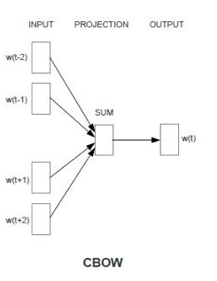
- Skip-gram
  - 思想：用中心词预测周围词
  - 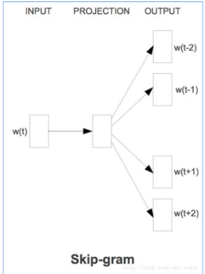
- CBOW vs Skip-gram 哪一个好？
  - CBOW 可以理解为 一个老师教多个学生；（高等教育）
  - Skip-gram 可以理解为 一个学生被多个老师教；（补习班）
  - 那问题来了？
    - 最后 哪个学生 成绩 会更好？
- 存在问题：
  - 多义词问题
    - 因为 word2vec 为静态方式，即训练好后，每个词表达固定；
  
### 【演变史】fastText 是什么及所存在问题? 

- 动机
  - word-level Model
    - 介绍：
      - 基于word单词作为基本单位的，这种方式虽然能够很好的对词库中每一个词进行向量表示
    - 问题：
      - OOV 问题
        - 问题描述：容易出现单词不存在于词汇库中的情况；
        - 解决方法：最佳语料规模，使系统能够获得更多的词汇量；
      - 误拼障碍
        - 问题描述：如果遇到了不正式的拼写, 系统很难进行处理；
        - 解决方法：矫正或加规则约束；
      - 做翻译问题时, 音译姓名比较难做到
  - Character-Level Model
    - 介绍：
      - 基于 Character 作为基本单位的，这种方式虽然能够很好的对字库中每一个 Char 进行向量表示
    - 优点：
      - 能够解决 Word-level 所存在的 OOV 问题；
      - 拼写类似的单词 具有类似的 embedding；
    - 问题：
      - Character-level 的输入句子变长；
      - 数据变得稀疏；
      - 对于远距离的依赖难以学到；
      - 训练速度降低；
    - 解决方法：
      - Lee 等 提出了利用多层 conv 和 pooling 和 highway layer 的方式来解决该问题，其结构如下所示：
        - 输入的字符首先需要经过 Character embedding 层，并被转化为 character embeddings 表示；
        - 采用 不同窗口大小的卷积核对输入字符的 character embeddings 表示进行卷积操作，论文中采用的窗口的大小分别为 3、4、5 ，也就是说学习 Character-level 的 3-gram、4-gram、5-gram;
        - 对不同卷积层的卷积结果进行 max-pooling 操作，即捕获其最显著特征生成 segment embedding;
        - segment embedding 经过 Highway Network (有些类似于Residual network，方便深层网络中信息的流通，不过加入了一些控制信息流量的gate）；
        - 输出结果 再经过 单层 BiGRU，得到最终 的 encoder output;
        - 之后，decoder再利用Attention机制以及character level GRU进行decode
      - 通过这种方式不仅能够解决 Word-level 所存在的 OOV 问题，而且能够捕获 句子的 3-gram、4-gram、5-gram 信息，这个也是 后期 FastText 的想法雏形；

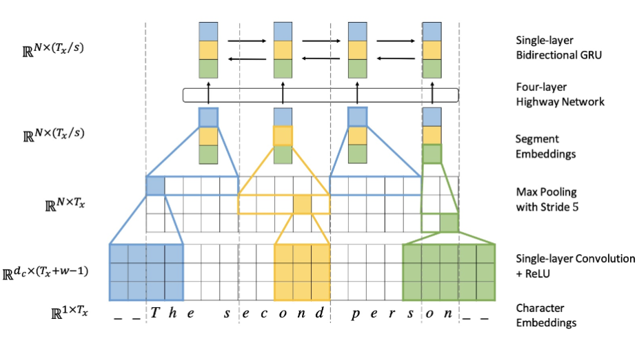

- 引言
   在前面，我们已经介绍和比较了 word-level 和 character-level 的优缺点，并根据其特点，提出一种介于 word-level Model 和 Character-level 之间的 Model —— Subword Model。
   
   那么，我们可不可以采取类似于上面的subword的思路来产生更好的word embedding呢？
   
   FAIR的FastText就是利用subword将word2vec扩充，有效的构建embedding。
- 基本思想
  
  将每个 word 表示成 bag of character n-gram 以及单词本身的集合，例如对于where这个单词和n=3的情况，它可以表示为 <wh,whe,her,ere,re>, ，其中"<",">"为代表单词开始与结束的特殊标记。
  
  假设对于word $w$ ，其n-gram集合用 $G_w$ 表示，每个 n-gram 的矢量表示为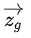,则每个单词可以表示成其所有n-gram的矢量和的形式，而center word $w$ 与context word $c$ 的分数就可表示成

  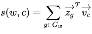

  之后就可以按照经典的word2vec算法训练得到这些特征向量。

  这种方式既保持了word2vec计算速度快的优点，又解决了遇到training data中没见过的oov word的表示问题，可谓一举两得。

- 模型结构
  - 每个单词通过嵌入层可以得到词向量;
  - 然后将所有词向量平均可以得到文本的向量表达;
  - 在输入分类器，使用softmax计算各个类别的概率；
  - 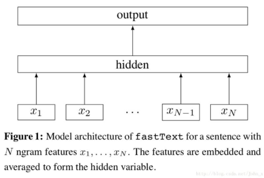
- 核心方法介绍：
  - 词内的n-gram信息(subword n-gram information)
    - 动机：
      - 之前方法：
        - 以词汇表中的独立单词作为基本单元来进行训练学习的
        - 存在问题：
          - 低频词、罕见词：由于在语料中本身出现的次数就少，得不到足够的训练，效果不佳
          - 未登录词：如果出现了一些在词典中都没有出现过的词，或者带有某些拼写错误的词，传统模型更加无能为力
    - 解决方法：
      - s1. 将一个单词打散到字符级别；
      - s2. 利用字符级别的n-gram信息来捕捉字符间的顺序关系
        - 目的：以此丰富单词内部更细微的语义
      - 举例：
        - 对于一个单词“google”，为了表达单词前后边界，我们加入<>两个字符，即变形为“<google>”；
        - 抽取所有的tri-gram信息：G = { <go, goo, oog,ogl, gle, le>}；
        - 通过这种方式：原始的一个单词google，就被一个字符级别的n-gram集合所表达；
    - 训练过程：
      - s1:每个n-gram都会对应训练一个向量；
      - s2:原来完整单词的词向量就由它对应的所有n-gram的向量求和得到；
      - s3:所有的单词向量以及字符级别的n-gram向量会同时相加求平均作为训练模型的输入；
    - 存在问题：
      - 问题 1：
        - 由于需要估计的参数多，模型可能会比较膨胀
        - 压缩模型的建议：
          - 采用hash-trick：由于n-gram原始的空间太大，可以用某种hash函数将其映射到固定大小的buckets中去，从而实现内存可控；
          - 采用quantize命令：对生成的模型进行参数量化和压缩；
          - 减小最终向量的维度。
  - 层次化Softmax回归(Hierarchical Softmax)
    - 动机：
      - 传统 softmax 
        - 介绍：
          - 以隐藏层的输出h为输入，经过线性和指数变换后，再进行全局的归一化处理，找到概率最大的输出项；
        - 问题：
          - 当词汇数量V较大时（一般会到几十万量级），Softmax计算代价很大，是O(V)量级。
    - 思想：
      - 将一个全局多分类的问题，转化成为了若干个二元分类问题，从而将计算复杂度从O(V)降到O(logV)；
      - 每个二元分类问题，由一个基本的逻辑回归单元来实现
    - 介绍：
      - 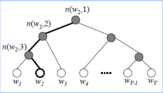
      - 步骤：
        - 从根结点开始，每个中间结点（标记成灰色）都是一个逻辑回归单元，根据它的输出来选择下一步是向左走还是向右走；
        - 上图示例中实际上走了一条“左-左-右”的路线，从而找到单词w₂。而最终输出单词w₂的概率，等于中间若干逻辑回归单元输出概率的连乘积；
        - 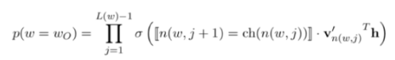
    - 问题：
      - 如何构造每个逻辑回归单元的输入
        - 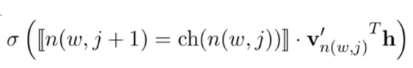
        - 特殊函数 x
          - 如果下一步需要向左走其函数值定义为1，向右则取-1。在训练时，我们知道最终输出叶子结点，并且从根结点到叶子结点的每一步的路径也是确定的。
        - 每个内部结点（逻辑回归单元）对应的一个向量 v'
          - 以在训练过程中学习和更新
        - h 是网络中隐藏层的输出
      - 如何建立这棵用于判断的树形结构?
        - 霍夫曼树的构造
          - 处理机制：将字符信息编码成为0/1二进制串
          - 结构介绍：给出现频繁的字符较短的编码，出现较少的字符以较长的编码，是最经济的方案
          - 构造步骤：
            - 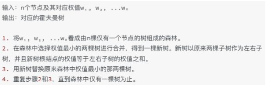

### 【演变史】elmo 是什么及所存在问题? 

- 动机
  - 多义词问题：
    - 因为 one-hot、word2vec、fastText 为静态方式，即训练好后，每个词表达固定；
  - 单向性：
    - 因为 one-hot、word2vec、fastText 都是 从左向右 学习，导致该方法 不能 同时考虑 两边信息；
- 特点：
  - 基于特征融合 的 word emb
- 思想：
  - 预训练时，使用语言模型学习一个单词的emb（**多义词无法解决**）；
  - 使用时，单词间具有特定上下文，可根据上下文单词语义调整单词的emb表示（**可解决多义词问题**）
    - 理解：因为预训练过程中，emlo 中 的 lstm 能够学习到 每个词 对应的 上下文信息，并保存在网络中，在 fine-turning 时，下游任务 能够对 该 网络进行 fine-turning，使其 学习到新特征； 

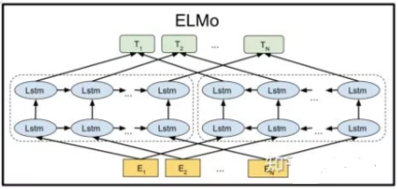

- 问题：
  - 1. 在做序列编码任务时，使用 LSTM；
  - 2. ELMo 采用双向拼接的融合特征，比Bert一体化融合特征方式弱；

### 【BERT】Bert 是什么?

BERT（Bidirectional Encoder Representations from Transformers）是一种Transformer的双向编码器，旨在通过在左右上下文中共有的条件计算来预先训练来自无标号文本的深度双向表示。因此，经过预先训练的BERT模型只需一个额外的输出层就可以进行微调，从而为各种自然语言处理任务生成最新模型。

这个也是我们常说的 【预训练】+【微调】

### 【BERT】Bert 三个关键点？

- 基于 transformer 结构
- 大量语料预训练：
  - 介绍：在包含整个维基百科的无标签号文本的大语料库中（足足有25亿字！） 和图书语料库（有8亿字）中进行预训练；
  - 优点：大语料 能够 覆盖 更多 的 信息；
- 双向模型：
  - BERT是一个“深度双向”的模型。双向意味着BERT在训练阶段从所选文本的左右上下文中汲取信息
  - 举例
    - 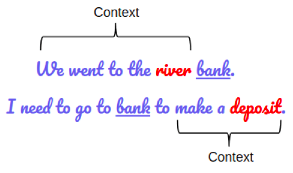
    - > BERT同时捕获左右上下文
    - 问题：
      - 如果仅取左上下文或右上下文来预测单词“bank”的性质，那么在两个给定示例中，至少有一个会出错；
    - 解决方法：
      - 在做出预测之前同时考虑左上下文和右上下文

### 【BERT】Bert 输入表征长啥样？

- input 组成：
  - Token embedding: 
  - Segment embedding:
  - Position embedding:

- 特点：
  - 在30000个词上使用了WordPiece嵌入，把拆分的词片段(word pieces)用"##"标注；
    - eg：在图中"playing"-"play ##ing"；
  - 最大长度：使用了学习过的位置嵌入，支持序列长度达512的 Token;
  - 特殊分类嵌入([CLS])：位于句首，在最终的隐藏层中（也就是转换器的输出）对应的是分类任务中序列标识的**聚合表征**。非分类任务中这一标记将被忽略；
  - 区分句子对在 序列 中位置的方式：
    - s1：用特殊词块([SEP])将它们分开；
    - s2：给第一句的每一个标记添加一个学习到的句子 A 的嵌入，给第二句的每个标记添加一个学习到的句子 B 的嵌入；
  - 对于单句输入，我们只使用句子A嵌入

### 【BERT】Bert 预训练任务？

- 预训练 包含 两个 Task:
  - Task 1：Masked LM
  - Task 2：Next Sentence Prediction

### 【BERT】Bert 预训练任务 Masked LM 怎么做？

- 动机：
  - 双向模型 由于 可以分别 从左到右 和 从右到左 训练，使得 每个词 都能 通过多层 上下文 “看到自己”；
- 方法：Masked LM 
- 做法：
  -  s1：随机遮蔽输入词块的某些部分；
  -  s2：仅预测那些被遮蔽词块；
  -  s3：被遮盖的标记对应的最终的隐藏向量被当作softmax的关于该词的一个输出，和其他标准语言模型中相同
- 问题：
  - 预训练和微调之间的不匹配：
    - 解释：在微调期间从未看到[MASK]词块
    - 解决方法：
      - 以一定概率用 [MASK] 词块替换“遮蔽”单词，论文采用 15% 的概率 随机选择 词块
      - 举例：
        - 句子：我的狗是毛茸茸的
        - 操作：
          - 80％的概率：用[MASK]词块替换单词，例如，我的狗是毛茸茸的！我的狗是[MASK]；
          - 10％的概率：用随机词替换遮蔽词，例如，我的狗是毛茸茸的！我的狗是苹果；
          - 10％的概率：保持单词不变，例如，我的狗是毛茸茸的！我的狗毛茸茸的。
            - 目的：是将该表征偏向于实际观察到的单词
        - 目的：模型需要学习每个输入词块的分布式语境表征
  - 收敛速度慢问题：
    - 原因：每 batch 中只预测了15％的词块，导致 收敛速度慢
  
### 【BERT】Bert 预训练任务 Next Sentence Prediction 怎么做？

- 动机：很多重要的下游任务，例如问答(QA)和自然语言推理(NLI)，都是基于对两个文本句子间关系的理解，而这种关系并非通过语言建模直接获得
- 方法：
  - 预训练 一个 二值化 NSP 任务 学习 句子间关系；
- 操作：
  - 选择句子A和B作为预训练样本：B有50%的可能是A的下一句，也有50%的可能是来自语料库的随机句子
  - 举例：
    - > 输入=[CLS]男子去[MASK]商店[SEP]他买了一加仑[MASK]牛奶[SEP]
    - > Label= IsNext
    - > 输入=[CLS]男人[面具]到商店[SEP]企鹅[面具]是飞行##少鸟[SEP]
    - > Label= NotNext

### 【BERT】如何 fine-turning？

- 动机：获得输入序列的固定维度池化表征
- 操作：
  - 对该输入第一个词块采取最终隐藏状态(例如，该变换器输出)，通过对应于特殊[CLS]词嵌入来构造。我们将该向量表示为$C∈R^H$。
  - 微调期间添加的唯一新参数是分类层向量$W∈R^{KxH}$，其中K是分类器标签的数量。
  - 该标签概率$P∈R^K$用标准softmax函数，P=softmax(CWT)计算。BERT和W的所有参数都经过联动地微调，以最大化正确标签的对数概率

## 参考

1. [知识网络](https://shimo.im/mindmaps/hGxYWjcvvvwJWrGR)
2. [ELMO、BERT、ERNIE、GPT](https://blog.csdn.net/Forlogen/article/details/92011185)
3. [搞懂 NLP 中的词向量，看这一篇就足够](https://www.infoq.cn/article/PFvZxgGDm27453BbS24W)
4. [后BERT时代：15个预训练模型对比分析与关键点探索（附链接）](https://www.jiqizhixin.com/articles/2019-08-26-16)
