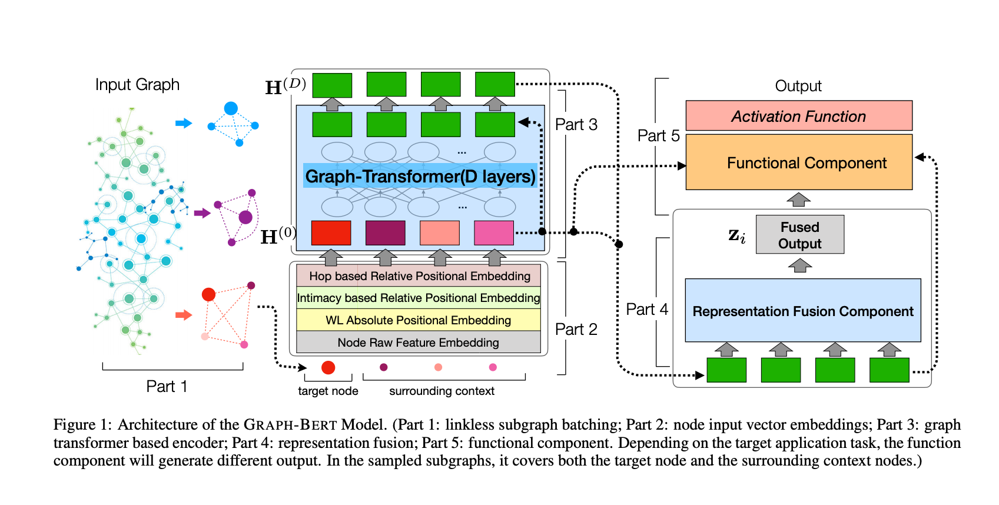

# GRAPH-BERT: Only Attention is Needed for Learning Graph Representations

> 作者：杨夕
> 
> 项目地址：https://github.com/km1994/nlp_paper_study/bert_study/T2020_GRAPH_BERT
> 
> 个人介绍：大佬们好，我叫杨夕，该项目主要是本人在研读顶会论文和复现经典论文过程中，所见、所思、所想、所闻，可能存在一些理解错误，希望大佬们多多指正。
> 
> 论文地址：https://arxiv.org/abs/2001.05140
> 
> 论文代码：https://github.com/jwzhanggy/Graph-Bert

## 动机

- 传统的GNN技术问题：
    - 模型做深会存在suspended animation和over smoothing的问题。
    - 由于 graph 中每个结点相互连接的性质，一般都是丢进去一个完整的graph给他训练而很难用batch去并行化。

## 论文方法

论文提出一种新的图神经网络模型GRAPH-BERT (Graph based BERT)，该模型只依赖于注意力机制，不涉及任何的图卷积和聚合操作。Graph-Bert 将原始图采样为多个子图，并且只利用attention机制在子图上进行表征学习，而不考虑子图中的边信息。因此Graph-Bert可以解决上面提到的传统GNN具有的性能问题和效率问题。

## Graph-Bert Vs GNN

1. Graph-Bert没有用任何图卷积操作以及相应的聚合操作（因此可以避免over-smoothing）而完全采用attention mechanism
2. Graph-Bert的输入是由某个结点的context信息构成的linkless subgraph而非传统GNN所用的整图
3. 一个pre-trained好的Graph-Bert可以较好的通过fine-tune来适应不同的task

## Graph-Bert Model

Grpah-Bert模型主要是包含了5个部分

### linkless subgraph batching

将原始图分解为无边子图集合，这一步属于预处理部分。具体来说，对于每个目标节点，根据节点之间的相似度分数选取前K个节点作为目标节点的上下文节点。

### node input embedding

节点输入特征的嵌入表示。本文考虑四种节点的特征：(1) raw feature vector embedding, (2) Weisfeiler-Lehman absolute role embedding, (3) intimacy based relative positional embedding, and (4) hop based relative distance embedding。这一步也是预处理。

### graph-transformer based encoder

基于图transformer的节点表征学习编码器，编码器的输出作为学习到的节点特征表示。

### graph-transformer based decoder

基于图transformer的解码器。主要考虑节点属性重建以及图结构恢复任务。

## 参考

1. [Graph-Bert 阅读笔记](https://zhuanlan.zhihu.com/p/150367881)