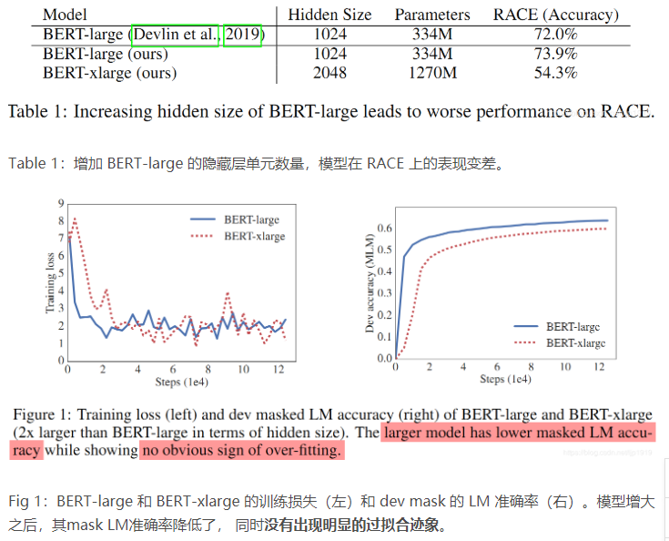
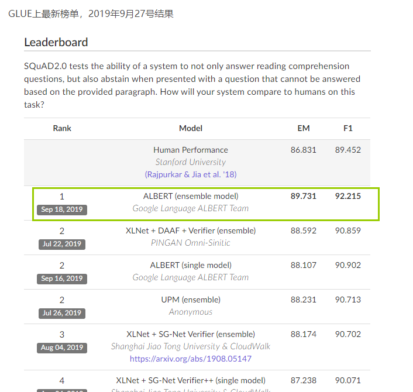
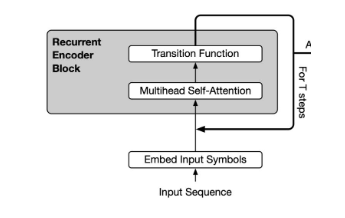
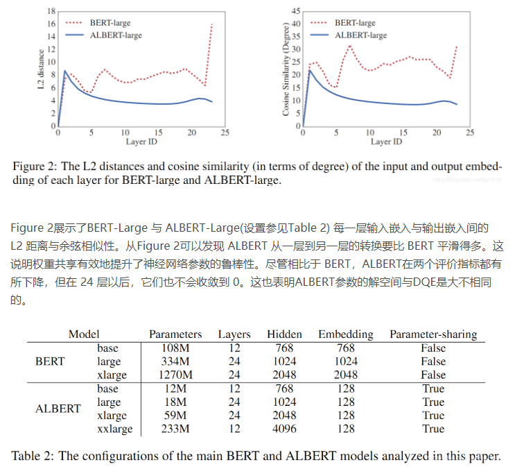

# A lite BERT for self-supervised learning of language representations

## 摘要

Increasing model size when pretraining natural language representations often results in improved performance on downstream tasks. However, at some point further model increases become harder due to GPU/TPU memory limitations, longer training times, and unexpected model degradation. 

To address these problems, we present two parameter-reduction techniques to lower memory consumption and increase the training speed of BERT (Devlin et al., 2019). 

Comprehensive empirical evidence shows that our proposed methods lead to models that scale much better compared to the original BERT. We also use a self-supervised loss that focuses on modeling inter-sentence coherence, and show it consistently helps downstream tasks with multi-sentence inputs. 

As a result, our best model establishes new state-of-the-art results on the GLUE, RACE, and SQuAD benchmarks while having fewer parameters compared to BERT-large.

预训练自然语言表征时，增加模型大小一般是可以提升模型在下游任务中的性能。但是这种纯粹依赖模型尺寸进而期望大力出奇迹的想法在未来会越发困难。进一步增加模型大小将带来以下困难：

> (1)GPU/TPU内存不足
> 
> (2)训练时间会更长
> 
> (3)模型退化。

所以，为了解决上述这些问题，本文提出通过两种参数精简技术来降低内存消耗，并加快BERT的训练速度。

此外，本文还引入一个自监督损失(self-supervised loss)，用于对句子连贯性(inter-sentence coherence)建模，并证明该损失函数能够提升多句子作为输入的下游任务的性能。本文所提出的模型ALBERT在 GLUE、RACE 和 SQuAD 这3个基准上都取得了新的SOTA结果，且参数量还少于 BERT-large。

## 动机

过往的研究者们在诸多NLP任务上的实验已经表明，模型规模在取得SOTA结果上至关重要。在应用场景中通常是预训练一个大规模的模型，再对其进行蒸馏萃取出一个更小的模型。考虑模型大小的重要性，我们不禁要问：“拥有更好的NLP模型是否能够和拥有更大的模型一样容易？”

上述问题首要解决的便是
1. 内存受限。当下的各种SOTA模型动辄数亿甚至数十亿个参数，倘若要扩大模型规模，这个内存问题是无法回避的。
2. 训练速度上的限制。由于通信开销与模型中参数的数量成正比，在分布式训练中训练速度将成为一大瓶颈。简单地增加隐含层单元数，只会适得其反，从而降低性能。Table 1和Fig 1中可以看出将BERT-large 的隐藏层单元数增加一倍， 该模型（BERT-xlarge）在 RACE 基准测试上的准确率显著降低。

## 所做工作概述

为解决上述问题，已有先贤们做了一些研究，比如模型并行化、智能内存管理等。这些解决方案只解决了内存受限问题，而没有考虑模型通信开销过大和模型退化问题。为此，本文提出A Lite BERT(ALBERT)模型以解决上述三个问题。 该模型的参数量远远少于传统的 BERT 架构。

ALBERT 引入2种参数精简技术，克服了扩展预训练模型面临的主要障碍。

第一种技术是**对嵌入参数进行因式分解(factorized embedding parameterization)**。将一个大的词汇嵌入矩阵分解为两个小矩阵，从而将隐藏层的大小与词汇嵌入的大小分离开来。这种分离便于后续隐藏层单元数量的增加，怎么说呢？就是增加隐藏层单元数量，并不显著增加词汇嵌入的参数量。

第二种技术是**跨层参数共享**。这一技术可以避免参数量随着网络深度的增加而增加。

这两种技术都显著降低了 BERT 的参数量，同时不显著损害其性能， 从而提升了参数效率。ALBERT 的配置类似于 BERT-large，但参数量仅为后者的 1/18，训练速度却是后者的 1.7 倍。 这些参数精简技术还可以充当某种形式的正则化，可以使训练更加稳定，且有利于泛化。

为了进一步提升 ALBERT 的性能， 本文还引入了一个**自监督损失函数，用于句子顺序预测（SOP，sentence-order prediction）**。SOP 主要聚焦于句间连贯，用于解决原版 BERT中下一句预测（NSP）损失的低效问题。因为确实已有研究(Yang et al., 2019; Liu et al., 2019)表明NSP是可以去掉的。

基于上述的这3个设计，ALBERT 能够扩展为更大的版本，在参数量仍然小于 BERT-large的同时，性能可以显著提升。本文在GLUE、SQuAD 和 RACE 这3个自然语言理解基准测试上都刷新了记录：在 RACE 上的准确率为 89.4%，在 GLUE 上的得分为 89.4，在 SQuAD 2.0 上的 F1 得分为 92.2。

## 相关研究

### 扩大模型表征

## 实现方式

自然语言的表征学习其重要程度不言而喻，目前的趋势已从前两年预训练词向量如标准的Word2Vec抑或是基于上下文语境的ELMo转变为整个网络的预训练+下游任务微。调。一般上来说，模型更大能够提升性能，比如Devlin et al. (2019)的工作就表明采用更多的隐含层单元数、更多的隐含层和更多的attention head能够提升性能。但是，凡事都有其适用范围。Devlin在隐含层单元数设置为1024后，就没有继续增加了。本文继续进一步，发现当隐含层单元数增加为2048个后，模型性能是退化的。所以，扩大自然语言的表征学习模型，并不能简单地增加模型尺寸了事。

另外，面对有限的计算资源，特别是GPU/TPU的内存受限，大规模模型的训练会显得很艰难。之前研究者们的方案有以下几种：(1)Chen et al. (2016) 提出的gradient checkpointing，以降低内存消耗，从而使得内存的占用是次线性的，其代价是需要一个额外的forward pass。(2)Gomez et al. (2017)提出从下一层重构每一层的激活，如此便无需存储中间激活。这两种方法是以牺牲速度为代价换取内存占用的降低。反观本文的方法，通过参数精简技术降低内存占用的同时还加速了训练速度，着实令人惊喜，有木有。

### 跨层参数共享

跨层参数共享在之前的Transformer架构中就有，但是Transformer只注重训练用于标准encoder-decoder的任务，而非预训练+下游任务微调的设置。与本文的观察所不同的是，Dehghani et al. (2018)发现跨层参数共享(Universal Transformer,UT)在语言建模和主谓一致方面能够取得比标准Transformer更好的结果。近来， Bai et al. (2019)提出的Deep Equilibrium Model (DQE)表明DQE能够在某一层取得输入嵌入与输出嵌入保持一致的平衡点。

### 句子次序目标

为了学习句子之间的连贯性，ALBERT引入了一个预测两个连续句子次序的目标函数。针对篇章中句子的连贯和衔接，此前就有学者在预训练中采用类似操作，比如基于Skip thought (Kiros et al., 2015)和FastSent (Hill et al., 2016)是通过对句子进行encoding进而预测句子周边词汇，从而学习句子嵌入。Gan et al., 2017虽然也是学习句子嵌入，但是使用的是预测后续的句子，而非仅仅其周边单词。[Jernite et al., 2017; Nie et al., 2019]所采用的目标则是预测显性话语标记语(explicit discourse markers，即话语末尾标记语)。本文所提出的损失函数是面向文本段落segments，而非句子。BERT中采用的一个损失函数是预测两个segments是否来自相同文档，更确切地说是，其正样本是下一个句子，而负样本是随机的其他文档句子。相比于上述的这些方法，本文的句子次序预测更具挑战性，于下游任务更有益。

## 主要内容

### 模型架构的选择

ALBERT 架构的主干网络与 BERT 相似，即使用 Transformer 编码器和 GELU 非线性激活函数。为便于论述，本文做如下约定：词嵌入大小为 E、编码器层数为L、隐藏层大小为 H。与 Devlin 等人的研究一样，本文将 前馈网络/滤波器 大小设置为4H，将注意力头的数量设置为H/64。

本文ALBERT框架与BERT相比有以下3点不同：

嵌入向量参数化的因式分解
在BERT 及后续的 XLNet 和 RoBERTa 中，WordPiece 词嵌入大小E和隐藏层大小H是相等的，即$E \equiv H$。这在建模和实际使用中，看起来可能并不是最优的。

(1)从建模的角度来说，WordPiece 词嵌入的目标是学习上下文无关的表示，而隐藏层嵌入的目标是学习上下文相关的表示。[Liu et al.,2019]通过上下文长度相关的实验表明，BERT的表征能力很大一部分来自于使用上下文以在学习过程提供上下文相关的表征信息。因此，将 WordPiece 词嵌入大小E 从隐藏层大小 H 分离出来，可以更高效地利用总体的模型参数， 其中H远远大于E。

(2)从实践的角度，自然语言处理使用的词典大小V一般非常庞大，如果E恒等于HHH，即$E \equiv H$，那么增加 H 将直接增大词典嵌入矩阵的大小$(V \times E)$。这会导致模型参数剧增，而模型训练过程中大部分参数的更新是很稀疏的。

因此，本文所提出的ALBERT对词嵌入参数进行了因式分解，将其分解为两个小矩阵。**本文不再将 one-hot 向量直接映射到大小为H 的隐藏空间，而是先将它们映射到一个低维词嵌入空间E，然后再映射到隐藏空间。通过这种分解，可以将词嵌入参数从 $O(V \times H)$ 降低到 $O(V \times E+E\times H)$。**这在H 远远大于E的时候，参数量减少得非常明显。

### 跨层参数共享

此外，ALBERT中还使用了一种跨层参数共享机制来进一步提升参数效率。其实目前有很多方式来共享参数，比如只共享前馈网络不同层之间的参数，或者只共享注意力机制的参数，而 **ALBERT 采用的是所有层共享所有参数**。

在之前也有学者提出过类似机制，比如[Dehghani et al. (2018)]的[(Universal Transformer, UT)](https://zhuanlan.zhihu.com/p/44655133)和Bai et al. (2019)和Deep Equilibrium Models(DQE)。虽然上述方案都有一定提升效果，但在度量过程发现词嵌入的 L2 距离和余弦相似性是震荡而不是收敛。如下图 2 展示了每一层输入与输出嵌入矩阵间的 L2 距离与余弦相似性。

### 句间连贯性损失

除了语言建模损失(masked language modeling，MLM)外，BERT 还使用了额外的下一句预测损失(NSP)。NSP损失本是为了提升下游任务的性能，但是后来很多研究 (Yang et al., 2019; Liu et al.,
2019)发现这种机制并不是很高效，因此决定去除它。

据此我们猜测，NSP低效的原因，主要是它的难度太小。因为下一句预测将主题预测和连贯性预测结合到单个任务中，然而主题预测比连贯性预测简单得多，同时NSP与MLM损失函数学到的内容是有重合的。

由于句间建模在语言理解中非常重要，因此本文提出一种基于语言连贯性的损失函数。在ALBERT中本文使用了一个句子次序预测（SOP）损失函数，它会避免预测主题，而只关注建模句子之间的连贯性。**SOP正样本获取方法与BERT相同，而负样本仅仅是将正样本的两个segments次序对换**。实验结果表明SOP能够在合理范围内解决NSP任务。在使用了该损失函数后，ALBERT能显著提升下游多句子编码任务的性能。

## 总结

本文的贡献主要在3个方面：

(1)对嵌入矩阵分解，解除词嵌入和隐含层大小的关系，便于隐含层大小的扩展而不剧增模型参数

(2)跨层参数共享，虽然一定程度上微微降低性能，但是可以大大地降低模型参数，收益很高

(3)放弃NSP，引入SOP，更为有力地学习句子间的连贯性

## 参考文献

1. [文献阅读笔记-ALBERT ： A lite BERT for self-supervised learning of language representations](https://blog.csdn.net/ljp1919/article/details/101680220)
2.  [【NLP】ALBERT粗读](https://zhuanlan.zhihu.com/p/84273154)