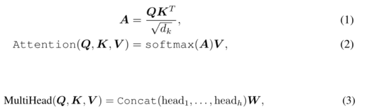
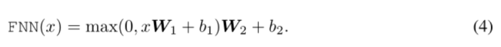
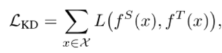
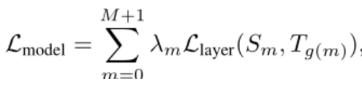
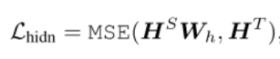
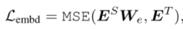
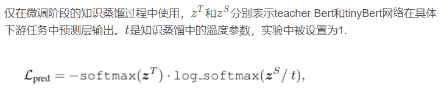
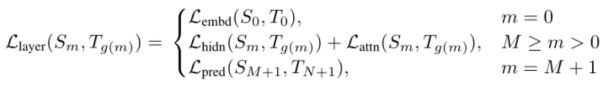
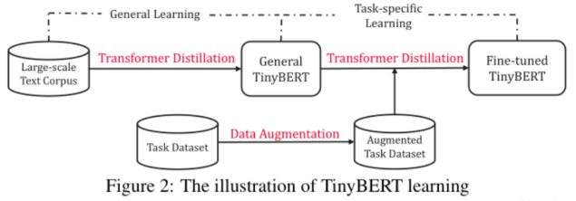
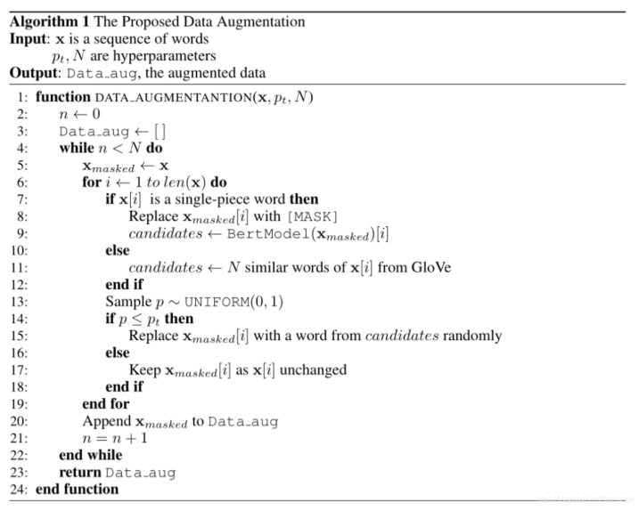

# 【关于 TinyBert】 那些你不知道的事

> 作者：杨夕
> 
> 项目地址：https://github.com/km1994/nlp_paper_study
> 
> 个人介绍：大佬们好，我叫杨夕，该项目主要是本人在研读顶会论文和复现经典论文过程中，所见、所思、所想、所闻，可能存在一些理解错误，希望大佬们多多指正。
> 
> 论文题目：TinyBERT: Distilling BERT for Natural Language Understanding
> 
> 论文地址：chrome-extension://ikhdkkncnoglghljlkmcimlnlhkeamad/pdf-viewer/web/viewer.html?file=https%3A%2F%2Farxiv.org%2Fpdf%2F1909.10351.pdf

## 目录

## 摘要

- 介绍：预训练语言模型如BERT等已经极大地提高了多项自然处理任务的性能；
- 问题：预训练语言模型通常具需要很大计算资源，所以其很难在有限的资源设备上运行。
- 动机：为了加速推理、减小模型的尺寸而同时保留精度；
- 方法：首先提出了一个新颖的迁移蒸馏方法，它是一种基于迁移方法的知识蒸馏思路。利用整个新颖的KD方法，大量的知识编码在一个大的“老师”BERT可以很好地被迁移到一个小的“学生”TinyBERT模型那里。我们引入一个新的两阶段学习TinyBERT学习框架，在预训练阶段和任务明确任务学习阶段都采用迁移蒸馏方式，整个框架可以保证TinyBERT能够捕捉到BERT中通用域和明确域的知识。
- 优点：性能能够超过基线BERT的96%，容量小7.5倍，推理速度快9.4倍。同时，TinyBERT要比基线DistillBERT也明显更优，只有其28%的参数，31%的推理时间

## 动机

- Bert 系列模型 成本增长 的 计算量；
- 模型不断增长的算力和内存要求可能阻止被广泛使用

## 前期知识

### Multi-Head Attention (MHA)  介绍

### Position-wise Feed-Forward Network (FFN) 介绍

### 知识蒸馏【Knowledge Distillation(KD)】

- 介绍：一种模型压缩常见方法，指的是在teacher-student框架中，将复杂、学习能力强的网络(teacher)学到的特征表示“知识”蒸馏出来，传递给参数量小、学习能力弱的网络(student)。teacher网络中学习到的特征表示可作为监督信息，训练student网络以模仿teacher网络的行为；
- 知识蒸馏的误差函数：

> 注： 
> x：网络输入； 
> L(·)：衡量在输入x xx下，teacher网络和student的网络的差异性； 
> X：训练集； 
> $f^T$：teacher网络的行为函数，可以通俗理解成网络中特征表示； 
> $f^S$：student网络的行为函数，可以通俗理解成网络中特征表示； 

- 关键问题：
  - 如何定义网络的差异性loss？
  - 如何选取网络的行为函数？

## 基于transformer的知识蒸馏模型压缩

- tinybert的创新点：学习了teacher Bert中更多的层数的特征表示；
- 特征表示：
  - 词向量层的输出；
  - Transformer layer的输出以及注意力矩阵；
  - 预测层输出(仅在微调阶段使用)；

- bert知识蒸馏的过程
  - 左图：整体概括了知识蒸馏的过程
    - 左边：Teacher BERT；
    - 右边：Student TinyBERT
    - 目标：将Teacher BERT学习到的知识迁移到TinyBERT中
  - 右图：描述了知识迁移的细节；
    - 在训练过程中选用Teacher BERT中每一层transformer layer的attention矩阵和输出作为监督信息

- 举例
  - 假设： Teacher BERT 有M层，TinyBERT有N层(N<M)；
  - n = g(m) 是TinyBERT到Teacher BERT 映射函数，表示TinyBERT的第m层是从Teacher BERT中的第n层学习知识的；
  - Teacher BERT 词向量层 -> Student BERT 词向量层: 0 = g(0)
  - Teacher BERT 预测输出层- > Student BERT 预测输出层: N+1=g(M + 1)
  - Teacher BERT 预测对应层- > Student BERT 预测对应层: n = g(m)

- 目标：将Teacher BERT学习到的特征表示作为TinyBERT的监督信息，从而训练TinyBERT
- 损失函数：
  

> 注： 
> $L_{layer}$：当前层衡量Teacher BERT络和TinyBERT的差异性的loss函数； 
> $λ_m$：超参数，代表当前层的重要程度； 

### Transformer层：

#### attention矩阵

- 操作： attention矩阵作为知识蒸馏过程中teacher网络的监督信息。
- 原因： 文献 证明了attention举证中包含了语法和共指信息，通过将attention矩阵作为teacher网络中的监督信息，可以将这些信息迁移到student网络。采用的是均方误差函数，h 是atteniton的头数，每层共h 个注意力矩阵A ；

#### Transformer层输出:

#### 词向量层：

#### 预测输出层：

#### 整体：

## Pre-training和Fine-tuning两个阶段知识蒸馏

- General distillation (Pre-training阶段)：使用大规模无监督的数据， 帮助student网络TinyBERT学习到尚未微调的teacher BERT中的知识，有利于提高TinyBERT的泛化能力。此时，由于词向量维度的减小，隐层神经元的减少，以及网络层数的减少，tinybert的表现远不如teacher bert。（注意：在Pre-training阶段，蒸馏的特征表示未使用预测层输出）
- task-specific distillation(Fine-tuning阶段)：使用具体任务的数据，帮助TinyBERT学习到更多任务相关的具体知识。值得注意的是，在Fine-tuning阶段，论文采用了**数据增强**的策略，从后面的实验中可以看出，数据增强起到了很重要的作用。 
  - 数据扩充的过程如下：
    - 首先对特定任务的数据中每一条文本使用bert自带的方式进行bpe分词，bpe分词之后是完整单词（single-piece word），用[MASK]符号代替；
    - 然后使用bert进行预测并选择其对应的候选词N个；如果bpe分词之后不是完整单词，则使用Glove词向量以及余弦相似度来选择对应的N个候选词；
    - 最后以概率 $p_{t}$ 选择是否替换这个单词，从而产生更多的文本数据。

## 参考

1. [TINYBERT: DISTILLING BERT FOR NATURAL LANGUAGE UNDERSTANDING](https://blog.csdn.net/ltochange/article/details/103115311)

