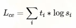

# DistilBERT, a distilled version of BERT: smaller, faster, cheaper and lighter

> 作者：杨夕
> github：https://github.com/km1994/nlp_paper_study
> paper：http://arxiv.org/abs/1910.01108

# 摘要

随着自大型预训练模型执行的转移学习在自然语言处理（NLP）中愈发普遍，在实时与/或受限的计算训练中或推理预算下，操作这些大型模型仍然很有挑战性。

在本文中，我们提出了一种名为DistilBERT的方法，预训练较小的通用语言表征模型，在将其用于较大任务（如较大的对应对象）时再对其进行微调。尽管之前的大多工作都在研究使用蒸馏来构建特定的任务模型，但是在预训练阶段，我们使用了知识蒸馏，证明了将BERT模型的大小减少40%，同时保留其97%的语言理解能力，并且增速60%是可行的。

## 动机

- Bert 系列模型 成本增长 的 计算量；
- 模型不断增长的算力和内存要求可能阻止被广泛使用

## 核心思想

通过知识蒸馏（在 logits，hidden_states 上计算学生与教师的 loss）训练一个小（主要是层数）模型实现和大模型类似的效果。

## 模型蒸馏思路

### 思路介绍

知识蒸馏 [Bucila 等，2006； Hinton 等，2015] 是一种压缩技术，训练一个紧凑型模型（学生），以再现较大模型（教师）或模型集合的行为。

### 损失函数

> $t_i$ 老师的概率估计
> $s_i$ 学生的概率估计

- 使用了 softmax-temperature：

> T 控制输出分布的平滑程度，推理时设置为 1 变为标准的 Softmax;
> $z_i$ 表示类别 i 的分数。

最终的损失函数是 Lce 和 masked language modeling loss Lmlm 的线性组合，另外作者发现添加余弦嵌入损失（Lcos）有利于使学生和教师隐藏状态向量的方向一致。

### 学生架构

- 具有和老师一般的体系结构；
- 移除了 Token type embedding 和 pooler；
- 层数减少为 1/2：作者调查发现改变隐层维度对计算效率的影响比其他因素的变化要小（比如层数）。

从老师的两层中选择一层来初始化学生。蒸馏应用了Liu et al. [2019] 提出的 BERT 模型训练最佳实践。语料和 Bert 使用的一致。

## 参考

1. [DistilBERT 论文+代码笔记](https://yam.gift/2020/04/27/Paper/2020-04-27-DistilBERT/)

