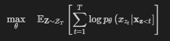
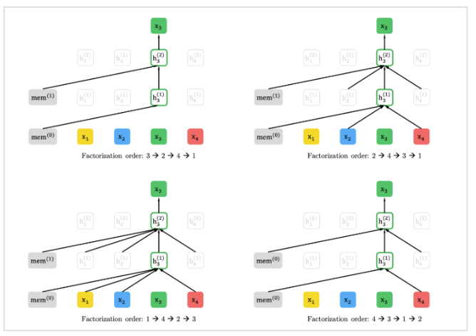
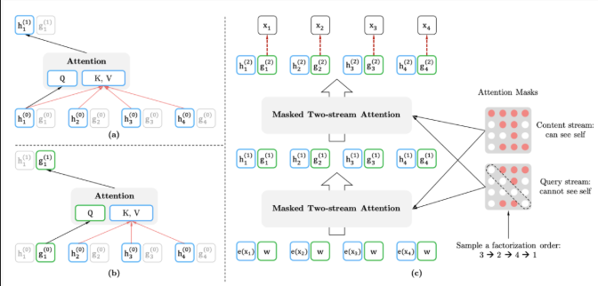
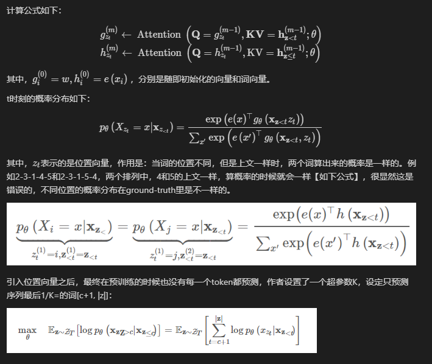
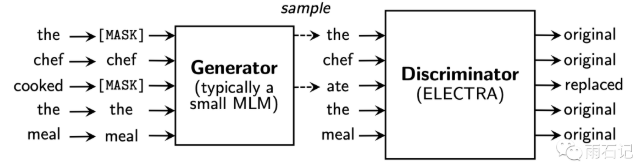

# 【关于 Bert 系列 】 那些的你不知道的事

> 作者：杨夕  
> 个人github：https://github.com/km1994/nlp_paper_study  
> 原文地址：https://github.com/km1994/nlp_paper_study/bert_study/ 
> 【注：手机阅读可能图片打不开！！！】

## 目录

- [【关于 Bert 系列 】 那些的你不知道的事](#关于-bert-系列--那些的你不知道的事)
  - [目录](#目录)
  - [总结](#总结)
  - [一、Bert](#一bert)
    - [1.1 【BERT】介绍](#11-bert介绍)
    - [1.2 【BERT】Bert 预训练任务？](#12-bertbert-预训练任务)
      - [1.2.1 【BERT】任务介绍](#121-bert任务介绍)
      - [1.2.2 【MLM】Bert 预训练任务 Masked LM 怎么做？](#122-mlmbert-预训练任务-masked-lm-怎么做)
        - [1.2.2.1【MLM】动机](#1221mlm动机)
        - [1.2.2.2【MLM】做法](#1222mlm做法)
      - [1.2.3【NSP】Bert 预训练任务 Next Sentence Prediction 怎么做？](#123nspbert-预训练任务-next-sentence-prediction-怎么做)
        - [1.2.3.1 【NSP】动机](#1231-nsp动机)
        - [1.2.3.2 【NSP】方法](#1232-nsp方法)
        - [1.2.3.3【NSP】操作](#1233nsp操作)
    - [1.3 【Bert】问题](#13-bert问题)
      - [1.3.1 【Bert】问题 1：预训练和微调之间的不匹配](#131-bert问题-1预训练和微调之间的不匹配)
      - [1.3.2 【Bert】问题2：收敛速度慢问题](#132-bert问题2收敛速度慢问题)
  - [二、XLNet](#二xlnet)
    - [2.1 【XLNet】 介绍](#21-xlnet-介绍)
    - [2.2 【XLNet】动机](#22-xlnet动机)
    - [2.3 【XLNet】AR vs AE](#23-xlnetar-vs-ae)
    - [2.4 【XLNet】 预训练](#24-xlnet-预训练)
      - [2.4.1 【XLNet】Permutation Language Modeling](#241-xlnetpermutation-language-modeling)
      - [2.4.2 【XLNet】 Two-Stream Self-Attention for Target-Aware Representations](#242-xlnet-two-stream-self-attention-for-target-aware-representations)
        - [2.4.2.1 介绍](#2421-介绍)
        - [2.4.2.2 计算两个self-attention](#2422-计算两个self-attention)
        - [2.4.2.3 Transformer-XL](#2423-transformer-xl)
  - [三、RoBERTa](#三roberta)
    - [3.1 动机](#31-动机)
    - [3.2 工作](#32-工作)
    - [3.3 预训练](#33-预训练)
      - [3.3.1 动态掩码](#331-动态掩码)
  - [四、ELECTRA](#四electra)
    - [4.1 动机](#41-动机)
    - [4.2 介绍](#42-介绍)
    - [4.3 核心任务](#43-核心任务)
    - [4.4 判别器 & 生成器](#44-判别器--生成器)
    - [4.5 算法流程](#45-算法流程)
  - [推荐阅读 【【关于 Bert 压缩】 那些你不知道的事】](#推荐阅读-关于-bert-压缩-那些你不知道的事)

## 总结

<table>
    <tr>
        <td>名称</td>
        <td>介绍</td>
        <td>动机</td>
        <td>预训练方法</td>
        <td>微调</td>
        <td>问题</td>
    </tr>
    <tr>
        <td>Bert</td>
        <td>Transformer的双向编码器</td>
        <td>多义词问题 && GPT 单向 Transformer</td>
        <td>Task 1：Masked LM && Task 2：Next Sentence Prediction</td>
        <td>直接利用 特定任务数据 微调</td>
        <td>1. [MASK]预训练和微调之间的不匹配 2. Max Len 为 512</td>
    </tr>
    <tr>
        <td>XLNet</td>
        <td>广义自回归预训练方法</td>
        <td>1. Bert 预训练和微调之间的不匹配 2. Bert 的 Max Len 为 512</td>
        <td>（1） Permutation Language Modeling【解决Bert 预训练和微调之间的不匹配】  （2）Two-Stream Self-Attention for Target-Aware Representations【解决PLM出现的目标预测歧义】   （3）XLNet将最先进的自回归模型Transformer-XL的思想整合到预训练中【解决 Bert 的 Max Len 为 512】</td>
        <td>直接利用 特定任务数据 微调</td>
        <td>问题</td>
    </tr>
    <tr>
        <td>RoBERTa</td>
        <td>A Robustly Optimized BERT Pretraining Approach </td>
        <td>1. 确定方法的哪些方面贡献最大可能是具有挑战性的 2. 训练在计算上是昂贵的的，限制了可能完成的调整量</td>
        <td>1. 去掉下一句预测(NSP)任务 2. 动态掩码 3. 文本编码</td>
        <td>直接利用 特定任务数据 微调</td>
        <td>问题</td>
    </tr>
    <tr>
        <td>ELECTRA</td>
        <td>判别器 & 生成器</td>
        <td>1. 只有15%的输入上是会有loss</td>
        <td>利用一个基于MLM的Generator来替换example中的某些个token，然后丢给Discriminator来判别</td>
        <td>直接利用 特定任务数据 微调</td>
        <td>问题</td>
    </tr>
</table>

## 一、Bert

### 1.1 【BERT】介绍

BERT（Bidirectional Encoder Representations from Transformers）是一种Transformer的双向编码器，旨在通过在左右上下文中共有的条件计算来预先训练来自无标号文本的深度双向表示。因此，经过预先训练的BERT模型只需一个额外的输出层就可以进行微调，从而为各种自然语言处理任务生成最新模型。

### 1.2 【BERT】Bert 预训练任务？

#### 1.2.1 【BERT】任务介绍

- 预训练 包含 两个 Task:
  - Task 1：Masked LM
  - Task 2：Next Sentence Prediction

#### 1.2.2 【MLM】Bert 预训练任务 Masked LM 怎么做？

##### 1.2.2.1【MLM】动机
- 双向模型 由于 可以分别 从左到右 和 从右到左 训练，使得 每个词 都能 通过多层 上下文 “看到自己”；

#####  1.2.2.2【MLM】做法
-  s1：随机遮蔽输入词块的某些部分；
-  s2：仅预测那些被遮蔽词块；
-  s3：被遮盖的标记对应的最终的隐藏向量被当作softmax的关于该词的一个输出，和其他标准语言模型中相同

#### 1.2.3【NSP】Bert 预训练任务 Next Sentence Prediction 怎么做？

#####  1.2.3.1 【NSP】动机

很多重要的下游任务，例如问答(QA)和自然语言推理(NLI)，都是基于对两个文本句子间关系的理解，而这种关系并非通过语言建模直接获得

#####  1.2.3.2 【NSP】方法

预训练 一个 二值化 NSP 任务 学习 句子间关系；

#####  1.2.3.3【NSP】操作
- 选择句子A和B作为预训练样本：B有50%的可能是A的下一句，也有50%的可能是来自语料库的随机句子
> 举例： 
> - 输入=[CLS]男子去[MASK]商店[SEP]他买了一加仑[MASK]牛奶[SEP]  
> - Label= IsNext  
> - 输入=[CLS]男人[面具]到商店[SEP]企鹅[面具]是飞行##少鸟[SEP]  
> - Label= NotNext  

### 1.3 【Bert】问题

#### 1.3.1 【Bert】问题 1：预训练和微调之间的不匹配
1. 解释：在微调期间从未看到[MASK]词块
2. 解决方法：
- 以一定概率用 [MASK] 词块替换“遮蔽”单词，论文采用 15% 的概率 随机选择 词块
- 目的：模型需要学习每个输入词块的分布式语境表征
- 举例：

> 句子：我的狗是毛茸茸的  
> 操作：  
> - 80％的概率：用[MASK]词块替换单词，例如，我的狗是毛茸茸的！我的狗是[MASK]；  
> - 10％的概率：用随机词替换遮蔽词，例如，我的狗是毛茸茸的！我的狗是苹果；  
> - 10％的概率：保持单词不变，例如，我的狗是毛茸茸的！我的狗毛茸茸的。【目的：是将该表征偏向于实际观察到的单词】  

#### 1.3.2 【Bert】问题2：收敛速度慢问题
1. 原因：每 batch 中只预测了15％的词块，导致 收敛速度慢

## 二、XLNet

### 2.1 【XLNet】 介绍

本文结合AR LM和AE LM，在Transformer-XL的基础上提出generalized autoregressive method，XLNet。

- 所有的分解序列作为一个集合，从中采样一个序列，XLNet按照AR LM的计算方式最大化有关序列所有可能的因式分解的排列的对数似然函数的期望。通常，当前token的上文包含left和right的tokens：比如原始序列为1-2-3-4，分解序列中采样一个为2-4-1-3，那么如果当前token为3，XLNet的方式就可以看到所有的信息，当然这也是理想情况。
- 引入Transformer-XL的segment recurrence mechanism和relative encoding scheme。
- 引入Masked Two-Stream Self-Attention解决PLM出现的目标预测歧义【the ambiguity in target prediction】问题。举个例子，比如分解序列中采样一个为2-4-6-1-3-5的序列，假设要预测[1]的token，按照经典的Transformer来计算next-token的概率分布，位置[1]token的概率就是通过[2,4,6]位置上的tokens来计算softmax，不会把[1]作为输入来计算的。但是如果以这种方式去预测next-token，这对[3,5]的预测就会产生影响，因为如果[1]的预测出现错误会把错误传给后面。对后面每一个token的预测，需要建立在之前token都已知的条件下。因此本文计算了两个self-attention计算方式，一个mask当前词，attention值记为$g$；一个已知当前词，attention值记为$h$。最后假设self-attention一共有$M$层，用第$M$层、$t$时刻的$g_t$，去预测词$x_t$。

### 2.2 【XLNet】动机

1. Bert 预训练和微调之间的不匹配
2. Bert 的 Max Len 为 512

### 2.3 【XLNet】AR vs AE

文章从AR(autoregressive，自回归)和AE(autoencoding，自编码)的角度出发，解释论文动机。

AR LM，即自回归语言模型。具体而言，给定一个序列，当前token时刻只知道前面的信息，而不知道后面的信息，即使分成正向和反向计算当前token时刻的概率分布，也是同样的原则，ELMo、GPT是属于这个范畴。对于一些自然语言理解任务而言，是给定上下文的，即使ELMo把两个的方向计算的信息concat，但也是独立计算，对上下文的编码是有缺陷的。

AE LM，即自编码语言模型。BERT通过预测原始数据里MASK掉的token来预训练语言模型，预测[MASK]使用了上下文信息，弥补了AR LM的缺陷。但是[MASK]只在预训练的时候用到，finetune的时候是不用的，这使得pretrain/train不一致。并且，BERT假定每个[MASK]与其他[MASK]是相互独立的，不能计算序列、长期依赖的联合概率。即使BERT的NSP预训练任务一定程度上给了模型建模句间关系的能力，但是还是对长文本不敏感。

### 2.4 【XLNet】 预训练

#### 2.4.1 【XLNet】Permutation Language Modeling

首先代码会根据输入序列的长度采样一个排列，然后用Transformer中attention mask的方式实现排列，如果原始序列长度为T，那么理论上一共有T的阶乘种情况。PLM的目标函数就是所有排列情况（论文里设定：统共T种）的期望最大：

这样pretrain和finetune阶段就一样了，输入都是原始序列，通过attention mask实现随机产生的排列。下图是排列语言模型的表现形式：

> 注：假设要预测t=3的词，按照不同的排列顺序，h_3的上文都不一样，用attention-mask的方式得到t=3的上文。

#### 2.4.2 【XLNet】 Two-Stream Self-Attention for Target-Aware Representations

##### 2.4.2.1 介绍

上面是构造输入，这里就是自回归地得到每一时刻的概率分布，示意图如下：

##### 2.4.2.2 计算两个self-attention

- (a) 代表context stream self-attention，以[1,t]时刻的词作为K、V，t时刻的词作为Q计算当前词的信息，把排列之后的原始序列信息用h记忆起来。
- (b) 代表query stream self-attention，mask掉当前词，以[1,t-1]时刻的词作为K、V，t时刻的词作为Q预测当前词，得到概率分布。
- (c) 代表通过多层的masked two-stream attention，最后用t时刻的$g_t$来预测x_t。

##### 2.4.2.3 Transformer-XL

确定好目标函数之后，框架确定为Transformer-XL自回归语言模型。特点是relative positional encoding scheme和segment recurrence mechanism，更好地处理长文本，提升计算效率。具体不介绍了，详见参考文献[2]。

## 三、RoBERTa

### 3.1 动机

- Bert 序列模型的问题
> 确定方法的哪些方面贡献最大可能是具有挑战性的;
> 
> 训练在计算上是昂贵的的，限制了可能完成的调整量

### 3.2 工作

- 更大的模型参数量（论文提供的训练时间来看，模型使用 1024 块 V100 GPU 训练了 1 天的时间）
- 更大bacth size。RoBERTa 在训练过程中使用了更大的bacth size。尝试过从 256 到 8000 不等的bacth size。
- 更多的训练数据（包括：CC-NEWS 等在内的 160GB 纯文本。而最初的BERT使用16GB BookCorpus数据集和英语维基百科进行训练）
另外，RoBERTa在训练方法上有以下改进：

### 3.3 预训练

#### 3.3.1 动态掩码

- 动机：NSP 作用不大。 去掉下一句预测(NSP)任务
- 动态掩码。BERT 依赖随机掩码和预测 token。原版的 BERT 实现在数据预处理期间执行一次掩码，得到一个静态掩码。 而 RoBERTa 使用了动态掩码：每次向模型输入一个序列时都会生成新的掩码模式。这样，在大量数据不断输入的过程中，模型会逐渐适应不同的掩码策略，学习不同的语言表征。
- 文本编码。Byte-Pair Encoding（BPE）是字符级和词级别表征的混合，支持处理自然语言语料库中的众多常见词汇。原版的 BERT 实现使用字符级别的 BPE 词汇，大小为 30K，是在利用启发式分词规则对输入进行预处理之后学得的。Facebook 研究者没有采用这种方式，而是考虑用更大的 byte 级别 BPE 词汇表来训练 BERT，这一词汇表包含 50K 的 subword 单元，且没有对输入作任何额外的预处理或分词。

## 四、ELECTRA

### 4.1 动机

- Bert MLM 方式： 在训练Bert的时候，在输入上操作把15%的词语给替换成Mask，然后这其中有80%是Mask，有10%是替换成其他词语，最后剩下10%保持原来的词语。
- 问题： 可以看到，Bert的训练中，每次相当于**只有15%的输入上是会有loss**的，而其他位置是没有的，这就导致了每一步的训练并没有被完全利用上，导致了训练速度慢。换句话说，就是模型只学习到 15%的 token 信息；

### 4.2 介绍

提出了一种更有效的样本预训练任务，称为替换令牌检测。我们的方法不是掩盖输入，而是通过使用从 small generator network 采样的合理替代物替换一些令牌来破坏输入。然后，我们训练一个判别模型，该模型预测损坏的输入中的每个标记是否被生成器采样器代替，而不是训练一个预测损坏的令牌的原始身份的模型。

### 4.3 核心任务

- 核心：将生成式的Masked language model(MLM)预训练任务改成了判别式的Replaced token detection(RTD)任务，判断当前token是否被语言模型替换过；
- 思路：利用一个基于MLM的Generator来替换example中的某些个token，然后丢给Discriminator来判别

### 4.4 判别器 & 生成器

如下图所示，首先会训练一个生成器来生成假样本，然后Electra去判断每个token是不是被替换了。

### 4.5 算法流程

1. Generator G:
   1. 输入经过随机选择设置为[MASK];
   2. 输入给 G，G 负责把[MASK]变成替换过的词;
2. Discriminator D:
   1. 预测 输入的句子 每个位置上的词语是否被替换过；
   
> 注： 
> 1. Discriminator是训练完之后我们得到的预训练模型，Generator在训练完之后就没有用了

## 推荐阅读 【[【关于 Bert 压缩】 那些你不知道的事](https://github.com/km1994/nlp_paper_study/bert_study/Bert_zip/)】