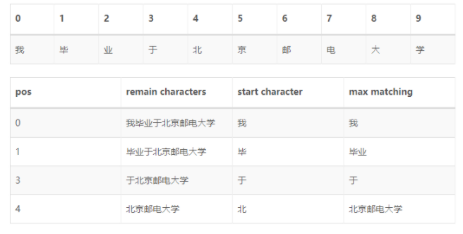
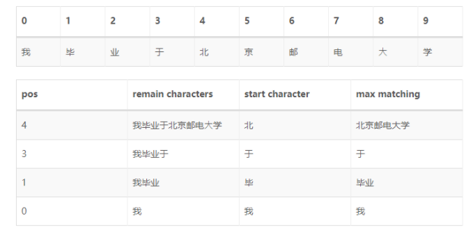
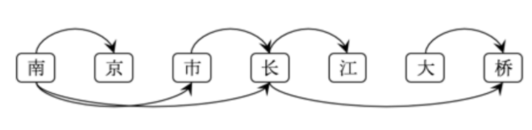
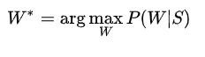
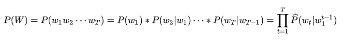

# 【关于 中文分词 】 那些的你不知道的事

> 作者：杨夕
> 
> 项目地址：https://github.com/km1994/nlp_paper_study
> 
> NLP 面经地址：https://github.com/km1994/NLP-Interview-Notes
> 
> 个人介绍：大佬们好，我叫杨夕，该项目主要是本人在研读顶会论文和复现经典论文过程中，所见、所思、所想、所闻，可能存在一些理解错误，希望大佬们多多指正。

## 目录

- [【关于 中文分词 】 那些的你不知道的事](#关于-中文分词--那些的你不知道的事)
  - [目录](#目录)
  - [一、什么是 中文分词？](#一什么是-中文分词)
  - [二、为什么用使用 中文分词，直接用句子或字不好么？](#二为什么用使用-中文分词直接用句子或字不好么)
  - [三、中文分词 有哪些难点？](#三中文分词-有哪些难点)
  - [四、常用方法有哪些？](#四常用方法有哪些)
    - [4.1 基于词典的中文分词方法](#41-基于词典的中文分词方法)
      - [4.1.1 正向最大匹配法](#411-正向最大匹配法)
        - [4.1.1.1 介绍](#4111-介绍)
        - [4.1.1.2 思路](#4112-思路)
      - [4.1.2 负向最大匹配法](#412-负向最大匹配法)
        - [4.1.2.1 介绍](#4121-介绍)
        - [4.1.2.2 思路](#4122-思路)
      - [4.1.3 双向最大匹配法](#413-双向最大匹配法)
    - [4.2 基于N-gram语言模型的分词方法](#42-基于n-gram语言模型的分词方法)
    - [4.3 基于规则的中文分词方法](#43-基于规则的中文分词方法)
  - [参考资料](#参考资料)

## 一、什么是 中文分词？

中文分词(Chinese Word Segmentation) 指的是将一个汉字序列切分成一个一个单独的词。分词就是将连续的字序列按照一定的规范重新组合成词序列的过程。

相比于英文，中文在词与词之间没有任何空格之类的显示标志指示词的边界，如下例所示：

```s
    【全模式】: 我/ 来到/ 北京/ 清华/ 清华大学/ 华大/ 大学
    【精确模式】: 我/ 来到/ 北京/ 清华大学
    【新词识别】：他, 来到, 了, 网易, 杭研, 大厦
    【搜索引擎模式】： 小明, 硕士, 毕业, 于, 中国, 科学, 学院, 科学院, 中国科学院, 计算, 计算所, 后, 在, 日本, 京都, 大学, 日本京都大学, 深造
```
> 注：对于句子 “我来到北京清华大学”，为了让计算机知道 句子中所包含的语义信息，需要将句子进行切割

## 二、为什么用使用 中文分词，直接用句子或字不好么？

- 基于字：无法捕获句子中词与词间的相互关系；
- 基于句子：句子中词语的信息不用作为特征加入模型；

## 三、中文分词 有哪些难点？

1. 没有统一的分词标准，不同的领域对于词的划分方式有不同的标准。
2. 歧义消解

```s
    例子1：结婚的和尚未结婚的
    结婚/的/和/尚未/结婚/的
    结婚/的/和尚/未/结婚/的
```

```s
    例子2：研究生命的起源
    研究/生命/的/起源
    研究生/命/的/起源
```

```s
    例子3：南京市长江大桥
    南京市/长江大桥
    南京/市长/江大桥
```

3. 未登录词（OOV）

## 四、常用方法有哪些？

### 4.1 基于词典的中文分词方法

通过维护词典，在切分语句时，将语句的每个字符串与词表中的词进行逐一匹配，找到则切分，否则不予切分。

#### 4.1.1 正向最大匹配法

##### 4.1.1.1 介绍

对于输入的一段文本从左至右、以贪心的方式切分出当前位置上长度最大的词。正向最大匹配法是基于词典的分词方法，其分词原理是：单词的颗粒度越大，所能表示的含义越确切。



##### 4.1.1.2 思路

- 假设：设S'为句子S的一个子串，词表中最长词的字数为m
- 初始化：指针p1指向句子的首位置
- 算法执行：

1. 如果p1到达句子末尾，分词结束；
2. p2 = p1 + m；
3. 如果p1和p2之间的字符串S'在词表中不存在，p2--，重复(3)；
4. 如果p1和p2之间的字符串S'在词表中存在，则S'是一个词，p1 = p2+1，转(1)；

#### 4.1.2 负向最大匹配法

##### 4.1.2.1 介绍

反向最大匹配法的基本原理与正向最大匹配法类似，只是分词顺序变为从右至左。容易看出，FMM或BMM对于一些有歧义的词处理能力一般。举个例子：结婚的和尚未结婚的，使用FMM很可能分成结婚/的/和尚/未/结婚/的；为人民办公益,使用BMM可能会分成为人/民办/公益。



##### 4.1.2.2 思路

- 假设：设S'为句子S的一个子串，词表中最长词的字数为m
- 初始化：指针p1指向句子的末尾位置
- 算法执行：

1. 如果p1到达句子首位置，分词结束；
2. p2 = p1 - m；
3. 如果p1和p2之间的字符串S'在词表中不存在，p2++，重复(3)；
4. 如果p1和p2之间的字符串S'在词表中存在，则S'是一个词，p1 = p2-1，转(1)；

#### 4.1.3 双向最大匹配法

将正向最大匹配法和逆向最大匹配法得到的分词结果进行比较，按照最大匹配原则，选择词数最少的结果返回。

### 4.2 基于N-gram语言模型的分词方法

- 动机：由于歧义的存在，一段文本存在多种可能的切分结果（切分路径），FMM、BMM使用机械规则的方法选择最优路径
- 方法介绍：N-gram语言模型分词方法则是利用统计信息找出一条概率最大的路径
- 举例说明



上图为南京市长江大桥的全切分有向无环图(DAG)。可以看到，可能的切分路径有：

```s
    南京/市/长江/大桥
    南京/市/长江大桥
    南京市/长江/大桥
    南京市/长江大桥
    南京/市长/江/大桥
    南京/市长/江大桥
    南京市长/江/大桥
    南京市长/江大桥
    …
```

- 思想介绍

假设随机变量S为一个汉字序列，W是S上所有可能的切分路径。对于分词，实际上就是求解使条件概率P(W∣S)最大的切分路径W∗，即



由于P(S)为归一化因子，P(S∣W)恒为1，因此只需要求解P(W)。

P(W)使用N-gram语言模型建模，定义如下(以Bi-gram为例)：



至此，各切分路径的好坏程度(条件概率P(W∣S))可以求解。简单的，可以根据DAG枚举全路径，暴力求解最优路径；也可以使用动态规划的方法求解，jieba中不带HMM新词发现的分词，就是DAG + Uni-gram的语言模型 + 后向DP的方式进行的。

### 4.3 基于规则的中文分词方法

从形式上看，词是稳定的字的组合，因此在上下文中，相邻的字同时出现的次数越多，就越有可能构成一个词。

形式上表现为序列标注问题，每个字在构造一个特定的词语时，都占据着一个确定的构词位置（即词位），构词位置只有四个取值：B（词首）、M（词中）、E（词尾）、S（单独成词）。

```s
    例子1：研究/生命/的/起源
    研/B 究/E 生/B 命/E 的/S 起/B 源/E
```

```s
    例子2：南京市/长江大桥/。
    南/B 京/M 市/E 长/B 江/M 大/M 桥/E 。/S
```

统计分词方法可以分为基于传统机器学习和基于深度学习两大类。

- 常见算法：
  - 隐马尔科夫模型（HMM）
  - 最大熵马尔可夫模型（MEMM）
  - 条件随机场（CRF）
  - BiLSTM-CRF

## 参考资料

1. [成庆, 宗. 统计自然语言处理[M]. 清华大学出版社, 2008]()
2. [中文分词算法简介](https://zhuanlan.zhihu.com/p/33261835)
3. [中文分词技术介绍](https://blog.csdn.net/xiaopihaierletian/article/details/72587365)
4. [中文分词学习笔记](https://blog.csdn.net/zerozzl01/article/details/109254512)