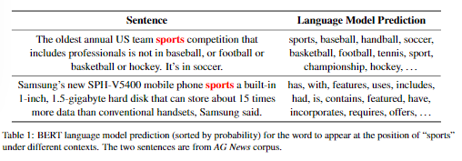
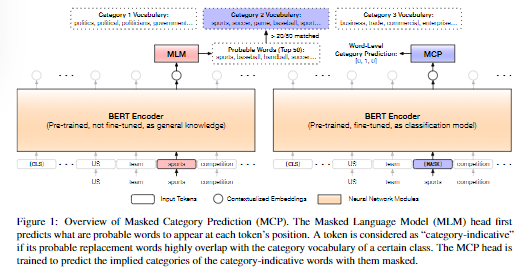

# 【关于 LOTClass】那些你不知道的事

> 作者：杨夕
> 
> 项目地址：
>
> 论文名称：《Text Classification Using Label Names Only: A Language Model Self-Training Approach》
> 
> 会议：EMNLP2020
>
> 论文地址：https://arxiv.org/pdf/2010.07245.pdf
> 
> 论文源码地址：https://github.com/yumeng5/LOTClass
> 
> 个人介绍：大佬们好，我叫杨夕，该项目主要是本人在研读顶会论文和复现经典论文过程中，所见、所思、所想、所闻，可能存在一些理解错误，希望大佬们多多指正。

## 动机

- 监督学习：标注数据昂贵
- 半监督学习：虽然减少了对标注数据的依赖，但还是需要领域专家手动进行标注，特别是在类别数目很大的情况下
- 关键词积累：关键词在不同上下文中也会代表不同类别

## 论文贡献

- 提出了一种基于预训练神经 LM 的弱监督文本分类模型 LotClass，它不需要任何标记文档，只需要每个类的标签名称。
- 提出了一种寻找类别指示词的方法和一个基于上下文的单词类别预测任务，该任务训练LM使用一个词的上下文来预测一个词的隐含类别。经过训练的LM很好地推广了基于未标记语料库的自训练文档级分类
- 在四个分类数据集上，LOTClass明显优于各弱监督模型，并具有与强半监督和监督模型相当的性能。

## 方法

###  Category Understanding via Label Name Replacemen 

- 介绍：使用预先训练好的 LM 从每个类的标签名中学习一个类别词汇，类似于最近研究中的topic mining

###  Masked Category Prediction

- 动机：就像人类如何进行分类一样，我们希望分类模型关注序列中的类别指示词。
- 方法：直接强调语料库中每一个类别词汇条目的出现。
- 问题：这种方法很容易出错
  - 原因：
    - （1）词义是上下文化的；并不是每出现一个类别关键字都表明类别。用于例如，如表1所示，第二句中的“体育”一词并不意味着“体育”这一主题。
    - （2） 范畴词汇的覆盖范围有限，某些特定语境下的术语与范畴关键词含义相似，但不包括在范畴词汇中。

> 表1

- 解决方法：
  - 预先训练的LM创建上下文化的单词级的类别监督方法，用于训练自己预测 masked 单词时单词的隐含类别，如图 1

> 图1：掩蔽类别预测（MCP）概述。Masked 语言模型（MLM）的头首先预测哪些词可能出现在每个标记的位置。如果代词的可能替代词与某一类的范畴词汇高度重叠，则该代词被认为是“范畴指示性的”。训练MCP词头预测类别指示词的隐含类别

## 参考

1. [韩家炜课题组重磅发文：文本分类只需标签名称，不需要任何标注数据！](https://zhuanlan.zhihu.com/p/345738174)