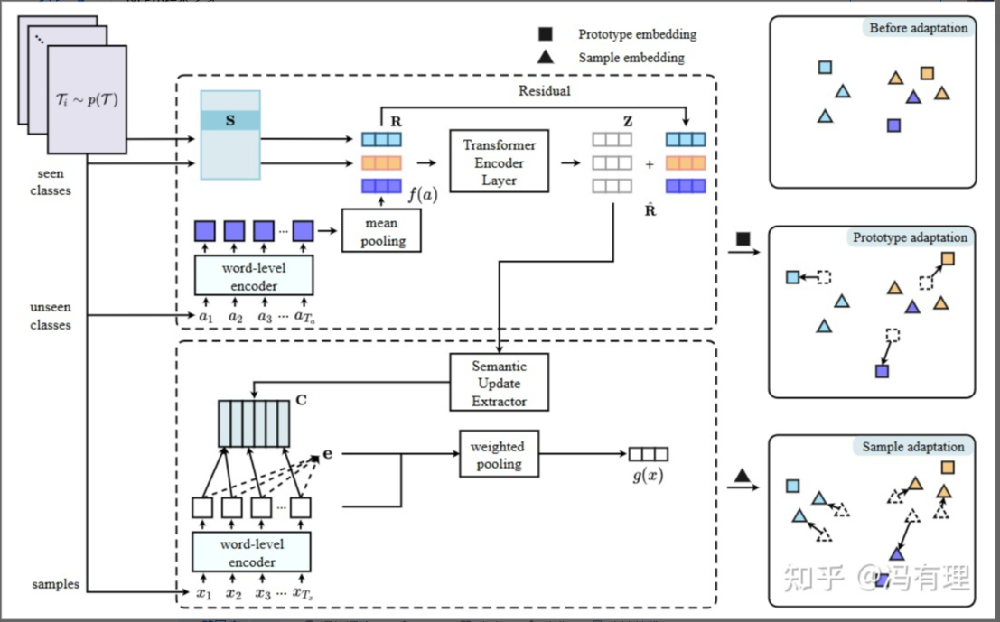

# 【关于 LTA 】那些你不知道的事

> 作者：杨夕
>
> 论文名称：Learn to Adapt for Generalized Zero-Shot Text Classification
> 
> 会议：ACL2022
>
> 论文地址：https://aclanthology.org/2022.acl-long.39
> 
> 论文源码地址：https://github.com/Quareia/LTA
> 
> 个人介绍：大佬们好，我叫杨夕，该项目主要是本人在研读顶会论文和复现经典论文过程中，所见、所思、所想、所闻，可能存在一些理解错误，希望大佬们多多指正。

## 一、动机

1. 什么是 广义零样本（Zero-shot）文本分类？

广义零样本（Zero-shot）文本分类旨在对可见类（seen classes）和增量出现的未见类（unseen classes）的文本实例进行分类。

2. 广义零样本（Zero-shot）文本分类 存在 什么问题？

由于参数在学习过程中仅对可见类进行优化，而未考虑未见类，且参数在预测过程中保持稳定，因此大多数现有方法的泛化能力较差。

## 二、论文方法

本文提出了一个**新的学习适应（Learn to Adapt，LTA）网络**，该网络使用一个可变的元学习框架。

具体而言，**LTA 通过使用可见类和虚拟的未见类来训练自适应分类器**，根据测试时间模拟广义零样本学习（generalized zero-shot learning，GZSL）场景。

与此同时，**学习校准类原型（prototype）和样本表示，使学习参数适应传入的未见类**。

作者声称，所提出的模型能够表征所有的原型和样本。将两个类映射到到一个分布更一致的全局空间。

在五个文本分类数据集上的大量实验表明，本文提出的模型优于sota方法，且具有很大的优势。

> 注：零样本学习（zero-shot learning，ZSL）旨在测试时对未见类实例进行分类；
> 广义零样本学习（generalized zero-shot learning，GZSL）旨在对可见类和新的未见类样本进行分类。

## 三、论文具体介绍

- 在训练阶段，本文采用了 episodic learning 方法，通过模拟多个广义零样本文本分类任务来训练模型;
- Prototype adaptation: 首先引入一个可学习的查找表 S ，存储可见类原型的嵌入，提取“假”的可见类原型  Si （本质上是虚拟未见类）
- Sample adaptation: 零样本学习任务容易产生语义丢失，未见类的特征在训练过程中会被丢弃。为了解决这一问题，本文提出了Sample adaptation 。具体而言，本文使用基于注意机制的语义更新提取器来捕获原型的同步更新

## 参考

1. [小样本学习：Learn to Adapt for Generalized Zero-Shot Text Classification](https://zhuanlan.zhihu.com/p/617380976)