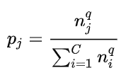
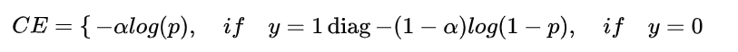
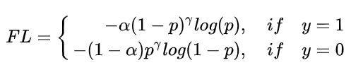
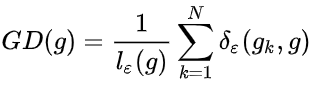
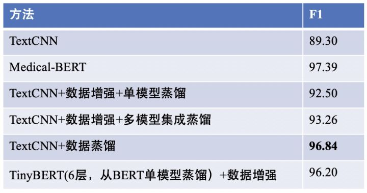

# 【关于 文本分类 trick】那些你不知道的事

> 作者：杨夕
> 
> 论文：Distilling Task-Specific Knowledge from BERT into Simple Neural Networks
> 
> 论文地址：https://arxiv.org/abs/1903.12136
> 
> 项目地址：https://github.com/km1994/nlp_paper_study
>
> 【注：手机阅读可能图片打不开！！！】

- [【关于 文本分类 trick】那些你不知道的事](#关于-文本分类-trick那些你不知道的事)
  - [一、数据预处理问题](#一数据预处理问题)
    - [1.1 vocab 构建问题](#11-vocab-构建问题)
    - [1.2 模型输入问题](#12-模型输入问题)
    - [1.3 噪声数据处理问题](#13-噪声数据处理问题)
    - [1.4 中文任务分词问题](#14-中文任务分词问题)
    - [1.5 停用词处理问题](#15-停用词处理问题)
  - [二、模型篇](#二模型篇)
    - [2.1 模型选择](#21-模型选择)
    - [2.2 词向量选择](#22-词向量选择)
    - [2.3 字 or 词向量 预训练](#23-字-or-词向量-预训练)
  - [三、参数篇](#三参数篇)
    - [3.1 正则化](#31-正则化)
    - [3.2 学习率](#32-学习率)
  - [四、任务篇](#四任务篇)
    - [4.1 二分类问题](#41-二分类问题)
    - [4.2 多标签分类](#42-多标签分类)
    - [4.3 长文本问题](#43-长文本问题)
    - [4.4 鲁棒性问题](#44-鲁棒性问题)
  - [五、标签体系构建](#五标签体系构建)
    - [5.1 标签体系构建](#51-标签体系构建)
    - [5.2 标签体系合理性评估](#52-标签体系合理性评估)
  - [六、策略构建](#六策略构建)
    - [6.1 算法策略构建](#61-算法策略构建)
    - [6.2 特征挖掘策略](#62-特征挖掘策略)
    - [6.3 数据不均衡问题](#63-数据不均衡问题)
      - [6.3.1 重采样（re-sampling）](#631-重采样re-sampling)
      - [6.3.2 重加权（re-weighting）](#632-重加权re-weighting)
      - [6.3.3 数据增强](#633-数据增强)
    - [6.4 预训练模型融合角度](#64-预训练模型融合角度)
    - [6.5 灾难性遗忘问题](#65-灾难性遗忘问题)
    - [6.6 小模型大智慧](#66-小模型大智慧)
      - [6.6.1 模型蒸馏](#661-模型蒸馏)
      - [6.6.2 数据蒸馏](#662-数据蒸馏)
  - [参考资料](#参考资料)

## 一、数据预处理问题

### 1.1 vocab 构建问题

- 数据预处理时vocab的选取（前N个高频词或者过滤掉出现次数小于3的词等等）；

### 1.2 模型输入问题

1. 结合要使用的模型，这里可以把数据处理成char、word或者都用等；
2. 词的词性特征、词的情感特征 加入训练数据会收到比较好的效果；
3. 至于PAD的话，取均值或者一个稍微比较大的数【75%位数】，但是别取最大值那种应该都还好；
4. 可以只保留某几个词性的词语，比如只要形容词和名词
5. 词干化 加入训练数据会收到比较好的效果；
6. 主题向量 加入训练数据会收到比较好的效果；
7. 位置向量 加入训练数据会收到比较好的效果；【位置向量则是将当前词汇的位置进行embedding，然后和词向量进行拼接】

### 1.3 噪声数据处理问题

- 噪声类型：【数据集D(X, Y)】
  - 噪声类型一：X内部噪声很大（比如文本为口语化表述或由广大互联网用户生成）；
  - 噪声类型二：Y的噪声很大（一些样本被明显的错误标注，一些样本人也很难定义是属于哪一类，甚至具备类别二义性）
  - 噪声类型三：固定规则数据（eg：XX报告、XX编辑等高频字段；明显影响模型判断的词语【标点符号影响】）。
- 噪声类型一的解决方法：
  - 方法一：字向量 and 词向量 角度：
    - s1：使用 char-level（中文中就是字的粒度） 作为模型输入；
    - s2：将 train from scratch（不使用预训练词向量）去跟word-level的对比一下；
    - s3：择优使用；
  - 方法二：使用特殊超参的fasttext去训练一份词向量：
    - 介绍：一般来说fasttext在英文中的char ngram的窗口大小一般取值3～6，但是在处理中文时，如果我们的目的是为了去除输入中的噪声，那么我们可以把这个窗口限制为1～2，这种小窗口有利于模型去捕获错别字（想象一下，我们打一个错误词的时候，一般都是将其中的一个字达成同音异形的另一个字），比如word2vec学出来的“似乎”的最近词可能是“好像”，然而小ngram窗口fasttext学出来的“似乎”最近词则很有可能是“是乎”等内部包含错别字的词，这样就一下子让不太过分的错别字构成的词们又重新回到了一起，甚至可以一定程度上对抗分词器产生的噪声（把一个词切分成多个字）。
  - 方法三：文本更正：
    - 中文如果是正常的文本多数都不涉及，但是很多恶意的文本，里面会有大量非法字符，比如在正常的词语中间插入特殊符号，倒序，全半角等。还有一些奇怪的字符，就可能需要你自己维护一个转换表了；
    - 如果是英文的，就涉及拼写检查，可以用python包pyenchant实现，比如 mothjer -> mother。
  - 方法四：文本泛化：
    - 表情符号、数字、人名、地址、网址、命名实体等，用关键字替代就行。这个视具体的任务，可能还得往下细化。比如数字也分很多种，普通数字，手机号码，座机号码，热线号码、银行卡号，QQ号，微信号，金钱，距离等等，并且很多任务中，这些还可以单独作为一维特征。还得考虑中文数字阿拉伯数字等。
    - 中文将字转换成拼音，许多恶意文本中会用同音字替代。
    - 如果是英文的，那可能还得做词干提取、形态还原等，比如fucking,fucked -> fuck

- 噪声类型二的解决方法：
  - 方法一：交叉验证
    - s1：训练模型；
    - s2：让模型去 筛选出 训练集和验证集 中 标签不一致的样本；
    - s3：bad case 分析；
      - 错误来源:
        - 存在规律性：编写规则过滤；
        - 无规律，但是存在标注错误的可能：删除；
        - 其他，...

- 噪声类型三的解决方法：
  - 方法一：对语料的片段或词进行统计，把很高频的无用元素去掉；

### 1.4 中文任务分词问题

- 可以只保留长度大于1的词
  - 结果：对结果精度没什么影响，但是可以有效降低特征维度。
- 确保分词器与词向量表中的token粒度match
  - 原因：如果 分词分对了，但是词找 词向量中找不到，也就是变成 OOV，那么分词性能再好也没用
  - 策略：
    - 使用 word2vec、glove、fasttext 对应的分词器；
    - 将 词典 作为 结巴分词器词典 加入 结巴分词中；
    - 大小写问题：建议将 大小写 全部转化为 大写或小写，防止由于大小写问题造成的 OOV;

### 1.5 停用词处理问题

1. 采用常用词
   1. 来源：网上
   2. 调整：需要根据 具体任务 增加或删除 一些停用词
2. 词筛选。出现次数太多和太少的都可以考虑去掉
   1. 太多的一般是这类文本的常用词；
   2. 太少的往往是拼写错误、命名实体、特殊词组等
3. 根据tfidf来筛选

## 二、模型篇

### 2.1 模型选择

1. 神经网络结构的话，可以多试几种比如fastText、TextCNN、RCNN、char-CNN/RNN、HAN等。
   1. fasttext：显然问题；
   2. TextCNN：简单问题（eg：存在 ngram 可帮助模型正确决策）；【句子太长，可以考虑空洞卷积，扩大感受野】
      1. Filter尺寸：这个参数决定了抽取n-gram特征的长度，这个参数主要跟数据有关，平均长度在50以内的话用10以下就可以了，否则可以长一些。在调参时可以先用一个尺寸grid search，找到一个最优尺寸，然后尝试最优尺寸和附近尺寸的组合；
      2. Filter个数：这个参数会影响最终特征的维度，维度太大的话训练速度就会变慢。这里在100-600之间调参即可；
      3. CNN的激活函数：可以尝试Identity、ReLU、Tanh
      4. 正则化：指对CNN参数的正则化，可以使用dropout或L2，但能起的作用很小，可以试下小的dropout率(<0.5)，L2限制大一点
      5. Pooling方法：根据情况选择mean、max、k-max pooling，大部分时候max表现就很好，因为分类任务对细粒度语义的要求不高，只抓住最大特征就好了
      6. Embedding表：中文可以选择char或word级别的输入，也可以两种都用，会提升些效果。如果训练数据充足（10w+），也可以从头训练
      7. 蒸馏BERT的logits，利用领域内无监督数据
      8. 加深全连接：原论文只使用了一层全连接，而加到3、4层左右效果
   3. TextRNN：复杂问题（eg：人工检查，无法找到规律）；
   4. Transformer：数据量大，显存资源足够；
   5. Bert：超复杂问题；
      1. 多试试不同的预训练模型，比如RoBERT、WWM、ALBERT
      2. 除了 [CLS] 外还可以用 avg、max 池化做句表示，甚至可以把不同层组合起来
      3. 在领域数据上增量预训练
      4. 集成蒸馏，训多个大模型集成起来后蒸馏到一个上
      5. 先用多任务训，再迁移到自己的任务

### 2.2 词向量选择

- 词袋模型：适用于传统的机器学习分类算法；
- 词向量：对于 传统的机器学习分类算法和深度学习方法均适用
  - 传统的机器学习分类算法：
    - 问题：如何将词向量转句向量；
    - 策略：平均、加权平均【tfidf作为权重】
  - 深度学习方法：
    - 问题：如何确定 取 多少个词问题
    - 策略：对正负样本分别统计，综合考虑长度与样本覆盖，用 均值 + n*方差的方式确定，尽量能完全覆盖80%以上的负样本，剩下的再截断，长度对rnn一类的算法性能影响比较大，对cnn类要好很多，所以,cnn类的可以稍微长点关系也不大

### 2.3 字 or 词向量 预训练

- 字向量：预训练时扩展窗口
- 词向量的选择，可以使用预训练好的词向量如谷歌、facebook开源出来的，当训练集比较大的时候也可以进行微调或者随机初始化与训练同时进行。训练集较小时就别微调了

## 三、参数篇

### 3.1 正则化

- BN 和 dropout(<0.5)，以及他们的相对位置和顺序：存在一定收益，需要结合语料分析
- dropout 添加位置：word embed 层后、pooling 后、FC层后

### 3.2 学习率

- 学习率设置：默认学习率 (通常 1e-3) ；
- 衰减：在多轮 epoch 之后将 lr * 0.1；
- 其他策略：
  - 以默认学习率 (通常 1e-3) 训练模型，得到一个在验证集上表现最好的模型。
  - 加载上一步最优模型，学习率降到 1e-4，继续训练模型，保留在验证集上表现最好的模型；
  - 加载上一步最优模型，去掉正则化策略（dropout 等），学习率调为 1e-5，然后训练得到最终的最优模型。

## 四、任务篇

### 4.1 二分类问题

- 输出层的选择：sigmoid or softmax
  - softmax：有时可能有一定的提升

### 4.2 多标签分类

- 问题：如果一个样本同时拥有多个标签，甚至标签同时还构成了DAG（有向无环图）
- 方法：用binary-cross-entropy训出个baseline来（即把每个类别变成一个二分类问题，这样N个类别的多标签分类问题就变成了N个二分类问题）
- 工具：tf.nn.sigmoid_cross_entropy_with_logits

### 4.3 长文本问题

- 方法一：粗暴截断：
  - 只取句首+句尾：截取信息量比较大的头部和尾部，然后进行拼接；
  - 随机截取：如果固定截断信息损失较大，可以在DataLoader中每次以不同的随机概率进行截断，这种截断可以让模型看到更多形态的case；
  - 句首+tfidf筛几个词出来：截取句首，对于句中和句尾，通过关键字提前方法提取关键词，拼接到句子后面；
  - 截断&滑窗+预测平均：通过随机截断或者固定滑窗将一个样本切割成多个样本，在预测时对多个样本的结果进行平均；
- 方法二：模型角度，常用一些模型优化，eg：XLNet、Reformer、Longformer

### 4.4 鲁棒性问题

- 粗暴的数据增强，加停用词加标点、删词、同义词替换等，如果效果下降就把增强后的训练数据洗一下。
- 对抗学习、对比学习这样的高阶技巧来提升；

## 五、标签体系构建

### 5.1 标签体系构建

1. **长尾标签**：某些分类标签下的样本天然就很少，可以把这一类标签设置「其他」，然后在下一层级单独对这些长尾标签进一步处理。
2. **易混淆标签**：一些标签下的样本表现形式不易区分，首先需要思考这类标签是否可以直接合并；如果不可以，可以先将这类标签进行统一，然后在下一层级进行规则处理。
3. **多标签**：一些场景下的标签设置可能达到几百个，可以设置多层级的标签体系进行处理。例如，**先构建标签大类、再构建标签小类**；也可以**设置多个二分类，适用于标签分类相对独立，并且经常需要新增修改的场景，能做到相互独立、便于维护**。
4. **未知标签**：业务冷启动时，如果尚不清楚设置哪些标签合适，可以尝试通过文本聚类方式初步划分标签，再辅以专家介入共同设定，这也是一个循环迭代的过程。

### 5.2 标签体系合理性评估

1. 标签体系合理性评估：
   1. 采样一部分数据标注，分析标签体系是否合理
2. 训练集构建：
   1. 初始训练集构建：
      1. 观察 每个标签下数据特点，常用词典+规则进行预标准，并结合人工 check；
   2. 结合【主动学习+迁移学习+自训练+数据增强】减低标注成本：
      1. **主动学习旨在挖掘高价值样本**：即通过构建较少的样本就可以满足指标要求。根据初始构建的数据集，可以train一个base model，然后挑选一些 **不确定性程度高（熵最大）+代表性高（非离群点）的样本进行人工标注**；
      2. **迁移学习降低对数据的依赖**：迁移学习中预训练语言模型的成功，可以使其在较少的标注样本上finetune就可达到目标指标；
      3. **扩充标注规模，数据增强最为关键**：在标注规模较小的少样本场景下，可以通过文本增强方式扩充数据集，撬动数据杠杆；
      4. **自训练**：
         1. 利用 初始标注集微调预训练模型 Bert;
         2. 然后利用微调后的Bert模型去回标 未标注数据集;
         3. 选取 置信度高 的 样本 作为训练集；
3. 评测集构建：
   1. 贴合真实数据分布的线上评估集，反映线上效果；
   2. 用规则去重后均匀采样的随机评估集，反映模型的真实能力；

## 六、策略构建

### 6.1 算法策略构建

1. 算法策略：
   1. 规则挖掘【规则兜底】：对于一些 高频case 和 hard case 优先考虑规则或词典解决，避免由于模型的更新迭代，而导致模型对于 这些 case 处理不够健壮；
      1. 常用的规则方法：重要case缓存、模式挖掘、关键词+规则设置等
   2. 模型泛化：模型化方法适合处理无法命中规则的case，具备泛化性。还有另一种处理逻辑是：如果case命中了规则，但模型对于规则预测的结果给出了很低的置信度（也就是模型认为另一种类别的置信度更高），这时我们可以选择相信模型，以模型输出为准。

### 6.2 特征挖掘策略

1. **离散数据挖掘**
   1. **构建关键词的高维稀疏特征**：类似结构化数据挖掘（如CTR中的wide&deep），比如根据关键词列表对文本内容进行挖掘，构建高维稀疏特征并喂入xDeepFM [3] 中进行处理，最后与文本向量一同拼接。
   2. **其他业务特征**：如疾病大类划分、就诊科室等业务特征。
2. **文本特征挖掘**
   1. **关键词&实体词与文本拼接**：将从文本序列提取的关键词或实体词拼接在文本序列后，再进行分类。如在BERT中：[CLS][原始文本][SEP][关键词1][SEP][实体词1]...
   2. **关键词embedding化**：将关键词划分为不同的类别属性，进行embedding化，不同于离散数据挖掘，这里的embedding不应稀疏。
   3. **领域化向量挖掘**：除了在领域语料上继续预训练词向量外，还可以有监督地构建词向量：例如对于21分类问题，先根据弱监督方法训练21个基于SVM的二分类器，然后提取每个词汇在21个SVM中的权重，即可为每个词汇可以构建21维的词向量。
3. **标签特征融入**
   1. **标签embedding 化**：设置label embedding，然后通过注意力机制与词向量进行交互，提取全局向量分类。
   2. **标签信息补充**：可以将类别标签与原始文本一同拼接，然后进行2分类，如在BERT中：[CLS][原始文本][SEP][类别标签]。此外，也可以通过强化学习动态地补充标签信息，具体可参考文献 [4] 。

### 6.3 数据不均衡问题

- 不均衡问题类别：
  - 数据量不均衡；
  - 数据多样性不均衡；
- 解决不平衡问题的通常思路：
  - **重采样（re-sampling）**；
  - **重加权（re-weighting）**；
  - **数据增强**；
  - 梯度放缩；
  - 伪标签；

#### 6.3.1 重采样（re-sampling）

- 目标：使所有标签对应的样本数量均衡
- 公式介绍：

> C 为数据集的类别数量，$n_i$为类别 i 的样本总数， $p_j$ 为从 j 类别中采样一个样本的概率

  
> 表示所有类别都采样相同数量的样本。

- 方法：
  - 欠采样&过采样&SMOTE
    - 欠采样：抛弃大量case，可能导致偏差加大；
    - 过采样：可能会导致过拟合；
    - SMOTE：一种近邻插值，降低过拟合风险，但不能直接应用于NLP任务的离散空间插值。
  - 数据增强：文本增强技术更适合于替代上述过采样和SMOTE。

#### 6.3.2 重加权（re-weighting）

重加权就是改变分类loss。相较于重采样，重加权loss更加灵活和方便。其常用方法有：

- loss类别加权：通常根据类别数量进行加权，加权系数与类别数量成反比。

- Focal Loss：上述loss类别加权主要关注正负样本数量的不平衡，并没有关注难易不平衡。Focal Loss主要关注难易样本的不平衡问题，可根据对高置信度(p)样本进行降权：

- GHM Loss：GHM(gradient harmonizing mechanism) 是一种梯度调和机制。Focal Loss虽然强调对hard example的学习，但不是所有的hard example都值得关注，有的hard example很可能是离群点，过分关注不是错上加错了吗？GHM定义了梯度模长g：

如下图所示（图片来自知乎[5]），梯度模长g接近于0的样本数量最多，随着梯度模长的增长，样本数量迅速减少，但是在梯度模长接近于1时，样本数量也挺多。

因此，GHM的出发点是：既不要关注那些容易学的样本，也不要关注那些离群点特别难分的样本。为此，作者定义了梯度密度 

其物理含义是：单位梯度模长g部分的样本个数。最终GHM Loss为： 

- Dice Loss:
  - 主要为了解决训练和测试时F1指标不一致的问题，提出一个基于Dice Loss的自适应损失——DSC,对F1指标更加健壮:

  - 与Focal Loss类似，训练时推动模型更加关注困难的样本,使用作为 (1-p) 每个样本的权重。改进之后的DSC为：

- 对logit调整权重：实际上是将类别概率 p(y) 引入loss中，并对logit调整权重，本质上是一种通过[互信息思想来缓解类别不平衡问题](https://link.zhihu.com/?target=https%3A//kexue.fm/archives/7615): 

#### 6.3.3 数据增强

- 数据增强：
  - “增删改”：句子中“增删改”一些词；
  - 回译：将文本翻译成其他语言再翻译回来；
  - 近义词：用 近义词 替换 部分词
  - 扩充
  - 截取

### 6.4 预训练模型融合角度

- 一般不需要直接进行finetune。当然也可先单独对BERT、XLNET、ALBERT进行finetune，然后再一起进行特征集成。
- 分词器可以采取最佳预训练模型的tokenizer，也可同时使用不同预训练模型的tokenizer。
- 不要忽视简单词向量的作用。类似字词向量、bi-gram向量的补充对于底层模型的丰富性很关键。
- 配置上层模型时，应注意学习率的调整。将集成的底层特征喂入biLSTM或CNN中，也可以拼接biLSTM和CNN共同作为上层模型。训练时，可以先将底层预训练模型freeze，只调整上层模型的学习率（较大），最后再全局调整学习率（较小）。
- CLS最后一定还要再用一次。无论上层模型怎样。CLS特征要再最后直接进入全连接层。

### 6.5 灾难性遗忘问题

- 动机：学习了新的知识之后，几乎彻底遗忘掉之前习得的内容；
- 具体描述：我们搭建了一个深度神经网络来学习识别各种动物。假定我们遇到了一个非常吝啬的数据提供者，每次只提供一种动物的数据，并在学习完成识别该动物后，将数据收缴上去；然后才给下一个动物的训练数据。有意思的现象出来了，这个神经网络在学习识别小狗后，让它识别之前学习过的小猫，它竟然识别不出来。这就是灾难性遗忘，它一直是深度学习领域一个比较严重的问题。
- 为什么会出现该问题：
  - 深度学习的结构一旦确定，在训练过程中很难调整。神经网络的结构直接决定学习模型的容量。固定结构的神经网络意味着模型的容量也是有限的，在容量有限的情况下，神经网络为了学习一个新的任务，就必须擦除旧有的知识。
  - 深度学习的隐含层的神经元是全局的，单个神经元的细小变化能够同时影响整个网络的输出结果。另外，所有前馈网络的参数与输入的每个维度都相连，新数据很大可能改变网络中所有的参数。我们知道，对于本身结构就已经固定的神经网络，参数是关于知识的唯一变化量。如果变化的参数中包含与历史知识相关性很大的参数，那么最终的效果就是，新知识覆盖了旧的知识。
- 解决方案：

1. 直接现有数据与原有数据混合训练；
2. 将特征抽取层freeze，对新类别只更新softMax全连接层；
3. 采取知识蒸馏方式。在现有数据与原有数据混合一起训练时，对原有类别进行蒸馏，指导新模型学习。
4. 将分类标签统一进行label embedding，新增类别单独构建的label embedding不影响原有类别。从而将分类转为一个match和rank问题。

### 6.6 小模型大智慧

- 动机：BERT虽然强大，但在低耗时场景、少机器场景下，直接拿BERT部署分类模型通常行不通。我们是否可以采取一个轻量级的模型，比如TextCNN，去逼近BERT的效果呢？
- 思路：采用知识蒸馏技术。蒸馏的本质是函数逼近，但如果直接将BERT（Teacher模型）蒸馏到一个十分轻量的TextCNN（Student模型），指标一般会下降。
- 方法：
  - **模型蒸馏**
  - **数据蒸馏**

#### 6.6.1 模型蒸馏

如果业务中的无标注数据较少，我们通常采取logits近似（值近似）让TextCNN进行学习，这种方式可称之为模型蒸馏。这是一种离线蒸馏方式：即先对Teacher模型finetune，然后freeze，再让Student模型学习。为避免蒸馏后指标下降明显，我们可以采取以下方式改进：

- 数据增强：在蒸馏的同时引入文本增强技术，具体的增强技术可参考[《NLP中的少样本困境问题探究》](https://link.zhihu.com/?target=https%3A//mp.weixin.qq.com/s%3F__biz%3DMzIwNzc2NTk0NQ%3D%3D%26mid%3D2247490516%26idx%3D1%26sn%3D16b1c520f312400ffcad5573d4330e08%26scene%3D21%23wechat_redirect)。TinyBERT就采取了增强技术，以辅助蒸馏。
- 集成蒸馏：对不同Teacher模型（如不同的预训练模型）的logits集成，让TextCNN学习。**「集成蒸馏+数据增强」**可以有效避免指标明显下降。
- 联合蒸馏：不同于离线蒸馏，这是一种联合训练方式。Teacher模型训练的同时，就将logits传给Student模型学习。联合蒸馏可以减轻异构化严重的Teacher和Student模型间的gap，Student模型可以慢慢从中间状态进行学习，更好地模仿Teacher行为。

#### 6.6.2 数据蒸馏

如果业务中的无标注数据规模较大，我们可以采取标签近似让TextCNN进行学习。这种方式称为数据蒸馏。其本质与伪标方法类似：让Teacher模型对无标注数据进行伪标，再让Student模型进行学习。其具体步骤为：

1. 训练1：BERT在标注数据集A上finetune，训练一个bert_model；
2. 伪标：bert_model对大量无标注数据U进行预测（伪标），然后根据置信度打分，选择高置信度的数据B填充到标注数据A，这时候标注数据变为（A+B）；
3. 训练2：基于标注数据A+B训练TextCNN，得到textcnn_model_1；
4. 训练3（optional）：让第3步训练好的textcnn_model_1基于标注数据A再训练一次，形成最终模型textcnn_model_2；

对上述两种蒸馏方式，笔者对业务中的一个21个分类任务（每类100条样本）进行了实验，相关结果如下：

从上图可以看出，如果我们能够获取更多的无标注数据，采取数据蒸馏的方式则更为有效，可以让一个轻量级的TextCNN最大程度逼近BERT。

不过也许有的读者会问，为什么不直接蒸馏为一个浅层BERT呢？这当然可以，不过笔者这里推荐TextCNN的原因是：它实在太轻了，而且会更加方便引入一些业务相关的特征。

如果仍然想蒸馏为一个浅层BERT，我们需要首先思考自己所在的领域是否与BERT原始预训练领域的gap是否较大？如果gap较大，我们不要停止预训练，继续进行领域预训练、然后再蒸馏；或者重新预训练一个浅层BERT。此外，采取BERT上线时，也可以进行算子融合（Faster Transformer）或者混合精度等方式。

## 参考资料

1. [【小夕精选】如何优雅而时髦的解决不均衡分类问题](https://mp.weixin.qq.com/s?__biz=MzIwNzc2NTk0NQ==&mid=2247484993&idx=1&sn=0bd32089a638e5a1b48239656febb6e0&chksm=970c2e97a07ba7818d63dddbb469486dccb369ecc11f38ffdea596452b9e5bf65772820a8ac9&token=407616831&lang=zh_CN#rd)
2. [在文本分类任务中，有哪些论文中很少提及却对性能有重要影响的trick](https://www.zhihu.com/question/265357659)
3. [xDeepFM: Combining Explicit and Implicit Feature Interactions for Recommender Systems](https://arxiv.org/pdf/1803.05170.pdf)
4. [Description Based Text Classification with Reinforcement Learning](https://arxiv.org/pdf/2002.03067.pdf)
5. [如何解决NLP分类任务的11个关键问题：类别不平衡&低耗时计算&小样本&鲁棒性&测试检验&长文本分类](https://zhuanlan.zhihu.com/p/183852900)