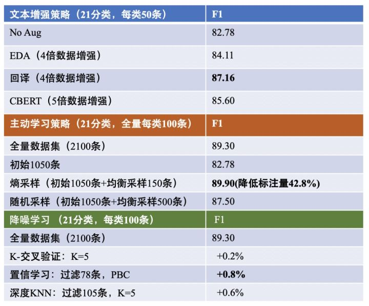
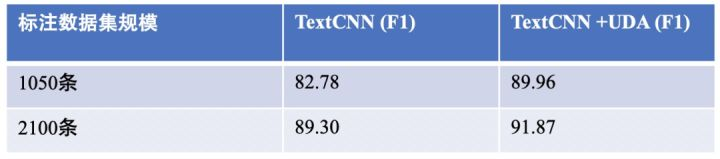
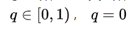
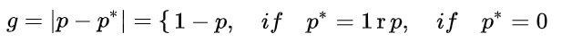
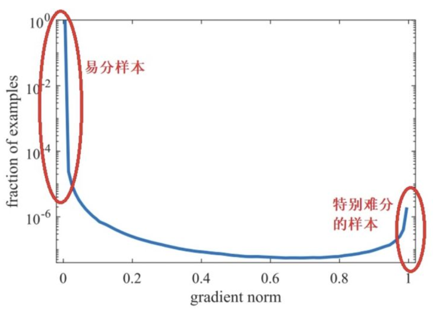
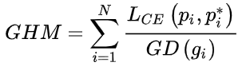
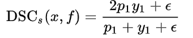
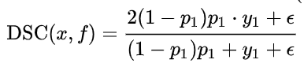
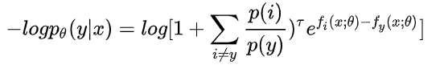

# 如何解决NLP分类任务的11个关键问题？

> 作者：JayLou娄杰
> 
> 原文链接：https://zhuanlan.zhihu.com/p/183852900
> 
> 转载者：杨夕
> 
> github：https://zhuanlan.zhihu.com/p/183852900

## 前言

在2020这个时间节点，对于NLP分类任务，我们的关注重点早已不再是如何构造模型、拘泥于分类模型长什么样子了。如同CV领域当前的重点一样，我们更应该关注如何利用机器学习思想，更好地去解决NLP分类任务中的**低耗时、小样本、鲁棒性、不平衡、测试检验、增量学习、长文本**等问题。

NLP分类任务我们每个NLPer都异常熟悉了，其在整个NLP业务中占据着举足轻重的地位，更多领域的子任务也常常转化为一个分类任务，例如新闻分类、情感识别、意图识别、关系分类、事件类型判断等等。构建一个完整的NLP分类任务主要包含4部分：**标签定义、数据构建、算法策略、测试部署**。本文的组织架构，如下图所示。

## 问题列表

- Q1: 如何科学地构建分类标签体系？
- Q2: 标注是「人工」智能的精髓所在，如何省成本、鲁棒、高效地构建任务数据集？
- Q3: 模型化就是唯一吗？分类任务中，算法策略构建的基本原则是什么？
- Q4: 特征挖掘立竿见影，如何在特征工程方面搞点事情？
- Q5: 数据为王，不要将数据闲置，如何将无标注数据更好地派上用场？
- Q6: 攻克分类任务的难点：如何更好处理不平衡问题（hard example问题）？
- Q7: BERT时代，如何处理长文本分类？
- Q8: 预训练融合：NLP竞赛利器！
- Q9: 你认真构造离线测试集了吗？指标高，也许是虚高！
- Q10: 模型更新迭代时，如何进行增量学习，不遗忘先前记忆？
- Q11: 低耗时场景，如何让TextCNN逼近BERT的效果？

## 问题解答

### Q1: 如何科学地构建分类标签体系？

分类标签的定义至关重要，面对复杂的标签问题，最为关键的一点就是要紧密贴合业务、和专家共同设定，而不是靠“蛮力”去解决。这里给出笔者曾涉及到的一些标签定义方法：

1. **长尾标签**：某些分类标签下的样本天然就很少，可以把这一类标签设置「其他」，然后在下一层级单独对这些长尾标签进一步处理。
2. **易混淆标签**：一些标签下的样本表现形式不易区分，首先需要思考这类标签是否可以直接合并；如果不可以，可以先将这类标签进行统一，然后在下一层级进行规则处理。
3. **多标签**：一些场景下的标签设置可能达到几百个，可以设置多层级的标签体系进行处理。例如，**先构建标签大类、再构建标签小类**；也可以**设置多个二分类，适用于标签分类相对独立，并且经常需要新增修改的场景，能做到相互独立、便于维护**。
4. **未知标签**：业务冷启动时，如果尚不清楚设置哪些标签合适，可以尝试通过文本聚类方式初步划分标签，再辅以专家介入共同设定，这也是一个循环迭代的过程。

对于上述的「长尾标签」和「易混淆标签」，当然也可在模型层面进行优化，这往往涉及样本不平衡和hard example的处理问题，我们在下文详细阐述。

### Q2: 标注是「人工」智能的精髓所在，如何省成本、鲁棒、高效地构建任务数据集？

标签定义好后，就需要构建分类任务数据集。数据集构建，是日常工作的重要一环。**既要省成本、也要鲁棒，更要高效**。构建数据集的主要流程包括以下4步：

1. ** 构建初始数据集**：为每个标签生产约100个样本，具体的措施可以采取关键词匹配等规则手段，再结合人工check进行。

2. **「主动学习+迁移学习」降低标注规模**：

- **主动学习旨在挖掘高价值样本**：即通过构建较少的样本就可以满足指标要求。根据初始构建的数据集，可以train一个base model，然后挑选一些 **不确定性程度高（熵最大）+代表性高（非离群点）的样本进行人工标注**。

- **迁移学习降低对数据的依赖**：迁移学习中预训练语言模型的成功，可以使其在较少的标注样本上finetune就可达到目标指标。

3. **扩充标注规模，数据增强最为关键**：在标注规模较小的少样本场景下，可以通过文本增强方式扩充数据集，撬动数据杠杆。在 [《标注样本少怎么办？「文本增强+半监督学习」总结》](https://zhuanlan.zhihu.com/p/146777068) 一文中我们对有关的文本增强技术进行了详细探究。

4. **清洗数据噪音，让模型更加鲁棒**：对于标注质量问题要严格把关，标志质量除了人工核查，也可以下面的方法自动化构建降噪系统：

- 人工规则清洗：可以配置关键词信息在内的黑白名单进行强规则清洗。
- 交叉验证：可以通过对训练集进行交叉验证，对那些标签不一致的样本进行去除或者人工纠正。
- 置信学习：本质上是对交叉验证的进一步推广，构建置信度混淆矩阵并引入rank机制过滤噪声样本。[《标注数据存在错误怎么办？MIT&Google提出用置信学习找出错误标注》](https://zhuanlan.zhihu.com/p/146557232)一文中有详细介绍。
- 深度KNN过滤：KNN中的最近邻度量，使其在鲁棒学习中更加有效。《Deep k-NN for Noisy Labels》一文表明：即使深度模型在含噪数据上进行训练，而将模型中间层表示适配于KNN进行噪声样本过滤，效果提升也很明显。

在构建数据集时，除了上述4步外，也要注重一些细节和原则问题：

- **针对少样本问题，不能盲目追求前沿算法的变现落地**。很多时候，我们总想寄托于某种方法能够通用地解决低资源问题，但现实往往是策略调研的时间过长，指标增益还没有直接人工补标数据来得快。笔者发现，绝大数少样本问题，必要的人工标注不可少，**多策略组合+“有计划、有策略”的人工标注**也许是解决少样本问题的最佳方式。
- 智能标注是否是一个伪命题？智能标注的本质是高效，但主动学习往往并不高效。主动学习需要对专家系统多次查询来进行标注。所以采用主动学习方法时，不仅要降低标注规模，也要注意降低查询次数。实践中，我们可以根据经验公式，优先对指标增益明显的类别标签进行主动查询。也可以根据经验公式预估一下满足增益目标的数据补充量，一次查询尽量满足要求，多标一点也没关系。所谓的“智能标注系统”是否真正的智能，笔者总觉得多多少少还是不能脱离人工介入。
- **预训练模型要具备领域性，不要停止预训练！**当我们所执行任务的标注数据较少，所属的领域与初始预训练语料越不相关，那就不要停止领域预训练！

笔者这里给出了上述一些策略的简要实验结果，如下图所示：

### Q3: 模型化就是唯一吗？分类任务中，算法策略构建的基本原则是什么？

算法策略主要包括规则挖掘和模型化方法，基本原则应是：

1. **规则兜底**：高频case和hard case优先进入规则模块，防止因模型的更新迭代，而使针对重要case的处理不够健壮。规则挖掘主要包括重要case缓存、模式挖掘、关键词+规则设置等。此外，规则也可以跟在分类模型后面进行兜底处理。
2. **模型泛化**：模型化方法适合处理无法命中规则的case，具备泛化性。还有另一种处理逻辑是：如果case命中了规则，但模型对于规则预测的结果给出了很低的置信度（也就是模型认为另一种类别的置信度更高），这时我们可以选择相信模型，以模型输出为准。

不过，无论是对于规则，还是模型，长尾问题的处理都是比较棘手的，但我们可以通过一些手段尽可能加强处理长尾case的能力（Q6中具体介绍）。

### Q4: 特征挖掘立竿见影，如何在特征工程方面搞点事情？

对于NLP分类任务，特别是垂直领域的分类任务，如果能够在业务特征层面更好地进行挖掘，那么指标增益可是立竿见影啊～

在特征工程方面，笔者这里主要给出了3种技巧：

- **离散数据挖掘**
  - **构建关键词的高维稀疏特征**：类似结构化数据挖掘（如CTR中的wide&deep），比如根据关键词列表对文本内容进行挖掘，构建高维稀疏特征并喂入xDeepFM [1] 中进行处理，最后与文本向量一同拼接。
  - **其他业务特征**：如疾病大类划分、就诊科室等业务特征。
- **文本特征挖掘**
  - **关键词&实体词与文本拼接**：将从文本序列提取的关键词或实体词拼接在文本序列后，再进行分类。如在BERT中：[CLS][原始文本][SEP][关键词1][SEP][实体词1]...
  - **关键词embedding化**：将关键词划分为不同的类别属性，进行embedding化，不同于离散数据挖掘，这里的embedding不应稀疏。
  - **领域化向量挖掘**：除了在领域语料上继续预训练词向量外，还可以有监督地构建词向量：例如对于21分类问题，先根据弱监督方法训练21个基于SVM的二分类器，然后提取每个词汇在21个SVM中的权重，即可为每个词汇可以构建21维的词向量。
- **标签特征融入**
  - **标签embedding 化**：设置label embedding，然后通过注意力机制与词向量进行交互，提取全局向量分类。
  - **标签信息补充**：可以将类别标签与原始文本一同拼接，然后进行2分类，如在BERT中：[CLS][原始文本][SEP][类别标签]。此外，也可以通过强化学习动态地补充标签信息，具体可参考文献 [2] 。

### Q5: 数据为王，不要将数据闲置，如何将无标注数据更好地派上用场？

大量的无标注数据蕴藏着巨大的能量！机器学习中，能够充分利用、并挖掘无标注数据价值的，自然是——自监督学习和半监督学习了。

- 自监督学习：乘风破浪的NLP预训练语言模型充分利用了无标注数据，展现出强大能力。而如果我们设计分类任务时，能够释放更多的无标注数据，亦或者通过度量学习采集更多的无标注数据，就可以：
  - 继续进行任务级别的预训练，这是一种廉价、快速提升指标的手段。
  - 与分类任务一起构造语言模型loss，进行多任务学习。
- 半监督学习：半监督学习在CV中已经发扬光大，常常有两种形式：
  - 伪标：可分为自训练和协同训练，Q6中介绍的数据蒸馏就属于自训练的一种。在Google的最新论文《Rethinking Pre-training and Self-training》中，表明自监督的局限性，而自训练表现良好，在每种条件设置下均能很好地发挥作用。可见，如果在NLP中能够构建类似于ImageNet那样大规模的有标签数据集，自训练“未来可期”。而联合自监督预训练和自训练可能会获得更大的增益。    
  - 一致性训练：对于未标记数据，希望模型在其输入受到轻微扰动时仍然产生相同的输出分布，这种方式能够提高一致性训练性能，充分挖掘未标注数据中潜在的价值，最终增强泛化性能。

来自Google的《UDA：Unsupervised Data Augmentation for Consistency Training》结合了自监督预训练和半监督学习中的一致性训练，在六个文本分类任务进行了实验，表明：

1. 在少样本场景下，借助UDA，最终能够逼近全量数据集时所达到的指标：在IMDb的2分类任务上，具有20个标注数据的UDA优于在1250倍标注数据上训练的SOTA模型。但相较于2分类任务，5分类任务难度更高，未来仍有提升空间。
2. 全量数据下，融合UDA框架，性能也有一定提升。
下面是笔者的一些简要实验结果：

### Q6: 攻克分类任务的难点：如何更好处理不平衡问题（hard example问题）？

不平衡问题（长尾问题）是文本分类任务一个难啃的骨头。也许有人会问：为何不在初始构造数据集时，就让每个分类标签下的样本数量相同，这不就解决不平衡问题了吗？

事实上，**不平衡问题不仅仅是分类标签下样本数量的不平衡，其本质上更是难易样本的不平衡**：即使样本数量是平衡的，有的hard example还是很难学习。类似，对那些数量较少的类别进行学习，在不做数据补充的情况下，也可看作是一个hard example问题。

解决不平衡问题的通常思路有两种：**重采样（re-sampling）**和**重加权（re-weighting）**：

#### （1）重采样（re-sampling）

重采用的通用公式为：

为数据集的类别数量，为类别的样本总数， 为从 类别中采样一个样本的概率. ， 表示所有类别都采样相同数量的样本。

C 为数据集的类别数量，$n_i $为类别 i 的样本总数， $p_j$ 为从 j 类别中采样一个样本的概率，  表示所有类别都采样相同数量的样本。

常用的重采样方法有：

- 欠采样&过采样&SMOTE
  - 欠采样：抛弃大量case，可能导致偏差加大；
  - 过采样：可能会导致过拟合；
  - SMOTE：一种近邻插值，降低过拟合风险，但不能直接应用于NLP任务的离散空间插值。
- 数据增强：文本增强技术更适合于替代上述过采样和SMOTE。
- 解耦特征和标签分布：文献[3] 认为对**不平衡问题的再平衡本质应只是分类器的再平衡过程，类别标签分布不应影响特征空间的分布**。基于此，可以解耦类别标签分布和特征空间分布：
  - 首先不做任何再平衡，直接对原始数据训练一个base_model。
  - 将base_model的特征提取器freeze，通过类别平衡采样（对尾部类别重采样）只调整分类器。
  - 分类器权重模 ||w|| 与类别数量呈正相关，因此还需将  ||w||做归一化处理。
- Curriculum Learning（课程学习）：课程学习[4]是一种模拟人类学习过程的训练策略，从易到难进行学习：
  - Sampling Scheduler：调整训练集的数据分布，逐步将采样数据集的样本分布从原先的不平衡调整到后期的平衡状态
  - Loss Scheduler：开始倾向于拉大不同类目之间特征的距离，后期再倾向于对特征做分类。

#### （2）重加权（re-weighting）

重加权就是改变分类loss。相较于重采样，重加权loss更加灵活和方便。其常用方法有：

- loss类别加权：通常根据类别数量进行加权，加权系数与类别数量成反比。

- Focal Loss：上述loss类别加权主要关注正负样本数量的不平衡，并没有关注难易不平衡。Focal Loss主要关注难易样本的不平衡问题，可根据对高置信度(p)样本进行降权：

- GHM Loss：GHM(gradient harmonizing mechanism) 是一种梯度调和机制。Focal Loss虽然强调对hard example的学习，但不是所有的hard example都值得关注，有的hard example很可能是离群点，过分关注不是错上加错了吗？GHM定义了梯度模长g：

如下图所示（图片来自知乎[5]），梯度模长g接近于0的样本数量最多，随着梯度模长的增长，样本数量迅速减少，但是在梯度模长接近于1时，样本数量也挺多。

因此，GHM的出发点是：既不要关注那些容易学的样本，也不要关注那些离群点特别难分的样本。为此，作者定义了梯度密度 

其物理含义是：单位梯度模长g部分的样本个数。最终GHM Loss为： 

- Dice Loss:
  - 主要为了解决训练和测试时F1指标不一致的问题，提出一个基于Dice Loss的自适应损失——DSC,对F1指标更加健壮:

  - 与Focal Loss类似，训练时推动模型更加关注困难的样本,使用作为 (1-p) 每个样本的权重。改进之后的DSC为：

- 对logit调整权重：实际上是将类别概率 p(y) 引入loss中，并对logit调整权重，本质上是一种通过[互信息思想来缓解类别不平衡问题](https://link.zhihu.com/?target=https%3A//kexue.fm/archives/7615): 

### Q7: BERT时代，如何处理长文本分类？

由于显存占用和算力的限制，BERT等预训练语言模型的input一般来说最长512个token。某些场景下处理长文本分类，BERT可能还不如CNN效果好。为能让BERT等更适合处理长文本，笔者从 **「文本处理」** 和 **「改进attention机制」**两个方面给出一些可以尝试的方法：

#### （1）文本处理

- 固定截断：一般来说，文本的开头和结尾信息量较大，可以按照一定比例对截取出文本的开头和结尾；
- 随机截断：如果固定截断信息损失较大，可以在DataLoader中每次以不同的随机概率进行截断，这种截断可以让模型看到更多形态的case；
- 截断&滑窗+预测平均：通过随机截断或者固定滑窗将一个样本切割成多个样本，在预测时对多个样本的结果进行平均；
- 截断+关键词提取：采取直接截断的方式可能会导致信息量损失，可以通过关键词提取补充信息。如：[CLS][截断文本][SEP][关键词1][SEP][关键词2]...

#### （2）改进attention机制

Transformer采取的attention机制，其时间复杂度为 $O(n^2)$ ，其中为文本长度。最近一些paper聚焦于对attention机制的改进、降低计算复杂度，以更适合处理长文本序列。主要包括：

- Reformer[6]：主要采取局部敏感哈希机制(Locality Sensitve Hashing，LSH)，这种机制类似于桶排序：将相近的向量先归为一类，只计算同类向量之间的点积，将时间复杂度降为 O(nlog(n)) ；考虑到相似的向量会被分到不同的桶里，Reformer进行了多轮LSH，但这反而会降低效率。
- Linformer[7]：提出自注意力是低秩的，信息集中在少量(k 个)的最大奇异值中。Linformer利用线性映射将时间复杂度降为 O(nk) ，当 $k<<n$ 时，接近于线性时间。但实践中表明，k增加效果会更好，k一般取256或512。
- Longformer[8]：采取滑窗机制，只在固定窗口大小w内计算局部attention，复杂度降为 O(nw)，当 $w<<n$ 时，接近于线性时间（实践中仍然取512）；为扩大感受野，也可以采取“膨胀滑窗机制”; 也可以在特殊位置，例如[CLS]处，局部地计算全局attention。
- Big Bird[9]：在Longformer基础上增加了Random attention，当前长序列建模的SOTA，刷新了QA和摘要的SOTA，同时也被证明是图灵完备的。如下图：

对于绝大数长文本分类问题，笔者建议首选「文本处理」方式。对于有条件的，可以采取上述「改进attention机制」方法进行尝试，比如，对已经预训练好的RoBERTa采取Longformer机制继续预训练。Longformer已经开源，并且可以直接在cuda内核上进行优化加速。

### Q8: 预训练融合：NLP竞赛利器！

各大NLP竞赛中，模型融合（集成）是一个重要的提分神器，而除了不同模型的融合，另一种更加有效的方式就是——预训练融合。

在NLP任务中，**不同模型的预测差异更多取决于底层模型（embedding层）的差异**，这不同于CV领域往往取决于上层模型的异构程度。

那么怎么丰富底层模型呢？一个直接的方式就是把不同预训练模型融合：如可以将word2vec、elmo、BERT、XLNET、ALBERT统一作为特征提取器，但这时需要注意（以下内容部分参考自"王然老师课程"[10]，笔者进行了归纳整合）：

- 一般不需要直接进行finetune。当然也可先单独对BERT、XLNET、ALBERT进行finetune，然后再一起进行特征集成。
- 分词器可以采取最佳预训练模型的tokenizer，也可同时使用不同预训练模型的tokenizer。
- 不要忽视简单词向量的作用。类似字词向量、bi-gram向量的补充对于底层模型的丰富性很关键。
- 配置上层模型时，应注意学习率的调整。将集成的底层特征喂入biLSTM或CNN中，也可以拼接biLSTM和CNN共同作为上层模型。训练时，可以先将底层预训练模型freeze，只调整上层模型的学习率（较大），最后再全局调整学习率（较小）。
- CLS最后一定还要再用一次。无论上层模型怎样。CLS特征要再最后直接进入全连接层。

### Q9: 你认真构造离线测试集了吗？指标高，也许是虚高！

很多时候时候我们构造测试集，往往都是根据初始标注集自动划分测试集，这在任务初期完全OK。但我们不能就此相信指标高，一切就OK。**模型的评估环节至关重要，不能总是上线了才醒悟，不能总是等着线上badcase来迭代**。

ACL2020最佳论文《Beyond Accuracy: Behavioral Testing of NLP Models with CHECKLIST》告诉我们：应通过CheckList全方位对模型多项“能力”进行评估，其可快速生成大规模的测试样例。

笔者发现在具体实践中，为了让评估更加全面，其实可以：

1. 积累同义词库、生僻字，进行性质不变测试、词汇测试；
2. 构造对抗样本，进行攻击测试；
3. 防患于未然，提前捞一批数据，找到那些不确定性高的case进行测试；

从上述测试中，发现bug自然是一件好事，问题的暴露让我们心里才有底。

最近开源的OpenAttack文本对抗攻击工具包也可帮助我们进行鲁棒性测试，主要包括：文本预处理、受害模型访问、对抗样本生成、对抗攻击评测以及对抗训练等。对抗攻击能够帮助暴露受害模型的弱点，有助于提高模型的鲁棒性和可解释性，具有重要的研究意义和应用价值。

### Q10: 模型更新迭代时，如何进行增量学习，不遗忘先前记忆？

模型化的手段在进行更新迭代时，也许会出现遗忘问题，即对之前已经处理好的case不work。如果badcase不多，先采取规则优化是相对健壮的，可以用规则设置旁路，专门处置应急badcase。

此外，笔者给出以下几种解决此问题的方案：

1. 直接现有数据与原有数据混合训练；
2. 将特征抽取层freeze，对新类别只更新softMax全连接层；
3. 采取知识蒸馏方式。在现有数据与原有数据混合一起训练时，对原有类别进行蒸馏，指导新模型学习。
4. 将分类标签统一进行label embedding，新增类别单独构建的label embedding不影响原有类别。从而将分类转为一个match和rank问题。

### Q11: 低耗时场景，如何让TextCNN逼近BERT的效果？

BERT虽然强大，但在低耗时场景、少机器场景下，直接拿BERT部署分类模型通常行不通。我们是否可以采取一个轻量级的模型，比如TextCNN，去逼近BERT的效果呢？

为解决这一问题，我们通常采用知识蒸馏技术。蒸馏的本质是函数逼近，但如果直接将BERT（Teacher模型）蒸馏到一个十分轻量的TextCNN（Student模型），指标一般会下降。

如何尽量缓解这一情况呢？笔者根据「无标注数据规模大小」分别给出了2种蒸馏方案——**模型蒸馏**和数**据蒸馏**。

#### （1）模型蒸馏

如果业务中的无标注数据较少，我们通常采取logits近似（值近似）让TextCNN进行学习，这种方式可称之为模型蒸馏。这是一种离线蒸馏方式：即先对Teacher模型finetune，然后freeze，再让Student模型学习。为避免蒸馏后指标下降明显，我们可以采取以下方式改进：

- 数据增强：在蒸馏的同时引入文本增强技术，具体的增强技术可参考[《NLP中的少样本困境问题探究》](https://link.zhihu.com/?target=https%3A//mp.weixin.qq.com/s%3F__biz%3DMzIwNzc2NTk0NQ%3D%3D%26mid%3D2247490516%26idx%3D1%26sn%3D16b1c520f312400ffcad5573d4330e08%26scene%3D21%23wechat_redirect)。TinyBERT就采取了增强技术，以辅助蒸馏。
- 集成蒸馏：对不同Teacher模型（如不同的预训练模型）的logits集成，让TextCNN学习。**「集成蒸馏+数据增强」**可以有效避免指标明显下降。
- 联合蒸馏：不同于离线蒸馏，这是一种联合训练方式。Teacher模型训练的同时，就将logits传给Student模型学习。联合蒸馏可以减轻异构化严重的Teacher和Student模型间的gap，Student模型可以慢慢从中间状态进行学习，更好地模仿Teacher行为。

#### （2）数据蒸馏

如果业务中的无标注数据规模较大，我们可以采取标签近似让TextCNN进行学习。这种方式称为数据蒸馏。其本质与伪标方法类似：让Teacher模型对无标注数据进行伪标，再让Student模型进行学习。其具体步骤为：

1. 训练1：BERT在标注数据集A上finetune，训练一个bert_model；
2. 伪标：bert_model对大量无标注数据U进行预测（伪标），然后根据置信度打分，选择高置信度的数据B填充到标注数据A，这时候标注数据变为（A+B）；
3. 训练2：基于标注数据A+B训练TextCNN，得到textcnn_model_1；
4. 训练3（optional）：让第3步训练好的textcnn_model_1基于标注数据A再训练一次，形成最终模型textcnn_model_2；

对上述两种蒸馏方式，笔者对业务中的一个21个分类任务（每类100条样本）进行了实验，相关结果如下：

从上图可以看出，如果我们能够获取更多的无标注数据，采取数据蒸馏的方式则更为有效，可以让一个轻量级的TextCNN最大程度逼近BERT。

不过也许有的读者会问，为什么不直接蒸馏为一个浅层BERT呢？这当然可以，不过笔者这里推荐TextCNN的原因是：它实在太轻了，而且会更加方便引入一些业务相关的特征。

如果仍然想蒸馏为一个浅层BERT，我们需要首先思考自己所在的领域是否与BERT原始预训练领域的gap是否较大？如果gap较大，我们不要停止预训练，继续进行领域预训练、然后再蒸馏；或者重新预训练一个浅层BERT。此外，采取BERT上线时，也可以进行算子融合（Faster Transformer）或者混合精度等方式。

## 写在最后

让我们一起致敬：那些年陪我们一起入门（坑）NLP的分类模型吧～

## Reference

1. [xDeepFM: Combining Explicit and Implicit Feature Interactions for Recommender Systems](https://arxiv.org/pdf/1803.05170.pdf)
2. [Description Based Text Classification with Reinforcement Learning](https://arxiv.org/pdf/2002.03067.pdf)
3. [Decoupling Representation and Classifier for Long-Tailed Recognition](https://arxiv.org/pdf/1910.09217.pdf)
4. [Dynamic Curriculum Learning for Imbalanced Data Classification](https://arxiv.org/pdf/1901.06783.pdf)
5. [5分钟理解Focal Loss与GHM——解决样本不平衡利器](https://zhuanlan.zhihu.com/p/80594704)
6. [REFORMER: THE EFFICIENT TRANSFORMER](https://arxiv.org/pdf/2001.04451.pdf)
7. [Linformer: Self-Attention with Linear Complexity](https://arxiv.org/pdf/2006.04768.pdf)
8. [Longformer: The Long-Document Transformer](https://arxiv.org/pdf/2004.05150.pdf) 
9. [Big Bird: Transformers for Longer Sequences](https://arxiv.org/pdf/2007.14062.pdf)
10. [王然老师课程](https://time.geekbang.org/course/intro/100046401)