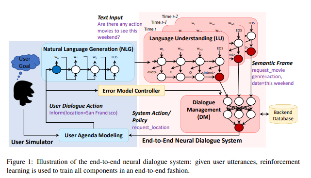
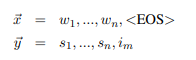

# 【关于 TC-Bot 】那些你不知道的事

> 作者：杨夕
> 
> 项目地址：https://github.com/km1994/nlp_paper_study
> 
> 个人介绍：大佬们好，我叫杨夕，该项目主要是本人在研读顶会论文和复现经典论文过程中，所见、所思、所想、所闻，可能存在一些理解错误，希望大佬们多多指正。
> 
> 论文：End-to-End Task-Completion Neural Dialogue Systems
> 
> 论文 code ：https://github.com/MiuLab/TC-Bot

## 目录

- [【关于 TC-Bot 】那些你不知道的事](#关于-tc-bot-那些你不知道的事)
  - [目录](#目录)
  - [论文动机，论文方法，论文实验结果？](#论文动机论文方法论文实验结果)
  - [传统的对话系统介绍](#传统的对话系统介绍)
  - [前沿方法 review](#前沿方法-review)
  - [论文方法整体介绍](#论文方法整体介绍)
  - [论文方法框架介绍](#论文方法框架介绍)
    - [Neural Dialogue System](#neural-dialogue-system)
      - [Language Understanding (LU) 怎么做？](#language-understanding-lu-怎么做)
      - [Dialogue Management (DM)](#dialogue-management-dm)
    - [User Simulation](#user-simulation)
      - [（1）用户议程模型](#1用户议程模型)
      - [（2）自然语言生成（NLG）](#2自然语言生成nlg)
    - [Error Model Controller](#error-model-controller)
      - [（1）意图级别错误](#1意图级别错误)
      - [（2）槽级别错误](#2槽级别错误)
  - [端到端的强化学习](#端到端的强化学习)
  - [参考资料](#参考资料)

## 论文动机，论文方法，论文实验结果？

- 动机：模块化任务驱动对话系统的主要缺点之一是每个模块都经过单独训练，这带来了一些挑战。例如，下游模块受上游模块的影响，并且由于错误的累积导致整个系统的性能并不可靠。

- 论文方法：本文为任务驱动对话系统提出了一种新的端到端学习框架，以解决此类问题。**我们的神经对话系统可以直接与结构化数据库交互，以帮助用户访问信息并完成某些任务。基于强化学习的对话管理器提供了强大的功能来处理由对话系统其他组件引起的噪声**。

- 实验结果：我们在电影票预订领域进行的实验表明，我们的端到端系统不仅在客观和主观评估方面都优于模块化对话系统baseline，而且针对于于语言理解模块，对噪声的鲁棒性也得到了一些具有不同错误粒度和错误率的系统性实验的证明。

## 传统的对话系统介绍

- 传统对话系统：基于复杂的模块化管道
  - 所包含模块：
    - 语言理解（LU）模块；
    - 对话管理器（DM）；
    - 自然语言生成（NLG）；

## 前沿方法 review

- Wen 等和 Bordes 等引入了**基于网络的端到端可训练的面向任务的对话系统**
  - 介绍：该系统将对话系统学习过程视为学习从对话历史到系统响应的映射的问题，并应用了编码器-解码器模型来训练整个系统系统。
  - 问题：系统是以监督方式进行训练的：
    - 需要大量的训练数据；
    - 由于缺乏对训练数据中对话控制的探索，因此可能无法有效地找到好的策略。
- Zhao和Eskenazi**首次**提出了一种**端到端强化学习（RL）方法**，用于DM中的对话状态追踪和策略学习
  - 介绍：当将这种方法应用于猜测用户想到的名人的面向任务的对话问题时，​​该方法被证明是很有前途的。在对话中，agent向用户询问一系列“是/否”问题，以找到正确的答案。
  - 问题：
    - 问题一：不固定的问题类型。提出请求问题比是/否问题更自然，更有效。例如，当位置槽有大量可能的值时，与系统询问“Are you located in Palo Alto?”相比，“Where are you located?”更为自然有效；
    -问题二： 较差的鲁棒性。用户的答案太简单，以至于不能被误解，因此系统在实际用户说话中**缺乏针对噪声的健壮性**；
    - 问题三：对话期间的用户请求。在面向任务的对话中，用户可能会提出问题以选择首选的插槽值。在售票示例中，用户可能会问“What flight is available tomorrow?”
- 针对问题二的相关改进：
  - Su 等简要研究了对话行为水平语义错误率对对话表现的影响。
  - Lemon and Liu比较了不同环境下的策略转移特性，表明在高噪声条件下训练的策略比在低噪声条件下训练的策略具有更好的转移特性。
  - Dhingra等提出了一种端到端的差异化KB-Infobot来为前两个问题提供解决方案，但最后一个问题仍未解决。

## 论文方法整体介绍

- 解决问题的方式：本文通过将目标系统重新定义为任务驱动的神经对话系统来解决上述所有三个问题。
- 方法介绍：本文**首次尝试了通过利用监督学习和强化学习技术以端对端的方式训练现实世界中的任务驱动对话系统**。为了进一步了解基于强化学习的对话系统的鲁棒性，我们对LU错误的细粒度水平进行了广泛的实验和定量分析，并对语言理解组件如何影响对话系统的整体性能提供了有意义的见解。
- 特点：
  - 鲁棒性。我们通过强化学习，根据不确定性和混乱情况自动选择动作，从而提出一种具有更高鲁棒性的神经对话系统。我们还提供了第一个系统分析，以调查不同类型的自然语言理解错误对对话系统性能的影响。我们表明，槽级别的错误比意图级别的错误对系统性能的影响更大，并且槽值替换最会使性能降低。我们的发现揭示了如何在考虑错误控制的情况下在对话系统中设计多任务自然语言理解模型（意图分类和槽位标签）。
  - 灵活性。该系统是第一个允许在对话过程中以用户主导的神经对话系统，用户可以在该系统中以更高的灵活性与系统进行交互，这在实际场景中很重要。
  - 可重现性。我们演示了如何使用众包的特定于任务的数据集和模拟用户以端到端的方式评估RL对话agent，从而确保可重现性和相同环境中竞争方法的一致比较。

## 论文方法框架介绍

- 框架模块划分：
  - 用户模拟器（左部分）：
    - 介绍：
      - 基于对话行为级别的基于议程的用户建模组件：用于控制以生成的用户目标为条件的会话交换，以确保用户以一致的，面向目标的方式采取行动。
      - NLG模块：用于生成与用户对话动作相对应的自然语言文本；
  - 神经对话系统（右部分）：
    - 介绍：
      - LU模块：将输入语句（已识别的话语或文本输入）解析成相应的语义框架；
      - DM（包括状态跟踪器和策略学习器）：将从每个话语中累积语义， 稳健地跟踪对话过程中的对话状态，并生成下一个系统动作

### Neural Dialogue System

#### Language Understanding (LU) 怎么做？

- 主要任务：自动对用户查询的领域以及特定领域的意图进行分类（意图识别），并填充一组槽以形成语义框架（槽填充）；
- 插槽标签表示常用方法：IOB 
  

> 其中：
> 
> $\vec{x}$：输入单词序列
> 
> $\vec{y}$包含相关的插槽 $s_k$ 和句子级别的意图 $i_m$

- 常用方法：LSTM
  - 介绍：执行意图预测和槽填充

- LU的目标：在给定单词序列$\vec{x}$的情况下最大化槽的和意图$\vec{y}$的条件概率：

$$p(\vec{y} | \vec{x}) = (\prod^n_ip(s_i| w_1,...,w_i))p(i_m|\vec{y}).$$

#### Dialogue Management (DM)

- 阶段：
  - 对话状态跟踪：对于给定LU输出，例如request(moviename；genre=action；date=this weekend)，状态跟踪器执行三个主要功能：
    - a.形成一个查询与数据库交互以检索可用的结果；
    - b.状态跟踪器将根据数据库的可用结果和最新的用户对话操作进行更新；
    - c.状态跟踪器将为策略学习准备状态表示$s_t$。
  - 策略学习：策略学习的状态表示包括最新的用户操作，例如request(moviename；genre=action；date=this weekend)，最新的agent操作（request(location)），可用的数据库结果，根据状态跟踪器的状态表示$s_t$，策略$π$将根据$π(s_t)$生成下一个可用的系统动作。监督学习或强化学习均可用于优化$π$。

### User Simulation

- 目的：为了对所提出的神经对话系统进行端到端训练，需要用户模拟器来自动地与对话系统进行交互。在任务驱动的对话环境中，用户模拟器首先生成用户目标。agent不知道用户目标，但会尝试在对话过程中帮助用户实现目标。
- 整个对话交流都隐含地围绕着这个目标。用户目标通常由两部分组成：
  - （1）可通知槽（inform_slots）以作为来自用户的约束的插槽值对；
  - （2）可请求槽（request_slots）作为用户没有任何信息但想要在对话期间从agent获取值的插槽。用户目标是使用一组有标签的对话数据生成的。

#### （1）用户议程模型

在对话过程中，用户模拟器会维护一个简洁的，类似堆栈的表示形式，称为用户议程；

- 用户状态$s_u$ 被分解为：
  - 议程$A$
  - 目标$G$，组成：
    - 约束$C$；
    - 请求$R$；
> 
> 在每个时刻$t$，用户模拟器都会基于当前状态$s_{u,t}$和上一个agent动作$a_{m,t-1}$生成下一个用户动作$a_{u,t}$，然后更新当前状态$s_{u,t}'$。

#### （2）自然语言生成（NLG）

- 介绍：根据用户的对话动作，NLG模块会生成自然语言文本。
- 目标：为了在有限的标签数据下控制用户模拟器的质量；
- 方法：采用了一种包括基于模板的NLG和基于模型的NLG的混合方法，其中Seq2Seq模型在标签数据集上训练了基于模型的NLG ；
- 思路：
  - 它以对话作为输入，并通过LSTM解码器使用插槽占位符生成初始句子；
  - 然后后处理扫描被执行以将插槽占位符替换为其实际值；
  - 在LSTM解码器中，我们应用集束搜索，该集束搜索在生成下一个字符时会反复考虑前k个最佳子句。

在混合模型中，如果可以在预定义的句子模板中找到用户对话动作，则应用基于模板的NLG；否则，将应用基于模板的NLG。这种混合方法使对话系统开发人员可以通过提供机器学习模型不能很好处理的句子模板来轻松改善NLG。

### Error Model Controller

- 目标：当在训练或测试基于用户动作的语义框架时，引入错误模型以模拟来自LU组件的噪声以及用户与agent之间的噪声通信以测试模型的鲁棒性。
- 方法：我们在错误模型中引入了不同级别的噪声：
  - 一种错误类型是意图级别，
  - 另一种类型是槽级别。对于每个级别，都有多种细粒度的噪声。

#### （1）意图级别错误

在意图级别上，我们将所有意图分为三类：

- 第1组：一般问候，感谢，结束等。
- 第2组：用户可以通知agent槽值，例如，inform(moviename =‘Titanic’,starttime =‘7pm’)。
- 第3组：用户可以请求有关特定槽的信息。在电影预订的情况下，用户可能会问“request(starttime;moviename=‘Titanic’)”。

例如，在电影预订的特定任务中，存在多个通知和请求意图，例如请求开始时间，请求电影名称，通知开始时间和通知电影名称等。基于以上意图类别，存在三种类型的意图错误 ：

- 随机错误（I0）：来自同一类别（组内错误）或其他类别（组间错误）的随机噪声意图。
- 组内错误（I1）：噪声意图来自与真实意图的同一组，例如，真实意图是request_theater，但LU模块预测的意图可能是request_moviename。
- 组间错误（I2）：噪声意图来自不同的组，例如，可能将真实的意图request_moviename预测为inform_moviename。

#### （2）槽级别错误

在槽级别，有四种错误类型：

- 随机错误（S0）：模拟随机设置为以下三种类型的噪声。
- 槽删除（S1）：用于模拟LU组件无法识别槽的情况。
- 错误的槽值（S2）：用于模拟正确识别槽名称但槽值错误（例如，错误的词段分割）的场景。
- 错误的槽（S3）：用于模拟错误识别槽及其值的情况。

## 端到端的强化学习

- 动机：为了学习我们系统的交互策略，我们以端到端的方式将强化学习应用于DM训练，其中每个神经网络组件都可以进行微调。
- 方法：该策略表示为深度Q网络（DQN），该策略将状态跟踪器的状态$s_t$作为输入，并为所有动作$a$输出$Q(s_t,a;θ)$。应用了两个重要的DQN技巧：目标网络（DDQN）使用和经验回放，其中为了适应对话环境更改了经验回放策略。
- **训练期间**，我们使用$\epsilon-greedy$探索和具有动态更改缓冲区大小的经验回放缓冲区。在每个模拟时期，我们模拟$N(N = 100)$个对话，并将这些状态转换元组$(s_t,a_t,r_t,s_{t+1})$添加到经验回放缓冲区中进行训练。在每一次仿真中，当前DQN将被更新多次（取决于批处理大小和当前经验回放缓冲区的大小）。在最后一个仿真时期，目标网络将被当前DQN替换，目标DQN网络仅在一个仿真时期中更新一次。
- **经验回放策略**对于RL训练至关重要。在我们的缓冲区更新策略中，我们从模拟中累积所有经验元组，并刷新经验池，直到当前RL agent达到成功率阈值（即，等于基于规则的agent的性能的阈值），然后使用当前RL agent的经验元组重新填充缓冲区。直觉是DQN的初始性能不足以生成良好的经验回放元组，因此我们不会刷新经验回放池，直到当前的RL代理可以达到一定的成功率（例如， 基于agent的代理）。在其余的训练过程中，在每个模拟时期，我们都会估计当前DQN agent的成功率（通过在模拟用户上运行多个对话）。如果当前DQN agent比目标网络更好，则将刷新经验回放缓冲区。

## 参考资料

1. [End-to-End Task-Completion Neural Dialogue Systems翻译](https://www.daimajiaoliu.com/daima/4edd53b90900414)