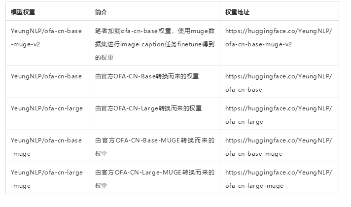
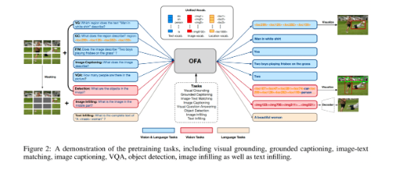

# 【关于 OFA-Chinese】那些你不知道的事

> 论文标题：Unifying Architectures, Tasks, and Modalities Through a Simple Sequence-to-Sequence Learning Framework 
> 
> github ：https://github.com/yangjianxin1/OFA-Chinese
>
> 模型权重

## 一、模型简介

OFA是由阿里达摩院发布的多模态预训练模型，OFA将各种模态任务统一于Seq2Seq框架中。如下图所示，OFA支持的下游任务包括但不限于Image Caption、Image Classification、 Image genaration、Language Understanding等等。

## 参考

1. [社区供稿｜OFA-Chinese：中文多模态统一预训练模型](https://mp.weixin.qq.com/s/qiilwa8a-AiRrxvXqY0WgA)

