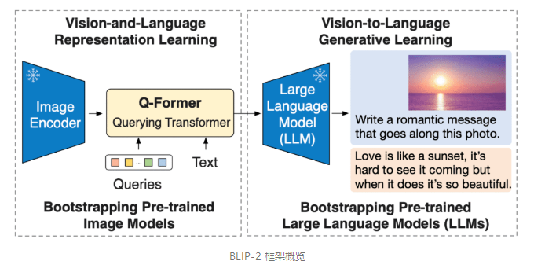
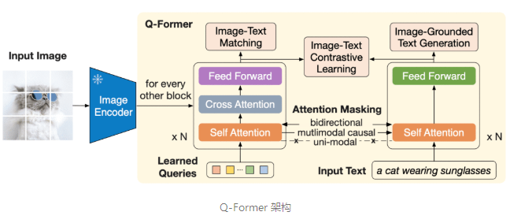
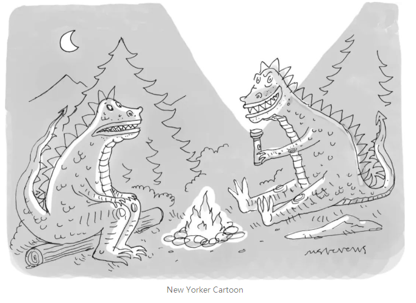

# 【关于 BLIP-2 】那些你不知道的事

> [BLIP-2 模型文档](https://hf.co/docs/transformers/main/en/model_doc/blip-2)

> [BLIP-2 论文链接](https://arxiv.org/pdf/2301.12597.pdf)

## 一、前言

本文将介绍来自 Salesforce 研究院的 BLIP-2 模型，它支持一整套最先进的视觉语言模型，且已集成入 🤗 Transformers。我们将向你展示如何将其用于图像字幕生成、有提示图像字幕生成、视觉问答及基于聊天的提示这些应用场景。

## 二、动机

近年来，计算机视觉和自然语言处理领域各自都取得了飞速发展。但许多实际问题本质上其实是多模态的，即它们同时涉及几种不同形式的数据，如图像和文本。因此，需要视觉语言模型来帮助解决一系列组合模态的挑战，我们的技术才能最终得到广泛落地。**视觉语言模型可以处理的一些 图生文 任务包括图像字幕生成、图文检索以及视觉问答**。图像字幕生成可以用于视障人士辅助、创建有用的产品描述、识别非文本模态的不当内容等。图文检索可以用于多模态搜索，也可用于自动驾驶场合。视觉问答可以助力教育行业、使能多模态聊天机器人，还可用于各种特定领域的信息检索应用。

现代计算机视觉和自然语言模型在能力越来越强大的同时，模型尺寸也随之显著增大。由于当前进行一次单模态模型的预训练既耗费资源又昂贵，因此端到端视觉语言预训练的成本也已变得越来越高。

**BLIP-2 通过引入一种新的视觉语言预训练范式来应对这一挑战，该范式可以任意组合并充分利用两个预训练好的视觉编码器和 LLM，而无须端到端地预训练整个架构。这使得我们可以在多个视觉语言任务上实现最先进的结果，同时显著减少训练参数量和预训练成本**。此外，这种方法为多模态ChatGPT 类应用奠定了基础。

## 三、BLIP-2 模型结构

BLIP-2 通过**在冻结的预训练图像编码器和冻结的预训练大语言模型之间添加一个轻量级 查询 Transformer (Query Transformer, Q-Former) 来弥合视觉和语言模型之间的模态隔阂 (modality gap)**。在整个模型中，Q-Former 是唯一的可训练模块，而图像编码器和语言模型始终保持冻结状态。



### 3.1 Q-Former 模型结构

Q-Former 是一个 transformer 模型，它由两个子模块组成，这两个子模块共享相同的自注意力层:

- 与冻结的图像编码器交互的图像 transformer，用于视觉特征提取
- 文本 transformer，用作文本编码器和解码器



图像 transformer 从图像编码器中提取固定数量的输出特征，这里特征的个数与输入图像分辨率无关。同时，图像 transformer 接收若干查询嵌入作为输入，这些查询嵌入是可训练的。这些查询还可以通过相同的自注意力层与文本进行交互 (译者注: 这里的相同是指图像 transformer 和文本 transformer 对应的自注意力层是共享的)。

### 3.2 Q-Former 预训练阶段

- 第一阶段，图像编码器被冻结，Q-Former 通过三个损失函数进行训练:
  - **图文对比损失 (image-text contrastive loss)**: 每个查询的输出都与文本输出的 CLS 词元计算成对相似度，并从中选择相似度最高的一个最终计算对比损失。在该损失函数下，查询嵌入和文本不会 “看到” 彼此。
  - **基于图像的文本生成损失**: 查询内部可以相互计算注意力但不计算文本词元对查询的注意力，同时文本内部的自注意力使用因果掩码且需计算所有查询对文本的注意力。
  - **图文匹配损失 (image-text matching loss)**: 查询和文本可以看到彼此，最终获得一个几率 (logit) 用以表示文字与图像是否匹配。这里，使用难例挖掘技术 (hard negative mining) 来生成负样本。

- 第二阶段：
  - 第一阶段输出：图像 transformer 作为一个信息瓶颈 (information bottleneck)，查询嵌入经过它后，其输出嵌入已经不仅仅包含了视觉信息，而且包含了与文本相关的视觉信息。
  - 第一阶段输出嵌入用作第二阶段 LLM 输入的视觉前缀。该预训练阶段主要涉及一个以基于图像的文本生成任务，损失函数使用因果 LM 损失。

## 四、通过 Hugging Face Transformers 使用 BLIP-2

### 4.1 模型加载

使用 Hugging Face Transformers，你可以轻松下载并在你自己的图像上运行预训练的 BLIP-2 模型。如果你想跑跑本文中的示例，请确保使用大显存 GPU。

我们从安装 Transformers 开始。由于此模型是最近才添加到 Transformers 中的，因此我们需要从源代码安装 Transformers:

```s
pip install git+https://github.com/huggingface/transformers.git
```

接下来，我们需要一个输入图像。《纽约客》每周都会面向其读者举办一场 卡通字幕比赛。我们从中取一张卡通图像输入给 BLIP-2 用于测试。

卡通字母比赛链接: https://www.newyorker.com/cartoons/contest#thisweek

```s
import requests
from PIL import Image

url = 'https://media.newyorker.com/cartoons/63dc6847be24a6a76d90eb99/master/w_1160,c_limit/230213_a26611_838.jpg'
image = Image.open (requests.get (url, stream=True).raw).convert ('RGB')  
display (image.resize ((596, 437)))
```



现在我们有一张输入图像了，还需要一个预训练过的 BLIP-2 模型和相应的预处理器来处理输入。你 可以在 Hugging Face Hub 上找到所有可用的预训练 checkpoints 列表。这里，我们将加载一个使用 Meta AI 的预训练 OPT 模型的 BLIP-2 checkpoint，该 OPT 模型具有 27 亿个参数。

```s
from transformers import AutoProcessor, Blip2ForConditionalGeneration
import torch

processor = AutoProcessor.from_pretrained ("Salesforce/blip2-opt-2.7b")
model = Blip2ForConditionalGeneration.from_pretrained ("Salesforce/blip2-opt-2.7b", torch_dtype=torch.float16)
```

请注意，你暂时还无法使用 Auto API (例如 AutoModelForXXX) 来加载 BLIP-2 模型，这种情况在 Hugging Face 中比较少见。你需要显式使用 Blip2ForConditionalGeneration 来加载 BLIP-2 模型。虽然自动获取模型还不能做到，但是你可以使用 AutoProcessor 来获取匹配的处理器类，在本例中为 Blip2Processor。

我们可以使用 GPU 来加快文本生成速度:

```s
device = "cuda" if torch.cuda.is_available () else "cpu"
model.to (device)
```

### 4.2 图像字幕生成

我们先看看 BLIP-2 是否可以零样本地为《纽约客》卡通图像生成字幕。要为图像添加字幕，我们不必向模型提供任何文本提示，仅提供预处理过的输入图像。没有任何文字提示，模型将从 BOS (beginning-of-sequence) 开始生成图像字幕。

```s
inputs = processor (image, return_tensors="pt")

generated_ids = model.generate (**inputs, max_new_tokens=20)
generated_text = processor.batch_decode (generated_ids, skip_special_tokens=True)[0].strip ()
print (generated_text)
>>>
"two cartoon monsters sitting around a campfire"
```

对于未使用《纽约客》风格的卡通图像训练过的模型，这是一个令人印象深刻的准确描述！

### 4.3 图像字幕生成

我们还可以通过提供文本提示来扩展图像字幕生成，模型将在给定图像的情况下接着提示词往下补充。

```s
prompt = "this is a cartoon of"

inputs = processor (image, text=prompt, return_tensors="pt").to (device, torch.float16)

generated_ids = model.generate (**inputs, max_new_tokens=20)
generated_text = processor.batch_decode (generated_ids, skip_special_tokens=True)[0].strip ()
print (generated_text)
>>>
"two monsters sitting around a campfire"
```

```s
prompt = "they look like they are"

inputs = processor (image, text=prompt, return_tensors="pt").to (device, torch.float16)

generated_ids = model.generate (**inputs, max_new_tokens=20)
generated_text = processor.batch_decode (generated_ids, skip_special_tokens=True)[0].strip ()
print (generated_text)
>>>
"having a good time"
```

### 4.4 视觉问答

用于视觉问答时，提示必须遵循特定格式: "Question: {} Answer:"

```s
prompt = "Question: What is a dinosaur holding? Answer:"

inputs = processor (image, text=prompt, return_tensors="pt").to (device, torch.float16)

generated_ids = model.generate (**inputs, max_new_tokens=10)
generated_text = processor.batch_decode (generated_ids, skip_special_tokens=True)[0].strip ()
print (generated_text)
>>>
"A torch"
```

### 4.5 基于聊天的提示

最后，我们可以通过拼接对话中每轮的问题和回答来创建类似 ChatGPT 的体验。我们用某个提示 (比如 “恐龙拿着什么？”) 来问模型，模型会为它生成一个答案 (如 “火炬”)，我们可以把这一问一答拼接到对话中。然后我们再来一轮，这样就把上下文 (context) 建立起来了。但是，需要确保的是，上下文不能超过 512 个标记，因为这是 BLIP-2 使用的语言模型 (OPT 和 T5) 的上下文长度。

```s
context = [
   ("What is a dinosaur holding?", "a torch"),
   ("Where are they?", "In the woods.")
]
question = "What for?"
template = "Question: {} Answer: {}."

prompt = "".join ([template.format (context [i][0], context [i][1]) for i in range (len (context))]) +" Question: "+ question +" Answer:"

print (prompt)
>>>
Question: What is a dinosaur holding? Answer: a torch. Question: Where are they? Answer: In the woods.. Question: What for? Answer:
```

```s
inputs = processor (image, text=prompt, return_tensors="pt").to (device, torch.float16)

generated_ids = model.generate (**inputs, max_new_tokens=10)
generated_text = processor.batch_decode (generated_ids, skip_special_tokens=True)[0].strip ()
print (generated_text)
>>>
To light a fire.
```


## 参考

1. [BLIP-2 模型文档](https://hf.co/docs/transformers/main/en/model_doc/blip-2)
2. [使用 BLIP-2 零样本“图生文”](https://mp.weixin.qq.com/s/EmlsjEb0xEp8u9-rDQxqjA)

