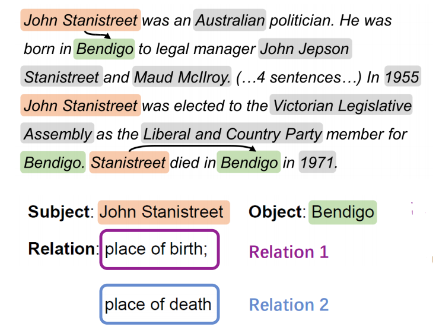
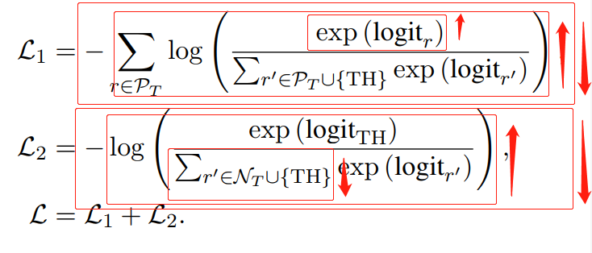
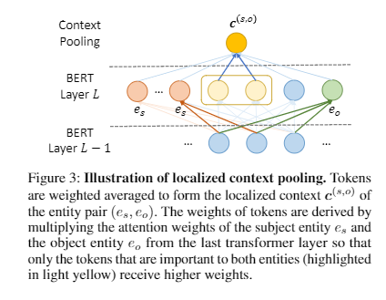
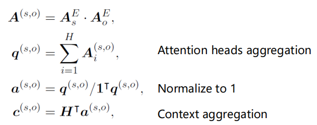
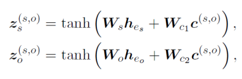
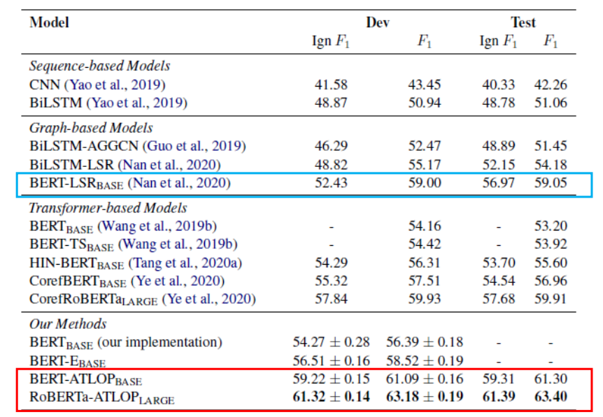
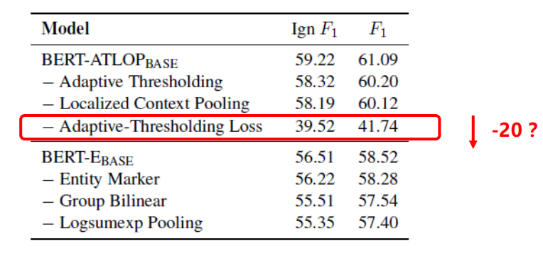

# 【关于 ATLOP】 那些的你不知道的事

> 作者：杨夕
> 
> 项目地址：https://github.com/km1994/nlp_paper_study
> 
> NLP 面经地址：https://github.com/km1994/NLP-Interview-Notes
> 
> 个人介绍：大佬们好，我叫杨夕，该项目主要是本人在研读顶会论文和复现经典论文过程中，所见、所思、所想、所闻，可能存在一些理解错误，希望大佬们多多指正。
> 
> 论文：Document-Level Relation Extraction with Adaptive Thresholding and Localized Context Pooling
> 
> 发表会议：AAAI
> 
> 论文地址：https://arxiv.org/abs/2010.11304
> 
> github：https://github.com/wzhouad/ATLOP


## 前言

- 为什么要看这篇论文？
  - whalePaper 论文分享中，针对 论文 损失函数 的 疑惑，以及 在讨论中未找到答案，所以决定自己找时间研读一下；
  - 出于 对 论文中 adaptive thresholding 的 兴趣点，之前做 mul-label 分类任务都是 根据主观元素设置  thresholding，这篇论文 采用 adaptive thresholding，让  thresholding 能够从模型中自学习学到，这对于 其他的 mul-label 分类任务，也可以得到很好的效果

## 一、摘要

Document-level relation extraction (RE) poses new challenges compared to its sentence-level counterpart. One document commonly contains multiple entity pairs, and one entity pair occurs multiple times in the document associated with multiple possible relations. In this paper, we propose two novel techniques, adaptive thresholding and localized context pooling, to solve the multi-label and multi-entity problems. The adaptive thresholding replaces the global threshold for multi-label classification in the prior work with a learnable entities-dependent threshold. The localized context pooling directly transfers attention from pre-trained language models to locate relevant context that is useful to decide the relation. We experiment on three document-level RE benchmark datasets: DocRED, a recently released large-scale RE dataset, and two datasets CDRand GDA in the biomedical domain. Our ATLOP (Adaptive Thresholding and Localized cOntext Pooling) model achieves an F1 score of 63.4, and also significantly outperforms existing models on both CDR and GDA.

- 动机：与句子级RE对应项相比，文档级关系提取（RE）问题，在一个文档里面，一对实体对可能存在多种关系【多标签问题】

- 论文方法：提出了两种新颖的技术：adaptive thresholding 和 localized context pooling，以解决多标签和多实体问题。
  - adaptive thresholding ：替换为先前学习中用于多标签分类的全局阈值，该阈值为**可学习的依赖实体的阈值**。
  - localized context pooling：将**注意力直接转移到预先训练的语言模型**上，从而找到有助于确定关系的相关上下文。
- 实验结果：论文在三个文档级RE基准数据集进行了实验：DocRED，一个最近发布的大规模RE数据集，以及生物医学领域中的两个数据集CDR和GDA。论文的ATLOP（自适应阈值处理和本地化context池）模型的F1得分为63.4；并且在CDR和GDA上也大大优于现有模型。

## 二、论文动机

1. 对于文档级RE，一个文档包含多个实体对，需要同时对它们之间的关系进行分类 【语句级RE只包含一对实体对】
2. 对于文档级RE，一个实体对可以在与不同关系关联的文档中多次出现【对于句子级RE，每个实体对只能出现一个关系】 -> 多标签问题


> 注：对于一个特定的实体对（John Stanistreet，Bendigo），它通过前两句和后两句表达出生地和死亡地的两种关系

3. 目前对于文档关系抽取主流的做法是采用基于graph的方法来做，但是很多基于BERT的工作也能够得到很好的结果，并且在基于graph的模型的实验部分，也都证明了BERT以及BERT-like预训练模型的巨大提升，以至于让人怀疑是否有必要引入GNN？作者发现如果只用BERT的话，那么对于不同的entity pair，entity的rep都是一样的，这是一个很大的问题，那是否能够不引入graph的方式来解决这个问题呢？

## 三、论文方法

- localized context pooling
  - 解决问题：解决了 using the same entity embedding for allentity pairs 问题
  - 方法：使用与当前实体对相关的额外上下文来增强 entity embedding。不是从头开始训练一个new context attention layer ，而是直接将预先训练好的语言模型中的注意头转移到实体级的注意上

- adaptive thresholding
  - 解决问题：问题 1 的 多实体对问题 和 问题 2 实体对存在多种关系问题
  - 方法：替换为先前学习中用于多标签分类的全局阈值，该阈值为**可学习的依赖实体的阈值**。

## 四、方法介绍

### 4.1 Adaptive Thresholding

#### 4.1.1 正负例 定义


- 正类 Pt ⊆  存在于实体间的关系 R。如果不表示任何关系，则 Pti 为空；
- 负类 Nt ⊆  存在于实体间的关系 R。如果不表示任何关系，则 Nt = R；
- TH Class：如果实体对分类正确，Pt 的logit会高于阈值，Nt 的logit低于阈值。这个阈值 TH Class 自学习。

#### 4.1.2 损失函数



- L1 损失函数：包含 Pt 和 TH Class，由于可能包含 多个 Pt，所以需要将 所有的 Pt 的交叉熵进行相加，通过这种方式将 Pt 的logit Push 高于 TH Class;
- L2 损失函数：包含 Nt 和 TH Class，通过这种方式将 Nt 的logit Pull 低于 TH Class;

> 代码实现
```s
import torch
import torch.nn as nn
import torch.nn.functional as F

class ATLoss(nn.Module):
    def __init__(self):
        super().__init__()

    def forward(self, logits, labels):
        # TH label
        ## 定义了 一个 值为0 的 列表
        th_label = torch.zeros_like(labels, dtype=torch.float).to(labels)
        ## 将最后的输入节点 设为 1，通过这种方式屏蔽其他输出节点信息
        th_label[:, 0] = 1.0
        ## 将最后的输入节点 设为 0，通过这种方式屏蔽 Th Class 输出节点信息
        labels[:, 0] = 0.0

        p_mask = labels + th_label
        n_mask = 1 - labels

        # Rank positive classes to TH
        ## Mask 掉 负例 输出节点
        logit1 = logits - (1 - p_mask) * 1e30
        loss1 = -(F.log_softmax(logit1, dim=-1) * labels).sum(1)

        # Rank TH to negative classes
        ## Mask 掉 正例 输出节点
        logit2 = logits - (1 - n_mask) * 1e30
        loss2 = -(F.log_softmax(logit2, dim=-1) * th_label).sum(1)

        # Sum two parts
        loss = loss1 + loss2
        loss = loss.mean()
        return loss

    # 预测的时候，将正例 label 转化为 1，负例 label 转化为 0
    def get_label(self, logits, num_labels=-1):
        th_logit = logits[:, 0].unsqueeze(1)
        output = torch.zeros_like(logits).to(logits)
        mask = (logits > th_logit)
        if num_labels > 0:
            top_v, _ = torch.topk(logits, num_labels, dim=1)
            top_v = top_v[:, -1]
            mask = (logits >= top_v.unsqueeze(1)) & mask
        output[mask] = 1.0
        output[:, 0] = (output.sum(1) == 0.).to(logits)
        return output

```

### 4.2 localized context pooling

1. 使用与两个实体相关的附加上下文embedding，来增强实体对的embedding。
2. 因为已经用了基于双向transformer的bert来编码，那里边自带多头attention，所以直接使用他们的注意力头来作为局部上下文。
3. 从最后一层transformer里取。对同一实体的所有提及的attention求平均，获得实体的attention。



#### 4.2.1 Relevant context aggregation

通过将它们的实体级attention相乘，然后进行规范化，我们获得了对两个实体都很重要的上下文embedding。



#### 4.2.2 Add the localized context to entity pair representation

有了上下文embedding，去修改上面编码层，然后将上下文embedding融入到实体embedding中。



### 4.3 模型代码实现

```s
import torch
import torch.nn as nn
from opt_einsum import contract
from long_seq import process_long_input
from losses import ATLoss

class DocREModel(nn.Module):
    def __init__(self, config, model, emb_size=768, block_size=64, num_labels=-1):
        super().__init__()
        self.config = config
        self.model = model
        self.hidden_size = config.hidden_size
        self.loss_fnt = ATLoss()

        self.head_extractor = nn.Linear(2 * config.hidden_size, emb_size)
        self.tail_extractor = nn.Linear(2 * config.hidden_size, emb_size)
        self.bilinear = nn.Linear(emb_size * block_size, config.num_labels)

        self.emb_size = emb_size
        self.block_size = block_size
        self.num_labels = num_labels

    def encode(self, input_ids, attention_mask):
        config = self.config
        if config.transformer_type == "bert":
            start_tokens = [config.cls_token_id]
            end_tokens = [config.sep_token_id]
        elif config.transformer_type == "roberta":
            start_tokens = [config.cls_token_id]
            end_tokens = [config.sep_token_id, config.sep_token_id]
        sequence_output, attention = process_long_input(self.model, input_ids, attention_mask, start_tokens, end_tokens)
        return sequence_output, attention

    def get_hrt(self, sequence_output, attention, entity_pos, hts):
        offset = 1 if self.config.transformer_type in ["bert", "roberta"] else 0
        n, h, _, c = attention.size()
        hss, tss, rss = [], [], []
        for i in range(len(entity_pos)):
            entity_embs, entity_atts = [], []
            for e in entity_pos[i]:
                if len(e) > 1:
                    e_emb, e_att = [], []
                    for start, end in e:
                        if start + offset < c:
                            # In case the entity mention is truncated due to limited max seq length.
                            e_emb.append(sequence_output[i, start + offset])
                            e_att.append(attention[i, :, start + offset])
                    if len(e_emb) > 0:
                        e_emb = torch.logsumexp(torch.stack(e_emb, dim=0), dim=0)
                        e_att = torch.stack(e_att, dim=0).mean(0)
                    else:
                        e_emb = torch.zeros(self.config.hidden_size).to(sequence_output)
                        e_att = torch.zeros(h, c).to(attention)
                else:
                    start, end = e[0]
                    if start + offset < c:
                        e_emb = sequence_output[i, start + offset]
                        e_att = attention[i, :, start + offset]
                    else:
                        e_emb = torch.zeros(self.config.hidden_size).to(sequence_output)
                        e_att = torch.zeros(h, c).to(attention)
                entity_embs.append(e_emb)
                entity_atts.append(e_att)

            entity_embs = torch.stack(entity_embs, dim=0)  # [n_e, d]
            entity_atts = torch.stack(entity_atts, dim=0)  # [n_e, h, seq_len]

            ht_i = torch.LongTensor(hts[i]).to(sequence_output.device)
            hs = torch.index_select(entity_embs, 0, ht_i[:, 0])
            ts = torch.index_select(entity_embs, 0, ht_i[:, 1])

            h_att = torch.index_select(entity_atts, 0, ht_i[:, 0])
            t_att = torch.index_select(entity_atts, 0, ht_i[:, 1])
            ht_att = (h_att * t_att).mean(1)
            ht_att = ht_att / (ht_att.sum(1, keepdim=True) + 1e-5)
            rs = contract("ld,rl->rd", sequence_output[i], ht_att)
            hss.append(hs)
            tss.append(ts)
            rss.append(rs)
        hss = torch.cat(hss, dim=0)
        tss = torch.cat(tss, dim=0)
        rss = torch.cat(rss, dim=0)
        return hss, rss, tss

    def forward(self,
                input_ids=None,
                attention_mask=None,
                labels=None,
                entity_pos=None,
                hts=None,
                instance_mask=None,
                ):

        sequence_output, attention = self.encode(input_ids, attention_mask)
        hs, rs, ts = self.get_hrt(sequence_output, attention, entity_pos, hts)

        hs = torch.tanh(self.head_extractor(torch.cat([hs, rs], dim=1)))
        ts = torch.tanh(self.tail_extractor(torch.cat([ts, rs], dim=1)))
        b1 = hs.view(-1, self.emb_size // self.block_size, self.block_size)
        b2 = ts.view(-1, self.emb_size // self.block_size, self.block_size)
        bl = (b1.unsqueeze(3) * b2.unsqueeze(2)).view(-1, self.emb_size * self.block_size)
        logits = self.bilinear(bl)

        output = (self.loss_fnt.get_label(logits, num_labels=self.num_labels),)
        if labels is not None:
            labels = [torch.tensor(label) for label in labels]
            labels = torch.cat(labels, dim=0).to(logits)
            loss = self.loss_fnt(logits.float(), labels.float())
            output = (loss.to(sequence_output),) + output
        return output

```

## 五、实验结果



## 六、消融实验



## 七、个人总结

- 创新点：在多标签分类任务中设置自适应的阈值使得不同的实体对在关系分类可以选择不同的阈值；对于相同实体对根据不同的上下文中利用局部上下文池化的方法更新实体的表示；

- 研究意义：这篇论文更多的是解决多标签分类问题，因为即便不是document-level RE，对于其他的多标签分类任务，也可以得到很好的效果。


## 参考资料

1. [whalePaper 论文学习小组——— 海顺关于 ATLOP 论文的分享](https://github.com/km1994/whalePaperShare/tree/master/Topic6/NLP/docrel)
2. [Document-Level Relation Extraction with Adaptive Thresholding and Localized Context Pooling](https://arxiv.org/abs/2010.11304)
3. [【论文阅读】Document-Level Relation Extraction with Adaptive Thresholding and Localized Context Pooling](https://blog.csdn.net/li_jiaoyang/article/details/112438104)