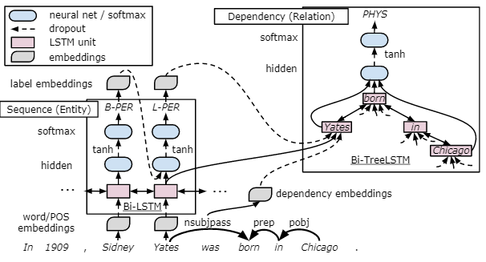

# GraphRel: Modeling Text as Relational Graphs for Joint Entity and Relation Extraction

## 摘要

In this paper, we present GraphRel, an end-to-end relation extraction model which uses graph convolutional networks (GCNs) to jointly learn named entities and relations. In contrast to previous baselines, we consider the interaction between named entities and relations via a relation-weighted GCN to better extract relations. Linear and dependency structures are both used to extract both sequential and regional features of the text, and a complete word graph is further utilized to extract implicit features among all word pairs of the text. With the graph-based approach, the prediction for overlapping relations is substantially improved over previous sequential approaches. We evaluate GraphRel on two public datasets: NYT and WebNLG. Results show that GraphRel maintains high precision while increasing recall substantially. Also, GraphRel outperforms previous work by 3.2% and 5.8% (F1 score), achieving a new state-of-the-art for relation extraction. 

在本文中，我们提出了GraphRel，这是一个使用图卷积网络（GCN）共同学习命名实体和关系的端到端关系提取模型。 

与以前的基准相反，我们考虑通过关系加权GCN更好地提取关系，从而命名实体与关系之间的相互作用。 

线性和相关性结构都用于提取文本的顺序特征和区域特征，并且完整的词图还用于提取文本的所有词对之间的隐式特征。 

使用基于图的方法，与以前的顺序方法相比，对重叠关系的预测有了很大的改进。 

我们在两个公共数据集上评估GraphRel：NYT和WebNLG。 结果表明，GraphRel保持高精度，同时大幅提高了查全率。 此外，GraphRel的性能比以前的工作高出3.2％和5.8％（F1评分），实现了关系提取的最新技术。

## 前期知识

三个方面研究：

1. End-to-end joint modeling of entity recognition and relation extraction;
2. Prediction of overlapping relations（重叠关系的预测）, i.e., relations that share a common mention;
3. Consideration of the interaction between relations（考虑关系之间的相互作用）, especially overlapping relations.

## 动机

联合建模的 缺点：

1. 这些复杂的方法是基于特征的结构化学习系统，因此严重依赖特征工程。

DNN 两个实体提及之间的最短依赖关系路径，或跨越两个实体提及的最小选区子树，以为每对实体提及编码相关信息。

缺点：

1. 这些方法不是实体和关系的端到端联合建模。 他们假设给出实体提及，并且在实际使用中需要命名实体识别器时，预期其性能会显着下降。
2. 如何考虑关系之间的相互作用，这对于重叠关系尤其重要。
   eg 1： (BarackObama, PresidentOf, UnitedStates) can be inferred from (BarackObama, Governance, UnitedStates)
   eg 2:  the former triplet could also be inferred from (BarackObama, LiveIn, WhiteHouse) and (WhiteHouse, PresidentialPalace, UnitedStates)

## 方法介绍

In this paper, we propose GraphRel, a neural end-to-end joint model for entity recognition and relation extraction that is the first to handle all three key aspects in relation extraction. GraphRel learns to automatically extract hidden features for each word by stacking a Bi-LSTM sentence encoder and a GCN  dependency tree encoder. Then GraphRel tags entity mention words and predicts relation triplets that connect mentions, where is the 1st-phase prediction.

在本文中，我们提出了GraphRel，这是一种用于实体识别和关系提取的神经端到端联合模型，它是第一个处理关系提取中所有三个关键方面的方法。 GraphRel通过堆叠Bi-LSTM句子编码器和GCN依赖树编码器来学习自动提取每个单词的隐藏特征。 然后GraphRel标记实体提及单词并预测连接提及的关系三元组，这是第一阶段预测。

To gracefully predict relation triplets while tak-ing into account the interactions between them, we add a novel 2nd-phase relation-weighted GCN to GraphRel. Already guided by both entity loss and relation loss, the 1st-phase GraphRel extracts node hidden features along dependency links while establishing a new fully connected graph with relation-weighted edges. Then, by op-erating on the intermediate graph, the 2nd-phase GCN effectively considers the interaction between entities and (possibly overlapping) relations be-fore the final classification for each edge.

为了在考虑三元组之间的相互作用的同时很好地预测三元组，我们在GraphRel中添加了一个新颖的第二阶段关系加权GCN。 第一阶段GraphRel已经受到实体损失和关系损失的指导，沿着依赖关系链接提取节点隐藏特征，同时建立一个具有关系加权边的新全连接图。 然后，通过对中间图进行操作，第二阶段GCN在对每个边缘进行最终分类之前有效地考虑了实体之间的相互作用以及（可能是重叠的）关系

## 贡献

•	Linear and dependency structures, as well as implicit features among all word pairs of the text, are considered by our method;

•	We perform end-to-end, joint modeling of entities and relations while considering all word pairs for prediction;

•	The interaction between entities and relations is carefully considered.

## 相关工作

### BiLSTM-TreeLSTM

> 思路：在序列上叠加一依赖树来对实体和关系共同建模

> 步骤：

1. 在每个句子上使用Bi-LSTM来自动特征学习；
2. 序列实体标签和最小依赖路径关系分类器共享所提取的隐藏特征；

> 问题

在引入共享参数以进行联合实体识别和关系提取时，它们仍必须通过管道传递标记器预测的实体提及，以形成关系分类器的提及对

### NovelTagging

> 思路

与实体识别一样，将关系提取公式化为顺序标记问题（NovelTagging）。 这使他们可以在Bi-LSTM编码器的顶部通过LSTM解码器对关系提取进行建模。

> 缺点

1. 关注孤立的关系并完全放弃了重叠关系

### end-to-end sequence-to-sequence model

> 思路

1. 通过Bi-LSTM对每个句子进行编码，并使用最后的编码器隐藏状态初始化一个（OneDecoder）或多个（MultiDecoder）LSTM，以动态解码关系三元组。 
2. 解码时，通过选择一个关系并从句子中复制两个单词来生成三元组。 seq2seq设置部分处理 triplets 之间的相互作用

> 问题

关系之间的相互作用仅在生成新的三元组时通过考虑具有强制线性顺序的先前生成的三元组来单向捕获。

## 方法介绍

GraphRel 包含  2 phases prediction：

1st-phase：应用 bi-RNN 和 GCN 提取 顺序和区域依赖词特征；（给定单词特征，我们可以预测每个单词对与所有单词的实体之间的关系。）

2st-phase：基于 1st-phase 所预测得结果，为每一个关系建立完整关系图，并在每个图上应用GCN来整合每个关系的信息，并进一步考虑实体与关系之间的相互作用。

### 1st-phase Prediction

1. 应用双向RNN提取顺序特征；
2. 使用双向GCN进一步提取区域依赖特征；
3. 基于提取的单词特征，我们预测每个单词对与单词实体之间的关系。

#### Bi-LSTM

对于每个词，我们合并词向量和 POS 向量作为初始特征：

$$h_{u}^{0}=W \operatorname{ord}(u) \oplus P O S(u)$$

#### Bi-GCN

如Cetoli等人所述，由于原始输入句子是一个序列，没有固有的图结构可以说。 我们使用依赖解析器为输入语句创建依赖树。 我们将依存树用作输入句子的邻接矩阵，并使用GCN提取区域依存特征。

同时考虑输入和输出单词功能:

#### Extraction of Entities and Relations

对于 词实体，我们 根据在1-layer LSTM上的词特征预测所有的词和应用 categorical loss ($ eloss_{1p}$)对其 进行 训练；

对于关系抽取，我们删除依赖边和对所有词进行预测。

where S(w1,r,w2) represents the relation tendency score for (w1, w2) under relation r and (w1, w2) refers to the word pair.

由于我们提取每个单词对的关系，因此我们的设计不包含三元组计数限制。 通过研究每个单词对的关系，GraphRel识别出尽可能多的关系。 利用Pr（w1，w2），我们还可以在这里计算出分类损失的关系，记为$rloss_{1p}$。 请注意，尽管$ eloss_{1p}$和$rloss_{1p}$都不会用作最终预测，但它们对于训练1期GraphRel也是很好的辅助损耗。

### 2nd-phase Predictio

第一阶段中提取的实体和关系不相互考虑。 为了考虑命名实体与关系之间的交互作用，并考虑文本中所有单词对之间的隐含特征，我们提出了一种新颖的第二阶段关系加权GCN以供进一步提取

####  Relation-weighted Graph

在 1st-phase 预测之后，建立对每一个关系r的关系权值图，其中边(w1,w2) 是 Pr(w1,w2):

然后，第二阶段在每个关系图上采用bi-GCN，将不同关系的不同影响程度和汇总作为综合词特征。 该过程可以表示为

第二阶段的bi-GCN进一步考虑了关系加权传播，并为每个单词提取了更多足够的特征。 利用来自第二阶段的较新单词功能，我们再次执行命名实体和关系分类，以进行更可靠的关系预测，此时对应的损失函数为 $ eloss_{2p}$和$rloss_{2p}$

### Training Detail

entity loss ：利用 BIESO 标注法标注，利用 交叉熵 作为 训练损失函数；

relation loss： feed in a one-hot relation vector as the ground truth of Pr(w1, w2) for each word pair (w1, w2)，利用 交叉熵 作为 训练损失函数；

### Inference

## 实验

## 结论

In this paper, we present GraphRel, an end-to-end relation extraction model which jointly learns named entities and relations based on graph con-volutional networks (GCN). We combine RNN and GCN to extract not only sequential features but also regional dependency features for each word. Implicit features among all word pairs of the text are also considered in our approach. We predict relations for each word pair, solving the problem of entity overlapping. Furthermore, we introduce a novel relation-weighted GCN that con-siders interactions between named entities and re-lations. We evaluate the proposed method on the NYT and WebNLG datasets. The results show that our method outperforms previous work by 3.2%and 5.8% and achieves a new state-of-the-art for relation extraction. （在本文中，我们提出了GraphRel，这是一种基于图卷积网络（GCN）共同学习命名实体和关系的端到端关系提取模型。 我们将RNN和GCN结合起来，不仅提取每个单词的顺序特征，还提取区域依赖性特征。 在我们的方法中还考虑了文本中所有单词对之间的隐式特征。 我们预测每个单词对的关系，解决实体重叠的问题。 此外，我们介绍了一种新颖的关系加权GCN，它考虑了命名实体与关系之间的交互。 我们在NYT和WebNLG数据集上评估提出的方法。 结果表明，我们的方法比以前的工作分别提高了3.2％和5.8％，并实现了关系提取的最新技术。）

## 参考资料

1. [论文阅读课3-GraphRel: Modeling Text as Relational Graphs for(实体关系联合抽取，重叠关系，关系之间的关系，自动提取特征）](https://blog.csdn.net/weixin_40485502/article/details/104311665)
2. [《GraphRel: Modeling Text as Relational Graphs for Joint Entity and Relation Extraction》阅读记录](https://blog.csdn.net/qq_40931181/article/details/102709340)
3. [NLP论文阅读笔记（Ⅲ）](https://doublebelief.github.io/2019/12/31/NLPpaperNotes3/)