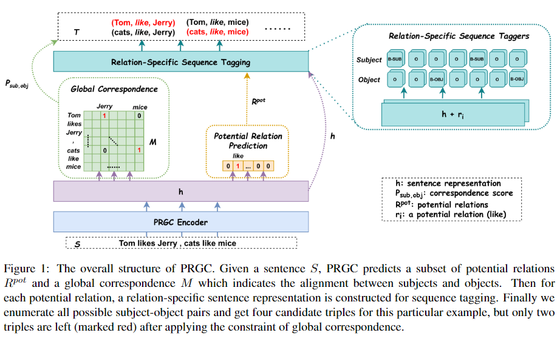
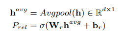
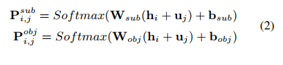
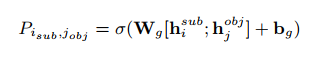
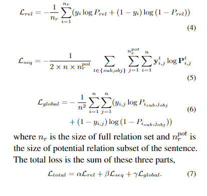

# 【关于 PRGC】 那些你不知道的事

> 作者：杨夕
> 
> 论文：PRGC: Potential Relation and Global Correspondence Based JointRelational Triple Extraction
> 
> 来源：ACL 2021
> 
> 论文地址：https://arxiv.org/pdf/2106.09895
> 
> 开源代码：https://github.com/hy-struggle/PRGC
> 
> NLP论文学习笔记：https://github.com/km1994/nlp_paper_study
> 
> **[手机版NLP论文学习笔记](https://mp.weixin.qq.com/s?__biz=MzAxMTU5Njg4NQ==&mid=100005719&idx=1&sn=14d34d70a7e7cbf9700f804cca5be2d0&chksm=1bbff26d2cc87b7b9d2ed12c8d280cd737e270cd82c8850f7ca2ee44ec8883873ff5e9904e7e&scene=18#wechat_redirect)**
> 
> 个人介绍：大佬们好，我叫杨夕，该项目主要是本人在研读顶会论文和复现经典论文过程中，所见、所思、所想、所闻，可能存在一些理解错误，希望大佬们多多指正。
> 
> NLP 百面百搭 地址：https://github.com/km1994/NLP-Interview-Notes
> 
> **[手机版NLP百面百搭](https://mp.weixin.qq.com/s?__biz=MzAxMTU5Njg4NQ==&mid=100005719&idx=3&sn=5d8e62993e5ecd4582703684c0d12e44&chksm=1bbff26d2cc87b7bf2504a8a4cafc60919d722b6e9acbcee81a626924d80f53a49301df9bd97&scene=18#wechat_redirect)**
> 
> 推荐系统 百面百搭 地址：https://github.com/km1994/RES-Interview-Notes
> 
> **[手机版推荐系统百面百搭](https://mp.weixin.qq.com/s/b_KBT6rUw09cLGRHV_EUtw)**

## 一、引言

- 动机：从非结构化文本中联合提取实体和关系是信息提取中的一项关键任务。最近的方法取得了可观的性能，但仍然存在一些固有的局限性：
  - 关系预测的冗余：TPLinker 为了避免曝光偏差，它利用了相当复杂的解码器，导致了稀疏的标签，关系冗余；
  - span-based 的提取泛化性差和效率低下;
- 论文方法：
  - 从新颖的角度将该任务分解为三个子任务：
    - Relation  Judgement；
    - Entity  Extraction；
    - Subject-object Alignment；
  - 然后提出了一个基于 Potential Relation and Global Correspondence (PRGC) 的联合关系三重提取框架：
    - **Potential Relation Prediction**：给定一个句子，模型先预测一个可能存在关系的子集，以及得到一个全局矩阵；
    - **Relation-Specific Sequence Tagging**：然后执行序列标注，标注存在的主体客体，以处理 subjects  and  object 之间的重叠问题；
    - **Global Correspondence**：枚举所有实体对，由全局矩阵裁剪；
  - 实验结果：PRGC 以更高的效率在公共基准测试中实现了最先进的性能，并在重叠三元组的复杂场景中提供了一致的性能增益

## 二、动机

- 关系冗余。传统 的 pipeline 方法 都是先抽实体再抽关系，但是这种方式 会 存在 关系冗余 问题；
- span-based的实体抽取：抽出来的实体质量欠佳且过程低效；

## 三、论文方法介绍

### 3.1  PRGC Encoder

利用 Bert 作为  PRGC Encoder。

### 3.2  PRGC Decoder

#### 3.2.1 Potential Relation Prediction

首先预测潜在关系的子集，只需要从这些潜在实体里提取子集。

给定embedding h，潜在关系预测模块如下：

问题建模为多标签二分类任务，比如有56种关系，那就有56个sigmoid。

如果概率超过阈值就认为存在关系，否则标记为0。

接下来只需要应用抽取的子集对应的embedding，而不是所有embedding

#### 3.2.2 Relation-Specific Sequence Tagging

依次解码主体和客体，是因为解决实体重叠问题。

> 注：因为crf无法解决实体重叠问题。不使用传统的lstm-crf做命名实体识别，而是直接上全连接。

#### 3.2.3 Global Correspondence

上一步获得了主体和客体，随后用一个 Global Correspondence Matrix ，确定正确的实体对。

Global Correspondence Matrix 的学习，和第二步的Potential Relation Prediction学习过程一样。

首先列举所有可能的主客体对，同样设定超过阈值就保留，否则丢弃。

#### 3.2.4 Training Strategy

联合训练模型，在训练期间优化组合目标函数并共享 PRGC 编码器的参数。总损失可以分为以下三部分：

> Performance might be better by carefully tuning theweight of each sub-loss, but we just assign equal weights for simplicity (i.e.,α=β=γ= 1)

## 参考

1. [PRGC: Potential Relation and Global Correspondence Based JointRelational Triple Extraction](https://arxiv.org/pdf/2106.09895)
2. [【论文阅读】PRGC: Potential Relation and Global Correspondence Based Joint Relational Triple Extraction](https://blog.csdn.net/li_jiaoyang/article/details/118310030)
3. [RE论文笔记-PRGC: Potential Relation and Global Correspondence Based Joint Relational Triple Extraction](https://zhuanlan.zhihu.com/p/391504640)