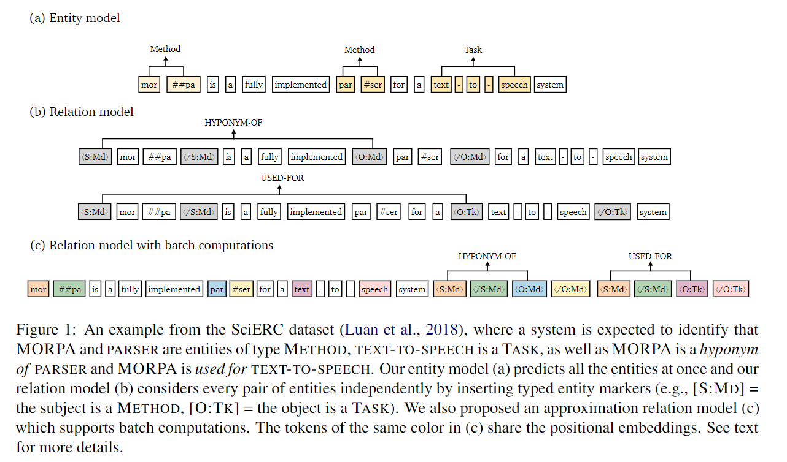
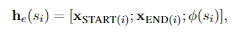
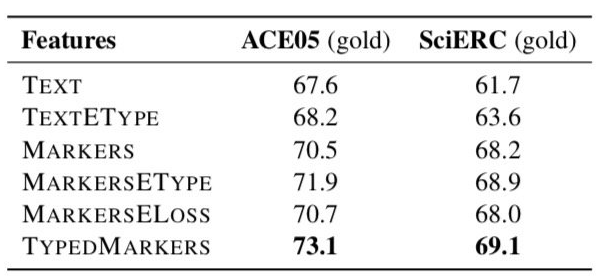

# 【关于 PURE 】 那些你不知道的事

> 作者：杨夕
> 
> 项目地址：https://github.com/km1994/nlp_paper_study
> 
> 个人介绍：大佬们好，我叫杨夕，该项目主要是本人在研读顶会论文和复现经典论文过程中，所见、所思、所想、所闻，可能存在一些理解错误，希望大佬们多多指正。
> 
> 论文：A Frustratingly Easy Approach for Joint Entity and Relation Extraction 
> 论文地址：chrome-extension://ikhdkkncnoglghljlkmcimlnlhkeamad/pdf-viewer/web/viewer.html?file=https%3A%2F%2Farxiv.org%2Fpdf%2F2010.12812.pdf 
> github :  
>   官方：https://github.com/princeton-nlp/PURE  
>   复现版：https://github.com/suolyer/PyTorch_BERT_Pipeline_IE 

- [【关于 PURE 】 那些你不知道的事](#关于-pure--那些你不知道的事)
  - [摘要](#摘要)
  - [动机](#动机)
  - [方法简述](#方法简述)
  - [方法分析](#方法分析)
    - [总结](#总结)
    - [存在问题及改进](#存在问题及改进)
  - [本文贡献](#本文贡献)
  - [前沿方法介绍](#前沿方法介绍)
    - [第1类：多任务学习（共享参数的联合抽取模型）](#第1类多任务学习共享参数的联合抽取模型)
    - [第2类：结构化预测（联合解码的联合抽取模型）](#第2类结构化预测联合解码的联合抽取模型)
  - [方法介绍](#方法介绍)
    - [Entity  model](#entity--model)
    - [Relation model](#relation-model)
      - [存在问题](#存在问题)
  - [实验结果](#实验结果)
  - [结果分析](#结果分析)
    - [Q1、关系抽取最care什么？实体类型信息也太重要了吧](#q1关系抽取最care什么实体类型信息也太重要了吧)
    - [Q2、共享编码 VS 独立编码 哪家强？](#q2共享编码-vs-独立编码-哪家强)
    - [Q3、误差传播不可避免？还是不存在？](#q3误差传播不可避免还是不存在)
    - [Q4：Effect of Cross-sentence Context](#q4effect-of-cross-sentence-context)
  - [参考](#参考)

## 摘要

- 介绍：端到端关系抽取的目的是识别命名实体，同时提取实体之间的关系；
- 前沿工作：最近的工作将这两个子任务联合建模，或者将它们统一到一个结构化的预测框架中，或者通过共享演示进行多任务学习。
- 方法提出：在这项工作中，我们描述了一种非常简单的联合实体和关系提取方法，并在标准基准（ACE04、ACE05和SciERC）上建立了新的最新技术。我们的方法基本上建立在两个独立的预训练编码器上，仅使用实体模型为关系提供输入特征模型。通过通过一系列的仔细检查，我们验证了学习实体和关系的不同语境表征的重要性，在关系模型的输入层融合实体信息，合并全局上下文。最后，我们还给出了一个有效的近似方法，该方法在参考时间内只需要两个编码器的一次通过，在精度下降很小的情况下获得了8-16倍的加速比

## 动机

- pipelined approach：
  - 流程：
    - NER：training one modelto extract entities；
    - RC：对实体对 进行 分类；
  - 存在问题：
- end2end：
  - 思路：将两个任务合在一起
  - 优点：联合模型可以更好地捕捉实体和关系之间的交互，并有助于缓解错误传播问题。

## 方法简述

- 方法：建立两个 encoders，并独立训练:
  - encoder 1：entity model
    - 方法：建立在 span-level representations 上
  - encoder 2：relation model：只依赖于实体模型作为输入特征
    - 方法：builds on contextual representations specific to a given pair of span
- 优点：
  - 很简单，但我们发现这种流水线方法非常简单有效；
  - 使用同样的预先训练的编码器，我们的模型在三个标准基准（ACE04，ACE05，SciERC）上优于所有以前的联合模型；

## 方法分析

### 总结

1. 实体和关系模型的上下文表示本质上捕获了不同的信息，因此共享它们的表示会影响性能；
2. 在关系模型的输入层融合实体信息（边界和类型）是至关重要的；
3. 利用 cross-sentence information 在两个任务中都是有用的；
4. 更强大的预先训练的语言模型可以带来更多的收获。

因此，我们期望这个简单模型将作为一个非常强大的基线，并使我们重新思考联合训练在端到端关系提取中的价值

### 存在问题及改进

- 问题：该方法需要为每对实体运行一次关系模型；
- 解决方法：为了缓解这一问题，我们提出了一种新颖而有效的替代算法，在推理时对不同的实体对进行近似和批处理
- 优点：这种近似在精度下降很小的情况下（如ACE05上的f1下降0.5-0.9%）实现了8-16倍的加速比，这使得我们的模型在实际应用中既快速又准确

## 本文贡献

1. 设计了一种非常简单的end2end关系抽取方法，即采取2个独立的编码器分别用于实体抽取和关系识别，使用相同的预训练模型就超越了之前所有的joint模型～
2. 分别学习实体和关系的不同上下文表示，比联合学习它们更有效～
3. 在关系模型的输入层融合实体类别信息十分重要～
4. 提出了一种新颖并且有效的近似方法，在精度下降很小的情况下，就实现8-16倍的推断提速

## 前沿方法介绍

### 第1类：多任务学习（共享参数的联合抽取模型）

多任务学习机制中，实体和关系共享同一个网络编码，但本质上仍然是采取pipeline的解码方式（故仍然存在误差传播问题）。近年来的大部分joint都采取这种共享参数的模式，集中在魔改各种Tag框架和解码方式。这里简单归纳几篇被大家熟知且容易实践的paper：

1. 多头选择[1]：构建N×N×C 的关系分类器对每一个实体pair进行关系预测（N为序列长度，C为关系类别总数），输入的实体pair其实是每一个抽取实体的最后一个token。后续基于多头选择机制，也有paper引入预训练语言模型和bilinear分类。
2. 层叠式指针标注[2]：将关系看作是SPO（Subject-Prediction-Object）抽取，先抽取主体Subject，然后对主体感知编码，最后通过层叠式的指针网络抽取关系及其对应的Object。
3. Span-level NER[3]：通过片段排列抽取实体，然后提取实体对进行关系分类。

### 第2类：结构化预测（联合解码的联合抽取模型）

结构化预测则是一个全局优化问题，在推断的时候能够联合解码实体和关系（而不是像多任务学习那样，先抽取实体、再进行关系分类）。结构化预测的joint模型也有较多，比如统一的序列标注框架[4]、多轮QA+强化学习[5]等，不过有的联合解码方式通常很复杂。

## 方法介绍

### Entity  model

1. 思路
   
- step 1：利用 Bert 表示 xt 的 上下文表示；
- step 2：采取Span-level NER的方式，即基于片段排列的方式，提取所有可能的片段排列；对于 给定 si∈S ，其表示 为 he(si);

> $φ(s_i)∈R^{dW}$ represents the learned embed-dings of span width features.

- step 3：通过 SoftMax 对每一个Span进行实体类型判断

2. 优点：可以解决嵌套实体问题
3. 缺点：计算复杂度较高；
   1. 解决方法：因此需要限制Span长度（对于含n个token的文本，理论上共有 $n(n+1)/2$ 种片段排列）

### Relation model

1. 输入
   
- 目标：关系模型以一对span si，sj（主语和宾语）为输入，预测两个span之间的关系类型。
- 改进点：将实体边界和类型作为标识符加入到实体Span前后，然后作为关系模型的input。例如，对于实体pair（Subject和Object）可分别在其对应的实体前后插入以下标识符：

> 举例说明： 
> <S:Md>和</S:Md>：代表实体类型为Method的Subject，S是实体span的第一个token，/S是最后一个token；
> <O:Md>和</O:Md>：代表实体类型为Method的Object，O是实体span的第一个token，/O是最后一个token；

2. 表示

然后，我们 X上 应用另一个预先训练好的编码器，并用xt表示输出表示。我们将两个start position的输出表示串联起来，并获得跨度对表示:

> 注：
> START(i) 和 START(j) 分别表示 X 中 的 <S：ei> 和 <O：ej>

3. 对每个实体pair中第一个token的编码进行concatenate，然后进行SoftMax分类

#### 存在问题

- 问题描述：对每个实体pair都要轮流进行关系分类，也就是同一文本要进行多次编码
- 解决方法：提出了一种加速的近似模型（如上图c所示）：可将实体边界和类型的标识符放入到文本之后，然后与原文对应实体共享位置向量。上图中相同的颜色代表共享相同的位置向量。具体地，在attention层中，文本token只去attend文本token、不去attend标识符token，而标识符token可以attend原文token。综上，通过这种「近似模型」可以实现一次编码文本就可以判断所有实体pair间的关系。

## 实验结果

上图给出了各个关系抽取榜单的对比结果（梅花图标代表引入了跨句信息，Rel+为严格指标），可以看出：

1. 不使用跨句信息(单句设置)就超越了ACE04/ACE05曾经的SOTA（使用同一预训练模型），使用跨句信息更是了不得啊。
2. 使用跨句信息登顶了SciERC（文档级）的SOTA；

而上图也给出了加速版「近似模型」的效果，可以看出：

1. 在单句设置中，ACE05和SciERC分别提速11.9倍和8.7倍，而指标仅仅下降0.5%和1.0%。
2. 「近似模型」加速明显（划重点）：我们先不要考虑是不是SOTA的事情，这个「近似模型」one-pass编码的的方式就足够让我们眼前一亮，这种方式与预训练模型兼容的恰到好处，权衡性能和准确性，相信在实际应用中具有重要意义！

## 结果分析

### Q1、关系抽取最care什么？实体类型信息也太重要了吧

首先就是分析不同实体表征方式的影响。文中共建了6种实体表征方式：

- TEXT：直接提取原始文本中，实体span所对应的编码表示。
- TEXTETYPE：在TEXT的基础上，concatenate实体类别向量。
- MARKERS：将标识符S、/S、O、/O插入到原始文本中，但是标识符没有实体类别信息。
- MARKERSETYPE：在MARKERS的基础上，concatenate实体类别向量，这是一种隐式的融入实体类别的方法。
- MARKERSELOSS：在关系模型中，构建判别实体类别的辅助loss。
- TYPEDMARKERS：就是本文所采取的方法，实体类别“显式”地插入到文本input中，如<S:Md> 和</S:Md>、<O:Md>和</O:Md>。

如上图所示（关系模型的实体是gold输入），我们可以发现：

1. 本文采取的TYPEDMARKERS实体表征方式，秒杀其余方式；
2. 实体类别信息对关系模型很重要，“显式”地编码实体类别信息好于隐式编码；在构造标识符时，不仅要区分span边界、更要显示融入实体类别信息。
3. MARKERSETYPE比MARKERSELOSS好，说明直接引入实体类型特征好于辅助loss的设计。

**总结：引入实体类别信息会让你的关系模型有提升**

### Q2、共享编码 VS 独立编码 哪家强？

- 争议性问题：基于参数共享编码的joint模型能够建模实体和关系的交互、促进彼此。但这篇居然是采取两个独立的编码器分别构建实体模型和关系模型，WHY？

从图中可以看出，共享编码， 实体抽取 和 关系抽取 的 效果 下降

- 原因：这是由于两个任务各自是不同的输入形式，并且需要不同的特征去进行实体和关系预测，也就是说：使用单独的编码器确实可以学习更好的特定任务特征。

### Q3、误差传播不可避免？还是不存在？

- 争议性问题：pipeline不是存在「误差传播」吗？也就是说，关系模型在训练的时候，输入的是gold实体进行关系判断，这会导致训练和推断时候的差异（暴露偏差）。
- 实验方法：采用10-way jackknifing方式（一种交叉验证）做了相关实验；
- 实验结果：发现训练时输入预测实体反而降低了F1值，毕竟这种方式会在训练的时候引入噪音；同时，采取pipeline进行推断时，如果有些gold实体在实体模型中没有被抽取出来，那么关系模型也就不会预测与该实体相关联的任何关系了。那有没有可能通过召回更多的实体，来减轻这种误差传播呢？论文也尝试召回更多的实体进行了实验，发现并没有提升F1值；
- 结论：并不认为误差传播问题不存在或无法解决，而需要探索更好的解决方案来解决此问题。

### Q4：Effect of Cross-sentence Context

在表2中，我们展示了跨句语境在英语和关系表现上的改进。最后，我们探讨了图2中不同上下文大小的影响。我们发现使用跨句上下文可以明显改善实体和关系。但是，结果不会从W=100 to W=300进一步增加。在我们的最终模型中，实体模型和关系模型都使用w=100

## 参考

1. [反直觉！陈丹琦用pipeline方式刷新关系抽取SOTA](https://zhuanlan.zhihu.com/p/274938894)