# 【关于 关系抽取 之 HBT】 那些的你不知道的事

> 作者：杨夕
> 
> 论文名称：A Novel Hierarchical Binary Tagging Framework for Relational Triple Extraction
> 
> 论文会议：ACL 2020
> 
> 项目地址：https://github.com/km1994/nlp_paper_study
> 
> keras4bert 版本：https://github.com/bojone/lic2020_baselines 【苏神 Lic2020 baseline】
> 
> pytorch 版本：https://github.com/powerycy/Lic2020- 【逸神 pytorch 复现版本】
> 
> 【注：手机阅读可能图片打不开！！！】

- [【关于 关系抽取 之 HBT】 那些的你不知道的事](#关于-关系抽取-之-hbt-那些的你不知道的事)
  - [摘要](#摘要)
  - [一、引言](#一引言)
    - [1.1 背景知识](#11-背景知识)
    - [1.2 之前方法介绍](#12-之前方法介绍)
      - [1.2.1 pipeline approach](#121-pipeline-approach)
        - [1.2.1.1 思路](#1211-思路)
        - [1.2.1.2 问题](#1212-问题)
      - [1.2.2 feature-based models and neural network-based models](#122-feature-based-models-and-neural-network-based-models)
        - [1.2.2.1 思路](#1221-思路)
        - [1.2.2.2 问题](#1222-问题)
      - [1.2.3 基于Seq2Seq模型  and GCN](#123-基于seq2seq模型--and-gcn)
        - [1.2.3.1 思路](#1231-思路)
        - [1.2.3.2 问题](#1232-问题)
  - [二、论文工作](#二论文工作)
  - [三、HBT 结构介绍](#三hbt-结构介绍)
    - [3.1 BERT Encoder层](#31-bert-encoder层)
    - [3.2 Hierarchical Decoder层](#32-hierarchical-decoder层)
      - [3.2.1 Subject Tagger 层](#321-subject-tagger-层)
      - [3.2.2 Relation-specific Object Taggers层](#322-relation-specific-object-taggers层)
    - [3.3 损失函数](#33-损失函数)
  - [四、实践](#四实践)
    - [4.1 数据集介绍](#41-数据集介绍)
    - [4.2 数据加载](#42-数据加载)
    - [4.3 数据生成器 定义](#43-数据生成器-定义)
    - [4.4 数据读取类 定义](#44-数据读取类-定义)
    - [4.5 模型 定义](#45-模型-定义)
    - [4.6 优化器 定义](#46-优化器-定义)
    - [4.7 模型训练和验证模块](#47-模型训练和验证模块)
  - [五、贡献](#五贡献)
  - [结论](#结论)
  - [参考](#参考)

## 摘要

Extracting relational triples from unstructured text is crucial for large-scale knowledge graph construction. However, few existing works excel in solving the overlapping triple problem where multiple relational triples in the same sentence share the same entities. In this work, we introduce a fresh perspective to revisit the relational triple extraction task and propose a novel Hierarchical Binary Tagging (HBT) framework derived from a principled problem formulation. Instead of treating relations as discrete labels as in previous works, our new framework models relations as functions that map subjects to objects in a sentence, which naturally handles the overlapping problem. Experiments show that the proposed framework already outperforms state-of-the-art methods even when its encoder module uses a randomly initialized BERT encoder, showing the power of the new tagging framework. It enjoys further performance boost when employing a pretrained BERT encoder, outperforming the strongest baseline by 17.5 and 30.2 absolute gain in F1-score on two public datasets NYT and WebNLG, respectively. In-depth analysis on different scenarios of overlapping triples shows that the method delivers consistent performance gain across all these scenarios.

从非结构化文本中提取关系三元组对于大规模知识图的构建至关重要。

但是，很少有现有的著作能很好地解决重叠三重问题，在该问题中，同一句子中的多个关系三重共享同一实体。

在这项工作中，我们引入了一个新的视角来重新审视关系三重提取任务，并提出了一个从有原则的问题表达中衍生出来的新颖的分层二进制标记（HBT）框架。我们的新框架没有像以前的作品那样将关系视为离散标签，而是将关系建模为将主语映射到句子中的宾语的函数，从而自然地解决了重叠问题。

实验表明，即使在其编码器模块使用随机初始化的BERT编码器的情况下，所提出的框架也已经超越了最新方法，显示了新标签框架的强大功能。当使用预训练的BERT编码器时，它在性能上得到了进一步的提升，在两个公共数据集NYT和WebNLG上，F1评分的绝对增益分别比最强的基线高17.5和30.2。对重叠三元组的不同方案的深入分析表明，该方法在所有这些方案中均提供了一致的性能提升。

## 一、引言

### 1.1 背景知识

关系三元组抽取(Relational Triple Extraction, RTE)，也叫实体-关系联合抽取，是信息抽取领域中的一个经典任务，三元组抽取旨在从文本中抽取出结构化的关系三元组(Subject, Relation, Object)用以构建知识图谱。

近年来，随着NLP领域的不断发展，在简单语境下(例如，一个句子仅包含一个关系三元组)进行关系三元组抽取已经能够达到不错的效果。但在复杂语境下(一个句子中包含多个关系三元组，有时甚至多达五个以上)，尤其当多个三元组有重叠的情况时，许多现有模型的表现就显得有些捉襟见肘了。

### 1.2 之前方法介绍

#### 1.2.1 pipeline approach

##### 1.2.1.1 思路

pipeline approach 方法的核心就是将 实体-关系联合抽取任务 分成 实体抽取+关系分类 两个任务，思路如下：

1. 实体抽取：利用一个命名实体识别模型 识别句子中的所有实体；
2. 关系分类：利用 一个关系分类模型 对每个实体对执行关系分类。 【这一步其实可以理解为文本分类任务，但是和文本分类任务的区别在于，关系分类不仅需要学习句子信息，还要知道 实体对在 句子中 位置信息】
   
##### 1.2.1.2 问题

- 误差传递问题：由于 该方法将 实体-关系联合抽取任务 分成 实体抽取+关系分类 两个任务处理，所以 实体抽取任务的错误无法在后期阶段进行纠正，因此这种方法容易遭受错误传播问题；

#### 1.2.2 feature-based models and neural network-based models 

#####  1.2.2.1 思路

通过用学习表示替换人工构建的特征，基于神经网络的模型在 关系三元组 提取 任务中取得了相当大的成功。

##### 1.2.2.2 问题

- 实体关系重叠问题：大多数现有方法无法正确处理句子包含多个相互重叠的关系三元组的情况。


> 图 1 中介绍了三种 关系三元组 场景 <br/>
> Normal 关系。表示三元组之间无重叠； (United states ，Trump) 之间的 关系为 Country_president，（Tim Cook，Apple Inc） 之间的关系为 Company_CEO；这种 三元组关系 比较简单 <br/>
> EPO(Entity Pair Overlap)。表示多（两）个三元组之间共享同一个实体对；（IQuentin Tarantino，Django Unchained） 实体对 间 存在 Act_in 和 Direct_movic 两种关系。 <br/>
>  SEO(Single Entity Overlap)。表示多（两）个三元组之间仅共享一个实体； （Jackie，Birth, Wachinghua） 和 （Wachinghua，Capital， United States） 共享 实体 Wachinghua。

#### 1.2.3 基于Seq2Seq模型  and GCN

##### 1.2.3.1 思路

Zeng 是最早在关系三重提取中考虑重叠三重问题的人之一。 他们介绍了如图 1 所示的不同重叠模式的类别，并提出了具有复制机制以提取三元组的序列到序列（Seq2Seq）模型。 他们基于Seq2Seq模型，进一步研究了提取顺序的影响，并通过强化学习获得了很大的改进。 

Fu 还通过使用基于图卷积网络（GCN）的模型将文本建模为关系图来研究重叠三重问题。

##### 1.2.3.2 问题

- 过多 negative examples：在所有提取的实体对中，很多都不形成有效关系，从而产生了太多的negative examples；
- EPO(Entity Pair Overlap) 问题：当同一实体参与多个关系时，分类器可能会感到困惑。 没有足够的训练样例的情况下，分类器就很难准确指出实体参与的关系；


## 二、论文工作

- 方式：实现了一个不受重叠三元组问题困扰的HBT标注框架(Hierarchical Binary Tagging Framework)来解决RTE任务；
- 核心思想：把关系(Relation)建模为将头实体(Subject)映射到尾实体(Object)的函数，而不是将其视为实体对上的标签。

论文并不是学习关系分类器f（s，o）→r，而是学习关系特定的标记器fr（s）→o；每个标记器都可以识别特定关系下给定 subject 的可能 object(s)。 或不返回任何 object，表示给定的主题和关系没有 triple。

- 思路：
  - 首先，我们确定句子中所有可能的 subjects； 
  - 然后针对每个subjects，我们应用特定于关系的标记器来同时识别所有可能的 relations 和相应的 objects。

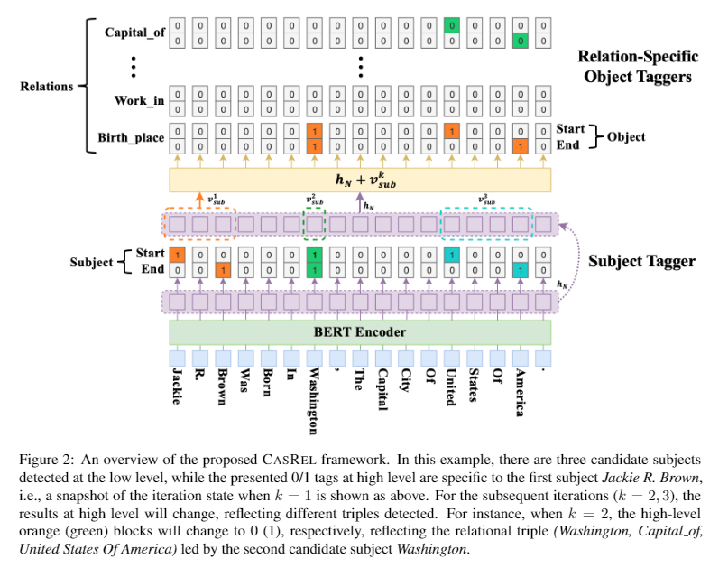

## 三、HBT 结构介绍

### 3.1 BERT Encoder层

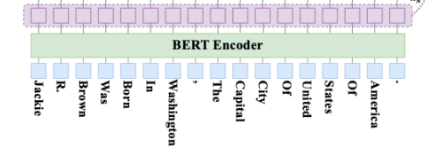

这里使用 Bert 做 Encoder，其实就是 用 Bert 做 Embedding 层使用。

- 代码介绍：

> 介绍：将 input_ids，attention_mask，token_type_ids，position_ids，head_mask，inputs_embeds 作为参数 输入 Bert 模型中，并取 Bert 模型最后一层作为 输出，即 隐藏状态。

```python
from transformers import BertModel,BertPreTrainedModel
class REModel_sbuject_2(BertPreTrainedModel):
    def __init__(self, config):
        super().__init__(config)
        self.bert = BertModel(config)
        self.dropout = nn.Dropout(config.attention_probs_dropout_prob)
        ...

    def forward(
        self, input_ids=None, attention_mask=None,
        token_type_ids=None, position_ids=None,
        head_mask=None, inputs_embeds=None,
        labels=None, subject_ids = None,
        batch_size = None, obj_labels = None,
        sub_train = False, obj_train = False
    ):
        outputs_1 = self.bert(
            input_ids=input_ids,
            attention_mask=attention_mask,
            token_type_ids=token_type_ids,
            position_ids=position_ids,
            head_mask=head_mask,
            inputs_embeds=inputs_embeds,
        )
        sequence_output = outputs_1[0]
        sequence_output = self.dropout(sequence_output)
        ...
```

### 3.2 Hierarchical Decoder层

Hierarchical Decoder 层 由两部分组成：

1. Subject tagger 层：用于 提取 Subject;
2. Relation-Specific Object Taggers 层：由一系列relation-specific object taggers（之所以这里是多个taggers是因为有多个可能的relation）；

#### 3.2.1 Subject Tagger 层

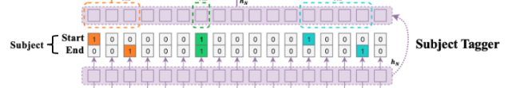

- 目标：检测 Subject 的开始和结束位置
- 方法：利用两个相同的 二分类器，来检测 每个 Subject 的开始和结束位置；
- 做法：

对BERT的输出的特征向量作sigmoid激活，计算该token作为subject的开始、结束的概率大小。如果 概率 超过设定阈值，则标记为 1，反之为 0。

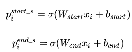

> 其中xi是第i个token的编码表示；pi是第i个token是subject的start或者end的概率

为了获得更好的W（weight）和b（bias）subject tagger需要优化这个似然函数：

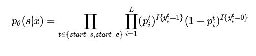

- 代码介绍：

```python
from torch.nn import BCELoss
class REModel_sbuject_2(BertPreTrainedModel):
    def __init__(self, config):
        super().__init__(config)
        self.num_labels = config.num_labels
        self.obj_labels = 110
        self.bert = BertModel(config)
        self.linear = nn.Linear(768, 768)
        self.dropout = nn.Dropout(config.attention_probs_dropout_prob)
        self.LayerNorm = BertLayerNorm(config.hidden_size, eps=1e-12)
        self.classifier = nn.Linear(config.hidden_size,config.num_labels)
        self.obj_classifier = nn.Linear(config.hidden_size, self.obj_labels)
        self.sub_pos_emb = nn.Embedding(256, 768)
        self.relu = nn.ReLU()
        self.init_weights()

    def forward(
        self, input_ids=None, attention_mask=None,
        token_type_ids=None, position_ids=None,
        head_mask=None, inputs_embeds=None,
        labels=None, subject_ids = None,
        batch_size = None, obj_labels = None,
        sub_train = False, obj_train = False
    ):
        ...
        # step 2：Subject Tagger 层。预测 subject
        if sub_train == True:
            logits = self.classifier(sequence_output)
            outputs = (logits,)   # add hidden states and attention if they are here
            loss_sig = nn.Sigmoid()
            # Only keep active parts of the loss
            active_logits = logits.view(-1, self.num_labels)
            active_logits = loss_sig(active_logits)
            active_logits = active_logits ** 2
            if labels is not None :
                active_labels = labels.view(-1, self.num_labels).float()
                loss_fct = BCELoss(reduction='none')
                loss = loss_fct(active_logits, active_labels)
                loss = loss.view(batch_size, -1, 2)
                loss = torch.mean(loss, 2)
                loss = torch.sum(attention_mask * loss) / torch.sum(attention_mask)
                outputs = (loss,) + outputs
            else:
                outputs = active_logits
        ...
```

#### 3.2.2 Relation-specific Object Taggers层

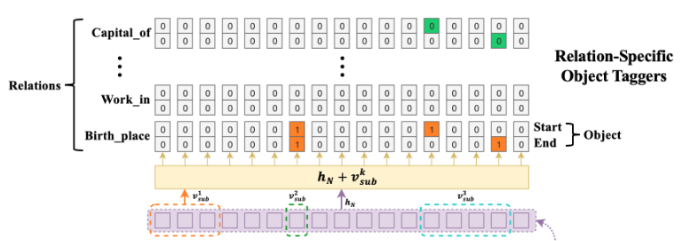

- 目标：检测 Object 的开始和结束位置
- 方法：利用两个相同的 二分类器，来检测 每个 Object 的开始和结束位置，但是 Relation-specific Object Taggers层 需要 融入上一步的 subject 特征，结合之前BERT Encoder的编码内容，用来在指定的relation下预测对应的object的起止位置，概率计算如下和之前相比多了v：

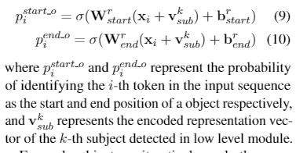

Suject Tagger预测的第k个实体的平均向量，如

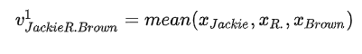

这么做的目的是保证xi和v是相同的维度

对于每个关系r对应的tagger，需要优化的似然函数如下来获得更好的W（weight）和b（bias）这个公式等号右边和之前是完全一样的：

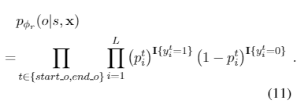

- 代码介绍：

```python
import torch.nn as nn
import torch
import torch.nn.functional as F
from torch.nn import BCELoss
BertLayerNorm = torch.nn.LayerNorm
...
# 功能：得到相应的向量过后对向量进行简单的相加求平均
def merge_function(inputs):
    '''
        功能：得到相应的向量过后对向量进行简单的相加求平均
    '''
    output = inputs[0]
    for i in range(1, len(inputs)):
        output += inputs[i]
    return output / len(inputs)

# 功能：根据 index 从 data 中取出 对应的向量表征
def batch_gather(data:torch.Tensor,index:torch.Tensor):
    """
        功能：根据 index 从 data 中取出 对应的向量表征
    """
    index = index.unsqueeze(-1)
    index = index.expand(data.size()[0],index.size()[1],data.size()[2])
    return torch.gather(data,1,index)

# 功能：根据 subject_ids 从 output 中取出 subject 的 start 和 end 向量表征
def extrac_subject_1(output, subject_ids):
    """
        功能：根据 subject_ids 从 output 中取出 subject 的 start 和 end 向量表征
    """
    start = batch_gather(output, subject_ids[:, :1])
    end = batch_gather(output, subject_ids[:, 1:])
    return start,end
```

```python
class REModel_sbuject_2(BertPreTrainedModel):
    def __init__(self, config):
        super().__init__(config)
        self.num_labels = config.num_labels
        self.obj_labels = 110
        self.bert = BertModel(config)
        self.linear = nn.Linear(768, 768)
        self.dropout = nn.Dropout(config.attention_probs_dropout_prob)
        self.LayerNorm = BertLayerNorm(config.hidden_size, eps=1e-12)
        self.classifier = nn.Linear(config.hidden_size,config.num_labels)
        self.obj_classifier = nn.Linear(config.hidden_size, self.obj_labels)
        self.sub_pos_emb = nn.Embedding(256, 768)
        self.relu = nn.ReLU()
        self.init_weights()

    def forward(
        self, input_ids=None, attention_mask=None,
        token_type_ids=None, position_ids=None,
        head_mask=None, inputs_embeds=None,
        labels=None, subject_ids = None,
        batch_size = None, obj_labels = None,
        sub_train = False, obj_train = False
    ):
        ...
        # step 3：Relation-specific Object Taggers层。传入subject，预测object
        if obj_train == True:
            ## step 3.1：得到subject的开始与结束位置之后，在取出倒数第二层的隐状态，利用输入的 subject_id 取出隐状态中的首尾向量
            hidden_states = outputs_1[2][-2]
            hidden_states_1 = outputs_1[2][-3]
            loss_sig = nn.Sigmoid()

            ## step 3.2 从 不同隐藏层 提取出 Subject 的 start 和 end 值
            sub_pos_start = self.sub_pos_emb(subject_ids[:, :1]).to(device)
            sub_pos_end = self.sub_pos_emb(subject_ids[:, 1:]).to(device)
            subject_start_last, subject_end_last = extrac_subject_1(sequence_output, subject_ids)
            subject_start_1,subject_end_1 = extrac_subject_1(hidden_states_1, subject_ids)
            subject_start,subject_end = extrac_subject_1(hidden_states, subject_ids)

            subject = (sub_pos_start + subject_start + sub_pos_end + subject_end + subject_start_last + subject_start_1 + subject_end_1 + subject_end_1).to(device)

            ## step 3.3 通过Conditional Layer Normalization将subject融入到object的预测中
            batch_token_ids_obj = torch.add(hidden_states, subject)
            batch_token_ids_obj = self.LayerNorm(batch_token_ids_obj)
            batch_token_ids_obj = self.dropout(batch_token_ids_obj)
            batch_token_ids_obj = self.relu(self.linear(batch_token_ids_obj))
            batch_token_ids_obj = self.dropout(batch_token_ids_obj)
            obj_logits = self.obj_classifier(batch_token_ids_obj)

            obj_logits = loss_sig(obj_logits)
            obj_logits = obj_logits ** 4
            obj_outputs = (obj_logits,)
            ## step 3.4：计算 Object 和 Relation 的 损失函数
            if obj_labels is not None:
                loss_obj = BCELoss(reduction='none')
                obj_loss = loss_obj(obj_logits.view(batch_size, -1, self.obj_labels // 2, 2), obj_labels.float())
                obj_loss = torch.sum(torch.mean(obj_loss, 3), 2)
                # 损失函数中的 MASK
                obj_loss = torch.sum(obj_loss * attention_mask) / torch.sum(attention_mask)
                s_o_loss = torch.add(obj_loss, loss)
                outputs_obj = (s_o_loss,) + obj_outputs
            else:
                outputs_obj = obj_logits.view(batch_size, -1, self.obj_labels // 2, 2)

        if obj_train == True:
            return outputs ,outputs_obj # (loss), scores, (hidden_states), (attentions)
        else:
            return outputs
```

### 3.3 损失函数

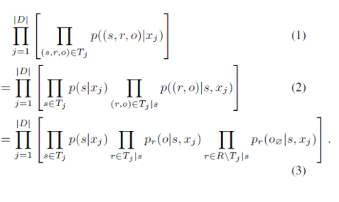

1. 公式 1 ： 对于training set D上的sentence xj和xj中可能存在的三元组的集合 Tj， 利用公式 1 去最大化data likelihood；
2. 公式 2 ： 采用 链式法则 将第一个公式 转化为 第二个公式；

> 右边部分下角标的 表示 Tj中指定s的三元组集合，集合中的ro对来计算后面这个部分

3. 公式 3 ：对于给定的一个subject，其在句子中所参与的关系个数一般来说是有限的，因此只有部分relation能够将其映射到相应的object上去(对应公式3的中间部分)，最终得到一个有效的三元组。

> 注：对于未参与的关系，文中提出了”null object”的概念，也就是说，在这种情况下函数会将subject映射到一个空的尾实体上(对应公式3的右端部分)，表示subject并不参与该关系，也就无法抽取出有效的三元组。

4. 损失函数：

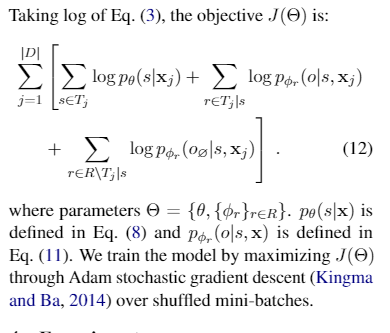

- 代码介绍：

```python
class REModel_sbuject_2(BertPreTrainedModel):
    def __init__(self, config):
        super().__init__(config)
        self.num_labels = config.num_labels
        self.obj_labels = 110
        self.bert = BertModel(config)
        self.linear = nn.Linear(768, 768)
        self.dropout = nn.Dropout(config.attention_probs_dropout_prob)
        self.LayerNorm = BertLayerNorm(config.hidden_size, eps=1e-12)
        self.classifier = nn.Linear(config.hidden_size,config.num_labels)
        self.obj_classifier = nn.Linear(config.hidden_size, self.obj_labels)
        self.sub_pos_emb = nn.Embedding(256, 768)
        self.relu = nn.ReLU()
        self.init_weights()

    def forward(
        self, input_ids=None, attention_mask=None,
        token_type_ids=None, position_ids=None,
        head_mask=None, inputs_embeds=None,
        labels=None, subject_ids = None,
        batch_size = None, obj_labels = None,
        sub_train = False, obj_train = False
    ):
        ...
        
        # step 2：Subject Tagger 层。预测 subject
        if sub_train == True:
            ...
            ## step 2.2：计算 Subject 的 损失函数
            if labels is not None :
                active_labels = labels.view(-1, self.num_labels).float()
                loss_fct = BCELoss(reduction='none')
                loss = loss_fct(active_logits, active_labels)
                loss = loss.view(batch_size, -1, 2)
                loss = torch.mean(loss, 2)
                loss = torch.sum(attention_mask * loss) / torch.sum(attention_mask)
                outputs = (loss,) + outputs
            else:
                outputs = active_logits

        # step 3：Relation-specific Object Taggers层。传入subject，预测object
        if obj_train == True:
            ...
            ## step 3.4：计算 Object 和 Relation 的 损失函数
            if obj_labels is not None:
                loss_obj = BCELoss(reduction='none')
                obj_loss = loss_obj(obj_logits.view(batch_size, -1, self.obj_labels // 2, 2), obj_labels.float())
                obj_loss = torch.sum(torch.mean(obj_loss, 3), 2)
                # 损失函数中的 MASK
                obj_loss = torch.sum(obj_loss * attention_mask) / torch.sum(attention_mask)
                s_o_loss = torch.add(obj_loss, loss)
                outputs_obj = (s_o_loss,) + obj_outputs
            else:
                outputs_obj = obj_logits.view(batch_size, -1, self.obj_labels // 2, 2)

        if obj_train == True:
            return outputs ,outputs_obj # (loss), scores, (hidden_states), (attentions)
        else:
            return outputs
```

## 四、实践

### 4.1 数据集介绍

数据集 来自于百度 Lic 2020-关系抽取比赛，数据集 格式如下：

> 训练数据

```json
{
    "text": "《步步惊心》改编自著名作家桐华的同名清穿小说《甄嬛传》改编自流潋紫所著的同名小说电视剧《何以笙箫默》改编自顾漫同名小说《花千骨》改编自fresh果果同名小说《裸婚时代》是月影兰析创作的一部情感小说《琅琊榜》是根据海宴同名网络小说改编电视剧《宫锁心玉》，又名《宫》《雪豹》，该剧改编自网络小说《特战先驱》《我是特种兵》由红遍网络的小说《最后一颗子弹留给我》改编电视剧《来不及说我爱你》改编自匪我思存同名小说《来不及说我爱你》", 
    "spo_list": [
        {
            "predicate": "作者", 
            "object_type": {"@value": "人物"}, 
            "subject_type": "图书作品", 
            "object": {"@value": "顾漫"}, 
            "subject": "何以笙箫默"
        }, 
        {
            "predicate": "改编自", 
            "object_type": {"@value": "作品"}, 
            "subject_type": "影视作品", 
            "object": {"@value": "最后一颗子弹留给我"}, 
            "subject": "我是特种兵"
        }, ...
    ]
}
...
```

> schema 数据

```json
{"object_type": {"@value": "学校"}, "predicate": "毕业院校", "subject_type": "人物"}
{"object_type": {"@value": "人物"}, "predicate": "嘉宾", "subject_type": "电视综艺"}
{"object_type": {"inWork": "影视作品", "@value": "人物"}, "predicate": "配音", "subject_type": "娱乐人物"}
{"object_type": {"@value": "歌曲"}, "predicate": "主题曲", "subject_type": "影视作品"}
{"object_type": {"@value": "人物"}, "predicate": "代言人", "subject_type": "企业/品牌"}
{"object_type": {"@value": "音乐专辑"}, "predicate": "所属专辑", "subject_type": "歌曲"}
{"object_type": {"@value": "人物"}, "predicate": "父亲", "subject_type": "人物"}
{"object_type": {"@value": "人物"}, "predicate": "作者", "subject_type": "图书作品"}
{"object_type": {"inArea": "地点", "@value": "Date"}, "predicate": "上映时间", "subject_type": "影视作品"}
{"object_type": {"@value": "人物"}, "predicate": "母亲", "subject_type": "人物"}
{"object_type": {"@value": "Text"}, "predicate": "专业代码", "subject_type": "学科专业"}
{"object_type": {"@value": "Number"}, "predicate": "占地面积", "subject_type": "机构"}
{"object_type": {"@value": "Text"}, "predicate": "邮政编码", "subject_type": "行政区"}
{"object_type": {"inArea": "地点", "@value": "Number"}, "predicate": "票房", "subject_type": "影视作品"}
{"object_type": {"@value": "Number"}, "predicate": "注册资本", "subject_type": "企业"}
{"object_type": {"@value": "人物"}, "predicate": "主角", "subject_type": "文学作品"}
{"object_type": {"@value": "人物"}, "predicate": "妻子", "subject_type": "人物"}
{"object_type": {"@value": "人物"}, "predicate": "编剧", "subject_type": "影视作品"}
{"object_type": {"@value": "气候"}, "predicate": "气候", "subject_type": "行政区"}
{"object_type": {"@value": "人物"}, "predicate": "歌手", "subject_type": "歌曲"}
{"object_type": {"inWork": "作品", "onDate": "Date", "@value": "奖项", "period": "Number"}, "predicate": "获奖", "subject_type": "娱乐人物"}
{"object_type": {"@value": "人物"}, "predicate": "校长", "subject_type": "学校"}
{"object_type": {"@value": "人物"}, "predicate": "创始人", "subject_type": "企业"}
{"object_type": {"@value": "城市"}, "predicate": "首都", "subject_type": "国家"}
{"object_type": {"@value": "人物"}, "predicate": "丈夫", "subject_type": "人物"}
{"object_type": {"@value": "Text"}, "predicate": "朝代", "subject_type": "历史人物"}
{"object_type": {"inWork": "影视作品", "@value": "人物"}, "predicate": "饰演", "subject_type": "娱乐人物"}
{"object_type": {"@value": "Number"}, "predicate": "面积", "subject_type": "行政区"}
{"object_type": {"@value": "地点"}, "predicate": "总部地点", "subject_type": "企业"}
{"object_type": {"@value": "地点"}, "predicate": "祖籍", "subject_type": "人物"}
{"object_type": {"@value": "Number"}, "predicate": "人口数量", "subject_type": "行政区"}
{"object_type": {"@value": "人物"}, "predicate": "制片人", "subject_type": "影视作品"}
{"object_type": {"@value": "Number"}, "predicate": "修业年限", "subject_type": "学科专业"}
{"object_type": {"@value": "城市"}, "predicate": "所在城市", "subject_type": "景点"}
{"object_type": {"@value": "人物"}, "predicate": "董事长", "subject_type": "企业"}
{"object_type": {"@value": "人物"}, "predicate": "作词", "subject_type": "歌曲"}
{"object_type": {"@value": "作品"}, "predicate": "改编自", "subject_type": "影视作品"}
{"object_type": {"@value": "企业"}, "predicate": "出品公司", "subject_type": "影视作品"}
{"object_type": {"@value": "人物"}, "predicate": "导演", "subject_type": "影视作品"}
{"object_type": {"@value": "人物"}, "predicate": "作曲", "subject_type": "歌曲"}
{"object_type": {"@value": "人物"}, "predicate": "主演", "subject_type": "影视作品"}
{"object_type": {"@value": "人物"}, "predicate": "主持人", "subject_type": "电视综艺"}
{"object_type": {"@value": "Date"}, "predicate": "成立日期", "subject_type": "机构"}
{"object_type": {"@value": "Text"}, "predicate": "简称", "subject_type": "机构"}
{"object_type": {"@value": "Number"}, "predicate": "海拔", "subject_type": "地点"}
{"object_type": {"@value": "Text"}, "predicate": "号", "subject_type": "历史人物"}
{"object_type": {"@value": "国家"}, "predicate": "国籍", "subject_type": "人物"}
{"object_type": {"@value": "语言"}, "predicate": "官方语言", "subject_type": "国家"}
```

### 4.2 数据加载

> 加载数据集函数

```python
import json
# 功能：加载数据集
def load_data(filename):
    D = []
    with open(filename,'r',encoding='utf8') as f:
        for l in f:
            l = json.loads(l)
            d = {'text': l['text'], 'spo_list': []}
            for spo in l['spo_list']:
                for k, v in spo['object'].items():
                    d['spo_list'].append(
                        (spo['subject'], spo['predicate'] + '_' + k, v)
                    )
            D.append(d)
    return D

# 功能：读取schema
def load_schema(schema_path):
    with open(schema_path,encoding='utf8') as f:
        id2predicate, predicate2id, n = {}, {}, 0
        predicate2type = {}
        for l in f:
            l = json.loads(l)
            predicate2type[l['predicate']] = (l['subject_type'], l['object_type'])
            for k, _ in sorted(l['object_type'].items()):
                key = l['predicate'] + '_' + k
                id2predicate[n] = key
                predicate2id[key] = n
                n += 1
    return id2predicate, predicate2id
```

> 函数调用

```python
# step 2：加载数据集
train_data = load_data(config.path['train_path'])
valid_data = load_data(config.path['valid_path'])
id2predicate, predicate2id = load_schema(config.path['schema_path'])
>>>
train_data[0:1]:[
        {
            'text': '《步步惊心》改编自著名作家桐华的同名清穿小说《甄嬛传》改编自流潋紫所著的同名小说电视剧《何以 笙箫默》改编自顾漫同名小说《花千骨》改编自fresh果果同名小说《裸婚时代》是月影兰析创作的一部情感小说《琅琊榜》是根据海宴 同名网络小说改编电视剧《宫锁心玉》，又名《宫》《雪豹》，该剧改编自网络小说《特战先驱》《我是特种兵》由红遍网络的小说《最后一颗子弹留给我》改编电视剧《来不及说我爱你》改编自匪我思存同名小说《来不及说我爱你》', 
            'spo_list': 
            [
                ('何以笙箫默', '作者_@value', '顾漫'), 
                ('我是特种兵', '改编自_@value', '最后一颗子弹留给我'), 
                ('步步惊心', '作者_@value', '桐华'), 
                ('甄嬛 传', '作者_@value', '流潋紫'), 
                ('花千骨', '作者_@value', 'fresh果果'), 
                ('裸婚时代', '作者_@value', '月影兰析'), 
                ('琅琊榜', '作者_@value', '海宴'), 
                ('雪豹', '改编自_@value', '特战先驱'),
                ('来不及说我爱你', '改编自_@value', '来不及说我爱你'), 
                ('来不及说我爱你', '作者_@value', '匪我思存')
            ]
        }
    ]

id2predicate:{
        0: '毕业院校_@value', 1: '嘉宾_@value', 2: '配音_@value', 3: '配音_inWork', 
        4: '主题曲_@value', 5: '代言人_@value', 6: '所属专辑_@value', 7: '父亲_@value', 
        8: '作者_@value', 9: '上映时间_@value', 10: '上映时间_inArea', 
        11: '母亲_@value', 12: '专业代码_@value', 13: '占地面积_@value',
        14: '邮政编码_@value', 15: '票房_@value', 16: '票房_inArea', 
        17: '注册资本_@value', 18: '主角_@value', 19: '妻子_@value', 
        20: '编剧_@value', 21: '气候_@value', 22: '歌手_@value', 23: '获奖_@value',
        24: '获奖_inWork', 25: '获奖_onDate', 26: '获奖_period', 27: '校长_@value',
        28: '创始人_@value', 29: '首都_@value', 30: '丈夫_@value', 31: '朝代_@value', 
        32: '饰演_@value', 33: '饰演_inWork', 34: '面积_@value', 35: '总部地点_@value', 
        36: '祖籍_@value', 37: '人口数量_@value', 38: '制片人_@value', 
        39: '修业年限_@value', 40: '所在城市_@value', 41: '董事长_@value', 
        42: '作词_@value', 43: '改编自_@value', 44: '出品公司_@value', 
        45: '导演_@value', 46: '作曲_@value', 47: '主演_@value', 48: '主持人_@value', 
        49: '成立日期_@value', 50: '简称_@value', 51: '海拔_@value', 52: '号_@value', 
        53: '国籍_@value', 54: '官方语言_@value'
    }

predicate2id:{
        '毕业院校_@value': 0, '嘉宾_@value': 1, '配音_@value': 2, '配音_inWork': 3, '主题曲_@value': 4, '代言人_@value': 5, '所属专辑_@value': 6, '父亲_@value': 7, '作者_@value': 8, '上映时间_@value': 9, '上映时间_inArea': 10, '母亲_@value': 11, '专业代码_@value': 12, '占地面积_@value': 13, '邮政编码_@value': 14, '票房_@value': 15, '票房_inArea': 16, '注册资本_@value': 17, '主角_@value': 18, '妻子_@value': 19, '编剧_@value': 20, '气候_@value': 21, '歌手_@value': 22, '获奖_@value': 23, '获奖_inWork': 24, '获奖_onDate': 25, '获奖_period': 26, '校长_@value': 27, '创始人_@value': 28, '首都_@value': 29, '丈夫_@value': 30, '朝代_@value': 31, '饰演_@value': 32, '饰演_inWork': 33, '面积_@value': 34, '总部地点_@value': 35, '祖籍_@value': 36, '人口数量_@value': 37, '制片人_@value': 38, '修业年限_@value': 39, '所在城市_@value': 40, '董事长_@value': 41, '作词_@value': 42, '改编自_@value': 43, '出品公司_@value': 44, '导演_@value': 45, '作曲_@value': 46, '主演_@value': 47, '主持人_@value': 48, '成立日期_@value': 49, '简称_@value': 50, '海拔_@value': 51, '号_@value': 52, '国籍_@value': 53, '官方语言_@value': 54
    }
```

### 4.3 数据生成器 定义

> 数据生成器 定义 

```python
import numpy as np
# 功能：数据生成器
class data_generator:
    """
        功能：数据生成器
    """
    def __init__(self, data, batch_size=64, buffer_size=None):
        self.data = data
        self.batch_size = batch_size
        if hasattr(self.data, '__len__'):
            self.steps = len(self.data) // self.batch_size
            if len(self.data) % self.batch_size != 0:
                self.steps += 1
        else:
            self.steps = None
        self.buffer_size = buffer_size or batch_size * 1000

    def __len__(self):
        return self.steps

    def data_res(self, tokenizer, predicate2id, maxlen):
        batch_token_ids, batch_segment_ids,batch_attention_mask = [], [], []
        batch_subject_labels, batch_subject_ids, batch_object_labels = [], [], []
        # step 1：打乱 数组
        indices = list(range(len(self.data)))
        np.random.shuffle(indices)
        # step 2：根据 indices 遍历 data
        for i in indices:
            d = self.data[i]
            ## step 2.1 对 句子 进行编码 
            token = tokenizer.encode_plus(
                d['text'], 
                max_length=maxlen,
                truncation=True
            )
            token_ids, segment_ids,attention_mask = token['input_ids'],token['token_type_ids'],token['attention_mask']

            # step 2.2 整理三元组 {s: [(o, p)]}
            spoes = {}
            for s, p, o in d['spo_list']:
                # step 2.2.1 对 s、p、o 进行 编码
                s = tokenizer.encode_plus(s)['input_ids'][1:-1]
                p = predicate2id[p]
                o = tokenizer.encode_plus(o)['input_ids'][1:-1]
                # step 2.2.2 从sequence中寻找子串patter，如果找到，返回第一个下标；否则返回-1。
                s_idx = search(s, token_ids)
                o_idx = search(o, token_ids)
                # step 2.2.3 当 s 和 o 都 存在时，记录 s 和 o 的 初始位置 和 结束位置
                if s_idx != -1 and o_idx != -1:
                    s = (s_idx, s_idx + len(s) - 1)
                    o = (o_idx, o_idx + len(o) - 1, p)
                    if s not in spoes:
                        spoes[s] = []
                    spoes[s].append(o)
            
            # step 2.3 设置 subject 和 object 标签
            if spoes:
                # step 2.3.1 设置 subject 的 start 和 end 标签
                subject_labels = np.zeros((len(token_ids), 2))
                for s in spoes:
                    subject_labels[s[0], 0] = 1
                    subject_labels[s[1], 1] = 1

                # step 2.3.2 随机选一个subject
                start, end = np.array(list(spoes.keys())).T
                start = np.random.choice(start)
                end = np.random.choice(end[end >= start])
                subject_ids = (start, end)

                # step 2.3.3 设置 对应的 object 标签
                object_labels = np.zeros((len(token_ids), len(predicate2id), 2))
                for o in spoes.get(subject_ids, []):
                    object_labels[o[0], o[2], 0] = 1
                    object_labels[o[1], o[2], 1] = 1

                # step 2.3.4 构建 batch
                batch_token_ids.append(token_ids)
                batch_segment_ids.append(segment_ids)
                batch_subject_labels.append(subject_labels)
                batch_subject_ids.append(subject_ids)
                batch_object_labels.append(object_labels)
                batch_attention_mask.append(attention_mask)

        # step 3： 序列 padding     
        batch_token_ids = sequence_padding(batch_token_ids)
        batch_segment_ids = sequence_padding(batch_segment_ids)
        batch_subject_labels = sequence_padding(
            batch_subject_labels, padding=np.zeros(2)
        )
        batch_subject_ids = np.array(batch_subject_ids)
        batch_object_labels = sequence_padding(
            batch_object_labels,
            padding=np.zeros((len(predicate2id), 2))
        )
        batch_attention_mask = sequence_padding(batch_attention_mask)
        return [
                    batch_token_ids, batch_segment_ids,
                    batch_subject_labels, batch_subject_ids,
                    batch_object_labels,batch_attention_mask
                ]
```

> 数据生成器 调用

```python
dg = data_generator(train_data)
dg_dev = data_generator(valid_data)
T, S1, S2, K1, K2, M1 = dg.data_res(
    tokenizer, predicate2id, config.maxlen
)
>>>
    print(f"T[0:1]:{T[0:1]}")
        >>>
        T[0:1]:
            [
                [    
                101 7032 2225 2209 8024 9120  118 8110  118 8149 1139 4495  754 4263
                2209 1065 6963 3377 3360 8024 6639 4413 3136 5298  102    0    0    0
                    0    0    0    0    0    0    0    0    0    0    0    0    0    0
                    0    0    0    0    0    0    0    0    0    0    0    0    0    0
                    0    0    0    0    0    0    0    0    0    0    0    0    0    0
                    0    0    0    0    0    0    0    0    0    0    0    0    0    0
                    0    0    0    0    0    0    0    0    0    0    0    0    0    0
                    0    0    0    0    0    0    0    0    0    0    0    0    0    0
                    0    0    0    0    0    0    0    0    0    0    0    0    0    0
                    0    0    0    0    0    0    0    0    0    0    0    0    0    0
                    0    0    0    0    0    0    0    0    0    0    0    0    0    0
                    0    0    0    0    0    0    0    0    0    0    0    0    0    0
                    0    0    0    0    0    0    0    0    0    0    0    0    0    0
                    0    0    0    0    0    0    0    0    0    0    0    0    0    0
                    0    0    0    0    0    0    0    0    0    0    0    0    0    0
                    0    0    0    0    0    0    0    0    0    0    0    0    0    0
                    0    0    0    0    0    0    0    0    0    0    0    0    0    0
                    0    0    0    0    0    0    0    0    0    0    0    0    0    0
                    0    0    0    0
                ]
            ]
    print(f"S1[0:1]:{S1[0:1]}")
        >>>
        S1[0:1]:
            [
                [
                    0 0 0 0 0 0 0 0 0 0 0 0 0 0 0 0 0 0 0 0 0 0 0 0 0 0 0 0 0 0 0 0 0 0 0 0
                    0 0 0 0 0 0 0 0 0 0 0 0 0 0 0 0 0 0 0 0 0 0 0 0 0 0 0 0 0 0 0 0 0 0 0 0
                    0 0 0 0 0 0 0 0 0 0 0 0 0 0 0 0 0 0 0 0 0 0 0 0 0 0 0 0 0 0 0 0 0 0 0 0
                    0 0 0 0 0 0 0 0 0 0 0 0 0 0 0 0 0 0 0 0 0 0 0 0 0 0 0 0 0 0 0 0 0 0 0 0
                    0 0 0 0 0 0 0 0 0 0 0 0 0 0 0 0 0 0 0 0 0 0 0 0 0 0 0 0 0 0 0 0 0 0 0 0
                    0 0 0 0 0 0 0 0 0 0 0 0 0 0 0 0 0 0 0 0 0 0 0 0 0 0 0 0 0 0 0 0 0 0 0 0
                    0 0 0 0 0 0 0 0 0 0 0 0 0 0 0 0 0 0 0 0 0 0 0 0 0 0 0 0 0 0 0 0 0 0 0 0
                    0 0 0 0
                ]
            ]
    print(f"S2[0:1]:{S2[0:1]}")
        >>>
        S2[0:1]:
        [
            [
                [0. 0.]
                [1. 0.]
                [0. 0.]
                [0. 1.]
                [0. 0.]
                [0. 0.]
                [0. 0.]
                [0. 0.]
                [0. 0.]
                [0. 0.]
                ...
            ]
        ]
    print(f"K1[0:1]:{K1[0:1]}")
        >>>
        K1[0:1]:[[1 3]]
    print(f"K2[0:1]:{K2[0:1]}")
        K2[0:1]:
        [
            [
                [
                    [0. 0.]
                    [0. 0.]
                    [0. 0.]
                    ...
                    [0. 0.]
                    [0. 0.]
                    [0. 0.]
                ]
                [
                    [0. 0.]
                    [0. 0.]
                    [0. 0.]
                    ...
                    [0. 0.]
                    [0. 0.]
                    [0. 0.]
                ]
                ...
            ]
        ]
    print(f"M1[0:1]:{M1[0:1]}")
        >>>
        M1[0:1]:
        [
            [
                1 1 1 1 1 1 1 1 1 1 1 1 1 1 1 1 1 1 1 1 1 1 1 1 1 0 0 0 0 0 0 0 0 0 0 0
                0 0 0 0 0 0 0 0 0 0 0 0 0 0 0 0 0 0 0 0 0 0 0 0 0 0 0 0 0 0 0 0 0 0 0 0
                0 0 0 0 0 0 0 0 0 0 0 0 0 0 0 0 0 0 0 0 0 0 0 0 0 0 0 0 0 0 0 0 0 0 0 0
                0 0 0 0 0 0 0 0 0 0 0 0 0 0 0 0 0 0 0 0 0 0 0 0 0 0 0 0 0 0 0 0 0 0 0 0
                0 0 0 0 0 0 0 0 0 0 0 0 0 0 0 0 0 0 0 0 0 0 0 0 0 0 0 0 0 0 0 0 0 0 0 0
                0 0 0 0 0 0 0 0 0 0 0 0 0 0 0 0 0 0 0 0 0 0 0 0 0 0 0 0 0 0 0 0 0 0 0 0
                0 0 0 0 0 0 0 0 0 0 0 0 0 0 0 0 0 0 0 0 0 0 0 0 0 0 0 0 0 0 0 0 0 0 0 0
                0 0 0 0
            ]
        ]
```

### 4.4 数据读取类 定义

> 数据读取类 定义

```python
import torch.utils.data as Data
class Dataset(Data.Dataset):
    def __init__(self,_batch_token_ids,_batch_segment_ids,_batch_subject_labels,_batch_subject_ids,_batch_obejct_labels,_batch_attention_mask):
        self.batch_token_data_ids = _batch_token_ids
        self.batch_segment_data_ids = _batch_segment_ids
        self.batch_subject_data_labels = _batch_subject_labels
        self.batch_subject_data_ids = _batch_subject_ids
        self.batch_object_data_labels = _batch_obejct_labels
        self.batch_attention_mask = _batch_attention_mask
        self.len = len(self.batch_token_data_ids)
    def __getitem__(self, index):
        return self.batch_token_data_ids[index],self.batch_segment_data_ids[index],\
        self.batch_subject_data_labels[index],self.batch_subject_data_ids[index],\
        self.batch_object_data_labels[index],self.batch_attention_mask[index]
    def __len__(self):
        return self.len
```

> 数据 读取类 定义

```python
torch_dataset = Dataset(T, S1, S2, K1, K2 , M1)
loader_train = Data.DataLoader(
    dataset=torch_dataset,  # torch TensorDataset format
    batch_size=config.batch_size,  # mini batch size
    shuffle=config.shuffle,  # random shuffle for training
    num_workers=config.num_workers,
    collate_fn=collate_fn,  # subprocesses for loading data
)
```

### 4.5 模型 定义

```python
model_name_or_path = config.path['model_path']
sub_model = REModel_sbuject_2.from_pretrained(model_name_or_path, num_labels=2,output_hidden_states=True)

if config.fp16 == True:
    sub_model.half()
```

### 4.6 优化器 定义

> 优化器 定义

```python
from transformers import AdamW
# 功能：获取 优化器 optimizer
def get_optimizer(sub_model, no_decay, learning_rate, adam_epsilon, weight_decay):
    param_optimizer = list(sub_model.named_parameters())  # 打印每一次 迭代元素的名字与参数
    optimizer_grouped_parameters = [
        {'params': [p for n, p in param_optimizer if not any(nd in n for nd in no_decay)],
        'weight_decay': weight_decay},  # n wei 层的名称, p为参数
        {'params': [p for n, p in param_optimizer if any(nd in n for nd in no_decay)], 'weight_decay': 0.0}
        # 如果是 no_decay 中的元素则衰减为 0
    ]
    #
    optimizer = AdamW(optimizer_grouped_parameters, lr=learning_rate, eps=adam_epsilon)  # adamw算法
    return optimizer
```

> 优化器 

```python
optimizer = get_optimizer(
    sub_model, config.no_decay, config.learning_rate, 
    config.adam_epsilon, config.weight_decay
)
train_steps = len(torch_dataset) // config.epochs
scheduler = get_linear_schedule_with_warmup(
    optimizer,
    num_warmup_steps = config.warmup_steps,
    num_training_steps = train_steps
)
```

### 4.7 模型训练和验证模块

> 模型训练 函数定义

```python
def train(
    sub_model,loader_train,
    device,
    optimizer,scheduler,
):
    sub_model.train()
    train_loss = 0.0
    for setp,loader_res in tqdm(iter(enumerate(loader_train))):
        # scheduler = WarmupLinearSchedule(optimizer, warmup_steps=warmup_steps,
        #                                  t_total=train_steps)  # warmup can su
        batch_token_ids = loader_res['batch_token_ids'].to(device)
        batch_segment_ids = loader_res['batch_segment_ids'].to(device)
        batch_subject_labels = loader_res['batch_subject_labels'].long().to(device)
        batch_subject_ids = loader_res['batch_subject_ids'].to(device)
        batch_object_labels = loader_res['batch_object_labels'].to(device)
        labels_start = (batch_subject_labels[:,:,0].to(device))
        labels_end = (batch_subject_labels[:,:,1].to(device))
        batch_attention_mask = loader_res['batch_attention_mask'].long().to(device)
        batch_segment_ids = batch_segment_ids.long().to(device)
        batch_attention_mask = batch_attention_mask.long().to(device)
        sub_out,obj_out = sub_model(
            input_ids=batch_token_ids,
            token_type_ids=batch_segment_ids,
            attention_mask=batch_attention_mask,
            labels=batch_subject_labels,
            subject_ids = batch_subject_ids,
            batch_size = batch_token_ids.size()[0],
            obj_labels = batch_object_labels,
            sub_train=True,
            obj_train=True
        )
        obj_loss,scores = obj_out[0:2]
        nn.utils.clip_grad_norm_(
            parameters=sub_model.parameters(), 
            max_norm=1
        )
        obj_loss.backward()
        train_loss += obj_loss.item()
        train_loss = round(train_loss, 4)
        optimizer.step()
        scheduler.step()
        optimizer.zero_grad()
        if setp % 200 == 0:
            print("loss",train_loss / (setp + 1))
```

> 模型验证 函数 定义

```python
def dev(sub_model,valid_data,config):
    sub_model.eval()
    f1, precision, recall = evaluate(valid_data)
    if f1 > config.best_acc :
        print("Best F1", f1)
        print("Saving Model......")
        config.best_acc = f1
        # Save a trained model
        model_to_save = sub_model.module if hasattr(sub_model, 'module') else sub_model  # Only save the model it-self
        output_model_file = os.path.join(config.output_dir, "pytorch_model.bin")
        torch.save(model_to_save.state_dict(), output_model_file)  # 仅保存学习到的参数
        f.write(str(epoch)+'\t'+str(f1)+'\t'+str(precision)+'\t'+str(recall)+'\n')
    print(f1,precision,recall)
    f.write(str(epoch)+'\t'+str(f1)+'\t'+str(precision)+'\t'+str(recall)+'\n')
```

> 模型训练和验证调用

```python
for epoch in range(config.epochs):
    train(
        sub_model,loader_train,
        config.device,
        optimizer,scheduler,
    )

    dev(sub_model,valid_data,config)
```

## 五、贡献

1. We introduce a fresh perspective to revisit the relational triple extraction task with a principled problem formulation, which implies a general algorithmic framework that addresses the overlapping triple problem by design. 

2. We instantiate the above framework as a novel hierarchical binary tagging model on top of a Transformer encoder. This allows the model to combine the power of the novel tagging framework with the prior knowledge in pretrained large-scale language models. 

3. Extensive experiments on two public datasets show that the proposed framework overwhelmingly outperforms state-of-the-art methods, achieving 17.5 and 30.2 absolute gain in F1-score on the two datasets respectively. Detailed analyses show that our model gains consistent improvement in all scenarios. 

## 结论

In this paper, we introduce a novel hierarchical binary tagging (HBT) framework derived from a principled problem formulation for relational triple extraction. Instead of modeling relations as discrete labels of entity pairs, we model the relations as functions that map subjects to objects, which provides a fresh perspective to revisit the relational triple extraction task. As a consequent, our model can simultaneously extract multiple relational triples from sentences, without suffering from the overlapping problem. We conduct extensive experiments on two widely used datasets to validate the effectiveness of the proposed HBT framework. Experimental results show that our model overwhelmingly outperforms state-of-theart baselines over different scenarios, especially on the extraction of overlapping relational triples.

在本文中，我们介绍了一种新颖的层次化二进制标记（HBT）框架，该框架源自用于关系三重提取的原则性问题公式。 我们不是将关系建模为实体对的离散标签，而是将关系建模为将主题映射到对象的函数，这为重新审视关系三重提取任务提供了新的视角。 因此，我们的模型可以同时从句子中提取多个关系三元组，而不会出现重叠问题。 我们对两个广泛使用的数据集进行了广泛的实验，以验证所提出的HBT框架的有效性。 实验结果表明，在不同情况下，特别是在提取重叠的关系三元组时，我们的模型绝对优于最新的基准。


## 参考

1. [A Novel Hierarchical Binary Tagging Framework for Relational Triple Extraction](https://xiaominglalala.github.io/2020/05/01/A-Novel-Hierarchical-Binary-Tagging-Framework-for/)
2. [论文笔记：A Novel Cascade Binary Tagging Framework for Relational Triple Extraction](https://zhuanlan.zhihu.com/p/360354799)
3. [百度信息抽取Lic2020关系抽取](https://zhuanlan.zhihu.com/p/138858558)
4. [bert4keras在手，baseline我有](https://spaces.ac.cn/archives/7321)
5. [lic2020_baselines/ie.py](https://github.com/bojone/lic2020_baselines/blob/master/ie.py)