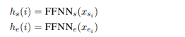
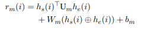
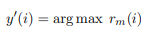
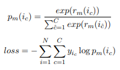
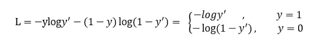
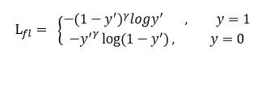
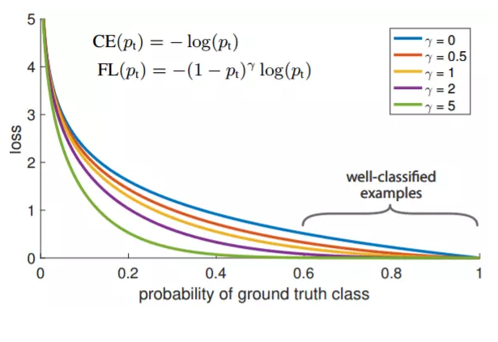
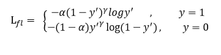

# 【关于 嵌套实体识别 之 Biaffine 】 那些你不知道的事

> 作者：杨夕
> 
> 论文：Named Entity Recognition as Dependency Parsing
> 
> 项目地址：https://github.com/km1994/nlp_paper_study
> 
> 论文地址：https://www.aclweb.org/anthology/2020.acl-main.577/
> 
> 代码：https://github.com/juntaoy/biaffine-ner
> 
> 代码【中文】：https://github.com/suolyer/PyTorch_BERT_Biaffine_NER
> 
> 个人介绍：大佬们好，我叫杨夕，该项目主要是本人在研读顶会论文和复现经典论文过程中，所见、所思、所想、所闻，可能存在一些理解错误，希望大佬们多多指正。

- [【关于 嵌套实体识别 之 Biaffine 】 那些你不知道的事](#关于-嵌套实体识别-之-biaffine--那些你不知道的事)
  - [摘要](#摘要)
  - [一、数据处理模块](#一数据处理模块)
    - [1.1 原始数据格式](#11-原始数据格式)
    - [1.2 数据预处理模块 data_pre()](#12-数据预处理模块-data_pre)
      - [1.2.1 数据预处理 主 函数](#121-数据预处理-主-函数)
      - [1.2.2  训练数据加载 load_data(file_path)](#122--训练数据加载-load_datafile_path)
      - [1.2.3 数据编码 encoder(sentence, argument)](#123-数据编码-encodersentence-argument)
    - [1.3 数据转化为 MyDataset 对象](#13-数据转化为-mydataset-对象)
    - [1.4 构建 数据 迭代器](#14-构建-数据-迭代器)
    - [1.5 最后数据构建格式](#15-最后数据构建格式)
  - [二、模型构建 模块](#二模型构建-模块)
    - [2.1 主题框架介绍](#21-主题框架介绍)
    - [2.2 embedding layer](#22-embedding-layer)
    - [2.2 BiLSTM](#22-bilstm)
    - [2.3 FFNN](#23-ffnn)
    - [2.4 biaffine model](#24-biaffine-model)
    - [2.5 冲突解决](#25-冲突解决)
    - [2.6 损失函数](#26-损失函数)
  - [三、学习率衰减 模块](#三学习率衰减-模块)
  - [四、loss 损失函数定义](#四loss-损失函数定义)
    - [4.1 span_loss 损失函数定义](#41-span_loss-损失函数定义)
    - [4.2 focal_loss 损失函数定义](#42-focal_loss-损失函数定义)
  - [四、模型训练](#四模型训练)
  - [参考](#参考)

## 摘要

- 动机：NER 研究 关注于 扁平化NER，而忽略了 实体嵌套问题；
- 方法： 在本文中，我们使用基于图的依存关系解析中的思想，以通过 biaffine model 为模型提供全局的输入视图。 biaffine model 对句子中的开始标记和结束标记对进行评分，我们使用该标记来探索所有跨度，以便该模型能够准确地预测命名实体。
- 工作介绍：在这项工作中，我们将NER重新确定为开始和结束索引的任务，并为这些对定义的范围分配类别。我们的系统在多层BiLSTM之上使用biaffine模型，将分数分配给句子中所有可能的跨度。此后，我们不用构建依赖关系树，而是根据候选树的分数对它们进行排序，然后返回符合 Flat 或  Nested NER约束的排名最高的树 span；
- 实验结果：我们根据三个嵌套的NER基准（ACE 2004，ACE 2005，GENIA）和五个扁平的NER语料库（CONLL 2002（荷兰语，西班牙语），CONLL 2003（英语，德语）和ONTONOTES）对系统进行了评估。结果表明，我们的系统在所有三个嵌套的NER语料库和所有五个平坦的NER语料库上均取得了SoTA结果，与以前的SoTA相比，实际收益高达2.2％的绝对百分比。

## 一、数据处理模块

### 1.1 原始数据格式

原始数据格式如下所示：

```s
    {
        "text": "当希望工程救助的百万儿童成长起来，科教兴国蔚然成风时，今天有收藏价值的书你没买，明日就叫你悔不当初！", 
        "entity_list": []
    }
    {
        "text": "藏书本来就是所有传统收藏门类中的第一大户，只是我们结束温饱的时间太短而已。", 
        "entity_list": []
    }
    {
        "text": "因有关日寇在京掠夺文物详情，藏界较为重视，也是我们收藏北京史料中的要件之一。", 
        "entity_list": 
        [
            {"type": "ns", "argument": "北京"}
        ]
    }
    ...
```

### 1.2 数据预处理模块 data_pre() 

#### 1.2.1 数据预处理 主 函数 

- 步骤：

1. 加载数据；
2. 对数据进行编码，转化为 训练数据 格式

- 代码介绍：

```s
def data_pre(file_path):
    sentences, arguments = load_data(file_path)
    data = []
    for i in tqdm(range(len(sentences))):
        encode_sent, token_type_ids, attention_mask, span_label, span_mask = encoder(
            sentences[i], arguments[i])

        tmp = {}
        tmp['input_ids'] = encode_sent
        tmp['input_seg'] = token_type_ids
        tmp['input_mask'] = attention_mask
        tmp['span_label'] = span_label
        tmp['span_mask'] = span_mask
        data.append(tmp)

    return data
```

- 输出结果：

```s
data[0:2]:
[
    {
        'input_ids': [
            101, 1728, 3300, 1068, 3189, 2167, 1762, 776, 2966, 1932, 3152, 4289, 6422, 2658, 8024, 5966, 4518, 6772, 711, 7028, 6228, 8024, 738, 3221, 2769, 812, 3119, 5966, 1266, 776, 1380, 3160, 704, 4638, 6206, 816, 722, 671, 511, 102, 0, 0, 0, 0, 0, 0, 0, 0, 0, 0, 0, 0, 0, 0, 0, 0, 0, 0, 0, 0, 0, 0, 0, 0, 0, 0, 0, 0, 0, 0, 0, 0, 0, 0, 0, 0, 0, 0, 0, 0, 0, 0, 0, 0, 0, 0, 0, 0, 0, 0, 0, 0, 0, 0, 0, 0, 0, 0, 0, 0, 0, 0, 0, 0, 0, 0, 0, 0, 0, 0, 0, 0, 0, 0, 0, 0, 0, 0, 0, 0, 0, 0, 0, 0, 0, 0, 0, 0
        ], 
        'input_seg': [
            0, 0, 0, 0, 0, 0, 0, 0, 0, 0, 0, 0, 0, 0, 0, 0, 0, 0, 0, 0, 0, 0, 0, 0, 0, 0, 0, 0, 0, 0, 0, 0, 0, 0, 0, 0, 0, 0, 0, 0, 0, 0, 0, 0, 0, 0, 0, 0, 0, 0, 0, 0, 0, 0, 0, 0, 0, 0, 0, 0, 0, 0, 0, 0, 0, 0, 0, 0, 0, 0, 0, 0, 0, 0, 0, 0, 0, 0, 0, 0, 0, 0, 0, 0, 0, 0, 0, 0, 0, 0, 0, 0, 0, 0, 0, 0, 0, 0, 0, 0, 0, 0, 0, 0, 0, 0, 0, 0, 0, 0, 0, 0, 0, 0, 0, 0, 0, 0, 0, 0, 0, 0, 0, 0, 0, 0, 0, 0
        ], 
        'input_mask': [
            1, 1, 1, 1, 1, 1, 1, 1, 1, 1, 1, 1, 1, 1, 1, 1, 1, 1, 1, 1, 1, 1, 1, 1, 1, 1, 1, 1, 1, 1, 1, 1, 1, 1, 1, 1, 1, 1, 1, 1, 0, 0, 0, 0, 0, 0, 0, 0, 0, 0, 0, 0, 0, 0, 0, 0, 0, 0, 0, 0, 0, 0, 0, 0, 0, 0, 0, 0, 0, 0, 0, 0, 0, 0, 0, 0, 0, 0, 0, 0, 0, 0, 0, 0, 0, 0, 0, 0, 0, 0, 0, 0, 0, 0, 0, 0, 0, 0, 0, 0, 0, 0, 0, 0, 0, 0, 0, 0, 0, 0, 0, 0, 0, 0, 0, 0, 0, 0, 0, 0, 0, 0, 0, 0, 0, 0, 0, 0
        ], 
        'span_label': array(
            [
                [0, 0, 0, ..., 0, 0, 0],
                [0, 0, 0, ..., 0, 0, 0],
                [0, 0, 0, ..., 0, 0, 0],
                ...,
                [0, 0, 0, ..., 0, 0, 0],
                [0, 0, 0, ..., 0, 0, 0],
                [0, 0, 0, ..., 0, 0, 0]
            ]
        ), 
        'span_mask': [
            [
                1, 1, 1, 1, 1, 1, 1, 1, 1, 1, 1, 1, 1, 1, 1, 1, 1, 1, 1, 1, 1, 1, 1, 1, 1, 1, 1, 1, 1, 1, 1, 1, 1, 1, 1, 1, 1, 1, 1, 1, 0, 0, 0, 0, 0, 0, 0, 0, 0, 0, 0, 0, 0, 0, 0, 0, 0, 0, 0, 0, 0, 0, 0, 0, 0, 0, 0, 0, 0, 0, 0, 0, 0, 0, 0, 0, 0, 0, 0, 0, 0, 0, 0, 0, 0, 0, 0, 0, 0, 0, 0, 0, 0, 0, 0, 0, 0, 0, 0, 0, 0, 0, 0, 0, 0, 0, 0, 0, 0, 0, 0, 0, 0, 0, 0, 0, 0, 0, 0, 0, 0, 0, 0, 0, 0, 0, 0, 0
            ], 
            [
                1, 1, 1, 1, 1, 1, 1, 1, 1, 1, 1, 1, 1, 1, 1, 1, 1, 1, 1, 1, 1, 1, 1, 1, 1, 1, 1, 1, 1, 1, 1, 1, 1, 1, 1, 1, 1, 1, 1, 1, 0, 0, 0, 0, 0, 0, 0, 0, 0, 0, 0, 0, 0, 0, 0, 0, 0, 0, 0, 0, 0, 0, 0, 0, 0, 0, 0, 0, 0, 0, 0, 0, 0, 0, 0, 0, 0, 0, 0, 0, 0, 0, 0, 0, 0, 0, 0, 0, 0, 0, 0, 0, 0, 0, 0, 0, 0, 0, 0, 0, 0, 0, 0, 0, 0, 0, 0, 0, 0, 0, 0, 0, 0, 0, 0, 0, 0, 0, 0, 0, 0, 0, 0, 0, 0, 0, 0, 0
            ], ...
        ]
    }, ...
]
```

#### 1.2.2  训练数据加载 load_data(file_path)

- 代码介绍：

```s
def load_data(file_path):
    with open(file_path, 'r', encoding='utf8') as f:
        lines = f.readlines()
        sentences = []
        arguments = []
        for line in lines:
            data = json.loads(line)
            text = data['text']
            entity_list = data['entity_list']
            args_dict={}
            if entity_list != []:
                for entity in entity_list:
                    entity_type = entity['type']
                    entity_argument=entity['argument']
                    args_dict[entity_type] = entity_argument
                sentences.append(text)
                arguments.append(args_dict)
        return sentences, arguments
```

- 输出结果：

```s
    print(f"sentences[0:2]:{sentences[0:2]}")
    print(f"arguments[0:2]:{arguments[0:2]}")

    >>>
    sentences[0:2]:['因有关日寇在京掠夺文物详情，藏界较为重视，也是我们收藏北京史料中的要件之一。', '我们藏有一册１９４５年 ６月油印的《北京文物保存保管状态之调查报告》，调查范围涉及故宫、历博、古研所、北大清华图书馆、北图、日伪资料库等二十几家，言及文物二十万件以上，洋洋三万余言，是珍贵的北京史料。']
    arguments[0:2]:[{'ns': '北京'}, {'ns': '北京', 'nt': '古研所'}]
```

#### 1.2.3 数据编码 encoder(sentence, argument)

- 代码介绍：

```s
# step 1：获取 Bert tokenizer
tokenizer=tools.get_tokenizer()
# step 2: 获取 label 到 id 间  的 映射表；
label2id,id2label,num_labels = tools.load_schema()

def encoder(sentence, argument):
    # step 3：利用 tokenizer 对 sentence 进行 编码
    encode_dict = tokenizer.encode_plus(
        sentence,
        max_length=args.max_length,
        pad_to_max_length=True,
        truncation=True
    )
    encode_sent = encode_dict['input_ids']
    token_type_ids = encode_dict['token_type_ids']
    attention_mask = encode_dict['attention_mask']

    # step 4：span_mask 生成
    zero = [0 for i in range(args.max_length)]
    span_mask=[ attention_mask for i in range(sum(attention_mask))]
    span_mask.extend([ zero for i in range(sum(attention_mask),args.max_length)])
    
    # step 5：span_label 生成
    span_label = [0 for i in range(args.max_length)]
    span_label = [span_label for i in range(args.max_length)]
    span_label = np.array(span_label)
    for entity_type,arg in argument.items():
        encode_arg = tokenizer.encode(arg)
        start_idx = tools.search(encode_arg[1:-1], encode_sent)
        end_idx = start_idx + len(encode_arg[1:-1]) - 1
        span_label[start_idx, end_idx] = label2id[entity_type]+1

    return encode_sent, token_type_ids, attention_mask, span_label, span_mask

```

- 步骤：

1. 获取 Bert tokenizer；
2. 获取 label 到 id 间  的 映射表；
3. encode_plus返回所有编码信息

```s
encode_dict:
{
    'input_ids': [101, 1728, 3300, 1068, 3189, 2167, 1762, 776, 2966, 1932, 3152, 4289, 6422, 2658, 8024, 5966, 4518, 6772, 711, 7028, 6228, 8024, 738, 3221, 2769, 812, 3119, 5966, 1266, 776, 1380, 3160, 704, 4638, 6206, 816, 722, 671, 511, 102, 0, 0, 0, 0, 0, 0, 0, 0, 0, 0, 0, 0, 0, 0, 0, 0, 0, 0, 0, 0, 0, 0, 0, 0, 0, 0, 0, 0, 0, 0, 0, 0, 0, 0, 0, 0, 0, 0, 0, 0, 0, 0, 0, 0, 0, 0, 0, 0, 0, 0, 0, 0, 0, 0, 0, 0, 0, 0, 0, 0, 0, 0, 0, 0, 0, 0, 0, 0, 0, 0, 0, 0, 0, 0, 0, 0, 0, 0, 0, 0, 0, 0, 0, 0, 0, 0, 0, 0],
    'token_type_ids': [0, 0, 0, 0, 0, 0, 0, 0, 0, 0, 0, 0, 0, 0, 0, 0, 0, 0, 0, 0, 0, 0, 0, 0, 0, 0, 0, 0, 0, 0, 0, 0, 0, 0, 0, 0, 0, 0, 0, 0, 0, 0, 0, 0, 0, 0, 0, 0, 0, 0, 0, 0, 0, 0, 0, 0, 0, 0, 0, 0, 0, 0, 0, 0, 0, 0, 0, 0, 0, 0, 0, 0, 0, 0, 0, 0, 0, 0, 0, 0, 0, 0, 0, 0, 0, 0, 0, 0, 0, 0, 0, 0, 0, 0, 0, 0, 0, 0, 0, 0, 0, 0, 0, 0, 0, 0, 0, 0, 0, 0, 0, 0, 0, 0, 0, 0, 0, 0, 0, 0, 0, 0, 0, 0, 0, 0, 0, 0], 
    'attention_mask': [1, 1, 1, 1, 1, 1, 1, 1, 1, 1, 1, 1, 1, 1, 1, 1, 1, 1, 1, 1, 1, 1, 1, 1, 1, 1, 1, 1, 1, 1, 1, 1, 1, 1, 1, 1, 1, 1, 1, 1, 0, 0, 0, 0, 0, 0, 0, 0, 0, 0, 0, 0, 0, 0, 0, 0, 0, 0, 0, 0, 0, 0, 0, 0, 0, 0, 0, 0, 0, 0, 0, 0, 0, 0, 0, 0, 0, 0, 0, 0, 0, 0, 0, 0, 0, 0, 0, 0, 0, 0, 0, 0, 0, 0, 0, 0, 0, 0, 0, 0, 0, 0, 0, 0, 0, 0, 0, 0, 0, 0, 0, 0, 0, 0, 0, 0, 0, 0, 0, 0, 0, 0, 0, 0, 0, 0, 0, 0]
}
```
> 注：<br/>
> ‘input_ids’：顾名思义，是单词在词典中的编码<br/>
> ‘token_type_ids’， 区分两个句子的编码<br/>
> ‘attention_mask’, 指定对哪些词进行self-Attention操作<br/>

4. span_mask 生成
5. span_label 生成

- 介绍：该方法 生成 一个 大小 为 args.max_length*args.max_length 的矩阵，用于 定位 span 在 句子中的位置【开始位置、结束位置】，span 在矩阵中行号 为 开始位置，列号为 结束位置，对应的值 为 该 span所对应的类型；

- 实例代码介绍：

```s
>>>
import numpy as np
span_label = [0 for i in range(10)]
span_label = [span_label for i in range(10)]
span_label = np.array(span_label)
start = [1, 3, 7]
end  = [ 2,9, 9]
label2id = [1,2,4]
for i in range(len(label2id)):
    span_label[start[i], end[i]] = label2id[i]  

>>> 
array( [[0, 0, 0, 0, 0, 0, 0, 0, 0, 0],
        [0, 0, 1, 0, 0, 0, 0, 0, 0, 0],
        [0, 0, 0, 0, 0, 0, 0, 0, 0, 0],
        [0, 0, 0, 0, 0, 0, 0, 0, 0, 2],
        [0, 0, 0, 0, 0, 0, 0, 0, 0, 0],
        [0, 0, 0, 0, 0, 0, 0, 0, 0, 0],
        [0, 0, 0, 0, 0, 0, 0, 0, 0, 0],
        [0, 0, 0, 0, 0, 0, 0, 0, 0, 4],
        [0, 0, 0, 0, 0, 0, 0, 0, 0, 0],
        [0, 0, 0, 0, 0, 0, 0, 0, 0, 0]])
> 注：行号 为 start，列号 为 end，值 为 label2id
```

### 1.3 数据转化为 MyDataset 对象

将数据转化为 torch.tensor 类型

```s
class MyDataset(Dataset):
    def __init__(self, data):
        self.data = data

    def __len__(self):
        return len(self.data)

    def __getitem__(self, index):
        item = self.data[index]
        one_data = {
            "input_ids": torch.tensor(item['input_ids']).long(),
            "input_seg": torch.tensor(item['input_seg']).long(),
            "input_mask": torch.tensor(item['input_mask']).float(),
            "span_label": torch.tensor(item['span_label']).long(),
            "span_mask": torch.tensor(item['span_mask']).long()
        }
        return one_data
```

### 1.4 构建 数据 迭代器

```s
def yield_data(file_path):
    tmp = MyDataset(data_pre(file_path))
    return DataLoader(tmp, batch_size=args.batch_size, shuffle=True)
```

### 1.5 最后数据构建格式

```s
data[0:2]:
[
    {
        'input_ids': [
            101, 1728, 3300, 1068, 3189, 2167, 1762, 776, 2966, 1932, 3152, 4289, 6422, 2658, 8024, 5966, 4518, 6772, 711, 7028, 6228, 8024, 738, 3221, 2769, 812, 3119, 5966, 1266, 776, 1380, 3160, 704, 4638, 6206, 816, 722, 671, 511, 102, 0, 0, 0, 0, 0, 0, 0, 0, 0, 0, 0, 0, 0, 0, 0, 0, 0, 0, 0, 0, 0, 0, 0, 0, 0, 0, 0, 0, 0, 0, 0, 0, 0, 0, 0, 0, 0, 0, 0, 0, 0, 0, 0, 0, 0, 0, 0, 0, 0, 0, 0, 0, 0, 0, 0, 0, 0, 0, 0, 0, 0, 0, 0, 0, 0, 0, 0, 0, 0, 0, 0, 0, 0, 0, 0, 0, 0, 0, 0, 0, 0, 0, 0, 0, 0, 0, 0, 0
        ], 
        'input_seg': [
            0, 0, 0, 0, 0, 0, 0, 0, 0, 0, 0, 0, 0, 0, 0, 0, 0, 0, 0, 0, 0, 0, 0, 0, 0, 0, 0, 0, 0, 0, 0, 0, 0, 0, 0, 0, 0, 0, 0, 0, 0, 0, 0, 0, 0, 0, 0, 0, 0, 0, 0, 0, 0, 0, 0, 0, 0, 0, 0, 0, 0, 0, 0, 0, 0, 0, 0, 0, 0, 0, 0, 0, 0, 0, 0, 0, 0, 0, 0, 0, 0, 0, 0, 0, 0, 0, 0, 0, 0, 0, 0, 0, 0, 0, 0, 0, 0, 0, 0, 0, 0, 0, 0, 0, 0, 0, 0, 0, 0, 0, 0, 0, 0, 0, 0, 0, 0, 0, 0, 0, 0, 0, 0, 0, 0, 0, 0, 0
        ], 
        'input_mask': [
            1, 1, 1, 1, 1, 1, 1, 1, 1, 1, 1, 1, 1, 1, 1, 1, 1, 1, 1, 1, 1, 1, 1, 1, 1, 1, 1, 1, 1, 1, 1, 1, 1, 1, 1, 1, 1, 1, 1, 1, 0, 0, 0, 0, 0, 0, 0, 0, 0, 0, 0, 0, 0, 0, 0, 0, 0, 0, 0, 0, 0, 0, 0, 0, 0, 0, 0, 0, 0, 0, 0, 0, 0, 0, 0, 0, 0, 0, 0, 0, 0, 0, 0, 0, 0, 0, 0, 0, 0, 0, 0, 0, 0, 0, 0, 0, 0, 0, 0, 0, 0, 0, 0, 0, 0, 0, 0, 0, 0, 0, 0, 0, 0, 0, 0, 0, 0, 0, 0, 0, 0, 0, 0, 0, 0, 0, 0, 0
        ], 
        'span_label': array(
            [
                [0, 0, 0, ..., 0, 0, 0],
                [0, 0, 0, ..., 0, 0, 0],
                [0, 0, 0, ..., 0, 0, 0],
                ...,
                [0, 0, 0, ..., 0, 0, 0],
                [0, 0, 0, ..., 0, 0, 0],
                [0, 0, 0, ..., 0, 0, 0]
            ]
        ), 
        'span_mask': [
            [
                1, 1, 1, 1, 1, 1, 1, 1, 1, 1, 1, 1, 1, 1, 1, 1, 1, 1, 1, 1, 1, 1, 1, 1, 1, 1, 1, 1, 1, 1, 1, 1, 1, 1, 1, 1, 1, 1, 1, 1, 0, 0, 0, 0, 0, 0, 0, 0, 0, 0, 0, 0, 0, 0, 0, 0, 0, 0, 0, 0, 0, 0, 0, 0, 0, 0, 0, 0, 0, 0, 0, 0, 0, 0, 0, 0, 0, 0, 0, 0, 0, 0, 0, 0, 0, 0, 0, 0, 0, 0, 0, 0, 0, 0, 0, 0, 0, 0, 0, 0, 0, 0, 0, 0, 0, 0, 0, 0, 0, 0, 0, 0, 0, 0, 0, 0, 0, 0, 0, 0, 0, 0, 0, 0, 0, 0, 0, 0
            ], 
            [
                1, 1, 1, 1, 1, 1, 1, 1, 1, 1, 1, 1, 1, 1, 1, 1, 1, 1, 1, 1, 1, 1, 1, 1, 1, 1, 1, 1, 1, 1, 1, 1, 1, 1, 1, 1, 1, 1, 1, 1, 0, 0, 0, 0, 0, 0, 0, 0, 0, 0, 0, 0, 0, 0, 0, 0, 0, 0, 0, 0, 0, 0, 0, 0, 0, 0, 0, 0, 0, 0, 0, 0, 0, 0, 0, 0, 0, 0, 0, 0, 0, 0, 0, 0, 0, 0, 0, 0, 0, 0, 0, 0, 0, 0, 0, 0, 0, 0, 0, 0, 0, 0, 0, 0, 0, 0, 0, 0, 0, 0, 0, 0, 0, 0, 0, 0, 0, 0, 0, 0, 0, 0, 0, 0, 0, 0, 0, 0
            ], ...
        ]
    }, ...
]
```

## 二、模型构建 模块

### 2.1 主题框架介绍


模型主要由 embedding layer、BiLSTM、FFNN、biaffine model 四部分组成。


### 2.2 embedding layer 

 1. BERT： 遵循 (Kantor and Globerson, 2019) 的方法来获取目标令牌的上下文相关嵌入，每侧有64个周围令牌;
 2. character-based word embeddings：使用 CNN 编码  characters of the tokens.

```s
class myModel(nn.Module):
    def __init__(self, pre_train_dir: str, dropout_rate: float):
        super().__init__()
        self.roberta_encoder = BertModel.from_pretrained(pre_train_dir)
        self.roberta_encoder.resize_token_embeddings(len(tokenizer))
        ...

    def forward(self, input_ids, input_mask, input_seg, is_training=False):
        bert_output = self.roberta_encoder(input_ids=input_ids, 
                                            attention_mask=input_mask, 
                                            token_type_ids=input_seg) 
        encoder_rep = bert_output[0]
        ...
```

### 2.2 BiLSTM

拼接 char emb 和 word emb，并输入到 BiLSTM，以获得 word 表示；

```s
class myModel(nn.Module):
    def __init__(self, pre_train_dir: str, dropout_rate: float):
        super().__init__()
        ...
        self.lstm=torch.nn.LSTM(input_size=768,hidden_size=768, \
                        num_layers=1,batch_first=True, \
                        dropout=0.5,bidirectional=True)
        ...

    def forward(self, input_ids, input_mask, input_seg, is_training=False):
        ...
        encoder_rep,_ = self.lstm(encoder_rep)
        ...
```

### 2.3 FFNN

从BiLSTM获得单词表示形式后，我们应用两个单独的FFNN为 span 的开始/结束创建不同的表示形式（hs / he）。对 span 的开始/结束使用不同的表示，可使系统学会单独识别 span 的开始/结束。与直接使用LSTM输出的模型相比，这提高了准确性，因为实体开始和结束的上下文不同。



```s
class myModel(nn.Module):
    def __init__(self, pre_train_dir: str, dropout_rate: float):
        ...
        self.start_layer = torch.nn.Sequential(
            torch.nn.Linear(in_features=2*768, out_features=128),
            torch.nn.ReLU()
        )
        self.end_layer = torch.nn.Sequential(
            torch.nn.Linear(in_features=2*768, out_features=128),
            torch.nn.ReLU()
        )
        ...

    def forward(self, input_ids, input_mask, input_seg, is_training=False):
        ...
        start_logits = self.start_layer(encoder_rep) 
        end_logits = self.end_layer(encoder_rep) 
        ...
```

### 2.4 biaffine model

在句子上使用biaffine模型来创建 l×l×c 评分张量（rm），其中l是句子的长度，c 是 NER 类别的数量 +1（对于非实体）。


> 其中si和ei是 span i 的开始和结束索引，Um 是 d×c×d 张量，Wm是2d×c矩阵，bm是偏差

- 定义

```s
class biaffine(nn.Module):
    def __init__(self, in_size, out_size, bias_x=True, bias_y=True):
        super().__init__()
        self.bias_x = bias_x
        self.bias_y = bias_y
        self.out_size = out_size
        self.U = torch.nn.Parameter(torch.Tensor(in_size + int(bias_x),out_size,in_size + int(bias_y))) 
    def forward(self, x, y):
        if self.bias_x:
            x = torch.cat((x, torch.ones_like(x[..., :1])), dim=-1)
        if self.bias_y:
            y = torch.cat((y, torch.ones_like(y[..., :1])), dim=-1)
        bilinar_mapping = torch.einsum('bxi,ioj,byj->bxyo', x, self.U, y)
        return bilinar_mapping
```

- 调用

```s
class myModel(nn.Module):
    def __init__(self, pre_train_dir: str, dropout_rate: float):
        ...
        self.biaffne_layer = biaffine(128,num_label)
        ...

    def forward(self, input_ids, input_mask, input_seg, is_training=False):
        ...
        span_logits = self.biaffne_layer(start_logits,end_logits)
        span_logits = span_logits.contiguous()
        ...
```

### 2.5 冲突解决

张量 vr_m 提供在 s_i≤e_i 的约束下（实体的起点在其终点之前）可以构成命名实体的所有可能 span 的分数。我们为每个跨度分配一个NER类别 $y_0$



然后，我们按照其类别得分 (r_m * (i_{y'})) 降序对所有其他“非实体”类别的 span 进行排序，并应用以下后处理约束：对于嵌套的NER，只要选择了一个实体不会与排名较高的实体发生冲突。对于 实体 i与其他实体 j ，如果 s_i<s_j≤e_i<e_j 或 s_j<s_i≤e_j<e_i ，那么这两个实体冲突。此时只会选择类别得分较高的 span。

> eg：<br/>
> 在 句子 ： In the Bank of China 中， 实体 the Bank 的 边界与 实体 Bank of China 冲突，

> 注：对于 flat NER，我们应用了一个更多的约束，其中包含或在排名在它之前的实体之内的任何实体都将不会被选择。我们命名实体识别器的学习目标是为每个有效范围分配正确的类别（包括非实体）。

### 2.6 损失函数

 因为该任务属于 多类别分类问题：



```s
class myModel(nn.Module):
    def __init__(self, pre_train_dir: str, dropout_rate: float):
        ...

    def forward(self, input_ids, input_mask, input_seg, is_training=False):
        ...
        span_prob = torch.nn.functional.softmax(span_logits, dim=-1)

        if is_training:
            return span_logits
        else:
            return span_prob
```

## 三、学习率衰减 模块

```s
class WarmUp_LinearDecay:
    def __init__(self, optimizer: optim.AdamW, init_rate, warm_up_epoch, decay_epoch, min_lr_rate=1e-8):
        self.optimizer = optimizer
        self.init_rate = init_rate
        self.epoch_step = train_data_length / args.batch_size
        self.warm_up_steps = self.epoch_step * warm_up_epoch
        self.decay_steps = self.epoch_step * decay_epoch
        self.min_lr_rate = min_lr_rate
        self.optimizer_step = 0
        self.all_steps = args.epoch*(train_data_length/args.batch_size)

    def step(self):
        self.optimizer_step += 1
        if self.optimizer_step <= self.warm_up_steps:
            rate = (self.optimizer_step / self.warm_up_steps) * self.init_rate
        elif self.warm_up_steps < self.optimizer_step <= self.decay_steps:
            rate = self.init_rate
        else:
            rate = (1.0 - ((self.optimizer_step - self.decay_steps) / (self.all_steps-self.decay_steps))) * self.init_rate
            if rate < self.min_lr_rate:
                rate = self.min_lr_rate
        for p in self.optimizer.param_groups:
            p["lr"] = rate
        self.optimizer.step()
```

## 四、loss 损失函数定义

### 4.1 span_loss 损失函数定义

- 核心思想：对于模型学习到的所有实体的 start 和 end 位置，构造首尾实体匹配任务，即**判断某个 start 位置是否与某个end位置匹配为一个实体，是则预测为1，否则预测为0**，相当于**转化为一个二分类问题**，正样本就是真实实体的匹配，负样本是非实体的位置匹配。

```s
import torch
from torch import nn
from utils.arguments_parse import args
from data_preprocessing import tools
label2id,id2label,num_labels=tools.load_schema()
num_label = num_labels+1

class Span_loss(nn.Module):
    def __init__(self):
        super().__init__()
        self.loss_func = torch.nn.CrossEntropyLoss(reduction="none")

    def forward(self,span_logits,span_label,seq_mask):
        # batch_size,seq_len,hidden=span_label.shape
        span_label = span_label.view(size=(-1,))
        span_logits = span_logits.view(size=(-1, num_label))
        span_loss = self.loss_func(input=span_logits, target=span_label)
        # start_extend = seq_mask.unsqueeze(2).expand(-1, -1, seq_len)
        # end_extend = seq_mask.unsqueeze(1).expand(-1, seq_len, -1)
        span_mask = seq_mask.view(size=(-1,))
        span_loss *=span_mask
        avg_se_loss = torch.sum(span_loss) / seq_mask.size()[0]
        # avg_se_loss = torch.sum(sum_loss) / bsz
        return avg_se_loss
```
> 注：view函数的作用为重构张量的维度，相当于numpy中resize（）的功能

- 参考论文：《[A Unified MRC Framwork for Name Entity Recognition](https://arxiv.org/abs/1910.11476)》

### 4.2 focal_loss 损失函数定义

- 目标：解决分类问题中类别不平衡、分类难度差异的一个 loss；
- 思路：降低了大量简单负样本在训练中所占的权重，也可理解为一种困难样本挖掘。
- 损失函数形式：

Focal loss是在交叉熵损失函数基础上进行的修改，首先回顾二分类交叉上损失：



y'是经过激活函数的输出，所以在0-1之间。可见普通的交叉熵对于正样本而言，输出概率越大损失越小。对于负样本而言，输出概率越小则损失越小。此时的损失函数在大量简单样本的迭代过程中比较缓慢且可能无法优化至最优。那么Focal loss是怎么改进的呢？





首先在原有的基础上加了一个因子，其中gamma>0使得减少易分类样本的损失。使得更关注于困难的、错分的样本。

例如gamma为2，对于正类样本而言，预测结果为0.95肯定是简单样本，所以（1-0.95）的gamma次方就会很小，这时损失函数值就变得更小。而预测概率为0.3的样本其损失相对很大。对于负类样本而言同样，预测0.1的结果应当远比预测0.7的样本损失值要小得多。对于预测概率为0.5时，损失只减少了0.25倍，所以更加关注于这种难以区分的样本。这样减少了简单样本的影响，大量预测概率很小的样本叠加起来后的效应才可能比较有效。

此外，加入平衡因子alpha，用来平衡正负样本本身的比例不均：



只添加alpha虽然可以平衡正负样本的重要性，但是无法解决简单与困难样本的问题。

lambda调节简单样本权重降低的速率，当lambda为0时即为交叉熵损失函数，当lambda增加时，调整因子的影响也在增加。实验发现lambda为2是最优。

- 代码实现

```s
import torch
import torch.nn as nn
import torch.nn.functional as F
class FocalLoss(nn.Module):
    '''Multi-class Focal loss implementation'''
    def __init__(self, gamma=2, weight=None, ignore_index=-100):
        super(FocalLoss, self).__init__()
        self.gamma = gamma
        self.weight = weight
        self.ignore_index = ignore_index

    def forward(self, input, target):
        """
        input: [N, C]
        target: [N, ]
        """
        logpt = F.log_softmax(input, dim=1)
        pt = torch.exp(logpt)
        logpt = (1 - pt) ** self.gamma * logpt
        loss = F.nll_loss(logpt, target, self.weight, ignore_index=self.ignore_index)
        return loss
```

- 参考论文：《 [Focal Loss for Dense Object Detection](https://arxiv.org/pdf/1708.02002.pdf) 》

## 四、模型训练

```s
def train():
    # step 1：数据预处理
    train_data = data_prepro.yield_data(args.train_path)
    test_data = data_prepro.yield_data(args.test_path)
    
    # step 2：模型定义
    model = myModel(pre_train_dir=args.pretrained_model_path, dropout_rate=0.5).to(device)
    
    # step 3：优化函数 定义
    # model.load_state_dict(torch.load(args.checkpoints))
    param_optimizer = list(model.named_parameters())
    no_decay = ['bias', 'gamma', 'beta']
    optimizer_grouped_parameters = [
        {'params': [p for n, p in param_optimizer if not any(nd in n for nd in no_decay)],
            'weight_decay_rate': 0.01},
        {'params': [p for n, p in param_optimizer if any(nd in n for nd in no_decay)],
            'weight_decay_rate': 0.0}
    ]
    optimizer = optim.AdamW(params=optimizer_grouped_parameters, lr=args.learning_rate)

    schedule = WarmUp_LinearDecay(
                optimizer = optimizer, 
                init_rate = args.learning_rate,
                warm_up_epoch = args.warm_up_epoch,
                decay_epoch = args.decay_epoch
            )
    
    # step 4：span_loss 函数 定义
    span_loss_func = span_loss.Span_loss().to(device)
    span_acc = metrics.metrics_span().to(device)

    # step 5：训练
    step=0
    best=0
    for epoch in range(args.epoch):
        for item in train_data:
            step+=1
            input_ids, input_mask, input_seg = item["input_ids"], item["input_mask"], item["input_seg"]
            span_label,span_mask = item['span_label'],item["span_mask"]
            optimizer.zero_grad()
            span_logits = model( 
                input_ids=input_ids.to(device), 
                input_mask=input_mask.to(device),
                input_seg=input_seg.to(device),
                is_training=True
            )
            span_loss_v = span_loss_func(span_logits,span_label.to(device),span_mask.to(device))
            loss = span_loss_v
            loss = loss.float().mean().type_as(loss)
            loss.backward()
            torch.nn.utils.clip_grad_norm_(model.parameters(), max_norm=args.clip_norm)
            schedule.step()
            # optimizer.step()
            if step%100 == 0:
                span_logits = torch.nn.functional.softmax(span_logits, dim=-1)
                recall,precise,span_f1=span_acc(span_logits,span_label.to(device))
                logger.info('epoch %d, step %d, loss %.4f, recall %.4f, precise %.4f, span_f1 %.4f'% (epoch,step,loss,recall,precise,span_f1))
        with torch.no_grad():
            count=0
            span_f1=0
            recall=0
            precise=0

            for item in test_data:
                count+=1
                input_ids, input_mask, input_seg = item["input_ids"], item["input_mask"], item["input_seg"]
                span_label,span_mask = item['span_label'],item["span_mask"]

                optimizer.zero_grad()
                span_logits = model( 
                    input_ids=input_ids.to(device), 
                    input_mask=input_mask.to(device),
                    input_seg=input_seg.to(device),
                    is_training=False
                    ) 
                tmp_recall,tmp_precise,tmp_span_f1=span_acc(span_logits,span_label.to(device))
                span_f1+=tmp_span_f1
                recall+=tmp_recall
                precise+=tmp_precise
                
            span_f1 = span_f1/count
            recall=recall/count
            precise=precise/count

            logger.info('-----eval----')
            logger.info('epoch %d, step %d, loss %.4f, recall %.4f, precise %.4f, span_f1 %.4f'% (epoch,step,loss,recall,precise,span_f1))
            logger.info('-----eval----')
            if best < span_f1:
                best=span_f1
                torch.save(model.state_dict(), f=args.checkpoints)
                logger.info('-----save the best model----')
 
```

## 参考

1. [Named Entity Recognition as Dependency Parsing](https://www.aclweb.org/anthology/2020.acl-main.577/)


