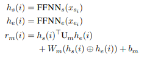
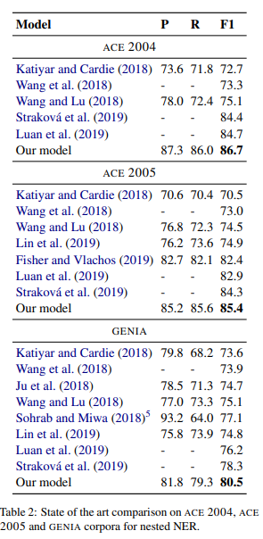

# 【关于 Biaffine Ner 】 那些你不知道的事

> 作者：杨夕
> 
> 项目地址：https://github.com/km1994/nlp_paper_study
> 
> 论文：https://www.aclweb.org/anthology/2020.acl-main.577/
> 
> 代码：https://github.com/juntaoy/biaffine-ner
> 
> 代码【中文】：https://github.com/suolyer/PyTorch_BERT_Biaffine_NER
> 
> 个人介绍：大佬们好，我叫杨夕，该项目主要是本人在研读顶会论文和复现经典论文过程中，所见、所思、所想、所闻，可能存在一些理解错误，希望大佬们多多指正。

## 摘要

- 动机：NER 研究 关注于 扁平化NER，而忽略了 实体嵌套问题；
- 方法： 在本文中，我们使用基于图的依存关系解析中的思想，以通过 biaffine model 为模型提供全局的输入视图。 biaffine model 对句子中的开始标记和结束标记对进行评分，我们使用该标记来探索所有跨度，以便该模型能够准确地预测命名实体。
- 工作介绍：在这项工作中，我们将NER重新确定为开始和结束索引的任务，并为这些对定义的范围分配类别。我们的系统在多层BiLSTM之上使用biaffine模型，将分数分配给句子中所有可能的跨度。此后，我们不用构建依赖关系树，而是根据候选树的分数对它们进行排序，然后返回符合 Flat 或  Nested NER约束的排名最高的树 span；
- 实验结果：我们根据三个嵌套的NER基准（ACE 2004，ACE 2005，GENIA）和五个扁平的NER语料库（CONLL 2002（荷兰语，西班牙语），CONLL 2003（英语，德语）和ONTONOTES）对系统进行了评估。结果表明，我们的系统在所有三个嵌套的NER语料库和所有五个平坦的NER语料库上均取得了SoTA结果，与以前的SoTA相比，实际收益高达2.2％的绝对百分比。

## 方法

- embedding layer : 
  - BERT： 遵循 (Kantor and Globerson, 2019) 的方法来获取目标令牌的上下文相关嵌入，每侧有64个周围令牌;
  - character-based word embeddings：使用 CNN 编码  characters of the tokens.
- BiLSTM：拼接 char emb 和 word emb，并输入到 BiLSTM，以获得 word 表示；
- FFNN：从BiLSTM获得单词表示形式后，我们应用两个单独的FFNN为 span 的开始/结束创建不同的表示形式（hs / he）。对 span 的开始/结束使用不同的表示，可使系统学会单独识别 span 的开始/结束。与直接使用LSTM输出的模型相比，这提高了准确性，因为实体开始和结束的上下文不同。
- biaffine model：我们在句子上使用biaffine模型来创建l×l×c评分张量（rm），其中l是句子的长度，c是NER类别的数量+1（对于非实体）。

> 其中si和ei是 span i 的开始和结束索引，Um 是 d×c×d 张量，Wm是2d×c矩阵，bm是偏差

- 张量 $vr_m$ 提供在 $s_i≤e_i$ 的约束下（实体的起点在其终点之前）可以构成命名实体的所有可能 span 的分数。我们为每个跨度分配一个NER类别 $y_0$

- 然后，我们按照其类别得分 $(r_m*(i_{y'}))$ 降序对所有其他“非实体”类别的 span 进行排序，并应用以下后处理约束：对于嵌套的NER，只要选择了一个实体不会与排名较高的实体发生冲突。对于 实体 i与其他实体 j ，如果 $s_i<s_j≤e_i<e_j$ 或 $s_j<s_i≤e_j<e_i$ ，那么这两个实体冲突。此时只会选择类别得分较高的 span。

> eg： 
> 在 句子 ： In the Bank of China 中， 实体 the Bank 的 边界与 实体 Bank of China 冲突，

> 注：对于 flat NER，我们应用了一个更多的约束，其中包含或在排名在它之前的实体之内的任何实体都将不会被选择。我们命名实体识别器的学习目标是为每个有效范围分配正确的类别（包括非实体）。

- 损失函数： 因为该任务属于 多类别分类问题：

## 实验结果分析

### Nested NER

### Flat NER

##  Ablation Study

### Biaffine Classifier 

- 操作：将 Biaffine Classifier 替换成 CRF，性能下降 0.8%；
- 解释：巨大的性能差异显示了添加biaffine模型的好处，并证实了我们的假设，即依赖项解析框架是我们系统高精度的重要因素。

### Contextual Embedding

- 操作：去掉 Bert  emb，性能 下降 2.4%；
- 解释：BERT嵌入是以下之一
精度的最重要因素

### Context Independent Embeddings

- 操作：去掉 上下文依赖的 fastText，性能下降 0.4% 
- 解释：即使启用了BERT嵌入，与上下文无关的嵌入仍然可以对系统做出相当明显的改进。

### Character Embeddings

- 操作：删除 character embeddings，性能下降 0.1%
- 解释：一种解释是英语不是一种形态丰富的语言，因此无益于主要来自角色级别的信息和BERT嵌入本身基于单词已经捕获了一些字符级信息。

## 结论

在本文中，我们将NER重新构造为结构化的预测任务，并针对 NEST 和 Flat NER 采用了SoTA依赖项解析方法。我们的系统使用上下文嵌入作为多层 BiLSTM 的输入。我们使用 biaffine 模型为句子中所有跨度分配分数。进一步的约束用于预测NEST 和 Flat NER。我们根据八个命名实体语料库评估了我们的系统。结果表明，我们的系统在所有八个语料库上均实现了SoTA。我们证明，先进的结构化预测技术可极大地改善 NEST 和 Flat NER的效果。

## 参考

1. [Named Entity Recognition as Dependency Parsing](https://www.aclweb.org/anthology/2020.acl-main.577/)
