# 【关于 Continual Learning for NER】那些你不知道的事

> 作者：杨夕
> 
> 论文：Continual Learning for Named Entity Recognition
> 
> 会议：AAAI2020
> 
> 论文下载地址：https://assets.amazon.science/65/61/ecffa8df45ad818c3f69fb1cf72b/continual-learning-for-named-entity-recognition.pdf
> 
> 本文链接：https://github.com/km1994/nlp_paper_study
> 
> 个人介绍：大佬们好，我叫杨夕，该项目主要是本人在研读顶会论文和复现经典论文过程中，所见、所思、所想、所闻，可能存在一些理解错误，希望大佬们多多指正。
> 
> 【注：手机阅读可能图片打不开！！！】

## 目录

- [【关于 Continual Learning for NER】那些你不知道的事](#关于-continual-learning-for-ner那些你不知道的事)
  - [目录](#目录)
  - [一、摘要](#一摘要)
  - [二、动机](#二动机)
    - [2.1 问题描述](#21-问题描述)
    - [2.2 解决方案](#22-解决方案)
  - [三、论文方法](#三论文方法)
  - [四、论文贡献](#四论文贡献)
  - [五、持续学习 是什么？](#五持续学习-是什么)
  - [六、Continually Learning Named Entities](#六continually-learning-named-entities)
    - [6.1 Knowledge Distillation](#61-knowledge-distillation)
      - [6.1.1 步骤](#611-步骤)
    - [6.2 Continual Learning for Sequence Tagging](#62-continual-learning-for-sequence-tagging)
      - [6.2.1 AddNER Model](#621-addner-model)
        - [6.2.1.1 模型介绍](#6211-模型介绍)
        - [6.2.1.2 模型损失函数构建](#6212-模型损失函数构建)
        - [6.2.1.3 存在问题与解决方法](#6213-存在问题与解决方法)
      - [6.2.2 ExtendNER Model](#622-extendner-model)
        - [6.2.2.1 模型介绍](#6221-模型介绍)
        - [6.2.2.2 模型损失函数构建](#6222-模型损失函数构建)
  - [七、实验结果](#七实验结果)
    - [7.1 数据集选取](#71-数据集选取)
    - [7.2 Results & Discussion](#72-results--discussion)
      - [7.2.1 Our  first  RQ  is: 【Transfer Learning for CL】Is  transfer learning sufficient for learning new entity types, while preserving knowledge of previously learned entity types? 迁移学习是否足以学习新的实体类型，同时保留先前学习的实体类型的知识？](#721-our--first--rq--is-transfer-learning-for-clis--transfer-learning-sufficient-for-learning-new-entity-types-while-preserving-knowledge-of-previously-learned-entity-types-迁移学习是否足以学习新的实体类型同时保留先前学习的实体类型的知识)
      - [7.2.2 Our second RQ is: 【AddNERvs.ExtendNER Student Models】Are  there  differences  between  the AddNER and ExtendNER models in the CL setting?](#722-our-second-rq-is-addnervsextendner-student-modelsare--there--differences--between--the-addner-and-extendner-models-in-the-cl-setting)
      - [7.2.3 Our third RQ is: 【KD for CL with Limited Annotations】Do the student models effectively learn with KD in the CL setting when new datasets are only minimally-annotated? 当新数据集仅进行最少标注时，学生模型是否可以在 CL 中使用 KD 进行有效学习？](#723-our-third-rq-is-kd-for-cl-with-limited-annotationsdo-the-student-models-effectively-learn-with-kd-in-the-cl-setting-when-new-datasets-are-only-minimally-annotated-当新数据集仅进行最少标注时学生模型是否可以在-cl-中使用-kd-进行有效学习)
      - [7.2.4 Our last RQ is: 【Knowledge Retention with KD】Do thestudent models retain knowledge of the previously learnedentity types when learning a new one? 在学习新的实体类型时，学生模型是否保留了先前学习的实体类型的知识？](#724-our-last-rq-is-knowledge-retention-with-kddo-thestudent-models-retain-knowledge-of-the-previously-learnedentity-types-when-learning-a-new-one-在学习新的实体类型时学生模型是否保留了先前学习的实体类型的知识)
  - [参考](#参考)

## 一、摘要

Named Entity Recognition (NER) is a vital task in variousNLP  applications.  However,  in  many  real-world  scenarios(e.g.,  voiceenabled  assistants)  new  named  entity  types  arefrequently  introduced,  entailing  retraining  NER  models  tosupport  these  new  entity  types.  Reannotating  the  originaltraining data for the new entity types could be costly or evenimpossible when storage limitations or security concerns restrict  access  to  that  data,  and  annotating  a  new  dataset  forall of the entities becomes impractical and error-prone as thenumber of types increases. To tackle this problem, we intro-duce a novel Continual Learning approach for NER, whichrequires new training material to be annotated only for thenew entity types. To preserve the existing knowledge previ-ously learned by the model, we exploit theKnowledge Distil-lation(KD) framework, where the existing NER model actsas the teacher for a new NER model (i.e., the student), whichlearns the new entity types by using the new training material  and  retains  knowledge  of  old  entities  byimitatingtheteacher’s outputs on this new training set. Our experimentsshow  that  this  approach  allows  the  student  model  to  “progressively” learn to identify new entity types without forgetting the previously learned ones. We also present a compar-ison with multiple strong baselines to demonstrate that ourapproach is superior for continually updating an NER model.

- 介绍：命名实体识别 (NER) 是各种 NLP 应用程序中的一项重要任务。
- 动机：在许多现实世界的场景中（例如，语音助手）经常引入新的命名实体类型，需要重新训练 NER 模型以支持这些新的实体类型。当存储限制或安全问题重新限制对该数据的访问时，为新实体类型重新 标注 原始训练数据可能成本高昂甚至不可能，并且随着类型数量的增加，为所有实体注释新数据集变得不切实际且容易出错.
- 论文方法： 引入了一种新颖的持续学习方法，它需要仅针对新的实体类型 标注 新的训练材料。为了保留模型先前学到的现有知识，我们利用知识蒸馏（KD）框架，其中现有的 NER 模型充当新 NER 模型（即学生）的老师，该模型通过以下方式学习新的实体类型使用新的训练材料并通过在这个新训练集上模仿教师的输出来保留旧实体的知识。
- 实验结果：这种方法允许学生模型“逐步”学习识别新的实体类型，而不会忘记以前学习的实体类型。我们还提供了与多个强基线的比较，以证明我们的方法在不断更新 NER 模型方面是优越的

## 二、动机

### 2.1 问题描述

1. 业务扩展，需要新增 实体类型（eg:像 Sirior Alexa 这样的语音助手不断地为其功能引入新的意图，因此**新的实体类型经常被添加到他们的插槽填充模型**中）

### 2.2 解决方案

- (i) 更新实体表以涵盖新类型并重新标注训练数据，然后在修改后的数据上从头开始重新训练模型；
  - 问题：当实体数量很大时，这很容易变得不切实际且容易出错；
- (ii) 仅为新实体类型注释新数据集，并使用此数据在持续学习 (CL) 设置中更新模型；
  - 问题：灾难性遗忘。重新训练后的模型会遗忘掉之前实体信息；
- (iii) self-training 方法：让现有的 NER 模型将有关它已经支持的实体的知识传授给新模型。 其中使用现有模型来 标注 新数据集，即填补仅手动 标注 新实体类型的空白，然后可以使用该数据集来训练新模型以识别新旧实体类型；
  - 问题：误差传递：旧模型的错误会传播到新模型，而没有考虑旧模型预测的不确定性。 认为旧模型的不确定性可以帮助新模型更好地了解旧的实体类型；

## 三、论文方法

研究 将 知识蒸馏（KD） 应用于 NER 的 CL 问题，通过 将 “teacher”模型的预测合并到“student”模型的目标函数中，该模型正在接受训练以执行类似但略有修改的任务。 通过学习输出概率分布，而不仅仅是标签，使得学生表现得与教师相似。

- “teacher”模型：经过训练的 NER 模型
- “student”模型：支持其他实体类型的新模型

## 四、论文贡献

- (i) 展示了如何使 CL 技术适应 NLU 域，以逐步学习 NER 的新实体类型； 
- (ii) 在两个 English NER 数据集上的结果表明，我们的 CL 方法使模型能够不断学习新的实体类型，而不会失去识别先前获得的类型的能力； 
- (iii) 表明半监督策​​略实现了与全监督设置相当的结果。

## 五、持续学习 是什么？

Continual Learning（也称为终身学习（Chen et al. 2018））研究从数据流中学习的问题。该流可以在输入分布的演变或通过合并新任务方面随时间变化。 CL 的目标是逐步扩展在模型中获得的知识（Lange 等人，2019 年），而不会产生任何灾难性遗忘（CF）（Goodfellowet al. 2013 年），主要是为了解释数据分布的变化。以前的工作主要集中在计算机视觉（Shmelkov、Schmid 和 Alahari 2017；Li 和 Hoiem 2018；Rannen 等人 2017）上，使用知识蒸馏（Hin-ton、Vinyals 和 Dean 2015）作为基础框架。

## 六、Continually Learning Named Entities

### 6.1 Knowledge Distillation

#### 6.1.1 步骤

1. teacher model 在 特定数据集上训练，以学习 该数据集的 类别概率分布；

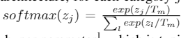

2. 通过在转移数据集上模仿 teacher model 输出分布来训练 teacher 模型

### 6.2 Continual Learning for Sequence Tagging

#### 6.2.1 AddNER Model

##### 6.2.1.1 模型介绍

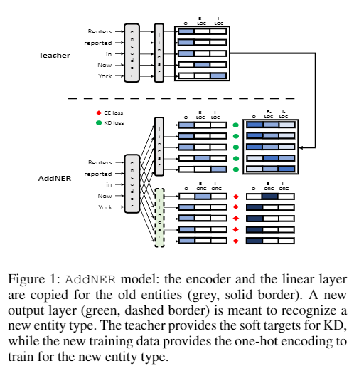
> 图 1：AddNER 模型：为旧实体（灰色、实心边框）复制编码器和线性层。新的输出层（绿色、虚线边框）旨在识别新的实体类型。教师为 KD 提供软目标，而新的训练数据提供 one-hot 编码以训练新的实体类型。

在这个模式中，学生 Mi+1 是老师 Mi 的克隆，并且添加了一个新的 added2 来识别 Enew 中的实体类型（图 1）。 在训练期间，Mi+1 观察来自 Dnew 的示例。 鉴于此数据集包含仅针对 Enew 标注 的实例，我们采用 KD 来防止对已经获得的实体类型的灾难性遗忘。这意味着每个句子也通过老师 Mi 运行，这为在旧的模型上训练学生提供了软目标 实体类型。 同时，标注数据用于学习如何识别新的实体类型。 因此，Mi+1 训练有两种损失：一种是惩罚忘记以前的实体类型（图 1 中的绿色圆圈），另一种是惩罚新实体类型上的错误（红色菱形）。

##### 6.2.1.2 模型损失函数构建

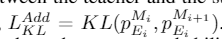
> That is, Mi+1 is trained by minimizing the KL divergence between the teacher and the student output distributions

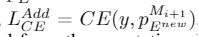
> The student model will  also  produce  the  output  probability  distribution  with respect to the new entity types with the new output layer,i.e., $p^{Mi+1}_{Enew}$. This is used to compute the cross-entropy loss

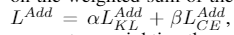
> he model is trained on the weighted sum of the two losses for each token

##### 6.2.1.3 存在问题与解决方法

- 问题：标签冲突

由于 AddNER 模型包含多个输出层，因此需要合并单个 token 的不同输出。特别是，可能出现一层的预测与另一层的预测冲突的情况。

- 解决方法：启发式方法，将每个令牌的不同层的输出合并：

1. If all layers predict theOtag, then output=O；
2. If exactly one layer predicts aB-tag and the other layerspredictO, then output=B-；
3. If multiple layers predictB-tags and the remaining layerspredictO, then output=B-with the highest probability；
4. If a layer predicts an I-tag, output=I- only if it matches the preceding tag in the sequence, i.e., the tag of the previous token must be a B- or I- of the same entity type.Otherwise, the output of that layer is treated as O, and the heuristics are applied again to determine the final output（如果一个层预测一个I-tag，则output=I-only 如果它匹配序列中的前一个tag，即前一个token的tag必须是相同实体类型的B-或I-。否则，那个的输出层被视为O，并再次应用启发式以确定最终输出）

#### 6.2.2 ExtendNER Model

##### 6.2.2.1 模型介绍

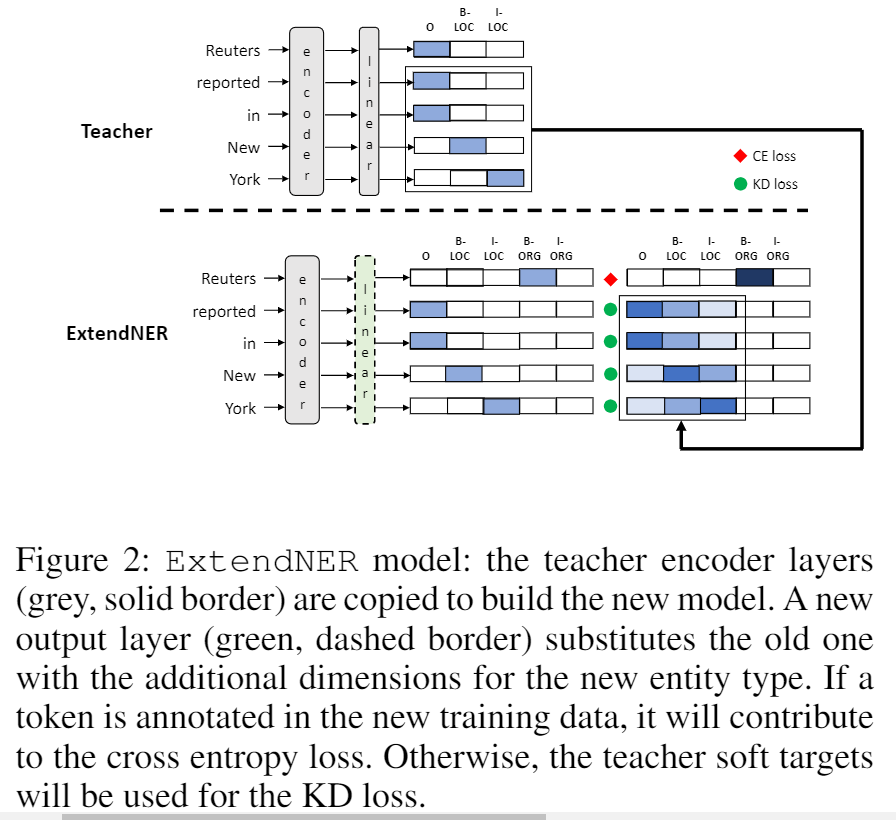
> ExtendNERmodel：复制 teacher 编码器层（灰色，实心边框）以构建新模型。一个新的输出层（绿色，虚线边框）用新实体类型的附加维度替换旧的层。如果在新的训练数据中标注了 token，则会导致交叉熵损失。否则， teacher 软目标将用于 KD 损失

在此设置中，Mi+1 再次是 Mi 的克隆，但扩展了标记器输出层，即向该层添加了新维度以识别 Enew 中的 m 个新实体类型（图 2）。 假设 Mi 能够识别 n 个实体类型，它的标记层可以被认为是一个维度为 h×(2n+1) 的矩阵。 Mi+1 的输出层将被扩展为维度为 h×(2n+2m+1) 的矩阵，以适应新的实体类型。

##### 6.2.2.2 模型损失函数构建

采用 KD 来防止灾难性遗忘具有两个损失函数：

- （i）Ei 中实体类型的教师和学生输出之间的 KL 散度；
- （ii）Enew 中实体类型的学生输出和 Dnew 中的黄金注释之间的交叉熵

对于句子中的每个 token 与相关的类别，该模型将计算 KL 散度或交叉熵损失，具体取决于 y 的值：

1. 当 y=O 时，计算 teacher 输出分布和 student 输出分布之间的 KL散度 (图2 绿色部分)

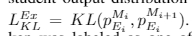

2. 如果 y 不等于 O（即 token 被标记为 Enew 中的实体类型之一）模型将计算交叉熵损失 (图2 红色部分)

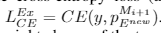

3. 该模型在两个损失的加权和上进行训练

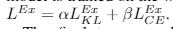

## 七、实验结果

### 7.1 数据集选取

> CoNLL-03
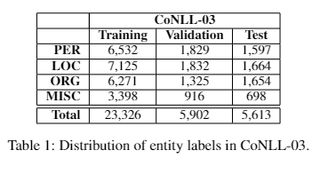

> OntoNotes
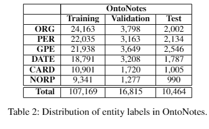

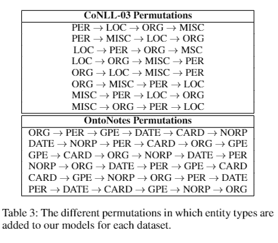
> 表 3：实体类型被添加到每个数据集的模型中的不同排列

### 7.2 Results & Discussion

#### 7.2.1 Our  first  RQ  is: 【Transfer Learning for CL】Is  transfer learning sufficient for learning new entity types, while preserving knowledge of previously learned entity types? 迁移学习是否足以学习新的实体类型，同时保留先前学习的实体类型的知识？

1. 对比实验

- frozen transfer models：在 D1 上训练了一个模型 M1，然后在 CoNLL-03 上训练了 D2 上的迁移学习模型，冻结编码器层；
- thefree transfer models：在 D1 上训练了一个模型 M1，然后在 CoNLL-03 上训练了 D2 上的迁移学习模型，不冻结编码器层；

2. 实验结果

- frozen transfer models： the average overall F1 scores at step2 was 57.49
- thefree transfer models：the averageperformance at step 2 was 56.21

3. 实验结论

- frozen transfer models： 减轻了任何灾难性的遗忘，但冻结编码器限制了模型充分学习新实体类型的能力
- thefree transfer models：出现 灾难性遗忘

无论编码器是否被冻结，迁移学习方法都不能成功用于 CL 设置中的 NER 模型。

#### 7.2.2 Our second RQ is: 【AddNERvs.ExtendNER Student Models】Are  there  differences  between  the AddNER and ExtendNER models in the CL setting? 

- ExtendNER 在  CoNLL-03 上 高 AddNER 0.06
- ExtendNER 在  OntoNotes 上 高 AddNER 0.04

#### 7.2.3 Our third RQ is: 【KD for CL with Limited Annotations】Do the student models effectively learn with KD in the CL setting when new datasets are only minimally-annotated? 当新数据集仅进行最少标注时，学生模型是否可以在 CL 中使用 KD 进行有效学习？

- 目标：对比每个模型在每个 stepi 的所有排列的平均 F1 分数。这些代表了每个模型在其所有支持的实体类型（新的和以前学习的）上的表现。这些结果显示在图 3 中，其中最左边的条形表示使用 KD 训练的扩展神经网络模型的分数。

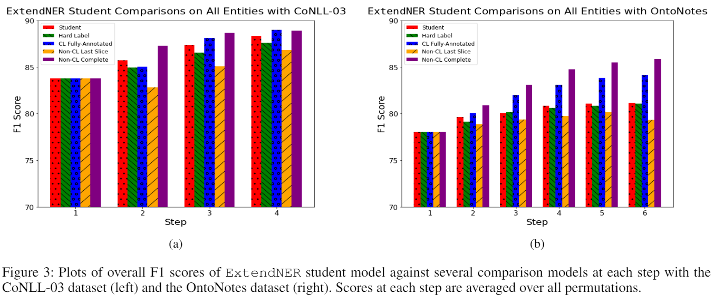
> 在 CoNLL-03 数据集（左）和 OntoNotes 数据集（右）的每个步骤中，ExtendNERstudent 模型的总体 F1 分数与几个比较模型的图。每个步骤的分数是所有排列的平均值

- 解释：
  - vs hard-label model
  - vs CL fully-annotated model
  - vs non-CL  last  slice models
  - vs non-CL complete models

#### 7.2.4 Our last RQ is: 【Knowledge Retention with KD】Do thestudent models retain knowledge of the previously learnedentity types when learning a new one? 在学习新的实体类型时，学生模型是否保留了先前学习的实体类型的知识？

- 目标：添加新类型时性能是否保持不变
- 

我们通过逐步跟踪模型在其学习的实体类型上的性能来解决这个问题，以查看在添加新类型时性能是否保持不变。特别是，对于每个排列，我们测量在步骤 1 中训练的初始模型的 F1 分数 在 e1，第2步训练的ExtendNER的F1分数 在 e1，依此类推。 e1 在所有排列的每一步的平均 F1 分数代表学生模型保留 e1 知识的程度。我们还可以跟踪性能 在 e2 starting from step 2, e3 starting from step 3等等，看看是否存在类似的趋势。 ExtendNER 和 KD 的这些结果如图 4 所示。我们可以看到，一般来说，F1 分数保持大致相同或逐步增加。这表明，随着新实体类型的引入，ExtendNER 保留甚至获得了通过 KD 训练的实体的知识。尽管在 OntoNotes 上第 3 步之后 e1 呈下降趋势（图 4b），但我们发现，ExtendNER 在第 6 步（77.88 F1）的平均性能 one1 低于第 1 步（78.03 F1），但这种差异并不显着（p = 0.9）。

e 还计算了每个排列中的每个实体类型在 stepiversus stepi+1 时 F1 得分之间的平均差异，以进一步测量扩展 NER 在 KD 后保留先前学习标签知识的能力。我们发现在 CoNLL-03 数据集上，F1 平均分在连续步骤之间显着增加了 1.308（p=0.0001）。在 OntoNotes 数据集上，F1 平均分增加了 0.0341，但这种差异没有统计学意义，（p = 0.7）。由于我们没有看到平均 F1 分数从一个步骤到下一个步骤有任何显着下降，这些结果表明我们的方法可以防止任何灾难性遗忘

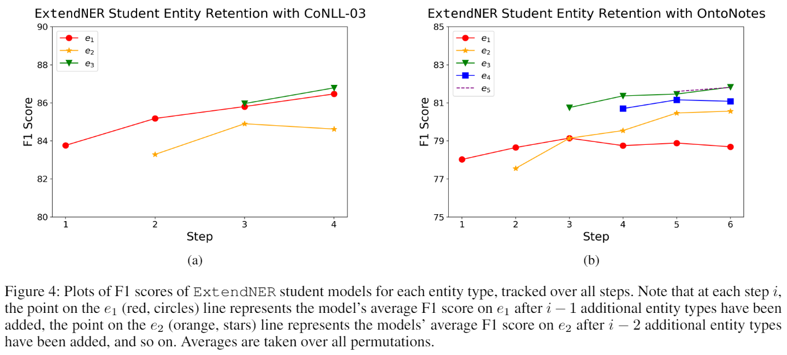
> 图 4：每个实体类型的 ExtendNERstudent 模型的 F1 分数图，跟踪所有步骤。请注意，在每个 stepi，e1（红色，圆圈）线上的点代表模型的平均 F1 分数添加了 1-1 个附加实体类型后，e2（橙色，星星）线上的点代表模型的平均 F1 分数增加了 1-2 个之后添加了实体类型，等等。对所有排列取平均值

## 参考

1. [Continual learning for named entity recognition](https://assets.amazon.science/65/61/ecffa8df45ad818c3f69fb1cf72b/continual-learning-for-named-entity-recognition.pdf)

