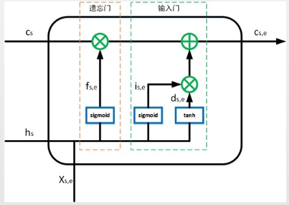

# Chinese NER Using Lattice LSTM（ACL2018）

> 作者：杨夕
> 
> 论文链接：[https://www.aclweb.org/anthology/P18-1144/](https://www.aclweb.org/anthology/P18-1144/)
> 
> 代码链接：[https://github.com/jiesutd/LatticeLSTM](https://github.com/jiesutd/LatticeLSTM)
> 
> 【注：手机阅读可能图片打不开！！！】

## 目录

- NER 简介
  - 命名实体识别（Named Entity Recognition）
  - 基于字符的 LSTM (Char-Based LSTM)
  - 基于词汇的 LSTM (Word-Based LSTM)
- Latitice LSTM
  - 网络结构
  - 计算原理
  - 性能评估
  
### 一、NER 简介

#### 1.1 命名实体识别

- 含义：
  - 识别文本中的人名、地名、机构名等实体名词，是自然语言处理的一项基本任务，广泛用于信息检索、知识图谱、智能问答等应用领域。
  - 对实体按类型（per、loc、org等）、位置（start、end、interior等）进行编码，可以讲命名实体识别转化为序列标注问题。
- 举例
  
   

- 经典模型：（Bi）LSTM-CRF
  - 将语句划分为 token，并表示为向量；
  - 用 LSTM 或 BiLSTM 提取 token 的特征表达；
  - 用 softmax 将特征表达转换为标签概率分布；
  - 将概率分布作为输入，真实标注作为输出，训练 CRF 模型

  

- 根据 token 类型不同，可以分为基于字符的模型和基于词汇的模型
  - 存在问题：
    
    1). 由于中文分词存在误差，基于词汇的 LSTM 表现不如基于字符的 LSTM;

    2). 基于字符的 LSTM 没有利用词汇信息，会导致实体划分出现歧义等问题。 
  
  

### 二、Lattice LSTM 

#### 2.1 网络结构

- 想法：在 char-based 的 LSTM 中引入词汇信息
- 做法：
  - 根据大量语料生成词典；
  - 若当前字符与前面的字符无法组成词典中词汇，则按 LSTM 的方法更新记忆状态；
  - 若当前字符与前面的字符组成词典中词汇，从最新词汇中提取信息，联合更新记忆状态；

#### 2.2 计算原理

- LSTM 计算字符信息
  
$$
f_{t}=\text { sigmoid }\left(W^{f} \times\left[h_{t-1} ; x_{t}\right]+b^{f}\right)
$$

$$
i_{t}=\operatorname{sigmoid}\left(W^{i} \times\left[h_{t-1} ; x_{t}\right]+b^{i}\right)
$$

$$
o_{t}=\operatorname{sigmoid}\left(W^{o} \times\left[h_{t-1} ; x_{t}\right]+b^{o}\right)
$$

$$
d_{t}=\tanh \left(W^{d} \times\left[h_{t-1} ; x_{t}\right]+b^{d}\right)
$$

$$
{c}{c_{t}=f_{t} \odot c_{t-1}+i_{t} \odot d_{t}} 

$$

$$
 {h_{t}=o_{t} \odot \tanh \left(c_{t}\right)}
$$

其中，t 表示字符索引，W,b 为神经元参数，x 为字符嵌入向量，h 为隐含向量，c 为 记忆向量。

> 绿色圆圈：对应位置的元素进行运算；
> 
> 蓝色方框：先进行线性组合（加偏置），再进行激活函数运算；
> 
> 蓝色椭圆：每个元素进行激活函数运算。

- Lattice LSTM 计算词汇信息

其中，s,e分别表示词汇起始字符和终止字符的索引，W，b 为神经元参数， x 为词汇嵌入向量，c 为记忆向量。无输出门和隐藏层，不保留对词汇信息的持续记忆。

> 绿色圆圈：对应位置的元素进行运算；
> 
> 蓝色方框：先进行线性组合（加偏置），再进行激活函数运算。

- 当前字符无词汇：LSTM

$$
c_{t}=\sum_{s} p_{s, t} \odot c_{s, t}+p_{t} \odot d_{t}
$$

- 当前字符有词汇：LSTM + Lattice

$$
p_{s, t}=\frac{\exp \left(i_{s, t}\right)}{\sum_{s} \exp \left(i_{s, t}\right)+i_{t}}, p_{t}=\frac{\exp \left(i_{t}\right)}{\sum_{s} \exp \left(i_{s, t}\right)+i_{t}}
$$

- 有词汇信息时，更新字符记忆向量没有用到前面字符的基于信息，即 $c_(t-1)$。

#### 2.3 性能评估

- 优点：对中文命名实体识别效果由于其他模型。
- 缺点：依赖于外部词典。

### 三、存在问题

Lattice LSTM 的提出，将词汇信息引入，有效提升了NER性能；但其也存在一些缺点：

- 计算性能低下，导致其**不能充分利用GPU进行并行化**。究其原因主要是每个字符之间的增加word cell（看作节点）数目不一致；
- 信息损失：
  - 1）每个字符只能获取以它为结尾的词汇信息，对于其之前的词汇信息也没有持续记忆。如对于「大」，并无法获得‘inside’的「长江大桥」信息。
  - 2）由于RNN特性，采取BiLSTM时其前向和后向的词汇信息不能共享，导致 Lattice LSTM **无法有效处理词汇信息冲突问题**

如上图所示：字符 [长] 可以匹配到词汇 [市长] 和 [长隆]，不同的匹配会导致 [长] 得到不同的标签，而对于 RNN 结构：仅仅依靠前一步的信息输入、而不是利用全局信息，无法有效处理这一冲突问题。显而易见，对于中文NER，这种冲突问题很常见，在不参考整个句子上下文和高层信息的前提下很难有效解决。

- 可迁移性差：只适配于LSTM，不具备向其他网络迁移的特性。