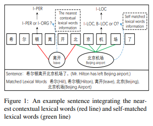
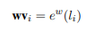

# CGN: Leverage Lexical Knowledge for Chinese Named Entity Recognition via Collaborative Graph Network（EMNLP2019）

> 作者：杨夕
> 
> 论文链接：[(https://www.aclweb.org/anthology/D19-1396.pdf](https://www.aclweb.org/anthology/D19-1396.pdf)
> 
> 代码链接：[Graph4CNER](https://github.com/DianboWork/Graph4CNER)
> 
> 【注：手机阅读可能图片打不开！！！】

## 摘要

The lack of word boundaries information has been seen as one of the main obstacles to develop a high performance Chinese named entity recognition (NER) system. Fortunately, the automatically constructed lexicon contains rich word boundaries information and word semantic information. However, integrating lexical knowledge in Chinese NER tasks still faces challenges when it comes to self-matched lexical words as well as the nearest contextual lexical words. We present a Collaborative Graph Network to solve these challenges. Experiments on various datasets show that our model not only outperforms the stateof-the-art (SOTA) results, but also achieves a speed that is six to fifteen times faster than that of the SOTA model.

**缺少单词边界信息**已被视为开发高性能中文命名实体识别（NER）系统的主要障碍之一。 幸运的是，自动构建的词典包含丰富的单词边界信息和单词语义信息。 然而，将词汇知识整合到中文NER任务中时，在自匹配词汇词以及最接近的上下文词汇词方面仍然面临挑战。 我们提出了一个协作图网络来解决这些挑战。 在各种数据集上进行的实验表明，我们的模型不仅超越了最新技术（SOTA）的结果，而且实现了比SOTA模型快6到15倍的速度。

 ## 动机

- 中文命名实体识别中，词边界 问题；

- 如何 引入 词边界信息：
  - pipeline：CWS -> NER 
    - 问题：误差传递
  - CWS 和 NER 联合学习
    - 问题：标注 CWS 数据
  - 利用 词典 自动构建
    - 优点：比 CWS 标注数据 更容易获得
    - 问题：
      - 第一个挑战是整合自我匹配的词汇词；
        - 举例：“北京机场” (Beijing Airport) and “机场” (Airport) are the self-matched words of the character “机” (airplane)
      - 第二个挑战是直接整合最接近的上下文词汇词；
        - 举例：by directly using the semantic knowledge of the nearest contextual words “离开” (leave), an “I-PER” tag can be predicted instead of an “I-ORG” tag, since “希尔顿” (Hilton Hotels) cannot be taken as the subject of the verb “离开” 
 
## 论文思路

- character-based Collaborative Graph：
  - encoding layer：
    - 句子信息：
      - s1：将 char 表示为 embedding;
        - 
      - s2：利用 biLSTM 捕获 上下文信息
          - 
    - lexical words 信息：
      - s1：将 lexical word 表示为 embedding;
        - 
    - 合并 contextual representation 和 word embeddings 
      - 
  - a graph layer：
    - Containing graph (C-graph):
      - 思路：字与字之间无连接，词与其inside的字之间有连接；
      - 目的：帮助 字符 捕获 self-matched lexical words 的边界和语义信息
    - Transition graph (T-graph):
      - 思路：相邻字符相连接，词与其前后字符连接；
      - 目的：帮助 字符 捕获 相邻 上下文 lexical 词 的 语义信息
    - Lattice graph (L-graph):
      - 思路：通相邻字符相连接，词与其开始结束字符相连；
      - 目的：融合 lexical knowledge
    - GAT:
      - 操作：针对三种图，使用Graph Attention Network(GAN)来进行编码。最终每个图的输出为
        - 
        - > 其中 $G_k$ 为第k个图的GAN表示，因为是基于字符级的序列标注，所以解码时只关注字符，因此从矩阵中取出前n行作为最终的图编码层的输出。
  - a fusion layer：
    - 目的：融合 三种 graphs 中不同 的 lexical 知识 
    - 
  - a decoding layer:
    - 操作：利用 CRF 解码
  - loss fun:
    - 

 

## 论文贡献

## 论文总结

## 参考

1. [[论文笔记]EMNLP2019: Leverage Lexical Knowledge for Chinese NER via Collaborative Graph Network](https://blog.csdn.net/carrie_0307/article/details/104986035)
2. [[[论文笔记]EMNLP2019: Leverage Lexical Knowledge for Chinese NER via Collaborative Graph Network](https://zhuanlan.zhihu.com/p/136277575)](https://zhuanlan.zhihu.com/p/136277575)