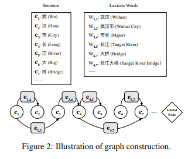
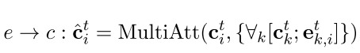
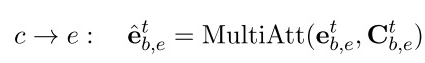
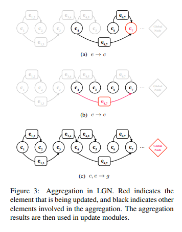
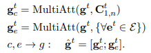
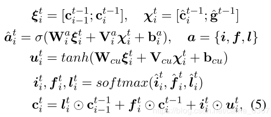
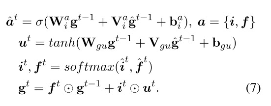

# 【关于 LGN 】那些你不知道的事 

> 作者：杨夕
> 
> 论文：LGN: A Lexicon-Based Graph Neural Network for Chinese NER(EMNLP2019)
> 
> 文章链接：https://gitee.com/km601/nlp_paper_study/tree/master/NER_study/DynamicArchitecture/EMNLP2019_LGN
> 
> 论文地址：http://qizhang.info/paper/emnlp-2019.ner.pdf
> 
> 代码地址：https://github.com/RowitZou/LGN

## 动机

- 在 char-base Chinese NER 中，同一个字符可能属于多个 lexicon word，存在 overlapping ambiguity 问题
  - 举例(如下图)
    - 字符[流] 可以 匹配词汇 [河流] 和 [流经] 两个词汇信息，但是 Lattice LSTM 只能利用 [河流]；
- Lattice LSTM这种RNN结构仅仅依靠前一步的信息输入，而不是利用全局信息
  - 举例
    - 字符 [度]只能看到前序信息，不能充分利用 [印度河] 信息，从而造成标注冲突问题
- Ma等人于2014年提出，想解决overlapping across strings的问题，需要引入「整个句子中的上下文」以及「来自高层的信息」；然而，现有的基于RNN的序列模型，不能让字符收到序列方向上 remain characters 的信息；

 

## 方法提出

- 论文提出一种 LGN 方法：
  - 图结构能够打破 RNN 序列结构的限制，使 character 和 lexicon word 间有更充分的联系；
  - 基于 lexicon word 将相关的字符连接起来，能够捕捉局部的构成信息；
  - 设计一个全局的中继节点来捕捉长距离依赖和高层次的特征信息；
  - LGN 将通过节点的"入边"和全局中继节点，对邻居节点进行聚合(正是由于这种多轮的聚合，使得全局上下文信息可以用来对模糊的词语进行区分)；

## Lexicon-Based Graph Neural Network

### Graph Construction and Aggregation

#### Graph Construction 

 

- 关于构图的示意如上图所示，主要包括以下要点：
  - 句子->有向图；
  - 每个字符被作为图中的一个节点, 在每个lexicon word的第一个和最后一个字符间构建一条边, 每条边代表了潜在的可能存在词语(即lexicon word)的特征；
  - 构建 全局的中继节点：该节点与图中的每个边和点都相连， 用来汇聚所有边和点的信息，从而消除词语之间的边界模糊；
  - 由于全局中继节点的存在，图中任意两个不邻接的节点之间都是彼此的二阶邻居，可以通过两次节点更新来接收彼此的非局部的信息；
  - 对以上的图结构进行转置得到一个所有边都反向后的反向图，将反向图与原图中得到的字符表示进行拼接，作为最终的字符表示；

#### Local Aggregation

##### 节点

- 令节点表示为 $c_i^t$, 该节点的入边集合为$E=\{e_{k,i}^t\}$, 则通过多头attn机制来聚合边$e_{k,i}$及其对应的前驱节点$c_k$;
  - 目的：入边和前驱节点能够有效地表明潜在word的边界信息
  
 

##### 边

- 令 $e_{b,e}^t$ 字符 $c_b^t$ 和 $c_e^t$ 之间的边, 同样通过多头attn机制进行对 $e_{b,e}^t$ 和 $c_b^t$ 到 $c_e^t$ 之间的字符进行聚合。

 

- 对于句子中的每个字符，通过LSTM得到其原始的节点表示；
- 对于lexicon words, 通过每个word的词向量来作为图中边的初始表示；node和edge的初始化表示平均后得到全局中继节点的初始化表示。

#### Global Aggregation

- 动机：捕获 长距离依赖 和 高层次的特征
- 通过全局节点对每条边和节点的表示进行聚合 （如下图）

 

 

- 经过这样多轮的信息交换后，
  - $\hat{g_t}$ 能够包含全局的特征信息;
  - $\hat{e_{b,e}^t}$包含了局部的字符信息;

### Recurrent-based Update Module

#### Node Update

 

#### Edge Update

 

#### Global Relay Node Update

 

### Decoding and Training

最后，图中节点的表示即每个字符的表示。通过CRF对字符对应标签进行解码。

