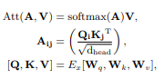
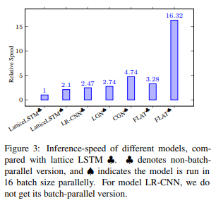

# 【关于 FLAT】 那些你不知道的事

> 作者：杨夕
> 
> 论文：FLAT: Chinese NER Using Flat-Lattice Transformer
> 
> 论文链接：[https://arxiv.org/pdf/2004.11795.pdf](https://arxiv.org/pdf/2004.11795.pdf)
> 
> 代码链接：[Flat-Lattice-Transformer](https://github.com/LeeSureman/Flat-Lattice-Transformer)
> 
> 【注：手机阅读可能图片打不开！！！】

## 摘要

Recently, the character-word lattice structure has been proved to be effective for Chinese named entity recognition (NER) by incorporating the word information.  （lattice 结构的有效）

However, since the lattice structure is complex and dynamic, most existing lattice-based models are hard to fully utilize the parallel computation of GPUs and usually have a low inference-speed.  （问题：计算资源未充分利用）

In this paper, we propose FLAT: Flat-LAttice Transformer for Chinese NER, which converts the lattice structure into a flat structure consisting of spans. Each span corresponds to a character or latent word and its position in the original lattice. （FLAT：将 lattice 结构转换为由span组成的平面结构，每个 span 对应一个字符或潜在单词及其在原始 lattice 中的位置。）

With the power of Transformer and well-designed position encoding, FLAT can fully leverage the lattice information and has an excellent parallelization ability. 

Experiments on four datasets show FLAT outperforms other lexicon-based models in performance and efficiency.

## 动机

### 1. Lattice structure

#### 介绍

利用词典匹配句子，以获得句子中潜在词，然后转化为如下图结构：

 

> 结构：有向图
> 节点：每个字符 或 潜在词

##### 问题

1. 不能获得句子顺序；
2. 词的第一个字符和最后一个字符决定其位置

###### 举例

如上图，“人和药店” 能够用于区分 地点实体“重庆”和组织实体“重庆人”

### 前期方法

- 方法一：设计一个动态框架，能够兼容词汇输入；
  - 代表模型： 
    - Lattice LSTM：利用额外的单词单元编码可能的单词，并利用注意力机制融合每个位置的变量节点

     

    - LR-CNN：采用不同窗口大小的卷积核来编码 潜在词
  - 问题：
    - RNN 和 CNN 难以解决长距离依赖问题，它对于 NER 是有用的，例如： coreference（共指）
    - 无法充分利用 GPU 的并行计算能力

- 方法二：将 Lattice 转化到图中并使用 GNN 进行编码：
  - 代表模型
    - Lexicon-based GN(LGN)
    - Collaborative GN(CGN)
  - 问题
    - 虽然顺序结构对于NER仍然很重要，并且 Graph 是一般的对应物，但它们之间的差距不可忽略;
    - 需要使用 LSTM 作为底层编码器，带有顺序感性偏置，使模型变得复杂。

## 方法简介

In this paper, we propose FLAT: Flat LAttice Transformer for Chinese NER. 

Transformer (Vaswani et al., 2017) adopts fully-connected self-attention to model the long-distance dependencies in a sequence.  (self-attention 解决长距离依赖问题)

To keep the position information, Transformer introduces the position representation for each token in the sequence. （位置编码信息的保存）

Inspired by the idea of position representation, we design an ingenious position encoding for the lattice-structure, as shown in Figure 1(c). 

 

In detail, we assign two positional indices for a token (character or word): 
- head position and tail position, by which we can reconstruct a lattice from a set of tokens. Thus, we can directly use Transformer to fully model the lattice input. （从一系列 tokens 中重建 lattice）
-  The self-attention mechanism of Transformer enables characters to directly interact with any potential word, including self-matched words. To a character, its self-matched words denote words which include it. （Transformer 的 self-attention 机制使 characters 可以直接与任何可能的单词（包括自匹配单词）进行交互。 对于一个字符，它的自匹配单词表示包括该单词本身。）

将Lattice结构展平，将其从一个有向无环图展平为一个平面的Flat-Lattice Transformer结构，由多个span构成：每个字符的head和tail是相同的，每个词汇的head和tail是skipped的。

  
For example, in Figure 1(a), self-matched words of “药 (Drug)” are “人和药 店(Renhe Pharmacy)” and “药店 (Pharmacy)”(Sui et al., 2019). Experimental results show our model outperforms other lexicon-based methods on the performance and inference-speed.

## Model 介绍

### 3.1 Converting Lattice into Flat Structure

1. 利用 词典从句子中获取 lattice；
2. flat-lattice : 定义一系列的 spans，每个 spans 对应 token（词 or 字符）、头字符位置、尾字符位置

### 3.2 Relative Position Encoding of Spans

- 问题：flat-lattice 结构包含不同长度的 spans;
- 解决方法：spans 的关系位置编码
  - 对于在lattice中的 spans $x_i$ 和 $x_j$ 存在三种关系：
    - intersection
    - inclusion and separation (包容和分离)
    - determined by their heads and tails (由他们的头和尾确定)
  - 使用一个 dense vector 对这些关系建模，他通过继续转换 head 和 tail 信息进行计算；
    - 优点
      - 能够表示两个 token 间关系；
      - 表示更多详细信息；
    - 举例
      - 例如 一个词和字符间的距离
      - 对于 span $x_i$ 的开始位置 $head[i]$ 和结束位置$tail[i$
      - 四种类型相对距离 可以用于 表示 $x_i$和$x_j$间的关系：

       

    > $d^{(ht)}_{ij}$表示 $x_i$ 的 head 和$x_j$的 head 的距离,以此类推
  - spans 的最后位置编码是这四个距离的简单的非线性转换：

     

    > $W_r$ 可学习参数，$⊕$为连接计算符，$p_d$ 通过以下方式计算：

     

    > $d$ 就是 $d^{(hh)}_{ij}$、$d^{(ht)}_{ij}$、$d^{(th)}_{ij}$ 和 $d^{(tt)}_{ij}$
    > $k$ 表示位置编码的维度索引
  - 利用 variant of self-attention (Dai et al., 2019) leverage 的相对span位置编码：
  
   

  - 利用 vanilla Transformer 计算：

    

  - 利用 CRF 作为输出层

## 实验分析

### 数据集选取

### 效果对比

### FLAT 优势

相比 lattice LSTM 优点：

1. All characters can directly interact with its self-matched words；
2. Long-distance dependencies can be fully modeled

## 结论

In this paper, we introduce a flat-lattice Transformer to incorporate lexicon information for Chinese NER. The core of our model is converting lattice structure into a set of spans and introducing the specific position encoding. Experimental results show our model outperforms other lexiconbased models in the performance and efficiency. We leave adjusting our model to different kinds of lattice or graph as our future work. 

## 参考资料

1. [FLAT: Chinese NER Using Flat-Lattice Transformer](https://zhuanlan.zhihu.com/p/142927260)
