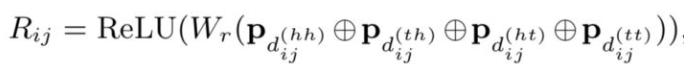

#### 4.3.2 Dynamic Architecture 范式

> Dynamic Architecture范式通常需要设计相应结构以融入词汇信息。

##### [1] [Lattice LSTM：Chinese NER Using Lattice LSTM（ACL2018）](https://arxiv.org/abs/1805.02023) 

###### 方法介绍

本文是基于词汇增强方法的中文NER的开篇之作，提出了一种Lattice LSTM以融合词汇信息。

具体地，当我们通过词汇信息（词典）匹配一个句子时，可以获得一个类似Lattice的结构。

Lattice是一个有向无环图，词汇的开始和结束字符决定了其位置。Lattice LSTM结构则融合了词汇信息到原生的LSTM中：

如上图所示，Lattice LSTM引入了一个word cell结构，对于当前的字符，融合以该字符结束的所有word信息，如对于「桥」融合了「长江大桥」和「大桥」的信息。对于每一个字符，Lattice LSTM采取注意力机制去融合个数可变的word cell单元，其主要的数学形式化表达为：

本文不再堆砌繁杂的数学公式，具体看参考原论文。需要指出的是，当前字符有词汇融入时，则采取上述公式进行计算；如当前字符没有词汇时，则采取原生的LSTM进行计算。当有词汇信息时，Lattice LSTM并没有利用前一时刻的记忆向量 $c^c_{j-1}$，即不保留对词汇信息的持续记忆。

###### 存在问题

Lattice LSTM 的提出，将词汇信息引入，有效提升了NER性能；但其也存在一些缺点：

- 计算性能低下，不能batch并行化。究其原因主要是每个字符之间的增加word cell（看作节点）数目不一致；
- 信息损失：
  - 1）每个字符只能获取以它为结尾的词汇信息，对于其之前的词汇信息也没有持续记忆。如对于「大」，并无法获得‘inside’的「长江大桥」信息。
  - 2）由于RNN特性，采取BiLSTM时其前向和后向的词汇信息不能共享。
- 可迁移性差：只适配于LSTM，不具备向其他网络迁移的特性。

##### [2] [LR-CNN:CNN-Based Chinese NER with Lexicon Rethinking(IJCAI2019)](https://pdfs.semanticscholar.org/1698/d96c6fffee9ec969e07a58bab62cb4836614.pdf)

###### 动机

Lattice LSTM 存在问题：
- 采取RNN结构，导致其**不能充分利用GPU进行并行化**；
- Lattice LSTM **无法有效处理词汇信息冲突问题**

如上图所示：字符 [长] 可以匹配到词汇 [市长] 和 [长隆]，不同的匹配会导致 [长] 得到不同的标签，而对于 RNN 结构：仅仅依靠前一步的信息输入、而不是利用全局信息，无法有效处理这一冲突问题。显而易见，对于中文NER，这种冲突问题很常见，在不参考整个句子上下文和高层信息的前提下很难有效解决。

###### 思路

本篇论文LR-CNN为解决这一问题，提出了Lexicon-Based CNNs和Refining Networks with Lexicon Rethinking。

- Lexicon-Based CNNs：采取CNN对字符特征进行编码，感受野大小为2提取bi-gram特征，堆叠多层获得multi-gram信息；同时采取注意力机制融入词汇信息（word embed）；
- Refining Networks with Lexicon Rethinking：由于上述提到的词汇信息冲突问题，**LR-CNN采取rethinking机制增加feedback layer来调整词汇信息的权值**：具体地，将高层特征作为输入通过注意力模块调节每一层词汇特征分布。如上图，高层特征得到的 [广州市] 和 [长隆]会降低 [市长] 在输出特征中的权重分布。最终对每一个字符位置提取对应的调整词汇信息分布后的multi-gram特征，喂入CRF中解码。

###### 优缺点

- 优点
  - LR-CNN最终相比于Lattice LSTM加速3.21倍

- 缺点
  - LR-CNN仍然计算复杂；
  - 不具备可迁移性

##### [3] [CGN: Leverage Lexical Knowledge for Chinese Named Entity Recognition via Collaborative Graph Network（ EMNLP2019）](https://www.aclweb.org/anthology/D19-1396.pdf)

###### 动机

由于Lattice LSTM存在信息损失，特别是无法获得‘inside’的词汇信息。

###### 思路

针对这一问题，本篇论文构建了基于协作的图网络，由编码层、图网络层、融合层、解码层组成。在图网络层，构建了三种不同的建图方式：

- Word-Character Containing graph (C-graph)：字与字之间无连接，词与其inside的字之间有连接。
- Word-Character Transition graph(T-graph)：相邻字符相连接，词与其前后字符连接。
- Word-Character Lattice graph(L-graph)：相邻字符相连接，词与其开始结束字符相连。

图网络层通过Graph Attention Network(GAN)进行特征提取，提取3种图网络中的前n个字符节点的特征：

特征融合则将基于字符的上下文表征H与图网络表征加权融合：

涉及GAN的相关计算公式可参考原论文。

##### [4] [LGN: A Lexicon-Based Graph Neural Network for Chinese NER(EMNLP2019)](https://www.aclweb.org/anthology/D19-1096.pdf)

###### 动机

本篇论文与LR-CNN出发点类似，**Lattice LSTM这种RNN结构仅仅依靠前一步的信息输入，而不是利用全局信息**，如上图所示：字符 [流]可以匹配到词汇 [河流] 和 [流经]两个词汇信息，但Lattice LSTM却只能利用 [河流] ；字符 [度]只能看到前序信息，不能充分利用 [印度河] 信息，从而造成标注冲突问题。

###### 思路

本篇论文通过采取 lexicon-based graph neural network (LGN)来解决上述问题。如上图所示，将每一个字符作为节点，匹配到的词汇信息构成边。通过图结构实现局部信息的聚合，并增加全局节点进行全局信息融入。聚合方式采取Multi-Head Attention，具体计算公式可参考原论文。

##### [5] [FLAT: Chinese NER Using Flat-Lattice Transformer（ACL2020）](https://arxiv.org/pdf/2004.11795.pdf)

###### 动机

1. 动机一：Lattice-LSTM 和 LR-CNN 问题
   1. 这些模型采取的RNN和CNN结构无法捕捉长距离依赖；
   2. 动态的Lattice结构也不能充分进行GPU并行；
2. 动机二：CGN 和 LGN 问题
   1. 采取的图网络虽然可以捕捉对于NER任务至关重要的顺序结构，但这两者之间的gap是不可忽略的；
   2. 这类图网络通常需要RNN作为底层编码器来捕捉顺序性，通常需要复杂的模型结构

###### 思路

众所周知，Transformer采取全连接的自注意力机制可以很好捕捉长距离依赖，由于自注意力机制对位置是无偏的，因此Transformer引入位置向量来保持位置信息。受到位置向量表征的启发，这篇论文提出的FLAT设计了一种巧妙position encoding来融合Lattice 结构，具体地，如上图所示，对于每一个字符和词汇都构建两个head position encoding 和 tail position encoding，可以证明，这种方式可以重构原有的Lattice结构。也正是由于此，FLAT可以直接建模字符与所有匹配的词汇信息间的交互，例如，字符[药]可以匹配词汇[人和药店]和[药店]。

因此，我们可以将Lattice结构展平，将其从一个有向无环图展平为一个平面的Flat-Lattice Transformer结构，由多个span构成：每个字符的head和tail是相同的，每个词汇的head和tail是skipped的。

在知乎专栏文章《[如何解决Transformer在NER任务中效果不佳的问题？](https://zhuanlan.zhihu.com/p/137315695)》，我们介绍了对于Tranformer结构，绝对位置编码并不适用于NER任务。因此，FLAT这篇论文采取XLNet论文中提出相对位置编码计算attention score：

论文提出四种相对距离表示 $x_i$ 和 $x_j$ 之间的关系，同时也考虑字符和词汇之间的关系：

$d^{(hh)}_{ij}$ 表示 $x_i$ 的head到 $x_j$ 的head距离，其余类似。相对位置encoding为：

$p_d$的计算方式与vanilla Transformer相同。

综上，FLAT采取这种全连接自注意力结构，可以直接字符与其所匹配词汇间的交互，同时捕捉长距离依赖。如果将字符与词汇间的attention进行masked，性能下降明显，可见引入词汇信息对于中文NER 的重要性。此外，相关实验表明，FLAT有效的原因是：新的相对位置encoding有利于定位实体span，而引入词汇的word embedding有利于实体type的分类。

