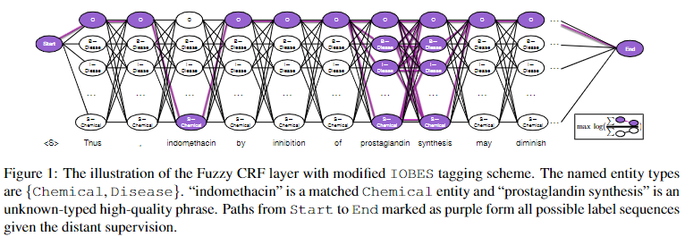
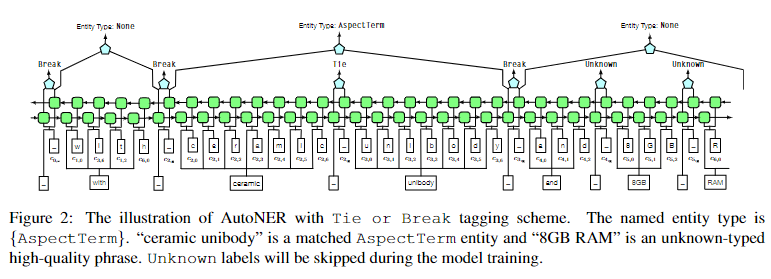
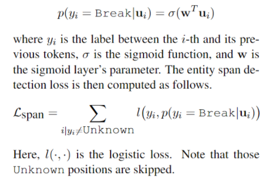
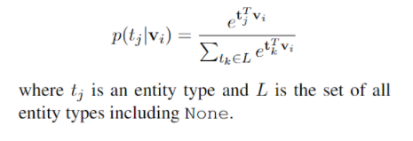
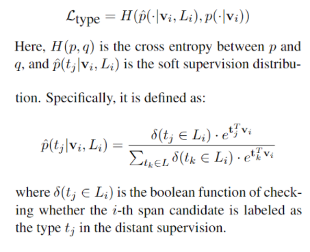

# 【关于 AutoNER】 那些你不知道的事

> 作者：杨夕
> 
> 论文名称：Learning Named Entity Tagger using Domain-Specific Dictionary
> 
> 会议：EMNLP2018
> 
> 论文地址：https://arxiv.org/abs/1809.03599
> 
> 项目地址：https://github.com/shangjingbo1226/AutoNER
> 
> 个人介绍：大佬们好，我叫杨夕，该项目主要是本人在研读顶会论文和复现经典论文过程中，所见、所思、所想、所闻，可能存在一些理解错误，希望大佬们多多指正。
> 
> NLP 论文读书笔记地址：https://github.com/km1994/nlp_paper_study
> 
> NLP 面经地址：https://github.com/km1994/NLP-Interview-Notes
> 
> 推荐系统 面经地址：https://github.com/km1994/RES-Interview-Notes

> **关注公众号 【关于NLP那些你不知道的事】 加入 【NLP && 推荐学习群】一起学习！！！**

## 一、前言

- 论文动机：
  - 基于机器学习的命名实体识别方法：需要 手工标注特征；
  - 基于深度学习的命名实体识别方法：需要大量标准数据；
  - 远程监督（结合外部词典）标注数据：生成的嘈杂标签对学习
- 论文方法：提出了两种神经模型，以适应字典中嘈杂的远程监督：
  - 首先，在传统的序列标记框架下，我们提出了一个修改后的模糊 CRF 层来处理具有多个可能标签的标记。
  - 在确定远程监督中嘈杂标签的性质后，我们超越了传统框架，提出了一种新颖、更有效的神经模型 AutoNER，该模型具有新的 Tie or Break 方案。
  - 讨论了如何改进远程监督以获得更好的 NER 性能。
- 实验结果：在三个基准数据集上进行的大量实验表明，仅使用字典而不需要额外的人力时，AutoNER 实现了最佳性能，并通过最先进的监督基准提供了具有竞争力的结果。

## 二、论文动机

- 基于机器学习的命名实体识别方法：需要 手工标注特征；
- 基于深度学习的命名实体识别方法：需要大量标准数据；
- 远程监督（结合外部词典）标注数据：
  - 方法：通常通过启发式匹配规则来解决实体文段检测entity span detection 问题
  - 存在问题：
    - 词典覆盖不全问题：由于大多数现有词典对实体的覆盖范围有限，因此简单地忽略不匹配的标记可能会引入假阴性的labels；（例如，图1中的“前列腺素合成”）
    - 多标签问题：相同实体对应多个类别的情况(缺少上下文)，或是遇到词表中不存在的类别；


> 注：图 1：带有修改后的 IOBEStaging 方案的模糊 CRF 层的图示。命名实体类型是{Chemical,Disease}。 “吲哚美辛”是匹配的化学物质，“前列腺素合成”是一个未知类型的高质量短语。路径从开始到结束标记为紫色形成所有可能的标签序列给定远程监督

- 传统 CRF 无法做 多标签分类问题

## 三、论文方法

### 3.1 Fuzzy-LSTM-CRF with Modified IOBES

#### 3.1.1 动机

传统 CRF 无法做 多标签分类问题。**CRF层能够 捕获 输出标签 之间的依赖性dependency between labels**。但是，**原始方案和常规CRF层都不能处理多类型或未知类型的tokentokens**。

#### 3.1.2 Modified IOBES

- 方法：采用Distant-supervision方法进行标注，即预先收集需要识别的实体词典库，采用词匹配的方法，在待处理文本中将词典中匹配到的实体标记出来
- 标注方法如下:
  - token 被标记为一种以上类型。这个token用所有这些types和 {I,B,E,S} 中的一种;
  - 类型未知的token，即词典中未出现的词。属于词典中的高质量短语 high quality phrase。{I,B,E,S,O} 所有五个都有可能，同时，分配了所有可用的类型。例如，如果只有两个可用types Chemical和Disease，则总共有2*4+1=9中labels ，但要注意 {I,B,E,S,O} 的标注顺序，比如B的后面不能再跟一个B
  - 对于标记为非实体的token，其标记 {O}

```s
  送     货     速     度     不 错 ，而 且 价    格     也 很 便 宜
  B-包装 I-包装 I-包装 E-包装 O  O  O  O O B-价格 E-价格 O  O  O  O
  B-物流 I-物流 I-物流 E-包装 O  O  O  O O B-价格 E-价格 O  O  O  O
  B-价格 I-价格 I-价格 E-包装 O  O  O  O O B-价格 E-价格 O  O  O  O
  0      0      0      0     0  0  0  0 0 B-价格 E-价格 O  O  O  O
```


#### 3.1.3 Fuzzy-LSTM-CRF

- 动机：传统的CRF层将唯一有效标签序列 only valid label sequence的可能性最大化，只需要最大化一条标注路径的概率即可，
- 方法：修改的IOBES方案中，一个句子可能具有多个有效的标签序列，由于存在多条路径，那么我们就需要同时最大化所有路径的概率
- 优化函数：枚举IOBES标签和所有匹配的实体类型，Objective是最大化所有可能的标签序列的总概率。


- 如何获取 高质量短语 high quality phrase？
  - 方法：
    - 利用 [AutoPhrase](https://arxiv.org/abs/1702.04457) 挖掘 语料中 ulabeled语料和短语词典；
    - 设置阈值，以筛选出 高质量的短语；
    - 对于挖掘出来的 高质量的短语 ，如果没在词典中出现过，我们就把它加入单独的一个“unknown”词典。

### 3.2 AutoNER with “Tie or Break”

#### 3.2.1 Tie or Break

- 动机：虽然使用fuzzy CRF可以处理一个实体对应多个类型的问题，但是仍然没有对远程监督带来的噪声问题进行处理
- 方法：“Tie or Break” Tagging Scheme
- 对于每两个相邻的tokens，它们之间的连接标记为：
  - Tie： 当两个token与同一实体匹配时，属于同一个实体mention即前后两个token构成一个实体mention
  - Unknown: if at least one of the tokens belongs to an unknown-typed high-quality phrase;
  - 否则为 Break


> 注：distant-supervision指出“ceramic unibody”匹配到了AspectTerm词典，8GB RAM是一个unknown高质量短语。因此ceramic unibody之间就被标记为Tie，短语8GB RAM的前后和中间就标记为Unknown。两个连续的Break标记之间的tokens就形成了一个span，每一个span都将被打上标签集中的所有匹配上的标签（词典匹配）。如果没有匹配到实体类型，我们就将其标记为None

- 举例说明：

假设“北京”在词典中的位置类中出现，那么“国立北京大学”在IOBES方案中真实的字标签序列和远程监督得到的字标签序列完全不一致。

```s
                   国    立    北    京    大    学
真实的字标签序列： B-LOC I-LOC I-LOC I-LOC I-LOC E-LOC
远程监督得到的：   O     O     B-LOC E-LOC O     O
```

因此，使用IOBES方案，词典中的“北京”对于“国立北京大学”就完全没有了作用，但其实词典中的“北京”还是有一些信息。因此，文章提出了Tie or Break方案，Tie表示当前词和上一个词在同一个实体内，Break表示当前词和上一个词不再同一个实体内。

```s
                   国    立    北    京    大    学
真实的字标签序列： Break Tie   Tie   Tie   Tie   Tie
远程监督得到的：   Break Break Break Tie   Break Break
```

如上面的例子所示，字标签起码没有全错。而实体类型，则与边界信息分开预测。于是在此方案下，一个句子有如下标注，其中B表示Break，T表示Tie，U表示Unknown，N表示None。

```s
句子： 我 觉 得 送 货 速 度 不 错 ， 而 且 价 格 也 很 便 宜
span:  B  B  B U  U  U  U  U  B B  B  B  B  T B  B  B  B
type:  N  N  N N  N  N  N  N  N N  N  N  价 价 N  N  N  N
```

> 注意，在预测span序列时，只预测是tie还是break，在计算损失时，忽略真实为Unknown的token。而在计算type损失的时候，包括了序列中所有的token。这部分不是文章的重点就不展开了。

需要注意的是，在span和type的预测中，没有使用CRF。

#### 3.2.2 AutoNER

实体span和type分两步编码，将实体span检测和实体类型预测分为两步执行。

1. 第一步：entity span detection：
   1. 在预测span序列时，只预测是tie还是break;
      1. 在计算损失时，忽略真实为Unknown的token;
      2. 在计算type损失的时候，包括了序列中所有的token。构
      3. 建一个二元分类器，输出类别为Break和Tie；
   2. 如果预标注是Unknown类型则直接跳过。在第i个token和它的前一个token间，将BiLSTM 的输出串联得到一个新的特征向量 ui ，被输入一个 sigmoid 层，估计这里是一个 Break 的概率



2. 第二步：entity types： BiLSTM的输出将 re-aligned 以形成一个新的特征向量 vi , for  ith span candidate。 vi 会被输入softmax layer，输出 vi 在每个实体类别上的概率，估计entity type分布为



由于 one span 可以被标记为多种类型，我们将 possible set of types for ith entity span candidate 的可能类型标记为 Li，第i个span 的 候选实体类型集



因为无明确的监督信息，因此采用，可能type集合内的概率分布作为监督信息，使得概率主要分配在可能的type集合上而不是整个type集中

AutoNER 没有 CRF 层和 Viterbi 解码，则在 inference 时更加高效


## 参考

1. [AutoNER: 在没有标记数据时，使用词典进行命名实体识别](https://zhuanlan.zhihu.com/p/99409904)
2. [Learning Named Entity Tagger using Domain-Specific Dictionary——AutoNER](https://jasonguojz.github.io/blog/2020/07/18/Learning%20Named%20Entity%20Tagger%20using%20Domain-Specific%20Dictionary/)
3. [论文笔记：Learning Named Entity Tagger using Domain-Specific Dictionary](http://www.noobyard.com/article/p-qspgsdrd-sr.html)


