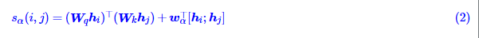
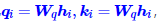
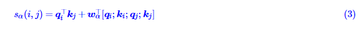

# 【关于 命名实体识别 之 Efficient GlobalPointer 】 那些你不知道的事

> 作者：杨夕
> 
> 项目地址：https://github.com/km1994/nlp_paper_study
> 
> 博客：【[Efficient GlobalPointer：少点参数，多点效果](https://kexue.fm/archives/8877)】
> 
> 代码：https://github.com/bojone/GlobalPointer
> 
> 个人介绍：大佬们好，我叫杨夕，该项目主要是本人在研读顶会论文和复现经典论文过程中，所见、所思、所想、所闻，可能存在一些理解错误，希望大佬们多多指正。

## 一、引言

**GlobalPointer是基于内积的token-pair识别模块，它可以用于NER场景，因为对于NER来说我们只需要把每一类实体的“(首, 尾)”这样的token-pair识别出来就行了。**

当它用于NER时，能统一处理嵌套和非嵌套任务，并在非嵌套场景有着比CRF更快的速度和不逊色于CRF的效果。换言之，就目前的实验结果来看，至少在NER场景，我们可以放心地将CRF替换为GlobalPointer，而不用担心效果和速度上的损失。

- 存在问题：原GlobalPointer参数利用率不高

## 二、解决方法——识别与分类

事实上，不难想象对于任意类型α，其打分矩阵sα(i,j)必然有很多相似之处，因为**对于大多数token-pair而言，它们代表的都是“非实体”，这些非实体的正确打分都是负的。这也就意味着，我们没必要为每种实体类型都设计独立的sα(i,j)，它们应当包含更多的共性**。

怎么突出sα(i,j)的共性呢？以NER为例，我们知道NER实际上可以**分解为“抽取”和“分类”**两个步骤，**“抽取”就是抽取出为实体的片段，“分类”则是确定每个实体的类型**。

这样一来，“抽取”这一步相当于只有一种实体类型的NER，我们可以用一个打分矩阵就可以完成，即 $(W_q h_i)^⊤ (W_k h_j)$ ，而“分类”这一步，我们则可以用“特征拼接+Dense层”来完成，即w^⊤_α[hi;hj]。于是我们可以将两项组合起来，作为新的打分函数：

这样一来，“抽取”这部分的参数对所有实体类型都是共享的，因此每新增一种实体类型，我们只需要新增对应的wα∈R^{2D}就行了，即新增一种实体类型增加的参数量也只是2D。进一步地，我们记

然后为了进一步地减少参数量，我们可以用[qi;ki]来代替hi，此时

此时wα∈R4d，因此每新增一种实体类型所增加的参数量为4d，由于通常d≪D，所以式(3)的参数量往往少于式(2)，它就是Efficient GlobalPointer最终所用的打分函数。

## 参考

1. [Efficient GlobalPointer：少点参数，多点效果](https://kexue.fm/archives/8877)
