# 【关于 Few-Shot Named Entity Recognition】 那些你不知道的事

> 作者：杨夕
> 
> 论文名称：Few-Shot Named Entity Recognition: A Comprehensive Study
> 
> 论文地址：https://arxiv.org/pdf/2012.14978.pdf
> 
> 阅读【[微软、UIUC韩家炜组联合出品：少样本NER最新综述](https://mp.weixin.qq.com/s?__biz=MzIwMTc4ODE0Mw==&mid=2247549628&idx=2&sn=f24f40a5d0b524da41ca6963af26d492&chksm=96eadd3ca19d542a48bce057dd52a87fec7e0d79df287f47ffb688d81d77a537f1dee16f2300&mpshare=1&scene=22&srcid=1130EFKG5OOnrNvTsVWlwdoE&sharer_sharetime=1638233071176&sharer_shareid=da84f0d2d31380d783922b9e26cacfe2#rd)】后，写下的读书笔记
> 
> NLP论文学习笔记：https://github.com/km1994/nlp_paper_study
> 
> **[手机版NLP论文学习笔记](https://mp.weixin.qq.com/s?__biz=MzAxMTU5Njg4NQ==&mid=100005719&idx=1&sn=14d34d70a7e7cbf9700f804cca5be2d0&chksm=1bbff26d2cc87b7b9d2ed12c8d280cd737e270cd82c8850f7ca2ee44ec8883873ff5e9904e7e&scene=18#wechat_redirect)**
> 
> 个人介绍：大佬们好，我叫杨夕，该项目主要是本人在研读顶会论文和复现经典论文过程中，所见、所思、所想、所闻，可能存在一些理解错误，希望大佬们多多指正。
> 
> NLP 百面百搭 地址：https://github.com/km1994/NLP-Interview-Notes
> 
> **[手机版NLP百面百搭](https://mp.weixin.qq.com/s?__biz=MzAxMTU5Njg4NQ==&mid=100005719&idx=3&sn=5d8e62993e5ecd4582703684c0d12e44&chksm=1bbff26d2cc87b7bf2504a8a4cafc60919d722b6e9acbcee81a626924d80f53a49301df9bd97&scene=18#wechat_redirect)**
> 
> 推荐系统 百面百搭 地址：https://github.com/km1994/RES-Interview-Notes
> 
> **[手机版推荐系统百面百搭](https://mp.weixin.qq.com/s/b_KBT6rUw09cLGRHV_EUtw)**

## 一、引言

机器学习和深度学习模型 普遍流行，而且性能 依赖 标注数据量的 规模。但是**在带 label 的训练样本很少或很难获取的情况下，直接训练模型通常不会有很好的泛化能力，反而容易造成模型对样本过拟合以及对目标任务欠拟合**。针对这几个问题少样本学习（few shot learning）应运而生，少样本学习指的是在 NLP 任务中只使用少量的标记样本训练模型，使得模型可以有效的学习小样本中的信息。本文针对 NER 领域中的 few shot learning 做了一个综述。

## 二、NER 研究背景

### 2.1 什么是 命名实体识别？

命名实体识别任务可以看做是一个序列标注任务，输入输出分别是如下形式：

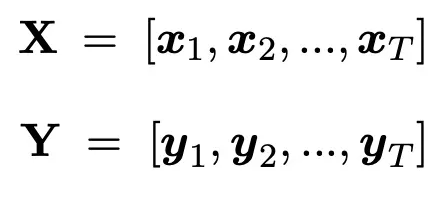

> 其中输入 X 是长度为 T 个 tokens 的文本，输出 Y 是长度为 T 个 tokens 的标签。整个带有标签的训练集合可以表示为如下形式：

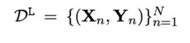

> 其中 N 表示的是该集合中样本的个数。

### 2.2 命名实体识别 常用方法？

在 NER 领域中常用的基于预训练模型的 Pipeline 方法是将预训练模型作为特征提取器，在预训练模型之后直接添加一层 Linear 和 Softmax，训练的时候调整 Linear 的参数，预训练模型的参数可以选择训练也可以选择保持不变。具体模型图如下：

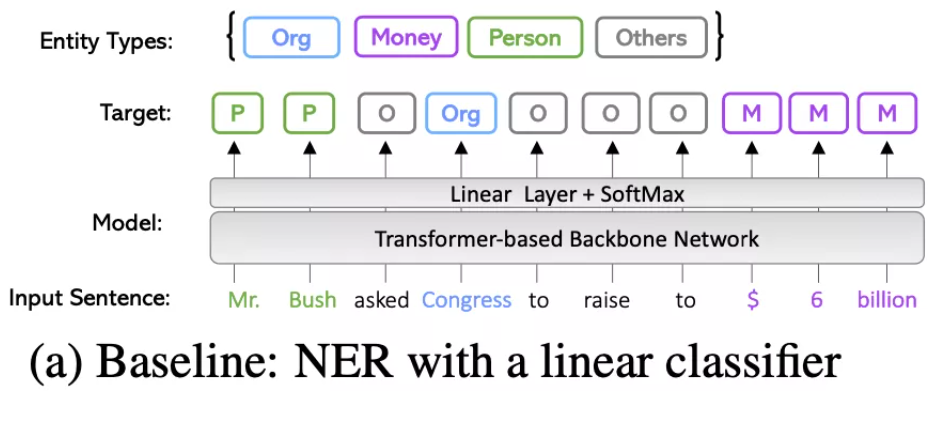

## 三、Few-shot NER 三个问题

### 3.1 利用 远程监督方法 构建 NER 标注数据 存在的问题

- 远程监督方法获取到的样本会存在很多噪声；
- 无法保证远程监督标注的领域完全适应以及词表的完整性，也就是会有实体 OOV 的问题。
 
因此将 Few-shot 方法应用 NER 也是一个很值得研究的方向。

### 3.2 将 few shot learning 应用于 NER 领域中需要面临的三个核心问题

1. How to adapt meta-learning such as prototype-based methods for few-shot NER? （如何将元学习方法作为 prototype-based 的方法应用到 few-shot NER 领域中？）
2. How to leverage freely-available web data as noisy supervised pre-training data?（如何利用大量免费可用的网页数据构造出 noisy supervised 方法中的预训练数据？）
3. How to leverage unlabeled in-domain sentences in a semi-supervised manner?（如何在半监督的范式中利用好 in-domain 的无标注数据？）

## 四、Prototype Methods

- 介绍：基于 meta-learning 方法的 few-shot 方法（**meta-learning 的核心思想**：让模型在多个具有大量标注数据的任务上学习，从而具备泛化到某个只有少量标注数据的任务上）
- 思路：

1. 定义两个集合 S 和 Q：

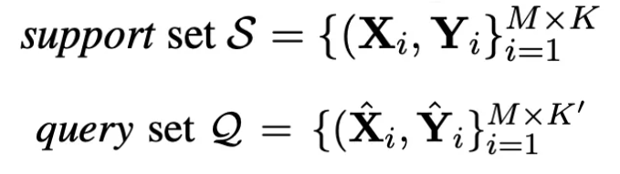

> Support set（M 个 entity types, 每个 entity types 有 K/K' 个 sentence）

2. **prototypes：在与单个 token 相同的表示空间中将 entity type 表示为向量**。（也就是把 label 映射为对应 的向量，向量的构造方法是将所有属于该类别的 token 向量求和平均。）

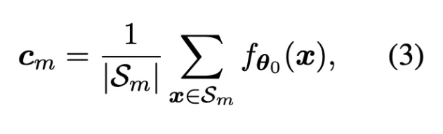

3. 对于一个新输入的 token 来说，将其输入模型后得到的输出和所有 prototypes 进行距离计算：

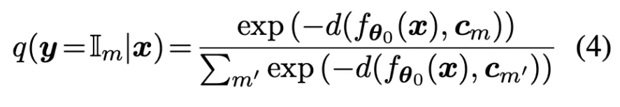

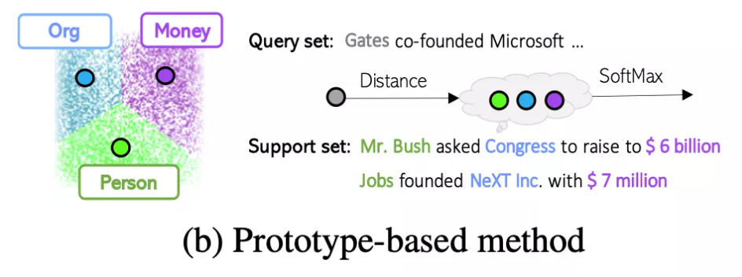

4. 训练过程中 support set 中的 entity type 会通过采样不断迭代变化;

5. infer过程中 则是对新的 token 使用最近邻（NN）算法计算最接近的那个类别。

- 存在问题：
  - [1] 在 few shot 的 NER 上探索了原型网络（prototypical network），但是 [1] 只使用了 RNN 作为主干模型，没有利用基于 Transformer 的体系结构的模型来对文本进行表示。因此可能该方法可能并没有将原型网络的效果发挥出来。
  - 本文的工作类似于 [2] [3]，他们都使用 KNN 来分配实体类型，但不同之处在于他们是将最近的 K 个邻居与每个个体 token 进行比较，而本文则是通过原型（prototype）来进行比较。因此，当给定示例的数量增加时，本文的方法更 scalable。

## 五、Noisy Supervised Pretraining

### 5.1 动机

通过预训练模型可以用于获取每个句子甚至每个 token 的 embedding 表示。但**这些表示有个特点就是他们对于所有下游任务都是不可知的**，也就是说预训练模型在预训练过程中对待每个 token 都是一致的。但是很多下游任务中，对某些特定的 token 需要有特别的处理。

> eg：在 NER 任务中，对于“Mr. Bush asked Congress to raise to $ 6 billion”这句话，模型需要能够辨认出“Congress”是一个 entity，而“to”只是一个普通的 token。

**如何能让预训练模型具备这种识别实体的能力呢？**

### 5.2 方法

- 方法：利用**大规模带噪声的网页数据（WiNER）来进行噪声监督预训练（noisy supervised pre-training）**的方法
- 思路：在 WiNER 中，包含着相较于下游任务更为丰富的实体类型，比如“Musician”和“Artist”通常表示的是两种不同的实体类型，而在常见的 NER 评测标准中二者都被归类为“Person”类型。
- 优点：使用大规模带噪声的数据预训练模型时，模型既可以学到区分实体的能力，又不会学到和下游任务完全一致的信息导致模型过拟合

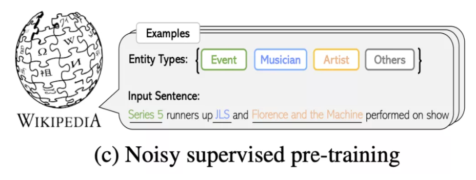

## 六、Self-Training

- 类型：半监督学习方法
- 特点：利用到了大量无标注数据和少量标注数据
- 思路：

1. 先通过标注数据学习一个 teacher 模型；
2. 通过 teacher 模型给无标注数据进行标注 soft 标签；

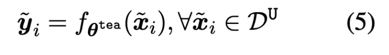

3. 使用标注数据和具有 soft 标签的数据训练 student 模型

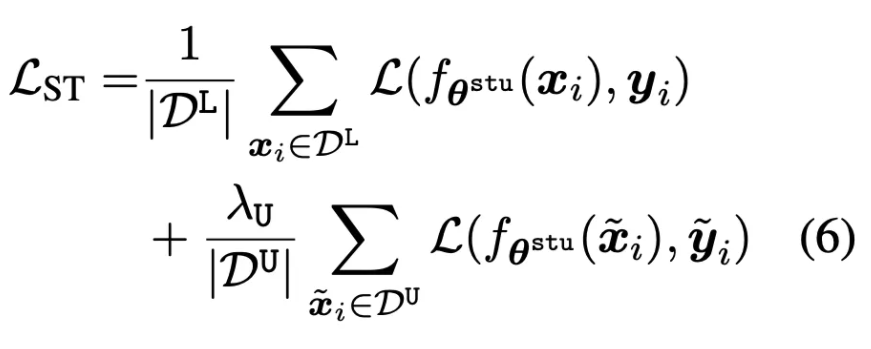

- 流程

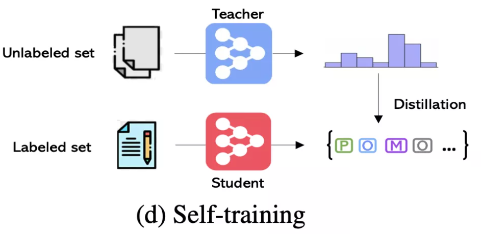

## 参考

1. [微软、UIUC韩家炜组联合出品：少样本NER最新综述](https://mp.weixin.qq.com/s?__biz=MzIwMTc4ODE0Mw==&mid=2247549628&idx=2&sn=f24f40a5d0b524da41ca6963af26d492&chksm=96eadd3ca19d542a48bce057dd52a87fec7e0d79df287f47ffb688d81d77a537f1dee16f2300&mpshare=1&scene=22&srcid=1130EFKG5OOnrNvTsVWlwdoE&sharer_sharetime=1638233071176&sharer_shareid=da84f0d2d31380d783922b9e26cacfe2#rd)

