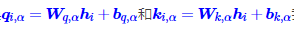
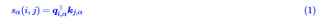
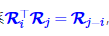
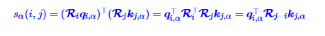
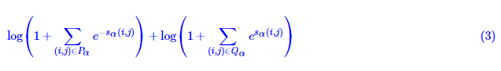
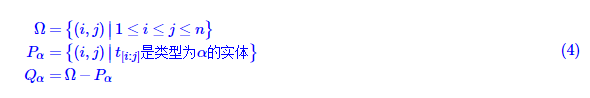

# 【关于 命名实体识别 之 GlobalPointer 】 那些你不知道的事

> 作者：杨夕
> 
> 项目地址：https://github.com/km1994/nlp_paper_study
> 
> 博客：【[GlobalPointer：用统一的方式处理嵌套和非嵌套NER](https://spaces.ac.cn/archives/8373)】
> 
> 代码：https://github.com/bojone/GlobalPointer
> 
> 个人介绍：大佬们好，我叫杨夕，该项目主要是本人在研读顶会论文和复现经典论文过程中，所见、所思、所想、所闻，可能存在一些理解错误，希望大佬们多多指正。

## 一、前言

本文将介绍一个称为GlobalPointer的设计，它利用**全局归一化**的思路来进行命名实体识别（NER），可以无差别地识别嵌套实体和非嵌套实体，在非嵌套（Flat NER）的情形下它能取得媲美CRF的效果，而在嵌套（Nested NER）情形它也有不错的效果。还有，在理论上，GlobalPointer的设计思想就比CRF更合理；而在实践上，它训练的时候不需要像CRF那样递归计算分母，预测的时候也不需要动态规划，是完全并行的，理想情况下时间复杂度是 O(1)。

## 二、 动机

### 2.1 Pointer Network

- 设计思路：在做实体识别或者阅读理解时，一般是用两个模块分别识别实体的首和尾；
- 存在问题：出现 训练和预测时的不一致问题

## 三、GlobalPointer

### 3.1 针对 Pointer Network 问题，GlobalPointer 解决方法

- 解决方法：针对这个不一致而设计的，它将首尾视为一个整体去进行判别，所以它更有“全局观”（更Global）。

### 3.2 基本思路

对于 长度为 n 的文本序列，对于 某一类 实体，其所包含的 候选实体 数量 为 n(n+1)/2，而 在 n(n+1)/2 候选实体中 只有 k 个 真正实体，那么就是 一个 “n(n+1)/2选k” 的多标签分类问题。如果有m种实体类型需要识别，那么就做成 m个“n(n+1)/2选k” 的多标签分类问题。这就是**GlobalPointer的基本思想，以实体为基本单位进行判别**，如图所示。


> 可能有读者会问：这种设计的复杂度明明就是O(n2)呀，不会特别慢吗？如果现在还是RNN/CNN的时代，那么它可能就显得很慢了，但如今是Transformer遍布NLP的时代，Transformer的每一层都是O(n2)的复杂度，多GlobalPointer一层不多，少GlobalPointer一层也不少，关键是O(n2)的复杂度仅仅是空间复杂度，如果并行性能好的话，时间复杂度甚至可以降到O(1)，所以不会有明显感知。

### 3.3 数学形式

设长度为 n 的输入 t 经过编码后得到向量序列[h1,h2,⋯,hn]，经过变换 



我们可以得到序列向量序列[q1,α,q2,α,⋯,qn,α]和[k1,α,k2,α,⋯,kn,α]，它们是识别第α种类型实体所用的向量序列。此时我们可以定义



作为从i到j的连续片段是一个类型为α的实体的打分。也就是说，用 $q_{i,α}$ 与 $k_{j,α}$ 的内积，作为片段 $t_{[i:j]}$ 是类型为α的实体的打分（logits），这里的 $t_{[i:j]}$ 指的是序列t的第i个到第j个元素组成的连续子串。在这样的设计下，GlobalPointer事实上就是Multi-Head Attention的一个简化版而已，有多少种实体就对应多少个head，相比Multi-Head Attention去掉了V相关的运算。

### 3.4 相对位置

#### 3.4.1 动机

- 动机1：虽然 式（1） 的设计能够对模型有提升，但是由于训练样本有限，导致模型效果欠缺，因为它没有显式地包含相对位置信息。在后面的实验中我们将会看到，加不加相对位置信息，效果可以相差30个百分点以上！

比如，我们要识别出地名，输入是天气预报的内容“北京：21度；上海：22度；杭州：23度；广州：24度；...”，这时候要识别出来的实体有很多，如果没有相对位置信息输入的话，GlobalPointer对实体的长度和跨度都不是特别敏感，因此很容易把任意两个实体的首尾组合都当成目标预测出来（即预测出“北京：21度；上海”这样的实体）。相反，有了相对位置信息之后，GlobalPointer就会对实体的长度和跨度比较敏感，因此能更好地分辨出真正的实体出来。

- 动机2：Transformer里边所有的相对位置编码局限性。大多数相对位置编码都对相对位置进行了一个截断，虽然这个截断范围对我们要识别的实体来说基本都够用了，但未免有点不优雅，不截断又会面临可学参数太多的问题。

#### 3.4.2 旋转式位置编码（RoPE）

> 参考： [Transformer升级之路：2、博采众长的旋转式位置编码](https://kexue.fm/archives/8265)

RoPE 其实就是一个变换矩阵 Ri，满足关系



这样一来我们分别应用到q,k中，就有



从而就显式地往打分sα(i,j)注入了相对位置信息。

## 四、优化细节

### 4.1 损失函数 优化

- 动机：虽然 设计好了打分sα(i,j)，将 识别特定的类α的实体，转变成了共有n(n+1)/2类的多标签分类问题。最朴素的思路是变成n(n+1)/2个二分类，然而实际使用时n往往并不小，那么n(n+1)/2更大，而每个句子的实体数不会很多（每一类的实体数目往往只是个位数），所以如果是n(n+1)/2个二分类的话，会带来极其严重的**类别不均衡问题**。

- 方法：softmax+交叉熵 损失函数
  - 特点：
    - 适用于多标签分类的损失函数
    - 它 是单目标多分类交叉熵的推广，特别适合总类别数很大、目标类别数较小的多标签分类问题。其形式也不复杂

> 参考：[将“softmax+交叉熵”推广到多标签分类问题](https://kexue.fm/archives/7359)

- 公式



其中Pα是该样本的所有类型为α的实体的首尾集合，Qα是该样本的所有非实体或者类型非α的实体的首尾集合，注意我们只需要考虑i≤j的组合，即



### 4.2 评价指标

- 动机：对于NER来说，常见的评价指标就是F1，注意是实体级别的F1，并非标注标签级别的F1。在传统的Pointer Network或者CRF的设计下，我们并不容易在训练过程中直接计算实体级别的F1
- 优化方式：能有这么简单，主要就是因为GlobalPointer的“Global”，它的y_true和y_pred本身就已经是实体级别了，通过**y_pred > 0我们就可以知道哪些实体被抽取出来的，然后做个匹配就可以算出各种（实体级别的）指标，达到了训练、评估、预测的一致性**。

```s
def global_pointer_f1_score(y_true, y_pred):
    """给GlobalPointer设计的F1
    """
    y_pred = K.cast(K.greater(y_pred, 0), K.floatx())
    return 2 * K.sum(y_true * y_pred) / K.sum(y_true + y_pred)
```

## 五、总结

GlobalPointer是基于内积的token-pair识别模块，它可以用于NER场景，因为对于NER来说我们只需要把每一类实体的“(首, 尾)”这样的token-pair识别出来就行了。


## 参考

1. [GlobalPointer：用统一的方式处理嵌套和非嵌套NER](https://spaces.ac.cn/archives/8373)