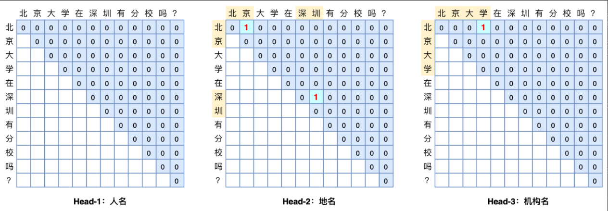

# 【关于 命名实体识别 之 GlobalPointer 】 那些你不知道的事

> 作者：杨夕
> 
> 项目地址：https://github.com/km1994/nlp_paper_study
> 
> 博客：【[GlobalPointer：用统一的方式处理嵌套和非嵌套NER](https://spaces.ac.cn/archives/8373)】
> 
> 代码：https://github.com/bojone/GlobalPointer
> 
> 个人介绍：大佬们好，我叫杨夕，该项目主要是本人在研读顶会论文和复现经典论文过程中，所见、所思、所想、所闻，可能存在一些理解错误，希望大佬们多多指正。

## 一、前言

本文将介绍一个称为GlobalPointer的设计，它利用全局归一化的思路来进行命名实体识别（NER），可以无差别地识别嵌套实体和非嵌套实体，在非嵌套（Flat NER）的情形下它能取得媲美CRF的效果，而在嵌套（Nested NER）情形它也有不错的效果。还有，在理论上，GlobalPointer的设计思想就比CRF更合理；而在实践上，它训练的时候不需要像CRF那样递归计算分母，预测的时候也不需要动态规划，是完全并行的，理想情况下时间复杂度是 O(1)。

## 二、 动机

### 2.1 Pointer Network

- 设计思路：在做实体识别或者阅读理解时，一般是用两个模块分别识别实体的首和尾；
- 存在问题：出现 训练和预测时的不一致问题

## 三、GlobalPointer

### 3.1 针对 Pointer Network 问题，GlobalPointer 解决方法

- 解决方法：针对这个不一致而设计的，它将首尾视为一个整体去进行判别，所以它更有“全局观”（更Global）。

### 3.2 基本思路

对于 长度为 n 的文本序列，对于 某一类 实体，其所包含的 候选实体 数量 为 n(n+1)/2，而 在 n(n+1)/2 候选实体中 只有 k 个 真正实体，那么就是 一个 “n(n+1)/2选k” 的多标签分类问题。如果有m种实体类型需要识别，那么就做成 m个“n(n+1)/2选k” 的多标签分类问题。这就是GlobalPointer的基本思想，以实体为基本单位进行判别，如图所示。

> 可能有读者会问：这种设计的复杂度明明就是O(n2)呀，不会特别慢吗？如果现在还是RNN/CNN的时代，那么它可能就显得很慢了，但如今是Transformer遍布NLP的时代，Transformer的每一层都是O(n2)的复杂度，多GlobalPointer一层不多，少GlobalPointer一层也不少，关键是O(n2)的复杂度仅仅是空间复杂度，如果并行性能好的话，时间复杂度甚至可以降到O(1)，所以不会有明显感知。

## 参考

1. [GlobalPointer：用统一的方式处理嵌套和非嵌套NER](https://spaces.ac.cn/archives/8373)