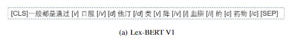
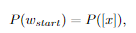
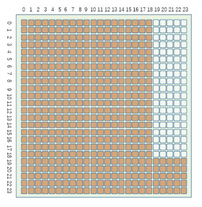
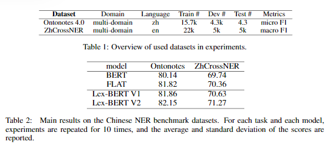

# 【关于 LEX-BERT】 那些你不知道的事

> 作者：杨夕
> 
> 论文名称：《Lex-BERT: Enhancing BERT based NER with lexicons》
> 
> 项目地址：https://github.com/km1994/nlp_paper_study
> 
> 个人介绍：大佬们好，我叫杨夕，该项目主要是本人在研读顶会论文和复现经典论文过程中，所见、所思、所想、所闻，可能存在一些理解错误，希望大佬们多多指正。

## 目录

## 摘要

In this work, we represent Lex-BERT, which incorporates the lexicon information into Chinese BERT for named entity recognition (NER) tasks in a natural manner.Instead of using word embeddings and a newly designed transformer layer as in FLAT, we identify the boundary of words in the sentences using special tokens,and the modified sentence will be encoded directly by BERT. Our model does not introduce any new parameters and are more efficient than FLAT. In addition, we  do  not  require  any  word  embeddings  accompanying  the  lexicon  collection.Experiments on MSRA and ZhCrossNER show that our model outperforms FLAT and other baselines.

在这项工作中，我们提出了Lex-BERT，它将词汇信息整合到中文BERT中，以自然的方式进行命名实体识别（NER）任务态度。相反通过使用单词嵌入和一个新设计的转换层作为充气工具，我们**使用特殊标记来识别句子中单词的边界，修改后的句子将由BERT直接编码**。我们的模型没有引入任何新的参数，比 FLAT 模型更有效。此外，我们不需要任何单词嵌入随词典收藏。实验在MSRA和ZhCrossNER上，我们的模型优于flat和其他基线.

## 动机

尽管它在NER任务中的表现令人印象深刻，但最近已经证明，添加词汇信息可以显著提高下游性能（Li et al.（2020））。然而，没有任何工作在不引入额外结构的情况下将单词信息纳入BERT。在我们的工作中，我们提出了词法BERT（lex-bert），这是一种在基于BERT的NER模型中更方便的词汇借用方法

## 方法介绍

### LEX-BERT V1

- 方法：Lex BERT的第一个版本通过在单词的左右两侧插入特殊标记来识别句子中单词的 span。特殊标记不仅可以标记单词的起始位置和结束位置，还可以为句子提供实体类型信息

- 作用：
  - 首先，如果我们的字典带有实体类型信息，我们可以通过标记将其插入到句子中。这里是医学相关动词的缩写，表示药物，表示检查索引，表示医学概念术语。
  - 其次，它们表示词汇集合中单词的开始或结束。这里开始标记的格式是[x]，结束标记的格式是[/x]，其中x可以是v、d、i等

### LEX-BERT V2

- 方法：对于在句子中加宽的单词，我们没有在句子中单词的周围插入起始和结束标记，而是在句子的末尾附加一个标记[x]。请注意，我们将标记的位置嵌入与单词的起始标记绑定：

修改了BERT的注意矩阵，如图2所示。句子中的文字标记只会互相注意，而不会注意标记。相反，markertoken可以处理输入序列中的所有标记。

## 实验结果

## 参考

1. [Lex-BERT：超越FLAT的中文NER模型？](https://zhuanlan.zhihu.com/p/343231764)
