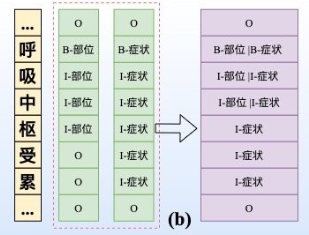
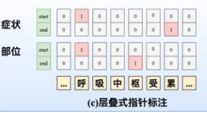
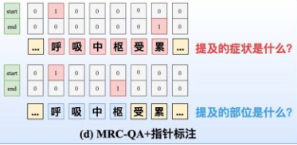
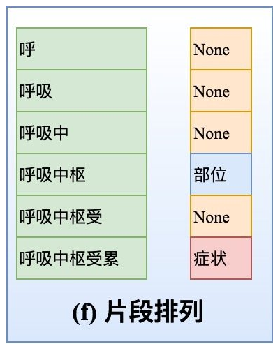

# 【关于 NER trick】 那些你不知道的事

> 作者：杨夕
> 
> 项目地址：https://github.com/km1994/nlp_paper_study
> 
> 个人介绍：大佬们好，我叫杨夕，该项目主要是本人在研读顶会论文和复现经典论文过程中，所见、所思、所想、所闻，可能存在一些理解错误，希望大佬们多多指正。

## 目录

## trick 1：领域词典匹配

- 场景：对于某些 常见短语，可以 采用 词典匹配 的方式。
- 方法：构建一个 常见短语 的 词典，比如 药物、疾病等，然后采用 flashtext 进行 关键词匹配；
- 优点：
  - 能够准确的挖掘出 常见短语；
  - 效率更快
- 缺点：
  - 对于有些 嵌套实体，如果 长实体未包含在词典中，那么将匹配到 短实体；
  - 词典收集工作量大

## trick 2：规则抽取

- 场景：对于一些 规定句式，可以 采用 规则匹配 的方式。
- 方法：构建一些 规则模板库，比如 “<PER> 去|到|抵达|经过 <LOC>”、“<drug> 能够|可以 治疗 <disease>” 等；
- 优点：
  - 对于某些固定句式，这种方法匹配度高；
  - 效率快；
- 缺点：
  - 会出现干扰词，eg: “<PER> 去|到|抵达|经过|访 <LOC>” 抽取 "特朗普和第一夫人访华" -> (特朗普和第一夫人,<PER>)、(华，<LOC>);
  - 需要手工制定规则；

## trick 3：词向量选取：词向量 or 字向量？

- 词向量
  - 方式：首先对句子进行分词，然后训练 所有词语 的 向量表示，最后利用 这些 词向量 训练模型；
  - 优点：
    - 能够 帮助 模型 学习 句子中 词汇关系；
  - 缺点：
    - OOV 问题；
    - 维护成本高；
    - 如果分词效果不好，那么词向量的质量 将受影响；
- 字向量
  - 方式：首先对句子按字切分，然后训练 所有字的 向量表示，最后利用 这些 字向量 训练模型；
  - 优点：
    - 解决了 词向量的 OOV 问题；
    - 减少人工维护成本；
    - 不用分词；
    - 在训练数据质量较差的时候（比如口语化较多，错别字较多，简称缩写较多等），采用字向量的效果好于词向量;
  - 缺点：
    - 学不出 词语间 的 关系；
  - 解决方法：
    - 利用 具有 双向 的 特征提取器 能够 缓解 该功能，eg: bilstm、bert 等；
  
## trick 4：特征提取器 如何选择？

- 短句子：
  - 模型：LSTM、BiLSTM、CNN、IDCNN
  - 优点：
    - 在句子较短的情况下， 模型能够 捕获 句子中词语间的依赖关系
- 长句子：
  - 模型：Bert
  - 优点：
    - 在句子较长的情况下， 由于 LSTM、BiLSTM、CNN、IDCNN 会出现 长距离依赖问题，所以性能下降；

## trick 5：专有名称 怎么 处理？【注：这一点来自于 [命名实体识别的几点心得](https://zhuanlan.zhihu.com/p/163607351) 】

- 场景：#1机组1A锅炉磨煤机故障，#2机组2C炉磨煤机故障。 实体是磨煤机。
- 方法：在训练ner模型时，可以将一类专业名词改写成一个符号表示
- 具体操作：
  - #1机组、#2机组、#3机组...是一类机组名词，可用<Unit>符号表示；
  - 1A锅炉，1A炉，1B炉，1C锅炉...是一类锅炉专业名词，可用<Speciality>符号表示；
- 转化后：
  - <Unit><Speciality>磨煤机故障，标注：[OOBIIOO]

## trick 6：标注数据 不足怎么处理？【这个问题可以说是现在很多小厂最头疼的问题】

- 问题介绍：随着模型的愈发精细复杂，需要训练的参数日益庞大，但其训练所需的人工标注数据却因为标注成本的问题难以得到相应地增长。
- 方法一：远程监督标注数据
  - 思路：使用远程监督的方法来得到大量的远程监督标注数据
  - 问题：有限覆盖问题（Limited Coverage）。由于用于远程监督的知识库规模有限，大量的实体存在于文本中而未出现在知识库中，导致在远程监督时，将这些未出现在知识库中的实体标注为非实体，从而产生大量的假负例；
- 方法二：优化模型
  - 思路：限制参数量，从而使得模型能够在较小的标注数据集上也能够完成训练；
- 方法三：采用主动学习方法
  - 思路：
    - step 1：先标注一小部分数据，利用这部分标注数据训练模型；
    - step 2：利用模型去标注 未标记数据；
    - step 3: 利用 查询函数 筛选 信息量最大的数据；（方法：信息熵计算不确定样本法、多模型投票选取争议性最高样本法）；
    - step 4：由人工进行标注，并加入到 标注数据中，回到 step 1，直到 样本足够大，或者 模型预测值 趋于平衡；
  - 优点：
    - 减少标注成本。由于 选取的数据 所包含的信息量较高，所以减少数据 标注成本（本人之前做过一个小实验，发现采用主动学习方法筛选出的总样本的30%左右，训练出的命名实体识别模型性能与全量训练效果相近）；
    - 数据质量高；
  - 缺点：
    - 如果 查询函数 选取 不对，可能吃力不讨好，也就是 选取的样本存在偏差，比如选到了 离群点。
- 方法四：迁移学习 【这种方法也蛮常见，问题就是风险太高】
- 方法五：预训练+自训练 【Self-training Improves Pre-training for Natural Language Understanding】
  - 背景知识：
    - 方法：
      - 预训练（Pre-training）从广义上来讲，是指先在较大规模的数据上对模型训练一波，然后再在具体的下游任务数据中微调。大多数情况下，预训练的含义都比较狭窄：在大规模无标注语料上，用自监督的方式训练模型。这里的自监督方法一般指的是语言模型；
      - 自训练是说有一个Teacher模型Ft和一个Student模型Fs，首先在标注数据上训练Ft，然后用它对大规模无标注数据进行标注，把得到的结果当做伪标注数据去训练Fs。
    - 相同点：用到了大规模无标注的数据
    - 区别：
      - 预训练始终对针对一个模型进行操作，而自训练却用到了两个模型；
      - 预训练是直接从无标注数据中学习，而自训练是间接地从数据中学习；
  - 思路：
    1. 将一个预训练模型（本文使用RoBERTa_Large）在标注数据上训练，作为教师模型Ft；
    2. 使用Ft从海量通用语料中提取相关领域的数据，一般是 抽取出 置信度较高的样本；
    3. 用Ft对提取的数据作标注；
    4. 用伪标注语料训练学生模型Fs。
- 方法六：实体词典+BERT相结合
  - 利用实体词典+BERT相结合，进行半监督自训练**【注：参考 资料11】 **

## trick 7：嵌套命名实体识别怎么处理 【注：参考 资料3】

### 7.1 什么是实体嵌套？

实体嵌套是指在一句文本中出现的实体，存在某个较短实体完全包含在另外一个较长实体内部的情况，如“南京市长”中地名“南京”就嵌套在职务名“南京市长”中。

### 7.2 与 传统命名实体识别任务的区别
传统的命名实体识别任务关注的都是平坦实体（Flat entities），即文本中的实体之间不交叉、不嵌套。
### 7.3 解决方法：
#### 7.3.1 方法一：序列标注
- 多标签分类
  - 思路：命名实体识别本来属于基于字的多分类问题，嵌套实体需要将其转化为 多标签问题（即每个字有多种标签，如下图所示）
  - 问题：
    - 学习难度较大
    - 容易导致label之间依赖关系的缺失

- 合并标签层
  - 思路：采用CRF，但设置多个标签层，对于每一个token给出其所有的label，然后将所有标签层合并
  - 问题：
    - 指数级增加了标签；
    - 对于多层嵌套，稀疏问题较为棘手；

#### 7.3.2 方法二：指针标注
- 层叠式指针标注
  - 思路：设置 C 个指针网络

- MRC-QA+指针标注
  - 思路：构建query问题指代所要抽取的实体类型，同时也引入了先验语义知识，如下图（d）所示。在文献中就对不同实体类型构建query，并采取指针标注，此外也构建了 **1 矩阵来判断span是否构成一个实体mention。

#### 7.3.3 方法三：多头标注

- 构建 span 矩阵
  - 思路：构建一个 ** 的Span矩阵
  - 说明：如图，Span{呼}{枢}=1，代表「呼吸中枢」是一个部位实体；Span{呼}{累}=2，代表「呼吸中枢受累」是一个症状实体；
  - 问题：
    - 如何构造Span矩阵问题
    - 如何解决0-1标签稀疏问题

- 嵌套实体的2篇SOTA之作： 
  - ACL20的《Named Entity Recognition as Dependency Parsing》采取Biaffine机制构造Span矩阵 **【注：具体可以参考 资料12】**；
  - EMNLP20的HIT **【注：具体可以参考 资料13】**则通过Biaffine机制专门捕获边界信息，并采取传统的序列标注任务强化嵌套结构的内部信息交互，同时采取focal loss来解决0-1标签不平衡问题。

#### 7.3.4 方法四：片段排列

十分直接，如下图（f）所示。对于含T个token的文本，理论上共有 = (+1)/2 种片段排列。如果文本过长，会产生大量的负样本，在实际中需要限制span长度并合理削减负样本。

## trick 8：为什么说 「词汇增强」 方法对于中文 NER 任务有效？

- 动机：虽然**基于字符的NER系统通常好于基于词汇（经过分词）的方法**，但**基于字符的NER没有利用词汇信息**，而**词汇边界对于实体边界通常起着至关重要的作用**。
- 目标：**如何在基于字符的NER系统中引入词汇信息**
- 思路：
  - 方法一：设计一个动态框架，能够兼容词汇输入 **【注：具体可以参考 资料6-10】**
  - 方法二：采用多种分词工具和多种句法短语⼯具进行融合来提取候选实体，并结合词典进行NER

## trick 9：NER实体span过长怎么办？

- 动机：如果NER任务中某一类实体span比较长（⽐如医疗NER中的⼿术名称是很长的），直接采取CRF解码可能会导致很多连续的实体span断裂；
- 解决方法：
  - 加入规则进行修正
  - 引入指针网络+CRF构建多任务学习。指针网络会更容易捕捉较长的span，不过指针网络的收敛是较慢的，可以对CRF和指针网络设置不同学习率，或者设置不同的loss权重。

## trick 10: NER 标注数据噪声问题？

- 动机：NER 标注数据存在噪声问题，导致模型训练效果差
- 方法：
  - 方法一：对训练集进行交叉验证，然后人工去清洗这些“脏数据”
  - 方法二：将noisy label learning应用于NER任务，惩罚那些噪音大的样本loss权重 **【注：具体可以参考 资料12】**

## trick 11： NER 标注数据不均衡问题？

- 动机：NER 标注数据 有些类别 标注数据量 较少；
- 方法：
  - 重采样
  - loss惩罚
  - Dice loss
  - 若 该类实体属于 长尾实体（填充率低），可以挖掘相关规则模板、构建词典库

## 参考资料

1. [命名实体识别的几点心得](https://zhuanlan.zhihu.com/p/163607351) 
2. [刷爆3路榜单，信息抽取冠军方案分享：嵌套NER+关系抽取+实体标准化](https://zhuanlan.zhihu.com/p/326302618)
3. [标注样本少怎么办？「文本增强+半监督学习」总结（从PseudoLabel到UDA/FixMatch）](https://zhuanlan.zhihu.com/p/146777068)
4. [如何解决NLP分类任务的11个关键问题：类别不平衡&低耗时计算&小样本&鲁棒性&测试检验&长文本分类](https://zhuanlan.zhihu.com/p/183852900)
5. [工业界如何解决NER问题？12个trick，与你分享～](https://zhuanlan.zhihu.com/p/152463745)
6. [Lattice LSTM：Chinese NER Using Lattice LSTM（ACL2018）](https://arxiv.org/abs/1805.02023)
7. [LR-CNN:CNN-Based Chinese NER with Lexicon Rethinking(IJCAI2019)](https://pdfs.semanticscholar.org/1698/d96c6fffee9ec969e07a58bab62cb4836614.pdf)
8. [CGN: Leverage Lexical Knowledge for Chinese Named Entity Recognition via Collaborative Graph Network（ EMNLP2019）](https://www.aclweb.org/anthology/D19-1396.pdf)
9. [LGN: A Lexicon-Based Graph Neural Network for Chinese NER(EMNLP2019)](https://www.aclweb.org/anthology/D19-1096.pdf)
10. [FLAT: Chinese NER Using Flat-Lattice Transformer（ACL2020）](https://arxiv.org/pdf/2004.11795.pdf)
11. [Better Modeling of Incomplete Annotations for Named Entity Recognition](http://www.statnlp.org/research/ie/zhanming19naacl-ner.pdf) 
12. [CrossWeigh: Training Named Entity Tagger from Imperfect Annotations](https://arxiv.org/pdf/1909.01441.pdf)
13. [HIT: Nested Named Entity Recognition via Head-Tail Pair and Token Interaction](https://www.aclweb.org/anthology/2020.emnlp-main.486.pdf)
14. [Named Entity Recognition as Dependency Parsing](https://www.aclweb.org/anthology/2020.acl-main.577/)

