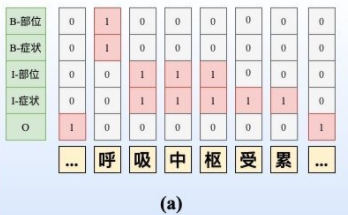
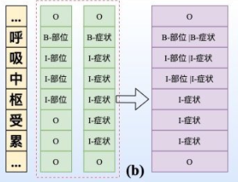
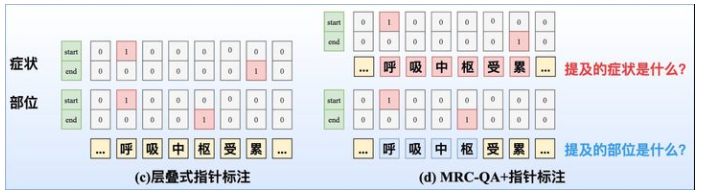
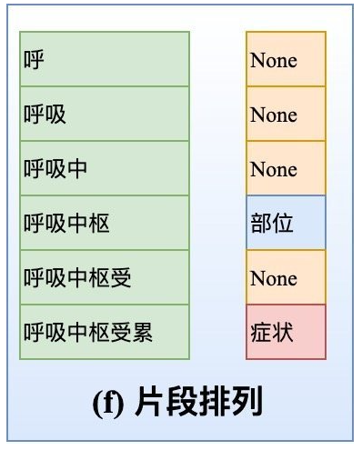

# 【关于 嵌套命名实体识别（Nested NER）】那些你不知道的事

> 作者：杨夕
> 
> 项目地址：https://github.com/km1994/nlp_paper_study
> 
> 个人介绍：大佬们好，我叫杨夕，该项目主要是本人在研读顶会论文和复现经典论文过程中，所见、所思、所想、所闻，可能存在一些理解错误，希望大佬们多多指正。

- [【关于 嵌套命名实体识别（Nested NER）】那些你不知道的事](#关于-嵌套命名实体识别nested-ner那些你不知道的事)
  - [一、动机篇](#一动机篇)
    - [1.1 传统的 命名实体识别方法存在什么问题？](#11-传统的-命名实体识别方法存在什么问题)
    - [1.2 识别出 嵌套实体 有什么用呢？](#12-识别出-嵌套实体-有什么用呢)
  - [二、嵌套命名实体识别（Nested NER）篇](#二嵌套命名实体识别nested-ner篇)
    - [2.1 传统的 命名实体识别方法 的思路是怎么样的？](#21-传统的-命名实体识别方法-的思路是怎么样的)
    - [2.2 嵌套命名实体识别方法 （Nested NER） 的动机？](#22-嵌套命名实体识别方法-nested-ner-的动机)
    - [2.3 嵌套命名实体识别方法 （Nested NER） 的解决方法有哪些？](#23-嵌套命名实体识别方法-nested-ner-的解决方法有哪些)
      - [2.3.1 将分类任务的目标从单标签变成多标签](#231-将分类任务的目标从单标签变成多标签)
      - [2.3.2 指针标注](#232-指针标注)
      - [2.3.3 多头标注](#233-多头标注)
      - [2.3.4 片段排列](#234-片段排列)
  - [参考资料](#参考资料)

## 一、动机篇

### 1.1 传统的 命名实体识别方法存在什么问题？

- 传统的命名实体识别方法（Flat NER）：抽取出 句子中可能为实体的所有元素，这些实体间不存在交集问题。

```s
    query：   感冒吃什么药物？
    NER 结果：{
        感冒：症状
    }
```

- 问题：但是现实中，并不是所有 句子所抽取出的实体都是没有交集的。比如下例 “腰间盘突出吃什么药物？”，NER 所 抽取出的 “腰间盘” 和 “腰间盘突出” 存在交集，或者说 “腰间盘” 包含于 “腰间盘突出”。此时，如果采用 Flat NER 进行处理，那么只能选取其中的一个。

```s
    query：  腰间盘突出吃什么药物？
    NER 结果：{
        腰间盘：部位，
        腰间盘突出：症状
    }
```
> 从上面结果可以看出，NER 所 抽取出的 “腰间盘” 和 “腰间盘突出” 存在交集，或者说 “腰间盘” 包含于 “腰间盘突出”。

### 1.2 识别出 嵌套实体 有什么用呢？

- 介绍：如果一个模型能够识别出 “腰间盘突出” 是一个症状，它倾向于将所有出现的 “腰间盘突出” 都标记成症状。但如果它能够在识别前者的同时将 “腰间盘”  标记成部位，我们就认为它有能力将所有 “[部位]突出” 的模式都识别出来，因为后者的角度，模型学到的是一种pattern，而非记住了一种具体情况。此外，提取出来的额外信息也能作为辅助特征，增强其他任务的效果。

## 二、嵌套命名实体识别（Nested NER）篇

### 2.1 传统的 命名实体识别方法 的思路是怎么样的？

- 目标：传统的 命名实体识别方法 会将 实体识别当成 序列标注 问题。
- 介绍：

```s
    定义：对于长度为 n 的句子 S = s1，s2，...,sn （si 为句子中 第 i 个 token）
    工作：序列标注任务即给每个 si 预测一个 label，来表示该 si 所属于的实体类型，通过将 相邻 si 拼接，可以得到 对应实体 span(start,end,type)
    核心：为一个给每个token进行分类的问题
```
- 常用的标注方法：
  - BIO：即Beginning、Inside、Outside，对于一个实体的第一个token，标注为B-[type]，实体其他位置的token标注为I-[type]，不属于任何实体的token标注为O；这样，对于一个标签数 T 的实体集，使用BIO标注将转变为 2*T+1 个标签；
  - BIOES：即Beginning、Inside、End、Outside、Single。其中End用来标识一个实体的结束，而Single用来标识仅包含一个token的实体。
- 思路：
  - 选择一个有效的标注Schema；
  - 选择分类模型（常用CNN/Bi-LSTM/BERT），对每个token进行分类；根据分类结果复原出原文中的实体。

### 2.2 嵌套命名实体识别方法 （Nested NER） 的动机？

- 动机：传统NER方法无法解决 Nested NER 问题，因为 Nested NER 中每个实体可能包含不同中实体类型。例如：北京大学 中的 北 同时属于B-Location，也属于B-Organization；而 京 也拥有I-Location与I-Organization两个标签。

### 2.3 嵌套命名实体识别方法 （Nested NER） 的解决方法有哪些？

#### 2.3.1 将分类任务的目标从单标签变成多标签

- 多标签分类：
  - 介绍：将多分类转化为多标签分类，在训练时将损失函数改为BCE或KL-divergence；在进行推理时，给定一个hard threshold，所有概率超过这个阈值的类别都会被预测出来，即使用sigmoid设定阈值进行解码；
  - 缺点：
    - 这种方式的学习难度较大，也会容易导致label之间依赖关系的缺失
    - 模型学习的目标设置过难，阈值定义比较主观，很难泛化；
    - 修改后的Schema预测的结果，复原回实体的时候又不再具有唯一性了



- 合并标签层：
  - 介绍：将可能共同出现的所有类别两两组合，产生新的标签（如：将B-Location与B-Organization组合起来，构造一个新的标签B-Loc|Org）；
  - 好处：最后的分类任务仍然是一个单分类，因为所有可能的分类目标我们都在Schema中覆盖了
  - 缺点：
    - 指数级增加了标签，导致分布过于稀疏，很难学习；
    - 对于多层嵌套，需要定义非常多的复合标签；
    - 修改后的Schema预测的结果，复原回实体的时候又不再具有唯一性了




#### 2.3.2 指针标注

- 层叠式指针标注：即设置C个指针网络，如下图（c）所示。
- MRC-QA+指针标注：构建query问题指代所要抽取的实体类型，同时也引入了先验语义知识，如下图（d）所示。在文献中就对不同实体类型构建query，并采取指针标注，此外也构建了 **1 矩阵来判断span是否构成一个实体mention。



#### 2.3.3 多头标注

- 构建一个 C 的Span矩阵，如下图（e）所示，Span{呼}{枢}=1，代表「呼吸中枢」是一个部位实体；Span{呼}{累}=2，代表「呼吸中枢受累」是一个症状实体；对于多头标注的一个重点就是如何构造Span矩阵、以及解决0-1标签稀疏问题。
- 嵌套实体的2篇SOTA之作： ACL20的《Named Entity Recognition as Dependency Parsing》采取Biaffine机制构造Span矩阵；EMNLP20的HIT[4]则通过Biaffine机制专门捕获边界信息，并采取传统的序列标注任务强化嵌套结构的内部信息交互，同时采取focal loss来解决0-1标签不平衡问题。


#### 2.3.4 片段排列

十分直接，如下图（f）所示。对于含T个token的文本，理论上共有 =(+1)/2 种片段排列。如果文本过长，会产生大量的负样本，在实际中需要限制span长度并合理削减负样本。



## 参考资料

1. [浅谈嵌套命名实体识别（Nested NER）](https://zhuanlan.zhihu.com/p/126347862)
2. [刷爆3路榜单，信息抽取冠军方案分享：嵌套NER+关系抽取+实体标准化](https://zhuanlan.zhihu.com/p/326302618)