# 【关于 NER数据存在漏标问题】那些你不知道的事

> 作者：杨夕
> 
> 论文：Empirical Analysis of Unlabeled Entity Problem in Named Entity Recognition
> 
> 会议：ICLR2021
> 
> 论文下载地址：https://arxiv.org/pdf/2012.05426
> 
> 本文链接：https://github.com/km1994/nlp_paper_study
> 
> 个人介绍：大佬们好，我叫杨夕，该项目主要是本人在研读顶会论文和复现经典论文过程中，所见、所思、所想、所闻，可能存在一些理解错误，希望大佬们多多指正。
> 
> 【注：手机阅读可能图片打不开！！！】


## 目录

- [【关于 NER数据存在漏标问题】那些你不知道的事](#关于-ner数据存在漏标问题那些你不知道的事)
  - [目录](#目录)
  - [一、摘要](#一摘要)
  - [二、为什么 数据会存在漏标？](#二为什么-数据会存在漏标)
  - [三、什么是 带噪学习(降噪学习)问题？](#三什么是-带噪学习降噪学习问题)
  - [四、NER 数据漏标问题所带来后果？](#四ner-数据漏标问题所带来后果)
  - [五、NER 性能下降 **原因**是什么？](#五ner-性能下降-原因是什么)
  - [六、论文所提出的方法是什么？](#六论文所提出的方法是什么)
  - [七、数据漏标，会导致NER指标下降有多严重？](#七数据漏标会导致ner指标下降有多严重)
  - [八、对「未标注实体问题」的解决方案有哪些？](#八对未标注实体问题的解决方案有哪些)
  - [九、如何降噪：改变标注框架+负采样？](#九如何降噪改变标注框架负采样)
    - [9.1 第一步：改变标注框架](#91-第一步改变标注框架)
    - [9.2 第二步：负采样](#92-第二步负采样)
  - [十、负样本采样，效果如何？](#十负样本采样效果如何)
  - [参考](#参考)

## 一、摘要

In many scenarios, named entity recognition (NER) models severely suffer from unlabeled entity problem, where the entities of a sentence may not be fully annotated.  Through empirical studies performed on synthetic datasets, we find two causes of the performance degradation. One is the reduction of annotated entitiesand the other is treating unlabeled entities as negative instances.  The first causehas less impact than the second one and can be mitigated by adopting pretraining language models.  The second cause seriously misguides a model in training and greatly affects its performances.  Based on the above observations, we propose ageneral approach that is capable of eliminating the misguidance brought by unlabeled entities.  The core idea is using negative sampling to keep the probability of training with unlabeled entities at a very low level.  Experiments on synthetic datasets and real-world datasets show that our model is robust to unlabeled entity problem and surpasses prior baselines.  On well-annotated datasets, our model is competitive with state-of-the-art method.

- 动机：在许多情况下，命名实体识别（NER）模型会*严重遭受未标记的实体问题的困扰*，其中句子的实体可能未得到完全注释。
- 性能下降 **原因**。
  - 一种是减少带注释的实体，
  - 另一种是将未标记的实体视为否定实例。
- **解决方法**：
  - 第一个原因可以通过采用预训练语言模型来缓解 【比第二个原因的影响较小】。
  - 第二个原因在训练中严重误导了模型，并极大地影响了模型的性能。
- **方法提出**：基于以上观察，我们提出了一种通用方法，该方法能够消除未标记实体带来的误导。
- **核心思想**：使用负采样将未标记实体进行训练的概率保持在非常低的水平。
- **实验结果**：对合成数据集和现实世界数据集进行的实验表明，我们的模型对未标记的实体问题具有鲁棒性，并且超过了先前的基准。在标注正确的数据集上，我们的模型与最先进的方法相比具有竞争力。

## 二、为什么 数据会存在漏标？

1. 数据集包含太多的实体类型；
2. 实体 可能与多个实体类型关联； 
3. 标注规范定义不完善：一开始标注规范没订好，后期标着标着发现不对，重新修改规范，然后就 ...
4. 标注人员问题：标注人员在标注过程中，难免出现 走神或错标问题；
5. 争议实体问题：对于类型 相近的，可能一个实体有多种 标注方法；
6. 嵌套实体问题：

比如下例 “腰间盘突出吃什么药物？”，NER 所 抽取出的 “腰间盘” 和 “腰间盘突出” 存在交集，或者说 “腰间盘” 包含于 “腰间盘突出”。此时，如果采用 Flat NER 进行处理，那么只能选取其中的一个。

```s
    query：  腰间盘突出吃什么药物？
    NER 结果：{
        腰间盘：部位，
        腰间盘突出：症状
    }
```
7. 远程监督标注语料方法问题：
   1. 方法：采用 词典等知识库 对 语料进行标注，以达到 自动生成标记数据
   2. 优点：省事又省心
   3. 缺点：
      1. 词典覆盖面不足，做会造成 语料实体**漏标** 【eg：2020 年的新冠，如果采用 2019的 词典标注，那么直接尬了】；
      2. 嵌套实体问题；

## 三、什么是 带噪学习(降噪学习)问题？

- 带噪学习(降噪学习)问题：把未标注的实体当作“负样本”，从而 给数据集引入了噪声
- 后果：将未标记的实体视为否定实例，导致 模型 性能下降；

## 四、NER 数据漏标问题所带来后果？

- 介绍：NER 数据漏标问题 可以视为 「未标注实体问题」或者「不完全实体标注问题」，属于 【带噪学习(降噪学习)问题】中一种

## 五、NER 性能下降 **原因**是什么？

- 目标：研究未标记实体问题对模型的影响以及如何有效消除它们。
- 研究方法：最初，构建一些综合数据集并介绍降解率。通过随机删除注释良好的数据集中的注释命名实体（例如CoNLL-2003（Sang＆De Meulder，2003））以不同的概率来构建数据集。退化率衡量未标记实体问题的影响使模型结果退化的严重程度。
- NER 性能下降 **原因**。
  - 一种是减少带注释的实体，
  - 另一种是将未标记的实体视为否定实例。
- **解决方法**：
  - 第一个原因：通过使用像BERT（Devlin等人，2018）这样的预训练语言模型作为句子编码器，可以很好地缓解这种情况 【比第二个原因的影响较小】。
  - 第二个原因：在训练中严重误导了模型，并对模型的性能产生很大的负面影响。即使在不太严重的情况下，它也可以使F1分数急剧降低约20％。

## 六、论文所提出的方法是什么？

对所有非实体span，提出一种负采样策略，可以将未标注实体当作负样本训练、降低到很低水平。未标注实体问题得到极大改善，超过一众SOTA方法。

## 七、数据漏标，会导致NER指标下降有多严重？

- 研究目标：模拟注释不佳的数据集
- 方法：随机删除了具有不同掩盖概率的标注良好的数据集的标记实体，测试集不变。
- 模型：
  - BERT 标注
  - LSTM 标注 【作为对比，研究使用预训练语言模型的效果】

- 为了探索未标记实体的培训带来的负面影响，我们针对以上两个模型提出了调整后的损失函数：

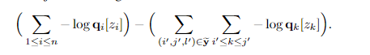

- 测量方法
  - 目标：衡量未标记实体问题的不同影响
  - 侵蚀率：代表实体标注量减少对NER指标下降的影响程度。在引入调节loss的前提下，与完全标注指标进行对比
  - 误导率:代表未标注实体对当作负样本时、对NER指标下降的影响程度。与引入调节loss的指标进行对比

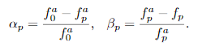

- 实验结果：
  - 随着实体mask概率 p 增大（未标注实体增多），指标下降明显。
  - 引入调节loss后（虚线部分），指标下降趋势趋缓，但在实体mask概率 p 很高时，NER指标仍然会有明显下降。

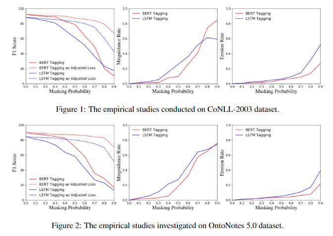

> 注：由第2、3幅图可以看出：在 p 很低的时候，误导率就较高了，而侵蚀率受影响较小，这表明：未标注实体当作负样本训练、对NER指标下降的影响程度很大，实体标注量减少对指标下降的影响较小。

## 八、对「未标注实体问题」的解决方案有哪些？

- 自动抽取短语回标训练集：这种方式会依赖于远程监督，未标注实体问题仍然存在；
- 自训练：通过多轮迭代伪标自训练，这种方式计算费时，降噪过程不见得很work；
- PU(positive-unlabeled) learning：为每个标签构建不同的二分类器。不过，未标注的实体仍然会影响相应实体类型的分类器；此外，该模型无法消除相邻实体的歧义。
- Partial CRF：是CRF的拓展，改进CRF使其可以绕过未标注实体。但事实上，真正的负样本还是不可缺少的，因此该方法只用于高质量的数据集。

> 注：上述相关方法或多或少存在“这样那样”的问题，但有一个共同特点：大多还是基于CRF这种序列标注模式改进，CRF作为一个全局结构化预测问题，“未标注实体”噪声对NER的影响是全局的，“牵一发而动全身”啊。

## 九、如何降噪：改变标注框架+负采样？

### 9.1 第一步：改变标注框架

1. 序列标注：每个序列位置都被标注为一个标签，比如按照BILOU标注，我们常用MLP或CRF解码。
2. 指针标注：对每个span的start和end进行标记，对于多片段抽取问题转化为N个2分类（N为序列长度）。
3. 多头标注：对每个token pair进行标记，其实就是构建一个的分类矩阵。
4. 片段排列：源于Span-level NER[1]的思想，枚举所有可能的span进行分类。事实上，片段排列的思想已经被Google推崇[2]并统一了信息抽取各个子任务。
   1. 优点：与同序列长度进行解耦，可以单独为每一个候选实体片段进行预测，打破了CRF那种全局结构化预测问题的限制，这样可以更加灵活地处理复杂抽取、小样本、降噪问题。
   2. 思路：
      1. 首先使用等式 1 获得标记表示hi。然后，获得每个短语x_{ij}的表示 【等式 4】
      2. 多层感知器（MLP）计算跨度 a(i,j) 的标签分布 i,j

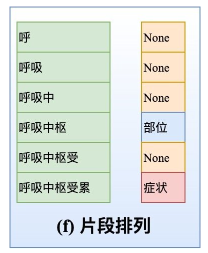
> 样例

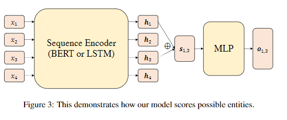
> 基于BERT+SoftMax 的 片段排列  方法框架

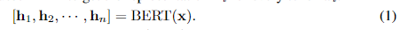
> 等式 1 

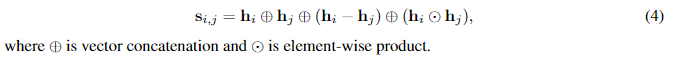
> 等式 4

### 9.2 第二步：负采样

- 降噪方法：对所有非实体片段进行负采样（下采样）。所有非实体片段中，有一部分可能是真正的、但未标注的实体（也就是未标注实体），但我们把能把它们都当作“负样本”看待，因此需要对所有非实体片段进行负采样
- 思路

1. 给定带注释的实体集 y，首先得到所有的负实例候选

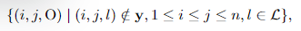
> L 是标签空间， O 是非实体跨度的标签

2. 然后，我们从整个候选集中随机抽取一个子集y'。样本集的大小 y' 是 {λ*n}，0<λ<1

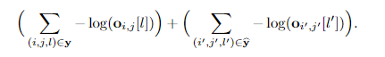
> loss计算：蓝框是标注实体集合 y 的loss计算，红框是采样实体集合 y' 的loss计算。

- 证明：通过负采样，可以将未标注实体当作负样本训练维持在一个很低水平

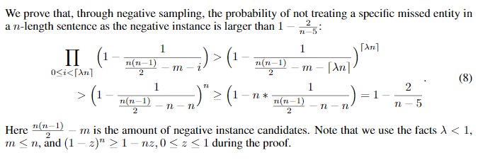

## 十、负样本采样，效果如何？

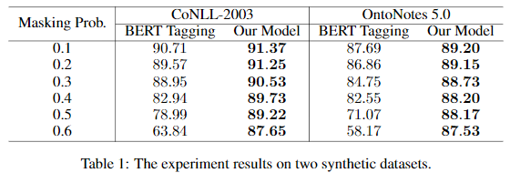
> 上图给出了不同实体mask概率 p 下：负样本采样方法与BERT-Tag的比较，可以看出：在实体存在漏标的场景下，传统的BERT标注方式会导致NER指标剧烈下降，而负采样方法可以极大缓解这一问题。

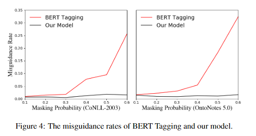
> 上图给出了不同实体mask概率 p 下，误导率的实验结果：可以看出本文的负采样方法，使得误导率维持在一个低水平。

## 参考

1. [ICLR2021 中唯一录取的NER论文：NER数据存在漏标怎么办？](https://zhuanlan.zhihu.com/p/347457328)


