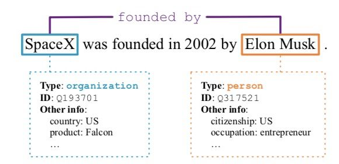

# 【关于 关系抽取到底在乎什么】 那些你不知道的事

> 作者：杨夕
> 
> 论文：《Learning from Context or Names? An Empirical Study on Neural Relation Extraction》
> 
> 论文地址：https://www.aclweb.org/anthology/2020.emnlp-main.298.pdf
> 
> 项目地址：https://github.com/km1994/nlp_paper_study
> 
> 个人介绍：大佬们好，我叫杨夕，该项目主要是本人在研读顶会论文和复现经典论文过程中，所见、所思、所想、所闻，可能存在一些理解错误，希望大佬们多多指正。

## 目录

## 为什么关系抽取 主要依赖于 【上下文信息】 和 【实体信息】？

- 上下文信息：模型需要通过学习实体对的上下文来对实体对进行分类；比如：可以利用 关系模板 「A be founded ... by B」 去 挖掘 (B, be found ,A) ；

- 实体信息：实体信息主要包括实体类型、实体ID、实体属性信息等，如果实体可以被链接到知识图谱上，那么相关信息也可以被模型所利用。既然关系抽取基于实体pair进行的分类预测，那么实体信息就必不可少了。

## 【上下文信息】 和 【实体信息】 哪个对 关系抽取任务 更重要？

- 上下文信息 和 实体信息 对于关系模型都很关键
- 实体提及中的类型Type信息很重要
- 上下文信息比实体信息更重要

## 参考

1. [刘知远老师的“灵魂发问”：关系抽取 到底在乎什么？](https://zhuanlan.zhihu.com/p/340375571)

