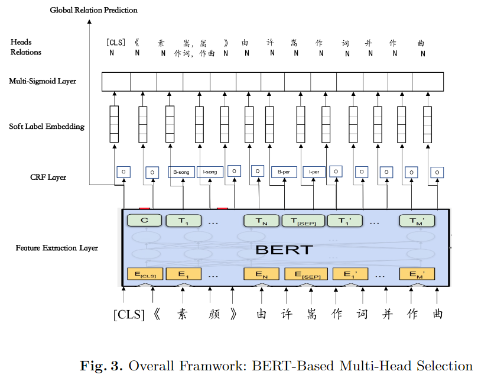
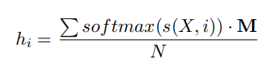

# 【关于 BERT-Based Multi-Head Selection 】 那些你不知道的事

> 作者：杨夕
> 
> 论文：《BERT-Based Multi-Head Selection for Joint Entity-Relation Extraction》
> 
> 论文地址：https://arxiv.org/abs/1908.05908
> 
> 项目地址：https://github.com/km1994/nlp_paper_study
> 
> 个人介绍：大佬们好，我叫杨夕，该项目主要是本人在研读顶会论文和复现经典论文过程中，所见、所思、所想、所闻，可能存在一些理解错误，希望大佬们多多指正。

## 一、动机

1. 之前的工作没有考虑实体关系重叠问题，即一个实体可能与上下文中的多个实体有不同的关系。

## 二、创新点

- 创新点
  - 将实体关系联合抽取问题看作是一个 multi-head selection 的问题，即任何一个实体都可能与其他实体存在关系，目的是**解决关系重叠问题**
  - 引入 Bert

## 三、模型结构介绍

### 3.1 Bert 

- 介绍：以字符序列作为输入，使用BERT捕获上下文特征

### 3.2 CRF层 

- 介绍：用于从句子中提取实体

### 3.3 软标签嵌入 层 

- 目标：在CRF逻辑的基础上构建了软标签嵌入，以在实体识别和关系提取之间有效地传递信息
- 思路：以 logits 作为输入来保持每个实体类型的概率。假设N是logits维数，即实体类型的个数，M为标签嵌入矩阵，则第i个字符的软标签嵌入可以形式化为

### 3.4 Multi-Sigmoid层

- 目标：为了解决一个实体属于多个三元组的问题，应用了一个Multi-Sigmoid层。
- 思路：将关系分类任务表示为一个多头选择问题，因为句子中的每个token都与其他token有多个关系。将第i个token的soft label embedding feed到两个单独的全连通层中，得到subject和object的表示以预测它们之间的关系。采用multi-sigmoid layer进行关系预测。

## 参考

1. [阅读分享：BERT-Based Multi-Head Selection for Joint Entity-Relation Extraction](https://blog.csdn.net/baidu_28820009/article/details/106043763)

