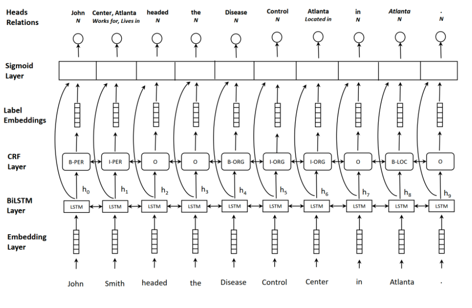
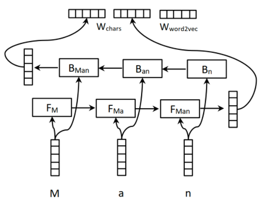
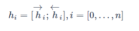
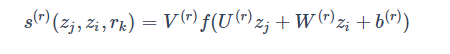
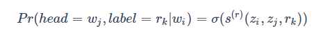
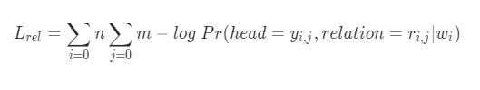

# 【关于 Multi-head Selection】 那些你不知道的事

> 作者：杨夕
> 
> 论文：《Joint entity recognition and relation extraction as a multi-head selection problem》
> 
> 论文地址：https://arxiv.org/abs/1804.07847
> 
> 项目地址：https://github.com/km1994/nlp_paper_study
> 
> 个人介绍：大佬们好，我叫杨夕，该项目主要是本人在研读顶会论文和复现经典论文过程中，所见、所思、所想、所闻，可能存在一些理解错误，希望大佬们多多指正。

## 一、动机

1. 目前 State-of-the-art 的联合抽取模型依赖外部的NLP工具提取特征，模型性能严重依赖 NLP 工具的性能；
2. 之前的工作没有考虑实体关系重叠问题，即一个实体可能与上下文中的多个实体有不同的关系。

## 二、创新点

- 创新点：将实体关系联合抽取问题看作是一个 multi-head selection 的问题，即任何一个实体都可能与其他实体存在关系，目的是**解决关系重叠问题**

## 三、模型结构介绍



### 3.1 Embedding layer

- 介绍：主要用于生成词表征，包括字符级别的向量和词级别的向量两个部分，构造方式如下所示，引入字符级别的向量是因为字符级别的向量可以融入一些形态学特征



### 3.2 BiLSTM encoding layer

- 介绍：利用 多层的 BiLSTM 来对句子进行编码，每一个时刻的输出为两个方向的向量的拼接：



### 3.3 CRF layer

在 BiLSTM 之后接 CRF 来辅助实体识别，实体识别部分的标注方式是 BIO，此外在实体位置标注之后还接有实体类别标注

### 3.4 Label Embedding

用来获取标签相应的向量表征，也是可训练的，用 gi 表示第 i 个 token 的预测标签向量

### 3.5 multi-head selection problem

将关系抽取看作一个 multi-head selection problem，multi-head 的含义是每个 实体 与其他所有 实体 都存在关系，在判断关系的时候，为了避免造成信息冗余，只判断每个实体的最后一个 token 与其他实体的最后一个 token 的关系，而每个实体的最后一个 token 被称作 head。对于每个 head ，需要预测元组 (y^i,c^i)，其中 y^i 表示当前 token 的关系对象，c^i 表示两者之间的关系。对于给定的 token 向量 wi 和 wj，其关系为 rk 的分数为：



> zi=[hi;gi]，f(⋅) 为激活函数，U(r),W(r) 相当于先将向量进行降维，V(r) 是一个一维向量

最后输出的是一个分数值，之后再将分数映射为概率值



### 3.6 损失函数

- 关系抽取过程 损失函数



- 整体损失函数


## 四、预测阶段

- 思路：预测关系的概率，当该概率超过 给定阈值就认为 该关系有效
- 方法：该模型对两个词之间过个关系的预测并不是采用的 softmax 函数，而是对每个关系采用了 sigmoid 函数。
- 区别： **softmax 是将所有类别看作是互斥关系，将所有分数归一化为和为 1 的形式，而 sigmoid 与 softmax 的区别在于，其独立的将每个类别的判断看作是独立二分类的问题，即各个类别不存在互斥关系**，这样跟有利于判断出两个实体之间存在的多种关系的情况。
  
## 五、实践

### 5.1 数据集介绍

- 数据集地址： [2020语言与智能技术竞赛：关系抽取任务](https://aistudio.baidu.com/aistudio/competition/detail/31?isFromCcf=true)
- 数据集介绍

> 训练数据格式

```json
    {
        "postag": [
                {"word": "如何", "pos": "r"}, {"word": "演", "pos": "v"}, {"word": "好", "pos": "a"}, {"word": "自己", "pos": "r"}, {"word": "的", "pos": "u"}, {"word": "角色", "pos": "n"}, {"word": "，", "pos": "w"}, {"word": "请", "pos": "v"}, {"word": "读", "pos": "v"}, {"word": "《", "pos": "w"}, {"word": "演员自我修养", "pos": "nw"}, {"word": "》", "pos": "w"}, {"word": "《", "pos": "w"}, {"word": "喜剧之王", "pos": "nw"}, {"word": "》", "pos": "w"}, {"word": "周星驰", "pos": "nr"}, {"word": "崛起", "pos": "v"}, {"word": "于", "pos": "p"}, {"word": "穷困潦倒", "pos": "a"}, {"word": "之中", "pos": "f"}, {"word": "的", "pos": "u"}, {"word": "独门", "pos": "n"}, {"word": "秘笈", "pos": "n"}
            ],
            "text": "如何演好自己的角色，请读《演员自我修养》《喜剧之王》周星驰崛起于穷困潦倒之中的独门秘笈",
            "spo_list": [
            {
                "predicate": "主演",
                "object_type": "人物",
                "subject_type": "影视作品",
                "object": "周星驰",
                "subject": "喜剧之王"
            }
        ]
    }
    ...
```

> schemas 文件

```json
    {"object_type": "地点", "predicate": "祖籍", "subject_type": "人物"}
    {"object_type": "人物", "predicate": "父亲", "subject_type": "人物"}
    {"object_type": "地点", "predicate": "总部地点", "subject_type": "企业"}
    ...
```

### 5.2 Requirement

- python 3.7
- pytorch-crf==0.7.2
- pytorch-transformers==1.0.0
- torch==1.1.0
- prefetch-generator==1.0.1
- tqdm==4.26.0

### 5.3 Chinese_selection_preprocessing 中文数据预处理类 

#### 5.3.0 运行

- 运行命令

```shell
    python main.py --mode preprocessing --exp_name chinese_selection_re
```

- 输入数据

> 训练数据格式

```json
    {
        "postag": [
                {"word": "如何", "pos": "r"}, {"word": "演", "pos": "v"}, {"word": "好", "pos": "a"}, {"word": "自己", "pos": "r"}, {"word": "的", "pos": "u"}, {"word": "角色", "pos": "n"}, {"word": "，", "pos": "w"}, {"word": "请", "pos": "v"}, {"word": "读", "pos": "v"}, {"word": "《", "pos": "w"}, {"word": "演员自我修养", "pos": "nw"}, {"word": "》", "pos": "w"}, {"word": "《", "pos": "w"}, {"word": "喜剧之王", "pos": "nw"}, {"word": "》", "pos": "w"}, {"word": "周星驰", "pos": "nr"}, {"word": "崛起", "pos": "v"}, {"word": "于", "pos": "p"}, {"word": "穷困潦倒", "pos": "a"}, {"word": "之中", "pos": "f"}, {"word": "的", "pos": "u"}, {"word": "独门", "pos": "n"}, {"word": "秘笈", "pos": "n"}
            ],
            "text": "如何演好自己的角色，请读《演员自我修养》《喜剧之王》周星驰崛起于穷困潦倒之中的独门秘笈",
            "spo_list": [
            {
                "predicate": "主演",
                "object_type": "人物",
                "subject_type": "影视作品",
                "object": "周星驰",
                "subject": "喜剧之王"
            }
        ]
    }
    ...
```

> schemas 文件

```json
    {"object_type": "地点", "predicate": "祖籍", "subject_type": "人物"}
    {"object_type": "人物", "predicate": "父亲", "subject_type": "人物"}
    {"object_type": "地点", "predicate": "总部地点", "subject_type": "企业"}
    ...
```

- 输出数据

> train_data.json

```json
    {"text": "如何演好自己的角色，请读《演员自我修养》《喜剧之王》周星驰崛起于穷困潦倒之中的独门秘笈", "spo_list": [{"predicate": "主演", "object": "周星驰", "subject": "喜剧之王"}], "bio": ["O", "O", "O", "O", "O", "O", "O", "O", "O", "O", "O", "O", "O", "O", "O", "O", "O", "O", "O", "O", "O", "B", "I", "I", "I", "O", "B", "I", "I", "O", "O", "O", "O", "O", "O", "O", "O", "O", "O", "O", "O", "O", "O"], "selection": [{"subject": 24, "predicate": 46, "object": 28}]}
    ...
```

> bio_vocab.json

```json
    {"<pad>": 3, "B": 0, "I": 1, "O": 2}
```

> relation_vocab.json

```json
    {"祖籍": 0, "父亲": 1, "总部地点": 2, "出生地": 3, "目": 4, "面积": 5, "简称": 6, "上映时间": 7, "妻子": 8, "所属专辑": 9, "注册资本": 10, "首都": 11, "导演": 12, "字": 13, "身高": 14, "出品公司": 15, "修业年限": 16, "出生日期": 17, "制片人": 18, "母亲": 19, "编剧": 20, "国籍": 21, "海拔": 22, "连载网站": 23, "丈夫": 24, "朝代": 25, "民族": 26, "号": 27, "出版社": 28, "主持人": 29, "专业代码": 30, "歌手": 31, "作词": 32, "主角": 33, "董事长": 34, "成立日期": 35, "毕业院校": 36, "占地面积": 37, "官方语言": 38, "邮政编码": 39, "人口数量": 40, "所在城市": 41, "作者": 42, "作曲": 43, "气候": 44, "嘉宾": 45, "主演": 46, "改编自": 47, "创始人": 48, "N": 49}
```

> relation_vocab.json

```json
    {"<pad>": 0, "如": 1, "何": 2, "演": 3, "好": 4, "自": 5, "己": 6, "的": 7, "角": 8, "色": 9, "，": 10, ...}
```

#### 5.3.1 中文数据预处理流程

```python
    class Runner(object):
        ...
        def preprocessing(self):
            if self.exp_name == 'conll_selection_re':
                self.preprocessor = Conll_selection_preprocessing(self.hyper)
            elif self.exp_name == 'chinese_selection_re':
                self.preprocessor = Chinese_selection_preprocessing(self.hyper)
            elif self.exp_name == 'conll_bert_re':
                self.preprocessor = Conll_bert_preprocessing(self.hyper)
            # 获取 关系predicate
            self.preprocessor.gen_relation_vocab()
            self.preprocessor.gen_all_data()
            sys.exit(0)
            self.preprocessor.gen_vocab(min_freq=1)
            # for ner only
            self.preprocessor.gen_bio_vocab()
```

#### 5.3.2 Chinese_selection_preprocessing 中文数据预处理类流程介绍 【lib/preprocessings/chinese_selection.py】  

```python
    class Chinese_selection_preprocessing(object):
        def __init__(self, hyper):
            self.hyper = hyper
            self.raw_data_root = hyper.raw_data_root
            self.data_root = hyper.data_root
            self.schema_path = os.path.join(self.raw_data_root, 'all_50_schemas')

            if not os.path.exists(self.schema_path):
                raise FileNotFoundError(
                    'schema file not found, please check your downloaded data!')
            if not os.path.exists(self.data_root):
                os.makedirs(self.data_root)

            self.relation_vocab_path = os.path.join(self.data_root,
                                                    hyper.relation_vocab)
        ...
```

##### 5.3.2.1 获取 关系 predicate （gen_relation_vocab()）

- 目标：从 schemas 文件 中抽取 关系predicate
- 代码介绍

```python
    # 功能：获取关系 predicate
    def gen_relation_vocab(self):
        '''功能：获取关系 predicate'''
        relation_vocab = {}
        i = 0
        for line in open(self.schema_path, 'r', encoding="utf-8"):
            relation = json.loads(line)['predicate']
            if relation not in relation_vocab:
                relation_vocab[relation] = i
                i += 1
        relation_vocab['N'] = i
        json.dump(relation_vocab,
                  open(self.relation_vocab_path, 'w', encoding="utf-8"),
                  ensure_ascii=False)
```

- 输入数据格式

```python
    {"object_type": "地点", "predicate": "祖籍", "subject_type": "人物"}
    ...
```

- 输出数据格式

```python
    {"祖籍": 0, "父亲": 1, "总部地点": 2, "出生地": 3, "目": 4, "面积": 5, "简称": 6, "上映时间": 7, "妻子": 8, "所属专辑": 9, "注册资本": 10, "首都": 11, "导演": 12, "字": 13, "身高": 14, "出品公司": 15, "修业年限": 16, "出生日期": 17, "制片人": 18, "母亲": 19, "编剧": 20, "国籍": 21, "海拔": 22, "连载网站": 23, "丈夫": 24, "朝代": 25, "民族": 26, "号": 27, "出版社": 28, "主持人": 29, "专业代码": 30, "歌手": 31, "作词": 32, "主角": 33, "董事长": 34, "成立日期": 35, "毕业院校": 36, "占地面积": 37, "官方语言": 38, "邮政编码": 39, "人口数量": 40, "所在城市": 41, "作者": 42, "作曲": 43, "气候": 44, "嘉宾": 45, "主演": 46, "改编自": 47, "创始人": 48, "N": 49}
    ...
```

##### 5.3.2.2 获取并预处理训练和验证数据 （gen_all_data()）

- 目标：获取并预处理训练和验证数据
- 代码介绍

1. 获取并预处理训练和验证数据 （gen_all_data()）

```python
    # 功能：获取并预处理训练和验证数据
    def gen_all_data(self):
        self._gen_one_data(self.hyper.train)
        self._gen_one_data(self.hyper.dev)
```

2. 获取并预处理 训练 or 验证数据 （ _gen_one_data()）

```python
    # 功能：获取并预处理 训练 or 验证数据
    def _gen_one_data(self, dataset):
        source = os.path.join(self.raw_data_root, dataset)
        target = os.path.join(self.data_root, dataset)
        with open(source, 'r', encoding="utf-8") as s, open(target, 'w', encoding="utf-8") as t:
            for line in s:
                newline = self._read_line(line)
                if newline is not None:
                    t.write(newline)
                    t.write('\n')
```

3. 逐条处理数据 （_read_line(self, line: str)）

```python
    # 功能：逐条处理数据
    def _read_line(self, line: str) -> Optional[str]:
        '''功能：逐条处理数据'''
        line = line.strip("\n")
        if not line:
            return None
        instance = json.loads(line)
        text = instance['text']
        bio = None
        selection = None
        # 处理 关系 数据
        if 'spo_list' in instance:
            spo_list = instance['spo_list']
            # 验证 instance 有效性
            if not self._check_valid(text, spo_list):
                return None
            spo_list = [{
                'predicate': spo['predicate'],
                'object': spo['object'],
                'subject': spo['subject']
            } for spo in spo_list]
            # 从 spo_list 中抽取 entities
            entities: List[str] = self.spo_to_entities(text, spo_list)
            # 从 spo_list 中抽取 predicate
            relations: List[str] = self.spo_to_relations(text, spo_list)
            # 利用 spo_list 构建 BIO 标注序列
            bio = self.spo_to_bio(text, entities)
            # 利用 spo_list 获取 (subject_pos, predicate_id, object_pos) 位置 selection 项（eg：subject_pos 为 subject 最后一个字符 在 text 中的位置，object_pos 同理，predicate_id 为 predicate 在 relation_vocab 中的 id）
            selection = self.spo_to_selection(text, spo_list)
        result = {
            'text': text,
            'spo_list': spo_list,
            'bio': bio,
            'selection': selection
        }
        return json.dumps(result, ensure_ascii=False)
```

3.1 验证 instance 有效性

```python
    # 功能：验证 instance 有效性
    def _check_valid(self, text, spo_list):
        '''
            功能：验证 instance 有效性
            input:
                text: str                             句子
                spo_list: List[Dict[str, str]]        关系三元组
            return:
                status: bool                          instance 有效性
        '''
        # spo 是否为空
        if spo_list == []:
            return False
        # len(text) 长度 是否 小于 max_text_len
        if len(text) > self.hyper.max_text_len:
            return False
        # 所有 spo 是否 都在 text 中
        for t in spo_list:
            if t['object'] not in text or t['subject'] not in text:
                return False
        return True
```

3.2 从 spo_list 中抽取 entities

```python
    # 功能：从 spo_list 中抽取 entities
    def spo_to_entities(self, text, spo_list):
        '''
            功能：从 spo_list 中抽取 entities
            input:
                text: str
                spo_list: List[Dict[str, str]]
            return:
                list(entities)  List[str]
        '''
        entities = set(t['object'] for t in spo_list) | set(t['subject']
                                                            for t in spo_list)
        return list(entities)
```

3.3 从 spo_list 中抽取 predicate

```python
    # 功能：从 spo_list 中抽取 predicate
    def spo_to_relations(self, text, spo_list):
        '''
            功能：从 spo_list 中抽取 predicate
            input:
                text: str
                spo_list: List[Dict[str, str]]
            return:
                list(predicate)  List[str]
        '''
        return [t['predicate'] for t in spo_list]
```

3.4 利用 spo_list 获取 (subject_pos, predicate_id, object_pos) 位置 selection 项（eg：subject_pos 为 subject 最后一个字符 在 text 中的位置，object_pos 同理，predicate_id 为 predicate 在 relation_vocab 中的 id）

```python
    # 功能：利用 spo_list 获取 (subject_pos, predicate_id, object_pos) 位置 selection 项（eg：subject_pos 为 subject 最后一个字符 在 text 中的位置，object_pos 同理，predicate_id 为 predicate 在 relation_vocab 中的 id）
    def spo_to_selection(self, text, spo_list ):
        ''''
            功能：利用 spo_list 获取 (subject_pos, predicate_id, object_pos) 位置 selection 项（eg：subject_pos 为 subject 最后一个字符 在 text 中的位置，object_pos 同理，predicate_id 为 predicate 在 relation_vocab 中的 id）
            input:
                text: str
                spo_list: List[Dict[str, str]]
            return:
                list(predicate)  List[Dict[str, int]]     selection
        '''
        selection = []
        for triplet in spo_list:
            object = triplet['object']
            subject = triplet['subject']
            object_pos = text.find(object) + len(object) - 1
            relation_pos = self.relation_vocab[triplet['predicate']]
            subject_pos = text.find(subject) + len(subject) - 1
            selection.append({
                'subject': subject_pos,
                'predicate': relation_pos,
                'object': object_pos
            })
        return selection
```

- 输入数据格式

```python
    {
        "postag": [
                {"word": "如何", "pos": "r"}, {"word": "演", "pos": "v"}, {"word": "好", "pos": "a"}, {"word": "自己", "pos": "r"}, {"word": "的", "pos": "u"}, {"word": "角色", "pos": "n"}, {"word": "，", "pos": "w"}, {"word": "请", "pos": "v"}, {"word": "读", "pos": "v"}, {"word": "《", "pos": "w"}, {"word": "演员自我修养", "pos": "nw"}, {"word": "》", "pos": "w"}, {"word": "《", "pos": "w"}, {"word": "喜剧之王", "pos": "nw"}, {"word": "》", "pos": "w"}, {"word": "周星驰", "pos": "nr"}, {"word": "崛起", "pos": "v"}, {"word": "于", "pos": "p"}, {"word": "穷困潦倒", "pos": "a"}, {"word": "之中", "pos": "f"}, {"word": "的", "pos": "u"}, {"word": "独门", "pos": "n"}, {"word": "秘笈", "pos": "n"}
            ],
            "text": "如何演好自己的角色，请读《演员自我修养》《喜剧之王》周星驰崛起于穷困潦倒之中的独门秘笈",
            "spo_list": [
            {
                "predicate": "主演",
                "object_type": "人物",
                "subject_type": "影视作品",
                "object": "周星驰",
                "subject": "喜剧之王"
            }
        ]
    }
    ...
```

- 输出数据格式

```python
    {
        "text": "如何演好自己的角色，请读《演员自我修养》《喜剧之王》周星驰崛起于穷困潦倒之中的独门秘笈", 
        "spo_list": [{"predicate": "主演", "object": "周星驰", "subject": "喜剧之王"}], 
        "bio": ["O", "O", "O", "O", "O", "O", "O", "O", "O", "O", "O", "O", "O", "O", "O", "O", "O", "O", "O", "O", "O", "B", "I", "I", "I", "O", "B", "I", "I", "O", "O", "O", "O", "O", "O", "O", "O", "O", "O", "O", "O", "O", "O"], 
        "selection": [{"subject": 24, "predicate": 46, "object": 28}]}
    ...
```


3.5 利用 spo_list 构建 BIO 标注序列

```python
    # 功能：利用 spo_list 构建 BIO 标注序列
    def spo_to_bio(self, text, entities):
        '''
            功能：利用 spo_list 构建 BIO 标注序列
            input:
                text: str
                spo_list: List[Dict[str, str]]
            return:
                list(predicate)  List[str]      BIO 标注序列
        '''
        bio = ['O'] * len(text)
        for e in entities:
            begin = text.find(e)
            end = begin + len(e) - 1

            assert end <= len(text)

            bio[begin] = 'B'
            for i in range(begin + 1, end + 1):
                bio[i] = 'I'
        return bio

```

- 输入数据格式

```python
    {
        "postag": [
                {"word": "如何", "pos": "r"}, {"word": "演", "pos": "v"}, {"word": "好", "pos": "a"}, {"word": "自己", "pos": "r"}, {"word": "的", "pos": "u"}, {"word": "角色", "pos": "n"}, {"word": "，", "pos": "w"}, {"word": "请", "pos": "v"}, {"word": "读", "pos": "v"}, {"word": "《", "pos": "w"}, {"word": "演员自我修养", "pos": "nw"}, {"word": "》", "pos": "w"}, {"word": "《", "pos": "w"}, {"word": "喜剧之王", "pos": "nw"}, {"word": "》", "pos": "w"}, {"word": "周星驰", "pos": "nr"}, {"word": "崛起", "pos": "v"}, {"word": "于", "pos": "p"}, {"word": "穷困潦倒", "pos": "a"}, {"word": "之中", "pos": "f"}, {"word": "的", "pos": "u"}, {"word": "独门", "pos": "n"}, {"word": "秘笈", "pos": "n"}
            ],
            "text": "如何演好自己的角色，请读《演员自我修养》《喜剧之王》周星驰崛起于穷困潦倒之中的独门秘笈",
            "spo_list": [
            {
                "predicate": "主演",
                "object_type": "人物",
                "subject_type": "影视作品",
                "object": "周星驰",
                "subject": "喜剧之王"
            }
        ]
    }
    ...
```

- 输出数据格式

```python
    {
        "text": "如何演好自己的角色，请读《演员自我修养》《喜剧之王》周星驰崛起于穷困潦倒之中的独门秘笈", 
        "spo_list": [{"predicate": "主演", "object": "周星驰", "subject": "喜剧之王"}], 
        "bio": ["O", "O", "O", "O", "O", "O", "O", "O", "O", "O", "O", "O", "O", "O", "O", "O", "O", "O", "O", "O", "O", "B", "I", "I", "I", "O", "B", "I", "I", "O", "O", "O", "O", "O", "O", "O", "O", "O", "O", "O", "O", "O", "O"], 
        "selection": [{"subject": 24, "predicate": 46, "object": 28}]}
    ...
```

> 注：selection 是利用 spo_list 获取 (subject_pos, predicate_id, object_pos) 位置 selection 项（eg：subject_pos 为 subject 最后一个字符 在 text 中的位置，object_pos 同理，predicate_id 为 predicate 在 relation_vocab 中的 id）

##### 5.3.2.3 构建词典 （gen_vocab(self, min_freq)）

- 目标：获取并预处理训练和验证数据
- 代码介绍

```python
    # 功能：词典构建
    def gen_vocab(self, min_freq: int):
        '''
            功能：词典构建
            input:
                min_freq: int    最低词频
            return:
                
        '''
        source = os.path.join(self.raw_data_root, self.hyper.train)
        target = os.path.join(self.data_root, 'word_vocab.json')

        cnt = Counter()  # 8180 total
        with open(source, 'r', encoding="utf-8") as s:
            for line in s:
                line = line.strip("\n")
                if not line:
                    return None
                instance = json.loads(line)
                text = list(instance['text'])
                cnt.update(text)
        result = {'<pad>': 0}
        i = 1
        for k, v in cnt.items():
            if v > min_freq:
                result[k] = i
                i += 1
        result['oov'] = i
        json.dump(result, open(target, 'w', encoding="utf-8"), ensure_ascii=False)
```

- 输入数据

```json
    {
        "postag": [
                {"word": "如何", "pos": "r"}, {"word": "演", "pos": "v"}, {"word": "好", "pos": "a"}, {"word": "自己", "pos": "r"}, {"word": "的", "pos": "u"}, {"word": "角色", "pos": "n"}, {"word": "，", "pos": "w"}, {"word": "请", "pos": "v"}, {"word": "读", "pos": "v"}, {"word": "《", "pos": "w"}, {"word": "演员自我修养", "pos": "nw"}, {"word": "》", "pos": "w"}, {"word": "《", "pos": "w"}, {"word": "喜剧之王", "pos": "nw"}, {"word": "》", "pos": "w"}, {"word": "周星驰", "pos": "nr"}, {"word": "崛起", "pos": "v"}, {"word": "于", "pos": "p"}, {"word": "穷困潦倒", "pos": "a"}, {"word": "之中", "pos": "f"}, {"word": "的", "pos": "u"}, {"word": "独门", "pos": "n"}, {"word": "秘笈", "pos": "n"}
            ],
            "text": "如何演好自己的角色，请读《演员自我修养》《喜剧之王》周星驰崛起于穷困潦倒之中的独门秘笈",
            "spo_list": [
            {
                "predicate": "主演",
                "object_type": "人物",
                "subject_type": "影视作品",
                "object": "周星驰",
                "subject": "喜剧之王"
            }
        ]
    }
    ...
```

- 输出数据

```json
    {"<pad>": 0, "如": 1, "何": 2, "演": 3, "好": 4, "自": 5, "己": 6, "的": 7, "角": 8, "色": 9, "，": 10, ... }
```

##### 5.3.2.4 获取 bio 词典 （gen_bio_vocab(self)）

- 目标：获取并预处理训练和验证数据
- 代码介绍

```python
    # 功能：获取 bio 词典
    def gen_bio_vocab(self):
        '''功能：获取 bio 词典'''
        result = {'<pad>': 3, 'B': 0, 'I': 1, 'O': 2}
        json.dump(result,
                  open(os.path.join(self.data_root, 'bio_vocab.json'), 'w', encoding="utf-8"))
```

- 输入数据

```json

```

- 输出数据

```json
    {'<pad>': 3, 'B': 0, 'I': 1, 'O': 2}
```

### 5.4 MultiHeadSelection 模型介绍


#### 5.4.1 Embedding layer

- 介绍：主要用于生成词表征，包括字符级别的向量和词级别的向量两个部分，构造方式如下所示，引入字符级别的向量是因为字符级别的向量可以融入一些形态学特征


> 代码介绍

```python
    class MultiHeadSelection(nn.Module):
        def __init__(self, hyper) -> None:
            ...
                # 词嵌入层定义
                self.word_embeddings = nn.Embedding(
                    num_embeddings=len(self.word_vocab),
                    embedding_dim=hyper.emb_size
                )
            ...
        def forward(self, sample, is_train: bool) -> Dict[str, torch.Tensor]:
            ...
                # Encoding 层 计算
                if self.hyper.cell_name in ('lstm', 'gru'):  # 采用 word2vec emb 层
                    embedded = self.word_embeddings(tokens)
                ...
            ...
```

#### 5.4.2 BiLSTM encoding layer

- 介绍：利用 多层的 BiLSTM 来对句子进行编码，每一个时刻的输出为两个方向的向量的拼接：


> 代码介绍

```python
    class MultiHeadSelection(nn.Module):
        def __init__(self, hyper) -> None:
            ...
                # encoding 层定义
                if hyper.cell_name == 'gru':
                    self.encoder = nn.GRU(
                        hyper.emb_size,
                        hyper.hidden_size,
                        bidirectional=True,
                        batch_first=True
                    )
                elif hyper.cell_name == 'lstm':
                    self.encoder = nn.LSTM(
                        hyper.emb_size,
                        hyper.hidden_size,
                        bidirectional=True,
                        batch_first=True
                    )
            ...
        def forward(self, sample, is_train: bool) -> Dict[str, torch.Tensor]:
            ...
                # Encoding 层 计算
                if self.hyper.cell_name in ('lstm', 'gru'):  # 采用 word2vec emb 层
                    o, h = self.encoder(embedded)
                    o = (lambda a: sum(a) / 2)(torch.split(o, self.hyper.hidden_size, dim=2))
                ...
            ...
```

#### 5.4.3 CRF layer

在 BiLSTM 之后接 CRF 来辅助实体识别，实体识别部分的标注方式是 BIO，此外在实体位置标注之后还接有实体类别标注

> 代码介绍

```python
    class MultiHeadSelection(nn.Module):
        def __init__(self, hyper) -> None:
            ...
                # CRF 定义
                self.tagger = CRF(len(self.bio_vocab) - 1, batch_first=True)
            ...
        def forward(self, sample, is_train: bool) -> Dict[str, torch.Tensor]:
            ...
                # CRF 层解码
                ## 构建 bio_mask，对 tokens 中 特殊字符做 mask
                if self.hyper.cell_name in ('gru', 'lstm'):   
                    mask = tokens != self.word_vocab['<pad>']  # batch x seq
                    bio_mask = mask
                else:
                    raise ValueError('unexpected encoder name!')
                ## 计算 loss
                output = {}
                crf_loss = 0
                if is_train:       # 计算 CRF loss
                    crf_loss = -self.tagger(emi, bio_gold, mask=bio_mask, reduction='mean')
                else:              # CRF 解码
                    decoded_tag = self.tagger.decode(emissions=emi, mask=bio_mask)
                    output['decoded_tag'] = [list(map(lambda x : self.id2bio[x], tags)) for tags in decoded_tag]
                    output['gold_tags'] = bio_text
                    temp_tag = copy.deepcopy(decoded_tag)
                    for line in temp_tag:
                        line.extend([self.bio_vocab['<pad>']]*(self.hyper.max_text_len - len(line)))
                    if self.gpu>=0:
                        bio_gold = torch.tensor(temp_tag).cuda(self.gpu)
                    else:
                        bio_gold = torch.tensor(temp_tag)
            ...
```

#### 5.4.4 Label Embedding

用来获取标签相应的向量表征，也是可训练的，用 gi 表示第 i 个 token 的预测标签向量

> 代码介绍

```python
    class MultiHeadSelection(nn.Module):
        def __init__(self, hyper) -> None:
            ...
                # bio + pad
                self.bio_emb = nn.Embedding(
                    num_embeddings=len(self.bio_vocab),
                    embedding_dim=hyper.bio_emb_size
                )
            ...
        def forward(self, sample, is_train: bool) -> Dict[str, torch.Tensor]:
            ...
                # Label Embedding 计算
                tag_emb = self.bio_emb(bio_gold)
                o = torch.cat((o, tag_emb), dim=2)
            ...
```

#### 5.4.5 multi-head selection problem

将关系抽取看作一个 multi-head selection problem，multi-head 的含义是每个 实体 与其他所有 实体 都存在关系，在判断关系的时候，为了避免造成信息冗余，只判断每个实体的最后一个 token 与其他实体的最后一个 token 的关系，而每个实体的最后一个 token 被称作 head。对于每个 head ，需要预测元组 (y^i,c^i)，其中 y^i 表示当前 token 的关系对象，c^i 表示两者之间的关系。对于给定的 token 向量 wi 和 wj，其关系为 rk 的分数为：


> zi=[hi;gi]，f(⋅) 为激活函数，U(r),W(r) 相当于先将向量进行降维，V(r) 是一个一维向量

最后输出的是一个分数值，之后再将分数映射为概率值


> 代码介绍

```python
    class MultiHeadSelection(nn.Module):
        def __init__(self, hyper) -> None:
            ...
                # multi-head selection 层
                self.selection_u = nn.Linear(hyper.hidden_size + hyper.bio_emb_size,
                                            hyper.rel_emb_size)
                self.selection_v = nn.Linear(hyper.hidden_size + hyper.bio_emb_size,
                                            hyper.rel_emb_size)
                self.selection_uv = nn.Linear(2 * hyper.rel_emb_size,
                                            hyper.rel_emb_size)
                self.emission = nn.Linear(hyper.hidden_size, len(self.bio_vocab) - 1)
            ...
        def forward(self, sample, is_train: bool) -> Dict[str, torch.Tensor]:
            ...
                # forward multi head selection
                B, L, H = o.size()
                u = self.activation(self.selection_u(o)).unsqueeze(1).expand(B, L, L, -1)
                v = self.activation(self.selection_v(o)).unsqueeze(2).expand(B, L, L, -1)
                uv = self.activation(self.selection_uv(torch.cat((u, v), dim=-1)))

                # correct one
                selection_logits = torch.einsum('bijh,rh->birj', uv, self.relation_emb.weight)
            ...
```

#### 5.4.6 损失函数

- 关系抽取过程 损失函数


> 代码介绍

```python
    class MultiHeadSelection(nn.Module):
        def __init__(self, hyper) -> None:
            ...

        def forward(self, sample, is_train: bool) -> Dict[str, torch.Tensor]:
            ...
                # correct one
                selection_logits = torch.einsum('bijh,rh->birj', uv, self.relation_emb.weight)

                # 计算 multi head selection loss
                selection_loss = 0
                if is_train:
                    selection_loss = self.masked_BCEloss(mask, selection_logits,selection_gold)
            ...
```

- 整体损失函数


> 代码介绍

```python
    class MultiHeadSelection(nn.Module):
        def __init__(self, hyper) -> None:
            ...

        def forward(self, sample, is_train: bool) -> Dict[str, torch.Tensor]:
            ...
                # 整体损失函数 计算
                loss = crf_loss + selection_loss
            ...
```

#### 5.4.7 预测阶段

- 思路：预测关系的概率，当该概率超过 给定阈值就认为 该关系有效
- 方法：该模型对两个词之间过个关系的预测并不是采用的 softmax 函数，而是对每个关系采用了 sigmoid 函数。
- 区别： **softmax 是将所有类别看作是互斥关系，将所有分数归一化为和为 1 的形式，而 sigmoid 与 softmax 的区别在于，其独立的将每个类别的判断看作是独立二分类的问题，即各个类别不存在互斥关系**，这样跟有利于判断出两个实体之间存在的多种关系的情况。
  
> 代码介绍

```python
    class MultiHeadSelection(nn.Module):
        def __init__(self, hyper) -> None:
            ...

        def inference(self, mask, text_list, decoded_tag, selection_logits):
            selection_mask = (mask.unsqueeze(2) *
                            mask.unsqueeze(1)).unsqueeze(2).expand(
                                -1, -1, len(self.relation_vocab),
                                -1)  # batch x seq x rel x seq
            selection_tags = (torch.sigmoid(selection_logits) *
                            selection_mask.float()) > self.hyper.threshold

            selection_triplets = self.selection_decode(
                text_list, decoded_tag,selection_tags
            )
            return selection_triplets

        def forward(self, sample, is_train: bool) -> Dict[str, torch.Tensor]:
            ...
            if not is_train:
                output['selection_triplets'] = self.inference(mask, text_list, decoded_tag, selection_logits)
                output['spo_gold'] = spo_gold
            ...
        
        # 功能：multi head selection 预测解码
        def selection_decode(
            self, text_list, sequence_tags,selection_tags: torch.Tensor
        ) -> List[List[Dict[str, str]]]:
            reversed_relation_vocab = {
                v: k for k, v in self.relation_vocab.items()
            }
            reversed_bio_vocab = {v: k for k, v in self.bio_vocab.items()}
            text_list = list(map(list, text_list))
            # 功能：查找 subject 和 object 实体
            def find_entity(pos, text, sequence_tags):
                entity = []
                if sequence_tags[pos] in ('B', 'O'):
                    entity.append(text[pos])
                else:
                    temp_entity = []
                    while sequence_tags[pos] == 'I':
                        temp_entity.append(text[pos])
                        pos -= 1
                        if pos < 0:
                            break
                        if sequence_tags[pos] == 'B':
                            temp_entity.append(text[pos])
                            break
                    entity = list(reversed(temp_entity))
                return ''.join(entity)

            batch_num = len(sequence_tags)
            result = [[] for _ in range(batch_num)]
            idx = torch.nonzero(selection_tags.cpu())
            for i in range(idx.size(0)):
                b, s, p, o = idx[i].tolist()

                predicate = reversed_relation_vocab[p]
                if predicate == 'N':
                    continue
                tags = list(map(lambda x: reversed_bio_vocab[x], sequence_tags[b]))
                object = find_entity(o, text_list[b], tags)
                subject = find_entity(s, text_list[b], tags)

                assert object != '' and subject != ''

                triplet = {
                    'object': object,
                    'predicate': predicate,
                    'subject': subject
                }
                result[b].append(triplet)
            return result
```

### 5.5 Selection_Dataset 训练数据加载类 

#### 5.5.1 初始化类

```python
    class Selection_Dataset(Dataset):
        def __init__(self, hyper, dataset):
            self.hyper = hyper
            self.data_root = hyper.data_root
            # 加载 词典
            self.word_vocab = json.load(
                open(os.path.join(self.data_root, 'word_vocab.json'), 'r' ,encoding="utf-8")
            )
            # 加载 关系库
            self.relation_vocab = json.load(
                open(os.path.join(self.data_root, 'relation_vocab.json'), 'r', encoding="utf-8")
            )
            # 加载 BIO 库
            self.bio_vocab = json.load(
                open(os.path.join(self.data_root, 'bio_vocab.json'), 'r', encoding="utf-8")
            )

            # for bert only
            self.bert_tokenizer = BertTokenizer.from_pretrained(self.hyper.bert_model)

            # 加载数据
            self.selection_list = []
            self.text_list = []
            self.bio_list = []
            self.spo_list = []
            for line in open(os.path.join(self.data_root, dataset), 'r', encoding="utf-8"):
                line = line.strip("\n")
                instance = json.loads(line)
                self.selection_list.append(instance['selection'])
                self.text_list.append(instance['text'])
                self.bio_list.append(instance['bio'])
                self.spo_list.append(instance['spo_list'])
```

#### 5.5.2 迭代器

```python
    class Selection_Dataset(Dataset):
        def __getitem__(self, index):
            selection = self.selection_list[index]
            text = self.text_list[index]
            bio = self.bio_list[index]
            spo = self.spo_list[index]
            if self.hyper.cell_name == 'bert':
                text, bio, selection = self.pad_bert(text, bio, selection)
                tokens_id = torch.tensor(self.bert_tokenizer.convert_tokens_to_ids(text))
            else:
                tokens_id = self.text2tensor(text)
            bio_id = self.bio2tensor(bio)
            selection_id = self.selection2tensor(text, selection)
            return tokens_id, bio_id, selection_id, len(text), spo, text, bio

        def __len__(self):
            return len(self.text_list)
        
        def text2tensor(self, text: List[str]) -> torch.tensor:
            # TODO: tokenizer
            oov = self.word_vocab['oov']
            padded_list = list(map(lambda x: self.word_vocab.get(x, oov), text))
            padded_list.extend([self.word_vocab['<pad>']] *
                            (self.hyper.max_text_len - len(text)))
            return torch.tensor(padded_list)

        def bio2tensor(self, bio):
            # here we pad bio with "O". Then, in our model, we will mask this "O" padding.
            # in multi-head selection, we will use "<pad>" token embedding instead.
            padded_list = list(map(lambda x: self.bio_vocab[x], bio))
            padded_list.extend([self.bio_vocab['O']] *
                            (self.hyper.max_text_len - len(bio)))
            return torch.tensor(padded_list)

        def selection2tensor(self, text, selection):
            # s p o
            result = torch.zeros(
                (self.hyper.max_text_len, len(self.relation_vocab),
                self.hyper.max_text_len))
            NA = self.relation_vocab['N']
            result[:, NA, :] = 1
            for triplet in selection:
                object = triplet['object']
                subject = triplet['subject']
                predicate = triplet['predicate']
                result[subject, predicate, object] = 1
                result[subject, NA, object] = 0
            return result
```

#### 5.5.3 Batch_reader Batch 加载器

```python
    class Batch_reader(object):
        def __init__(self, data):
            transposed_data = list(zip(*data))
            # tokens_id, bio_id, selection_id, spo, text, bio
            self.tokens_id = pad_sequence(transposed_data[0], batch_first=True)
            self.bio_id = pad_sequence(transposed_data[1], batch_first=True)
            self.selection_id = torch.stack(transposed_data[2], 0)
            self.length = transposed_data[3]
            self.spo_gold = transposed_data[4]
            self.text = transposed_data[5]
            self.bio = transposed_data[6]

        def pin_memory(self):
            self.tokens_id = self.tokens_id.pin_memory()
            self.bio_id = self.bio_id.pin_memory()
            self.selection_id = self.selection_id.pin_memory()
            return self

    def collate_fn(batch):
        return Batch_reader(batch)

    Selection_loader = partial(DataLoader, collate_fn=collate_fn, pin_memory=True)

```


## 六、总结

这篇文章的关键创新点在于其将关系抽取任务当作一个 multi-head selection problem 的问题，从而使得每个实体能够与其他所有实体判断关系，此外，不再将关系抽取任务当作一个每个关系互斥的多分类任务，而是看作每个关系独立的多个二分类任务，从而能够判断每一对实体是否可能有多个关系存在。

## 参考

- [Model 3: Joint entity recognition and relation extraction as a multi-head selection problem](https://www.cnblogs.com/sandwichnlp/p/12049829.html#model-3-joint-entity-recognition-and-relation-extraction-as-a-multi-head-selection-problem)


