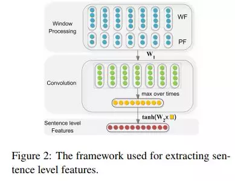
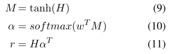
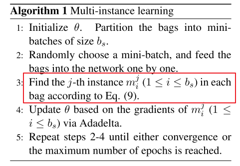
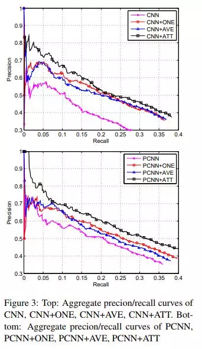
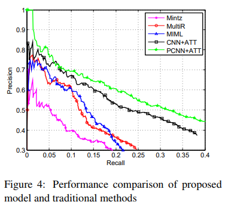

## 关系抽取（分类）论文总结

### 基本介绍
#### 基本定义

- 关系分类：判断给定实体对（e1,e2）在句子中所表达出的关系，属于多分类问题。
- 关系抽取：从一个句子中判断两个实体是否存在关系，属于二分类问题，指定某种关系。
  
#### 常用数据集

- ACE 2005
  介绍：599 docs， 7 types
- SemiEval 2010 Task8 Dataset:
  - 19  types;
  - train data: 8000;
  - test data: 2717;
- NYT+FreeBase 通过Distant Supervised ;method 提取，里面会有噪音数据：
  - 53 types;
  - train data: 522611 sentence; **里面存在近80%的句子的标签为 NA**;
  - test data: 172448 sentence;


### 学习方法分类

- Fully Supervised Learning
  
  所用的数据集为 label 完全正确的 SemEval 2010 Task 8 数据集，该数据集的训练数据样例：
  
```
The <e1>microphone</e1> converts sound into an electrical <e2>signal</e2>.
Cause-Effect(e1,e2)
Comment:
```
其中，第一行为 sentence,第二行为两个实体间的关系，第三行为备注。

- Distant Supervised Learning
  
  所用的数据集为 NYT+FreeBase 数据集，该数据集的训练数据样例：

```
m.0ccvx    m.05gf08    queens    belle_harbor    /location/location/contains    .....officials yesterday to reopen their investigation into the fatal crash of a passenger jet in belle_harbor , queens...... ###END###
```
一共为6列，前两列为两个entity的Freebase mid，第三四列为两个entity在句子中的string。第五列为relation，最后一列为sentence（有省略），以###END###结尾

- Joint Learning with wntity and relation
- Tree Bassed Methods

#### Fully Supervised Learning

##### 一、Relation Classification via Convolutional Deep Neural Network

> Zeng,et.al. (2014). Relation Classification via Convolutional Deep Neural Network. Coling, 2335–2344
> 
> 论文地址：https://www.aclweb.org/anthology/C14-1220
> 
> 读书笔记：https://mp.weixin.qq.com/s?__biz=MzAxMTU5Njg4NQ==&mid=100001827&idx=4&sn=e23122678e7a297df8cbc403456a0989
> 
> 论文源码地址：
> 
>  - pytorch实现：https://github.com/Thidtc/Relation-Classification-via-Convolutional-Deep-Neural-Network
> 
>  - tensorflow实现: https://github.com/FrankWork/conv_relation

1. 论文动机

- 针对之前的关系抽取方法大多数是基于统计机器学习的方法，这种方法虽然能够获得不错的效果，但是由于该方法的性能取决于所提取的特征的质量，因此存在局限性;
- 相比于RNN，CNN 对长距离位置建模存在局限性;

2. 论文思路
   
   本篇论文的模型框架包含三部分：Word Representation, Feature Extraction, and Output，整体框架如下图所示：

   

    - Word Representation Layer：本文采用 [Turian 2010ACL] 的 Pre-Train 的词向量；
    - Feature Extraction Layer：分别提取 Lexical Leval Feature 和 Sentence Leval Feature；
    - Output Layer：最后直接将 Lexical Leval Feature 和 Sentence Leval Feature 进行拼接，并输入到一个全连接层+Softmax，以进行关系分类。

    2.1. Word Representation Layer

    2.2. Feature Extraction Layer

    (1) Lexical-Feature

    Lexical-Feature 一共分为以下5部分，如下图所示：

      

      - L1: entity1
      - L2: entity2
      - L3: entity1 左右两边的tokens
      - L4: entity2 左右两边的tokens
      - L5: WordNet 中两个entity 的上位词
  
     举个栗子，对于下面这段话：

     > The [haft] of the [axe] is made of yew wood.

      - L1: entity1：haft
      - L2: entity2：axe
      - L3: entity1’s 上下文：the, of
      - L4: entity2’s 上下文：the, is
      - L5: 在wordNet中找到两个entity的上位词。上位词就是包含关系，比如parrot这个词的上位词就是bird. 这种包含关系其实类似于指明了实体的类型特征。

     将这些 Features 拼接起来，作为最后的 Lexical Level Features。

    (2) Sentence-Feature

    本文提出 CNN 来获取 Sentence Level representation 和自动提取 Sentence Level Feature，该模型架构如下图所示：

    


    (2.1) Window Processing Layer 中每个词包含两种特征：
    - WF(word feature)：词向量
    - PF(position feature)：位置特征，针对 CNN 存在无法捕获长距离特征及语义成分，本文采用了 位置特征。每个 word 与两个entity将的相对距离。如下图所示：

    

    > 图中，单词 been 距离 entity1 的距离为 2，距离 entity2 的距离为-4.

    > 这样每个word 就有了两个位置特征[d1,d2]，这两个特征也需要再额外使用Lookup-Table 做Embedding，投影成低维向量，也就是每个相对距离，都对应到一个低维实数向量。 这个Position Feature 的引入其实是突出了两个entity的作用，实验证明PF对效果的提升很明显。   

    因此，每个 word 的 Sentence Level Feature 维度为：$d_w + d_p * 2$，其中，$d_w$为word embedding 的维度，$d_p$为position embedding 的维度。

    (2.2) 卷积操作

    为了获取 Sentence Level Feature，本文首先采用卷积提取特征，然后使用 Max Pooling 操作提取每个卷积核中最有用的特征，最后，利用一个全连接层提取 Sentence Level Feature。

    2.3. Output Layer

    最后将 Lexical Level Feature 和 Sentence Level Feature 拼接成一个向量 $f=[l,g]$，作为整个句子的 Feature。
    最后将这些Feature输入全连接层和softmax分类器，即可进行关系分类。

3. 实验

    实验结果如下表所示。

    


4. 个人点评

   - 优点
     - 使用Pooling 操作，提取了每一个卷积核对应的最优特征；
     - 引入Position Feature: 相当于在一定程度上引入了位置信息，因为CNN更多是局部N-Gram特征; PF突出了entity的影响，包括后续的PieceWise Max Pooling，同样也是对entity与其他词分开考虑。
   - 缺点
     - 虽然使用了多个卷积核，但是仅仅使用同一个window-size, 提取特征比较单一；
     - 结构还是相对简单，更多的是类似于CNN 文本分类的结构。 而且还是加入了人为构造的Lexical Feature。


##### 二、Attention-Based Bidirectional Long Short-Term Memory Networks for Relation Classification

> Zhou. (2016). Attention-Based Bidirectional Long Short-Term Memory Networks for Relation Classification. ACL
> 
> 论文地址：https://www.aclweb.org/anthology/C14-1220
> 
> 读书笔记：https://mp.weixin.qq.com/s?__biz=MzAxMTU5Njg4NQ==&mid=100001827&idx=2&sn=27cd33fa69eaf376a92352f65b293e90
> 
> 论文源码地址：
> 
>  - tensorflow实现: https://github.com/crownpku/Information-Extraction-Chinese/tree/master/RE_BGRU_2ATT
> 
>  - 复现版本：https://github.com/km1994/relation_extraction_study/tree/master/Attention-Based-BiLSTM-relation-extraction

1. 论文动机

   - 最新的系统仍然依赖于词典资源，例如wordNet或者NLP系统，像依赖解析器和命名实体识别，以获得高级特征;
   - 重要信息可以出现在句子的任何位置;
   - 手动设计功能非常耗时，并且由于不同训练数据集的覆盖率较低而导致通用性较差。

2. 论文思路

    本文提出了一种新的神经网络Att-BLSTM用于关系分类。 我们的模型利用双向长短期记忆网络（BLSTM）的神经注意机制来捕获句子中最重要的语义信息。该框架如下图所示：

    

    - Input Layer： 将句子输入到模型中；
    - Embedding Layer：将每个词映射到低维度向量中；
    - BiLSTM Layer：利用 BiLSTM 获取句子中Sentence Level Feature；
    - Attention Layer：生成权重向量，并通过乘以权重向量将每个时间步长的词级特征合并到Sentence Level Feature向量中；设$H=[h_1,h_2,h_3,..h_T]$为BiLSTM的所有step的输出矩阵，$T$为句子长度. 然后经过下面的操作来计算每个step的权重:
    - 
    

        这样$α$ 就是weight vector, $r$就是最终的Attention-BiLSTM的输出，也即sentence的embedding, 之后使用了softmax来分类，损失函数使用对数似然。

    - Output Layer：最后将 Sentence Level Feature 向量用于关系分类。

3. 实验
   
   实验结果如下表所示：

   


4. 个人点评

    作为 NLP 任务中标配 Attention + BiLSTM 一直被用于不同的 NLP 任务中，所以本文并没有什么比较大的创新点。 

##### 三、Relation Classification via Multi-Level Attention CNNs

> Wang. (2016). Relation Classification via Multi-Level Attention CNNs. ACL
> 
> 论文地址：http://iiis.tsinghua.edu.cn/~weblt/papers/relation-classification.pdf
> 
> 读书笔记：https://mp.weixin.qq.com/s?__biz=MzAxMTU5Njg4NQ==&mid=100001827&idx=5&sn=f125b23b172f9755c0f02991919deee6 
> 
> 论文源码地址：
> 
>   - tensorflow 版本：https://github.com/lawlietAi/relation-classification-via-attention-model


1. 论文动机
   
    - 关系表达的多样性问题；
    - 虽然，深度学习模型能够在不需要手工特征工程或外部资源的情况下，捕获相应的信息和特征，但是，这些模型无法识别批判性线索和对外部知识存在依赖。

2. 论文思路
   

  本文提出了一个多级别的基于注意力的卷积神经网络模型，如下图所示：

  

  设计了相对复杂的两层Attention机制来尽可能突出句子中哪些部分对relation label有更大的贡献。使用了word similarity来定义句子中word与target entity的相似度，从而根据相似度来引入权重，这是第一层的Attention. 第二层Attention则是对卷积之后Pooling阶段，采用Attention Pooling 而不是Max Pooling. 通过这些操作来减弱噪音，加强相关性强的词的权重。此外也改进了前面Santos提出的Ranking Loss. 下面对文中详细介绍.

  2.1. Input Layer

  采用 word embedding + position embedding，所以词的表示形式如下所示：

  

  $$\mathbf{w}_{i}^{\mathrm{M}}=\left[\left(\mathbf{w}_{i}^{\mathrm{d}}\right)^{\top},\left(\mathbf{w}_{i, 1}^{\mathrm{p}}\right)^{\top},\left(\mathbf{w}_{i, 2}^{\mathrm{p}}\right)^{\top}\right] \mathbf{T}$$

  将trigram信息融合进去，设置一个滑动窗口k，以每个word 为中心，左右$k/2$个词作为上下文，然后直接串起来，这样每个词的embedding size变为:$(d_w+2*d_p)∗k$，如下:

  $$\mathbf{z}_{i}=\left[\left(\mathbf{w}_{i-(k-1) / 2}^{\mathrm{M}}\right)^{\top}, \ldots,\left(\mathbf{w}_{i+(k-1) / 2}^{\mathrm{M}}\right)^{\top}\right]^{\top}$$

  其实这个n-gram过程现在完成，然后卷积的时候，卷积核的size设置为1就可以了。或者现在不做，卷积核设置为k，可以达到同样的效果。但是后面有Attention，因此在这篇文章中，先做了n-gram。 输入层到这里为止，与其他文章完全一样。 下面就是加入 Input Attention 过程。 首先引入两个对角矩阵$A_1,A_2$ 对应每个句子的两个entity. 然后使用word embedding的向量内积运算来衡量某个词$w_i$ 与 $entity e_j,j=1,2$的相关性，这样对角矩阵A的元素就是: $A_{i, i}^{j}=f\left(e_{j}, w_{i}\right)$,其中f就内积运算。最后使用softamx归一化，来定义Attention的权重:

  $$\alpha_{i}^{j}=\frac{\exp \left(A_{i, i}^{j}\right)}{\sum_{i^{\prime}=1}^{n} \exp \left(A_{i^{\prime}, i^{\prime}}^{j}\right)}$$

  每个词都有对两个entity的权重:$α_1,α_2$. 这样把权重融合到已经得到的$z_i$中。融合的方法文中给了三个:

  - average：$r_{i}=z_{i} \frac{\alpha_{i}^{1}+\alpha_{i}^{2}}{2}$,这种方式直接简单，不过从经验感觉，直接求和比平均要好；
  - concat：$r_{i}=\left[\left(z_{i} \alpha_{i}^{1}\right)^{T},\left(z_{i}, \alpha_{i}^{2}\right) T\right]^{T}$ 这种方式理论上保留的信息量最大；
  - substract：$r_{i}=z_{i} \frac{\alpha_{i}^{1}-\alpha_{i}^{2}}{2}$ 这种方式其实有点类似于TranE，将relation视为两个权重的差。

  这样整个句子表示为: $R=[r_1,r_2,...,r_n]$, 至此包含第一层的Attention的Input Layer 完成.

  之后是卷积层，这里跟其他文章中卷积相同:

  $$R^{*}=\tanh \left(W_{\mathrm{f}} R+B_{\mathrm{f}}\right)$$


  其中 $W_f$是卷积核，size为$d^{c} \times k\left(d^{w}+2 d^{p}\right)$, 前面已经说过了，由于已经在input处做过了tri-gram操作，这里的$d_c$一般为1.

  2.2. Attention Based Pooling Layer

  大部分文章直接使用Max Pooling来处理，这样可能会有一些过于简单，有时候并不能抽出跟后续的relation labels 更相关的部分，这也是这篇文章提出Attention Based Pooling的动机。 定义一个关联矩阵表示卷积之后的结果R∗的每一个元素与relation labels的相关性，如下:

  $$G=R^{* \top} U W^{\mathrm{L}}$$

  其中U是Attention中的权重矩阵，$W^L$ 表示relation labels的embedding，跟word/position embedding一样，需要在训练过程更新。这样的G就是一个相关矩阵，每一个元素 $G_(i,j)$就表示R∗的第i个元素与第j个label的相关性。然后在对G做列归一化:

  $$A_{i, j}^{\mathrm{p}}=\frac{\exp \left(G_{i, j}\right)}{\sum_{i^{\prime}=1}^{n} \exp \left(G_{i^{\prime}, j}\right)}$$

  有了Attention Pooling矩阵，在做max pooling：

  $$\mathbf{w}_{i}^{\mathrm{O}}=\max _{j}\left(R^{*} A^{\mathrm{p}}\right)_{i, j}$$

  2.3. Loss Function Layer

  最后介绍模型改进的损失函数，根据Santos 2015提出的Ranking Loss, 这篇文章同样使用margin based ranking loss function. 一般的margin function都需要定义一个distance/score function, 从而来区分正负样例. 在santos文中，直接使用了网络最后的输出score。这篇文章利用relation embedding $W_{y}^{L}$, 定义了如下的score distance function:

  $$\delta_{\theta}(S, y)=\left\|\frac{\mathbf{w}^{\mathrm{O}}}{\left|\mathbf{w}^{\mathrm{O}}\right|}-W_{y}^{\mathrm{L}}\right\|$$

  来衡量模型的输出$w^O$与正确label对应的vector $W_{y}^{L}$的相关度，然后就是margin function:

  $$\begin{array}{l}{\mathcal{L}=\left[\delta_{\theta}(S, y)+\left(1-\delta_{\theta}\left(S, \hat{y}^{-}\right)\right)\right]+\beta\|\theta\|^{2}} \\ {=\left[1+\left\|\frac{\mathbf{w}^{\mathrm{O}}}{\left|\mathbf{w}^{\mathrm{O}}\right|}-W_{y}^{L}\right\|-\left\|\frac{\mathbf{w}^{\mathrm{O}}}{\left|\mathbf{w}^{\mathrm{O}}\right|}-W_{\hat{y}^{-}}^{\mathrm{L}}\right\|\right]} \\ {\quad+\beta\|\theta\|^{2}}\end{array}$$

  这里直接设置了1为margin，y−是错误标签，最后用SGD等方法去优化。

3. 实验
   
    

4. 个人点评

- 优点
  - 两层Attention: 在文章中的两处Attention 均是基于embedding 的内积来运算的。 其中Input Attention 很直观，利用embedding的内积来衡量相关；
  - Distance Function：从margin based ranking loss 出发，类似TransE等模型，使用embedding的逼近来作为距离函数。

- 缺点
  - Input Layer的attention 使用word 与 entity的 embedding similarity 来作为attention的权重，这里有些问题。比如“ caused by ” 这里的 caused 很关键，但是与e1, e2的相似度应该比较小。而且不同的词在不同的relation中的重要程度是不一样的。使用统一的embedding 可能会有噪音影响。在一个可能原因是Out Of Vocab 的词语也会降低performance。
  - 结构复杂 复杂度高，收敛困难，尤其是第二个Attention

**示例**


#### Distant Supervised Learning

上一章的全监督方法都是在完全正确的标注数据集上来做的，因此数据量很小，SemEval 2010 一共是10000左右条文本。因此开始考虑研究如何在大数据集上做关系抽取。2010年提出Distant Supervision可以自动标注训练样本，原理很简单。**利用知识图谱中的两个entity以及对应的某个relation，在corpus中进行回标，如果某个句子中同时包含了两个entity，那么就假定这个句子包含了上述的relation**. 这样就可以获得大量的标注数据。当然缺陷就是假设太强，会引入了很多噪音数据， 因为包含两个entity的句子不一定可以刻画对应的relation，如下, 对于NYT 语料中的第一个句子的确描述了 Founder的关系，但是第二句就不是这个关系，因此属于噪音:


在2011年提出了Multi Instance Learning的方法来改进原始的Distance supervision的方法，有一个At-Least-One 的前提: **包含两个entity的所有句子中，至少有一个句子可以体现relation，即至少有一个标注正确的句子。**通过结合FreeBase 对NYT语料做Entity Linking，Relation Aligning等操作进行标注， 最终得到一个被广泛使用的关系抽取数据集, 在开始已经描述过详情。正如前面声明，这里面会有噪音数据。 因此在这一系列的文章中，都会针对该噪音问题做一些工作，其中大部分基于Multi Instance来做。简单引用介绍Multi Instance Learning:

> 多示例学习可以被描述为：假设训练数据集中的每个数据是一个包(Bag)，每个包都是一个示例(instance)的集合,每个包都有一个训练标记，而包中的示例是没有标记的；如果包中至少存在一个正标记的示例，则包被赋予正标记；而对于一个有负标记的包，其中所有的示例均为负标记。（这里说包中的示例没有标记，而后面又说包中至少存在一个正标记的示例时包为正标记包，是相对训练而言的，也就是说训练的时候是没有给示例标记的，只是给了包的标记，但是示例的标记是确实存在的，存在正负示例来判断正负类别）。通过定义可以看出，与监督学习相比，多示例学习数据集中的样本示例的标记是未知的，而监督学习的训练样本集中，每个示例都有一个一已知的标记；与非监督学习相比，多示例学习仅仅只有包的标记是已知的，而非监督学习样本所有示例均没有标记。但是多示例学习有个特点就是它广泛存在真实的世界中，潜在的应用前景非常大。 from http://blog.csdn.net/tkingreturn/article/details/39959931

从这个介绍中可以看出来在Multi Instance Learning很适合用在NYT+FreeBase数据集上。

##### 一、Distant Supervision for Relation Extraction via Piecewise Convolutional Neural Networks （未看）

> Zeng (2015). Distant Supervision for Relation Extraction via Piecewise Convolutional Neural Networks. EMNLP
> 
> 论文地址：
> 
> 读书笔记：
> 
> 论文源码地址：
> 
>  - tensorflow实现: 

1. 论文动机

  - Distant supervised 会产生有大量噪音或者被错误标注的数据，直接使用supervised的方法进行关系分类，效果很差。
  - 原始方法大都是基于词法、句法特征来处理， 无法自动提取特征。而且句法树等特征在句子长度边长的话，正确率很显著下降。

2. 论文思路

因此文中使用Multi Instance Learning的at least one假设来解决第一个问题； 在Zeng 2014 的CNN基础上修改了Pooling的方式，解决第二个问题。 先介绍改进的CNN: Piece Wise CNN(PCNN). 总体结构如下, 与Zeng 2014 很类似:


输入仍然是一个sentence，Input Layer依然是word embedding + position embedding, 后面接卷积操作。 之后的Pooling层并没有直接使用全局的Max Pooling, 而是局部的max pooling. 文中把一个句子分为三部分，以两个entity为边界把句子分为三段，然后卷积之后对每一段取max pooling, 这样可以得到三个值，相比传统的max-pooling 每个卷积核只能得到一个值，这样可以更加充分有效的得到句子特征信息。 假设一共有个N个卷积核，最终pooling之后得到的sentence embedding的size为: $3N$, 后面再加softmax进行分类，最终得到输出向量$o$, 上面的示意图很清晰了，其中的$c1,c2,c3$是不同卷积核的结果，然后都分为3段进行Pooling。 下面可以减弱错误label问题的Multi-Instance Learning。这里面有一个概念， 数据中包含两个entity的所有句子称为一个Bag。先做几个定义:

  -  $M=M_{1}, M_{2}, \ldots, M_{T}$表示训练数据中的T个bags，每个bags都有一个relation标签.
  - $M_{i}=m_{i}^{1}, m_{i}^{2}, \ldots, m_{i}^{q_{i}}$ 表示第i个bag内有个$q_i$ instance，也就是句子。
  - $o$ 表示给定$m_i$的网络模型的输出(未经过softmax)，其中$o_r$表示第r个relation的score

  这样经过softmax 就可以计算每一个类别的概率了

  $$p\left(r | m_{i}^{j} ; \theta\right)=\frac{e^{o_{r}}}{\sum_{k=1}^{n_{1}} e^{o_{k}}}$$

  这里需要说明的是，我们的目的得到每个bag的标签，并不关注bag里面instances的。因为每个bag上的label就是两个entity的relation。 而上面的概率是计算的bag里面某一个instance的，所以需要定义基于Bag的损失函数，文中采取的措施是根据At-Least-One的假设，每个Bag都有至少有一个标注正确的句子，这样就可以从每个bag中找一个得分最高的句子来表示整个bag,于是定义如下的目标函数: 假设训练数据为T个bags: $<M_i,y_i>$:

  

  这样到此为止，模型部分完毕，完整的算法如下:

  

1. 实验

2. 个人点评

  这篇文章在NYT + FreeBase 数据集上比较好的效果， 也是第一篇使用CNN+Multi Instance来处理Distant Supervision 的关系抽取。相比与Zeng 2014，将Piecewise Pooling 加入到CNN中，以及将Multi Instance来处理Distance Supervised，从而减弱噪音的影响。当然在MIL中直接取了置信度最高的instance作为bag的，肯定会损失一部分信息，因此后续一些文章在上面做了工作。


##### 二、Neural Relation Extraction with Selective Attention over Instances

> Lin (2016). Neural Relation Extraction with Selective Attention over Instances.ACL
> 
> 论文地址： https://www.aclweb.org/anthology/P16-1200
> 
> 读书笔记：https://mp.weixin.qq.com/s?__biz=MzAxMTU5Njg4NQ==&mid=100001827&idx=3&sn=b898f436ae1f97268f6967658d9214f4
> 
> 论文源码地址：
> 
>  - tensorflow实现: 

1. 论文动机
   
  [Zeng 2015] 提出的将许多实例学习与神经网络模型相结合，并在远程监督数据集中取得了不错的效果，但是，该方法假设至少有一个涉及实体对的句子能够表达该实体对间的关系，并且仅在训练和预测中为每个实体对选择最可能的句子，即每一个包中仅仅取置信度最高的instance，而抛弃其他置信度低的instance。这种方法带来的问题是会损失一部分有用的instance，而一个 bag 内可能存在许多个 positive instance。

2. 论文思路
   
   论文利用带有 sentence-level 选择注意力机制的 CNN 处理每一个 bag 中所有的 instance，该方法不仅能够减少instance中的噪音，而且还能加强 position instance ，以充分利用训练数据。该模型的整体框架如下图所示：

   

  本文分为两部分：
  - Sentence Encoder：利用 CNN 构建句子的分布式表示；
  - Selective Attention over Instance： 使用基于句子级别的注意力机制来选取 position instance。

  2.1 Sentence Encoder

  

  通过以下步骤对实现 Sentence Encoder：
  - 将句子中的词转化为词向量；
  - 利用 convolutional layer，max-pooling 和 non-linear 构建 instance 的分布式表示。 

  2.2 Selective Attention over Instance

  为了充分获取 instance 中的信息，论文对所有 instance 进行加权：

  $$\mathbf{s}=\sum_{i} \alpha_{i} \mathbf{x}_{i}$$

  论文提出了两种不同的加权方式：

  - Average：
    假设集合 X 中所有 instance 的对集合表示的贡献度一样，所以有：

    $$\mathbf{s}=\sum_{i} \frac{1}{n} \mathbf{x}_{i}$$

    **存在问题：数据集中的错误标签的 instance 将带来噪声污染。**

  - Selective Attention

    使用 Selective Attention 来弱化噪声 instance，所以 $\alpha$定义如下：

    $$\alpha_{i}=\frac{\exp \left(e_{i}\right)}{\sum_{k} \exp \left(e_{k}\right)}$$

    其中，$e_i$ 为基于查询的函数，其对输入句子$x_i$ 和预测关系 $r$的匹配程度进行评分。我们选择双线性形式，在不同的备选方案中实现最佳性能：

    $$e_{i}=\mathbf{x}_{i} \mathbf{A} \mathbf{r}$$

    其中，$A$对权重对角矩阵，$r$ 是表示与关系$r$相关联的查询向量。

  最后，得到了加权的s就是bag-level的embedding。最后的输出需要注意，并不是直接用一个全连接层+softmax.而是根据向量的相似度计算bag的emebdding 与 每个relation的相似度作为relation的score，比如relation r的score计算方式:

  $$\mathbf{o}=\mathbf{M s}+\mathbf{d}$$
  
  
  每个relation的score计算完之后，通过 softmax 层定义条件概率 $p(r | S, \theta)$：

  $$p(r | S, \theta)=\frac{\exp \left(o_{r}\right)}{\sum_{k=1}^{n_{r}} \exp \left(o_{k}\right)}$$


  因此，当具有最高概率的句子的权重被设置为1而其他的权重被设置为0时，它们用于多实例学习的方法可以被视为特殊情况作为我们的选择性注意。

3. 实验
   
  文中首先做了在CNN/PCNN的基础上，如何使用bag内的信息的对比试验，结果如下，其中CNN/PCNN表示没有引入MIL，+ONE表示ZENG2015的取置信度最高的一个，+AVE与+ATT则是文中提出的两个:

  

  可以看出来，Attention的效果最好, 而且+ONE比+AVE要稍微好一些，也很容易理解，+AVE对噪音数据放大了影响。 第二个对比实验则是与传统方法的对比:
  
  

  最后一组实验则是更进一步验证Attention的作用。 因为在测试数据中，有超过3/4的bags 只有一个句子。 因此文中把拥有多个句子的entity pair 提取出来验证效果，在该子集上使用一下三种设置:

  - One: 表示在每个bag里面随机选择一个句子来进行预测
  - Two: 表示在每个bag里面随机选择两个句子来进行预测
  - All: 使用bag里面所有的句子来进行测试
  评价指标使用P@N，结果如下:

  

4. 个人点评

  相比于前三期论文采用label完全准确的SemEval 2010 Task 8 数据集来进行关系分类的全监督方法，本期的论文所采用的是利用Distant Supervision的方法自动标注训练样本的NYT 语料，这种方法虽然能够获取更多的训练集，但是也带来了噪声污染（因为有些包含同一对实体对的句子不一定表达相同的关系）。
  动机：本文是在【Zeng 2015】基础上的一个改进，Zeng 2015 的方法只取每一个bag中置信度最高的instance，这样会丢失很多的信息，因为每一个bag内可能有很多个positive instance。应用Attention机制可以减弱噪音，加强正样本，因此可以更充分的利用信息。
  
  问题与思考：
  1. 虽然本论文采用基于position 的词向量，但是该方法是否能够真的有效解决 CNN 在处理长句子时所出现的长距离依赖问题？
  2. 是否能够解决一对实体对在不同的句子中所表达的关系差异问题？
  3. 前几期论文的方法，更多的是在给定实体对的情况下进行关系抽取，是否能够向百度竞赛里面一样，只给出一个分好词的句子以及每个词的词性，然后模型自动抽取里面的关系实体？

- 优点
    
    [Zeng 2015] 提出的将许多实例学习与神经网络模型相结合，并在远程监督数据集中取得了不错的效果，但是，该方法假设至少有一个涉及实体对的句子能够表达该实体对间的关系，并且仅在训练和预测中为每个实体对选择最可能的句子，即每一个包中仅仅取置信度最高的instance，而抛弃其他置信度低的instance。这种方法带来的问题是会损失一部分有用的instance，而一个 bag 内可能存在许多个 positive instance。

- 缺点


##### 二、Attention-Based Bidirectional Long Short-Term Memory Networks for Relation Classification

> Zhou. (2016). Attention-Based Bidirectional Long Short-Term Memory Networks for Relation Classification. ACL
> 
> 论文地址：
> 
> 读书笔记：
> 
> 论文源码地址：
> 
>  - tensorflow实现: 

1. 论文动机
2. 论文思路
3. 实验
4. 个人点评


### 参考资料
[Turian 2010ACL][Word representations: a simple and general method for semi-supervised learning](https://www.aclweb.org/anthology/P10-1040)

[关系抽取(分类)总结][关系抽取(分类)总结](http://shomy.top/2018/02/28/relation-extraction/)

[Zeng 2015][Distant Supervision for Relation Extraction via Piecewise Convolutional Neural Networks](http://www.emnlp2015.org/proceedings/EMNLP/pdf/EMNLP203.pdf)


