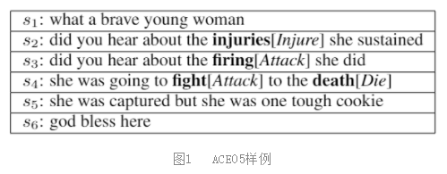
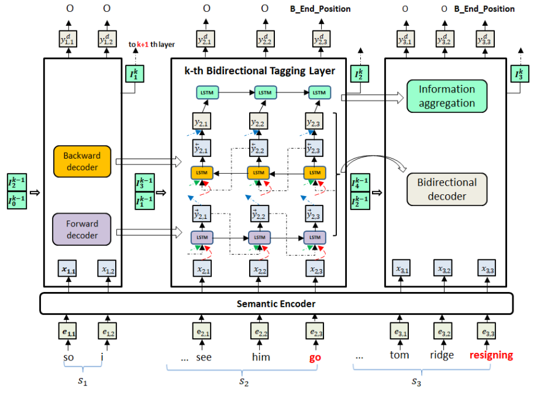
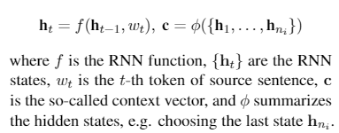
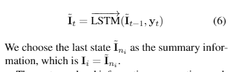
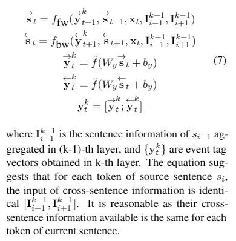
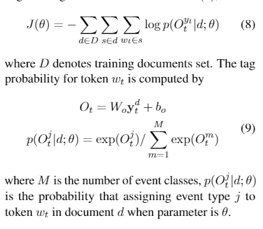
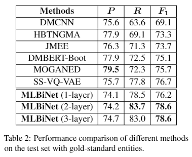
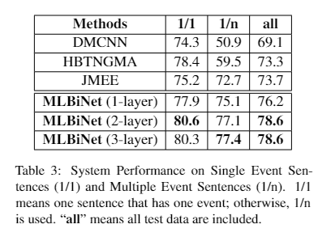
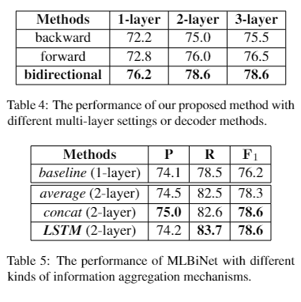

# 【关于 MLBiNet】那些你不知道的事

> 作者：杨夕
> 
> 论文：MLBiNet: A Cross-Sentence Collective Event Detection Network
> 
> 会议： ACL2021
> 
> 论文下载地址：https://arxiv.org/pdf/2105.09458.pdf
> 
> 论文代码：https://github.com/zjunlp/DocED
> 
> 本文链接：https://github.com/km1994/nlp_paper_study
> 
> 个人介绍：大佬们好，我叫杨夕，该项目主要是本人在研读顶会论文和复现经典论文过程中，所见、所思、所想、所闻，可能存在一些理解错误，希望大佬们多多指正。
> 
> 【注：手机阅读可能图片打不开！！！】

- [【关于 MLBiNet】那些你不知道的事](#关于-mlbinet那些你不知道的事)
  - [一、引言](#一引言)
  - [二、背景知识](#二背景知识)
    - [2.1 什么是 事件抽取？](#21-什么是-事件抽取)
    - [2.2 事件触发词检测任务面临的挑战 是什么？](#22-事件触发词检测任务面临的挑战-是什么)
    - [2.3 目前 事件抽取 存在问题？](#23-目前-事件抽取-存在问题)
  - [三、论文介绍](#三论文介绍)
    - [3.1 论文动机](#31-论文动机)
    - [3.2 论文方法](#32-论文方法)
      - [3.2.1 Semantic Encoder 语义编码器](#321-semantic-encoder-语义编码器)
      - [3.2.2 Forward Decoder 双向解码器](#322-forward-decoder-双向解码器)
      - [3.2.3 Information Aggregation 信息整合层](#323-information-aggregation-信息整合层)
      - [3.2.4  Multi-Layer Bidirectional Network 多层双向打标器](#324--multi-layer-bidirectional-network-多层双向打标器)
      - [3.2.5 Loss Function](#325-loss-function)
  - [四、实验结果](#四实验结果)
  - [参考](#参考)

## 一、引言

We  consider  the  problem  of  collectively  detecting  multiple  events,  particularly  in  cross-sentence settings.  The key to dealing with the problem is to encode semantic information and model event inter-dependency at a document-level. In  this  paper,  we  reformulate  it  as a  Seq2Seq  task  and  propose  a Multi-Layer Bidirectional Network (MLBiNet) to capturethe document-level as sociation of events and semantic information simultaneously.  Specifically, a bidirectional decoder is firstly devised to model event inter-dependency with in a sentence when decoding the event tag vector sequence. Secondly, an information aggregation module  is  employed  to  aggregate  sentence-level semantic and event tag information.  Finally, we stack multiple bidirectional decoders and feed cross-sentence information, forming a multi-layer bidirectional tagging architectureto iteratively propagate information across sentences.

- 动机：跨句事件抽取旨在研究如何同时识别篇章内多个事件
- 论文方法：论文将其重新表述为 **Seq2Seq 任务**，并提出了一个多层双向网络 (Multi-Layer Bidirectional Network，MLBiNet) 来 **融合跨句语义和关联事件信息，从而增强内各事件提及的判别**
- 论文思路： 在解码事件标签向量序列时
  - 首先，为建模句子内部事件关系，我们提出双向解码器用于同时捕捉前向和后向事件依赖；
  - 然后，利用信息聚合器汇总句子语义和事件提及信息；
  - 最后，通过迭代多个由双向解码器和信息聚合器构造的单元，并在每一层传递邻近句子的汇总信息，最终感知到整个文档的语义和事件提及信息。

## 二、背景知识

### 2.1 什么是 事件抽取？

- 事件抽取组成：
  - 事件触发词检测（识别事件触发词，并明确所触发事件的类型）
  - 属性抽取（识别触发事件的属性，并标注各属性对应角色）

> 注：“He died in hospital” 中 “died” 作为一个 Die 类型事件的触发词，该事件中，属性 “He” 的角色为 Person, “hospital” 的角色为 Place.

### 2.2 事件触发词检测任务面临的挑战 是什么？

1. 句子上下文表示及篇章级信息整合[1],[2]。**候选触发词类型的判定一般需要结合上下文信息**，包括关联实体信息（类型等）、其他候选触发词等。

> 例如，图 1 中句子 3 中的 “firing” 可能是开枪（触发 Attack 事件）或离职（触发 End_Position 事件），Attack 事件的确立需要融合句子2,4等的信息。

2. **句内和句间事件关联性建模**[1],[3]。句4包含事件触发词fight和death，ACE05数据集中超过40%触发词如此共现；类似句2、句3和句4中的连续关联事件同样普遍。

因此，建模事件之间依赖对于同时抽取句子、跨句多事件尤为重要。

### 2.3 目前 事件抽取 存在问题？

现有方法主要专注于句子级事件抽取，忽略了存在于其他句子中的信息。

## 三、论文介绍

### 3.1 论文动机

1. 可将事件触发词检测任务视为一个**Seq2Seq任务**，对应基于RNN的encoder-decoder框架能有效处理该类问题，其中encoder建模丰富的上下文语义信息，decoder在解码过程中捕捉标签的依赖性。
   1. source序列为文本篇章或句子；
   2. target序列是事件标签序列。
2. 对于当前句子，与之关联最密切的信息主要存在于邻近句子，相距较远的文本影响较小。

### 3.2 论文方法

> 模型结构

#### 3.2.1 Semantic Encoder 语义编码器

- 结构：由BiLSTM和自注意力机制构成；

#### 3.2.2 Forward Decoder 双向解码器

- 结构：融合前向解码和后向解码，有助于捕捉双向事件依赖关系；

#### 3.2.3 Information Aggregation 信息整合层

- 结构：基于简单 LSTM 结构整合句子内部事件标签信息和语义信息

#### 3.2.4  Multi-Layer Bidirectional Network 多层双向打标器

- 作用：多层双向打标器则逐层传递邻近句子信息，最终捕捉更大邻域范围内的语义和事件信息，进而实现跨句事件联合抽取。
- 结构主要约束包括：
  - （1）信息传递只发生在相邻句子间；
  - （2）当前句子中的所有token可见跨句信息是相同的；
  - （3）随着层数增加，较远距离的句子信息可被当前句子获取到；
  - （4）每层的双向打标器都由一个双向解码器和一个信息整合层构成
- 对于第 k 层事件标签向量信息计算方法为：

#### 3.2.5 Loss Function

- negative log-likelihood loss function J(θ)

## 四、实验结果

在ACE05数据集上进行了试验，如下两个表所示，我们的方法在不同维度都能取得较好的效果。

- 结论：
  - 双向解码器有效，它在1层时较之于HBTNGMA更优；
  - 跨句信息整合有意义，多层网络下，我们的方法在单事件句子和多事件句子的抽取效果都得到提升。

模块剖析进一步了验证双向解码器和信息整合层的作用。

- 结论：
  - 双向解码器较之于单向方法显著更优；
  - 层数增加情况下，不同解码机制下的效果都能得到提升；
  - 不同信息整合机制也能引起一定表现变动。

## 参考

1. Collective event detection via a hierarchical and bias tagging networks with gated multi-level attention mechanisms. EMNLP2018
2. Document embedding enhanced event detection with hierarchical and supervised attention. ACL2018
3. Jointly multiple events extraction via attention-based graph information aggregation. EMNLP2018
4. [ACL2021 | 探讨跨句事件联合抽取问题](https://mp.weixin.qq.com/s/Y3s8jvpKx-EoFOqa_ZCVfw)

