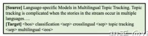
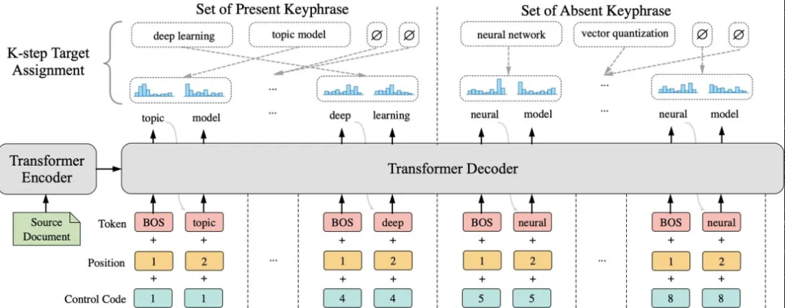

# 【关于 One2Set 】 那些你不知道的事

> 作者：杨夕
> 
> 项目地址：https://github.com/km1994/nlp_paper_study
> 
> 论文名称：One2Set: Generating Diverse Keyphrases as a Set
> 
> 论文：https://aclanthology.org/2021.acl-long.354/
>
> 代码：https://github.com/jiacheng-ye/kg_one2set
> 
> 会议：ACL2021
> 
> 个人介绍：大佬们好，我叫杨夕，该项目主要是本人在研读顶会论文和复现经典论文过程中，所见、所思、所想、所闻，可能存在一些理解错误，希望大佬们多多指正。

## 一、摘要

Recently,   the  sequence-to-sequence  modelshave made remarkable progress on the task ofkeyphrase  generation  (KG)  by  concatenatingmultiple  keyphrases  in  a  predefined  order  asa  target  sequence  during  training.   However,the  keyphrases  are  inherently  an  unorderedset rather than an ordered sequence. Imposinga predefined order will introduce wrong biasduring  training,  which  can  highly  penalizeshifts in the order between keyphrases. In thiswork,  we  propose  a  new  training  paradigmONE2SETwithout    predefining    an    orderto  concatenate  the  keyphrases.To  fit  thisparadigm,   we  propose  a  novel  model  thatutilizes  a  fixed  set  of  learned  control  codesas conditions to generate a set of keyphrasesin parallel.  To solve the problem that there isno  correspondence  between  each  predictionand   target   during   training,   we   propose   aK-step   target   assignment   mechanism   viabipartite  matching,   which  greatly  increasesthe diversity and reduces the duplication ratioof  generated  keyphrases.    The  experimentalresults  on  multiple  benchmarks  demonstratethat  our  approach  significantly  outperformsthe state-of-the-art methods

- 背景：最近，序列到序列模型通过在训练期间以预定义的顺序连接多个关键短语作为目标序列，在关键短语生成 (KG) 任务上取得了显着进展。
- 动机：**关键短语本质上是一个无序的集合而不是一个有序的序列**。强加预定义的顺序会在训练期间引入错误的偏差，这会严重惩罚关键短语之间的顺序变化。
- 论文方法：提出了一种新的训练范式ONE2SET，而无需预先定义连接关键短语的顺序。为了适应这种范式，我们提出了一种新模型，该模型利用一组固定的学习控制代码作为条件来并行生成一组关键短语。针对训练过程中每个预测与目标之间没有对应关系的问题，我们提出了一种通过二部匹配的K步目标分配机制，极大地增加了多样性并减少了生成的关键短语的重复率。

## 二、任务背景

### 2.1 什么是关键词生成任务的形式？

> 给一篇源文档（比如论文的摘要），关键词预测任务就是希望能预测出一些表达文档重点信息的关键词，或者更准确的说是关键短语。

### 2.2 关键词生成任务的类别？

- 类别一：present keyphrase 。表示 keyphrase 在 Doc 中；
- 类别二：absent keyphrase 。表示 keyphrase 不在 Doc 中；

### 2.3 关键词生成任务的两种方式？

#### 2.3.1 One2One

1. One2One 方法介绍

对于 One2One，将训练样本 (x，Y) 划分成多个样本对 ${(x,y^i)}_{i=1,...,y}$，这种划分方式使得：

- 在训练阶段，只能采用一个目标关键词作为 label；
- 在预测阶段，如果要生成多个关键词，就需要利用 beam search来生成多个关键词；

2. One2One 方法存在问题

- 忽略语义依赖问题：beam search生成的多个关键词之间也没有语义上的依赖性，可能生成语义重复的关键词。
- 数量固定问题：beam search数量往往给定，即不能为不同源文档 x 生成动态数量的关键词

#### 2.3.2 One2Seq

1. One2Seq 方法介绍

One2Seq 方法 将 所有的关键词按照一个给定的顺序（比如一般就是present在前，absent在后）连起来作为训练样本，也即训练样本为 $(x,f(y))$。

- 忽略语义依赖问题 可以通过看到前面预测关键词来实现；
- 数量固定问题：可以用最后的eos标签决定。

## 三、论文动机

One2Seq 方法虽然引入了一个 先验顺序函数 $f(y)$ 能够 解决 忽略语义依赖问题 和 数量固定问题，但是容易导致 和原始的数据样本并不一致问题。

用这种预定义的顺序函数会有以下几点问题：

- 一方面，之前有研究者发现不同的顺序函数会对结果有比较大的影响。尽管他们发现Appear-Ap策略（present关键词按照在文章中出现的先后顺序以此排列，absent关键词按照作者给的顺序连接到present关键词序列后面）会相对比其他几种策略好一些。如果关键词有顺序的话，这种顺序可能也未必是最好的选择。
- 另一方面，训练的时候引入预定的顺序函数很可能带来错误的偏置。如图3（a）所示，上面是目标序列（即 $f(y)$），下面是预测的序列。尽管模型预测对了这两个关键词本身，但是由于顺序和给定的不一样，模型还是会有很大的loss，也就是这种先验顺序会干扰模型学习真正要学的东西。

那为什么不可以让模型学会这个顺序函数，这样也就不会预测出topic model在前，deep learning在后的情况了？当然，如果模型真的能学会，那自然是没有问题的，但是模型实际上很难学会，原因如下：

- 一方面，训练集中不能保证都是topic model在前，deep learning在后，这可称之为多模式问题（multi-modality problem)。这在其他任务，比如非自回归机器翻译以及对话的回复生成中也会遇到类似问题，模型很可能学到一个错误的中间状态。
- 另一方面，模型确实很难学这个顺序。比如后面的absent关键词序列部分是按照作者给定的先后顺序连接的，而不同作者给的顺序依据也是不一样的，有的作者可能就是按照重要性给，有的就是按照技术、领域等topic给，有的可能就是比较随意地给，那么这也就要求模型去拟合不同作者的这一特征，而这在没有作者信息的情况下是很难的（引入作者信息是一个方向）。

> **「所以，既然这个顺序函数f会带来那么多问题，而且更重要的是数据本身就是没有这个东西的，那我们能不能不引人顺序函数来进行训练和预测呢？」**

这也就引出了我们的做法，我们希望在训练和预测的时候都和顺序无关，而只关注在每个关键词本身上。如图3（b），简单来说，在One2Set范式下，模型的训练样本就是原样本 (x,Y)。

## 四、模型介绍

在One2Set范式下，我们提出了SetTrans (Set prediction model based on Transformer) 模型（图4），该模型模型主要解决以下问题：

- 如何生成一个集合而不是一个序列？
- 生成的集合和目标集合的loss怎么算？
- 如何考虑到预测的依赖问题和动态数量问题？

为了解决第一个问题，我们引入 N个控制编码（Control Code），每个控制编码对应生成一个集合元素，这样我们就生成了包含 N 个关键词的集合。

为了解决第二个问题，也就是给定包含 N 个预测关键词的集合，如何与包含 M 个关键词的目标集合计算loss。这里我们假设预定义的 N 的取值始终大于等于 M（即统计数据集中文档的关键词最多有几个）。然后，我们用  ϕ 元素加进 M 中，使得两个集合元素数量相等，这样我们只需为他们进行最优的一对一匹配（匈牙利算法可解），然后匹配完之后就能计算loss了。其中，每个预测关键词与目标关键词的匹配得分可以定义为目标关键词在预测分布中的概率之和。

针对第三个问题，依赖问题可以一定程度上在训练时让control code隐式学习到，动态数量问题可以通过去掉预测的 ϕ 元素解决。

此外，还有几个细节问题：

- 由于匹配目标前是不知道target是哪个的，于是只能自回归预测，但是开始阶段模型不会预测出<eos>，就是个冷启动的问题。这边令每个控制编码只预测 K 步（如图中 K-2 ），然后用这  个和每个target关键词的前  个算score。
- 在匹配完之后，由于每个control code都只对应自回归成了 K 个，如果直接给监督的话信息不完整，而且是一种student-forcing的形式，效果会很差（见消融实验倒数第二行）。这边选择在匹配完之后teacher-forcing地再过一遍算loss。
- 这边在匹配目标的时候present和absent两个集合的时候分开考虑（Separate Set Loss），也就是一半的control code只会和present关键词做匹配，另一半的control code只会和absent关键词做匹配。这样好处是让这两部分的control code学到present和absent预测中不同的偏置（present部分的control code会更倾向于指导模型去copy原文内容，absent部分则倾向于指导模型自己归纳生成）。这可以看成是一种在输入端而不是和常见的在输出端做区分的multi-task。（见消融实验最后一行）

## 参考地址

1. [One2Set: Generating Diverse Keyphrases as a Set](https://aclanthology.org/2021.acl-long.354/)
2. [kg_one2set](https://github.com/jiacheng-ye/kg_one2set)
3. [ACL2021 | 把关键词生成看成集合预测问题](https://mp.weixin.qq.com/s/BmJaobaX7SGBqQIOdREYrg)

