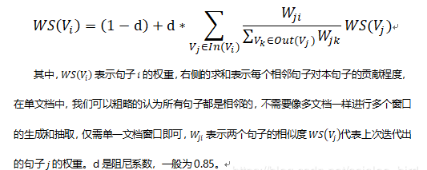

# 【关于 关键词提取】 那些你不知道的事

> 作者：杨夕
> 
> 项目地址：https://github.com/km1994/nlp_paper_study
> 
> 个人介绍：大佬们好，我叫杨夕，该项目主要是本人在研读顶会论文和复现经典论文过程中，所见、所思、所想、所闻，可能存在一些理解错误，希望大佬们多多指正。

- [【关于 关键词提取】 那些你不知道的事](#关于-关键词提取-那些你不知道的事)
  - [一、TF-IDF关键词提取算法](#一tf-idf关键词提取算法)
    - [1.1 理论基础](#11-理论基础)
    - [1.2 计算公式](#12-计算公式)
      - [1.2.1 词频 （Term Frequency，TF）](#121-词频-term-frequencytf)
      - [1.2.2 逆文本频率(Inverse Document Frequency，IDF)](#122-逆文本频率inverse-document-frequencyidf)
      - [1.2.3 TF-IDF](#123-tf-idf)
    - [1.3 应用](#13-应用)
    - [1.4 实战篇](#14-实战篇)
      - [1.4.1 TF-IDF算法 手撸版](#141-tf-idf算法-手撸版)
      - [1.4.2 TF-IDF算法 Sklearn 版](#142-tf-idf算法-sklearn-版)
      - [1.4.3 TF-IDF算法 jieba 版](#143-tf-idf算法-jieba-版)
  - [二、PageRank算法【1】](#二pagerank算法1)
    - [2.1 理论学习](#21-理论学习)
  - [三、TextRank算法【2】](#三textrank算法2)
    - [3.1 理论学习](#31-理论学习)
    - [3.2 实战篇](#32-实战篇)
      - [3.2.1 基于Textrank4zh的TextRank算法版](#321-基于textrank4zh的textrank算法版)
      - [3.2.2 基于jieba的TextRank算法实现](#322-基于jieba的textrank算法实现)
      - [3.2.3 基于SnowNLP的TextRank算法实现](#323-基于snownlp的textrank算法实现)
  - [参考](#参考)

## 一、TF-IDF关键词提取算法

### 1.1 理论基础

- 类型：一种统计方法
- 作用：用以评估句子中的某一个词（字）对于整个文档的重要程度；
- 重要程度的评估：
  - 对于 句子中的某一个词（字）随着其在整个句子中的出现次数的增加，其重要性也随着增加；（正比关系）【体现词在句子中频繁性】
  - 对于 句子中的某一个词（字）随着其在整个文档中的出现频率的增加，其重要性也随着减少；（反比关系）【体现词在文档中的唯一性】
- 重要思想：
  - 如果某个单词在一篇文章中出现的频率TF高，并且在其他文章中很少出现，则认为此词或者短语具有很好的类别区分能力，适合用来分类；

### 1.2 计算公式

#### 1.2.1 词频 （Term Frequency，TF）

- 介绍：体现 词 在 句子 中出现的频率；
- 问题：
  - 当一个句子长度的增加，句子中 每一个 出现的次数 也会随之增加，导致该值容易偏向长句子；
  - 解决方法：
    - 需要做归一化（词频除以句子总字数）
- 公式


#### 1.2.2 逆文本频率(Inverse Document Frequency，IDF)

- 介绍：体现 词 在文档 中出现的频率
- 方式：某一特定词语的IDF，可以由总句子数目除以包含该词语的句子的数目，再将得到的商取对数得到；
- 作用：如果包含词条t的文档越少, IDF越大，则说明词条具有很好的类别区分能力
- 公式：


#### 1.2.3 TF-IDF

- 介绍：某一特定句子内的高词语频率，以及该词语在整个文档集合中的低文档频率，可以产生出高权重的TF-IDF。因此，TF-IDF倾向于过滤掉常见的词语，保留重要的词语。
- 优点：
  - 容易理解；
  - 容易实现；
- 缺点：
  - 其简单结构并没有考虑词语的语义信息，无法处理一词多义与一义多词的情况


### 1.3 应用

- 搜索引擎；
- 关键词提取；
- 文本相似性；
- 文本摘要

### 1.4 实战篇

#### 1.4.1 TF-IDF算法 手撸版

> TF-idf 函数复现

```python
# 函数说明：特征选择TF-IDF算法
def tfidf_feature_select(list_words):
    """
        函数说明：特征选择TF-IDF算法
        Parameters:
            list_words:词列表
        Returns:
            dict_feature_select:特征选择词字典
    """
    sent_keyword_list = []
    for word_list in list_words:
        #总词频统计
        doc_frequency=defaultdict(int)
        for i in word_list:
            doc_frequency[i]+=1
 
        #计算每个词的TF值
        word_tf={}  #存储没个词的tf值
        for i in doc_frequency:
            word_tf[i]=doc_frequency[i]/sum(doc_frequency.values())

        #计算每个词的IDF值
        doc_num=len(list_words)
        word_idf={} #存储每个词的idf值
        word_doc=defaultdict(int) #存储包含该词的文档数
        for i in doc_frequency:
            for j in list_words:
                if i in j:
                    word_doc[i]+=1
        for i in doc_frequency:
            word_idf[i]=math.log(doc_num/(word_doc[i]+1))

        #计算每个词的TF*IDF的值
        word_tf_idf={}
        for i in doc_frequency:
            word_tf_idf[i]=word_tf[i]*word_idf[i]
 
        # 对字典按值由大到小排序
        dict_feature_select=sorted(word_tf_idf.items(),key=operator.itemgetter(1),reverse=True)
        sent_keyword_list.append(dict_feature_select[0:5])
    return sent_keyword_list
```

> 函数调用

```python
print(f"docs[0:1]:{docs[0:1]}")
>>>
[['中国', '本周', '新冠', '疫情', '中国', '包括', '北京', '疫情', '本周', '北京', '中国', '当局']]

features=tfidf_feature_select(docs) #所有词的TF-IDF值
print(len(features))
for feature in features:
    print(feature)
>>>
100
[('北京', 0.44321000615546297), ('本周', 0.3837641821656743), ('疫情', 0.2767885344702751), ('中国', 0.24856306833596672), ('当局', 0.23445089306333636)]
[('香港', 0.8666204143875924), ('本周', 0.26568289534546685), ('反对', 0.19428681879294274), ('BBC', 0.16979037793767088), ('回应', 0.10227923218972224)]
[('点', 0.6743380571769196), ('本周', 0.17712193023031123), ('经济', 0.17712193023031123), ('疫情', 0.12774855437089622), ('7', 0.12004982678958988)]
[('爆发', 0.21022682621431513), ('香港', 0.16941451709832633), ('北京', 0.13996105457540936), ('月', 0.10754223658231381), ('气溶胶', 0.10511341310715756)]
[('当局', 0.29614849650105646), ('6', 0.1748138112443843), ('不明', 0.15767011966073635), ('爆发', 0.15767011966073635), ('事件', 0.15767011966073635)]
...
```

#### 1.4.2 TF-IDF算法 Sklearn 版

```python
from sklearn.feature_extraction.text import CountVectorizer
from sklearn.feature_extraction.text import TfidfVectorizer
docs_list = [" ".join(doc) for doc in docs]

#该类会统计每个词语的tf-idf权值
tf_idf_Vectorizer = TfidfVectorizer()
#将文本转为词频矩阵并计算tf-idf
tfidf_mat  = tf_idf_Vectorizer.fit_transform(docs_list)
vocab_dict =tf_idf_Vectorizer.vocabulary_#获得所有文本的关键字和其位置的dict
#将tf-idf矩阵抽取出来，元素a[i][j]表示j词在i类文本中的tf-idf权重
weight = tfidf_mat.toarray()
feat = np.argsort(-weight)#降序排序
total_key_word = []
for l in range(len(docs_list)):
    values_word = []
    for j in range(5):#获取每类文本的5个关键字
        keyword = [k for k,v in vocab_dict.items() if v ==feat[l,j]]
        values_word.append(keyword[0])
    total_key_word.append(values_word)

for key_word in total_key_word:
    print(key_word)
>>>
['北京', '本周', '中国', '疫情', '当局']
['香港', '本周', '反对', 'bbc', '回应']
['本周', '经济', '中国', '疫情', '支持']
['爆发', '香港', '北京', '病毒', '疫情']
['当局', '中国', '事件', '爆发', '不明']
...
```


#### 1.4.3 TF-IDF算法 jieba 版

```python
import jieba.analyse
 
text='关键词是能够表达文档中心内容的词语，常用于计算机系统标引论文内容特征、信息检索、系统汇集以供读者检阅。关键词提取是文本挖掘领域的一个分支，是文本检索、文档比较、摘要生成、文档分类和聚类等文本挖掘研究的基础性工作'

for doc in docs_list:
    keywords=jieba.analyse.extract_tags(doc, topK=5, withWeight=True, allowPOS=())
    print(keywords)
>>>
[('疫情', 1.3477578533583332), ('新冠', 0.9962306252416666), ('本周', 0.972621126705), ('北京', 0.7779003847866667), ('中国', 0.756830171665)]
[('香港', 1.6952004552875), ('BBC', 0.9962306252416666), ('本周', 0.72946584502875), ('反对', 0.46703171161083334), ('回应', 0.3104253012429167)]
[('疫情', 1.0782062826866665), ('新冠', 0.7969845001933333), ('BBC', 0.7969845001933333), ('本周', 0.778096901364), ('中国', 0.605464137332)]
[('新冠', 0.9195975002230768), ('疫情', 0.6220420861653846), ('爆发', 0.607387069014359), ('病毒', 0.5705823308092308), ('气溶胶', 0.5367533562820512)]
...
```

## 二、PageRank算法【1】

### 2.1 理论学习

- 论文：[The PageRank Citation Ranking: Bringing Order to the Web](http://ilpubs.stanford.edu:8090/422/1/1999-66.pdf)
- 介绍：通过计算网页链接的数量和质量来粗略估计网页的重要性，算法创立之初即应用在谷歌的搜索引擎中，对网页进行排名；
- 核心思想：
  - 链接数量：如果一个网页被越多的其他网页链接，说明这个网页越重要，即该网页的PR值（PageRank值）会相对较高；
  - 链接质量：如果一个网页被一个越高权值的网页链接，也能表明这个网页越重要，即一个PR值很高的网页链接到一个其他网页，那么被链接到的网页的PR值会相应地因此而提高；
- 计算公式


> S(V_i) ： 网页 i 的 重要性；
> 
> d：托尼系数；
> 
> ln(V_i)：整个互联网中所存在的有指向网页 i 的链接的网页集合；
> 
> Out(V_j)： 网页 j 中存在的指向所有外部网页的链接的集合；
> 
> Out(V_j)：该集合中元素的个数；

## 三、TextRank算法【2】

### 3.1 理论学习

- 论文：[TextRank: Bringing Order into Texts](https://web.eecs.umich.edu/~mihalcea/papers/mihalcea.emnlp04.pdf)
- 介绍：一种基于图的用于关键词抽取和文档摘要的排序算法，由谷歌的网页重要性排序算法PageRank算法改进而来，它利用一篇文档内部的词语间的共现信息(语义)便可以抽取关键词，它能够从一个给定的文本中抽取出该文本的关键词、关键词组，并使用抽取式的自动文摘方法抽取出该文本的关键句；
- 基本思想：将文档看作一个词的网络，该网络中的链接表示词与词之间的语义关系；
- 计算公式：



- pageRank vs TextRank
  - PageRank算法根据网页之间的链接关系构造网络，TextRank算法根据词之间的共现关系构造网络；
  - PageRank算法构造的网络中的边是有向无权边，TextRank算法构造的网络中的边是无向有权边。

### 3.2 实战篇

#### 3.2.1 基于Textrank4zh的TextRank算法版

> 函数

```python
from textrank4zh import TextRank4Keyword, TextRank4Sentence
import pandas as pd
import numpy as np
 
# 功能：关键词抽取
def keywords_extraction(text):
    '''
      功能：关键词抽取
    '''
    tr4w = TextRank4Keyword(allow_speech_tags=['n', 'nr', 'nrfg', 'ns', 'nt', 'nz'])
    # allow_speech_tags   --词性列表，用于过滤某些词性的词
    tr4w.analyze(text=text, window=2, lower=True, vertex_source='all_filters', edge_source='no_stop_words',
                 pagerank_config={'alpha': 0.85, })
    # text    --  文本内容，字符串
    # window  --  窗口大小，int，用来构造单词之间的边。默认值为2
    # lower   --  是否将英文文本转换为小写，默认值为False
    # vertex_source  -- 选择使用words_no_filter, words_no_stop_words, words_all_filters中的哪一个来构造pagerank对应的图中的节点
    #                -- 默认值为`'all_filters'`，可选值为`'no_filter', 'no_stop_words', 'all_filters'
    # edge_source  -- 选择使用words_no_filter, words_no_stop_words, words_all_filters中的哪一个来构造pagerank对应的图中的节点之间的边
    #              -- 默认值为`'no_stop_words'`，可选值为`'no_filter', 'no_stop_words', 'all_filters'`。边的构造要结合`window`参数
 
    # pagerank_config  -- pagerank算法参数配置，阻尼系数为0.85
    keywords = tr4w.get_keywords(num=6, word_min_len=2)
    # num           --  返回关键词数量
    # word_min_len  --  词的最小长度，默认值为1
    return keywords
 
# 功能：关键短语抽取
def keyphrases_extraction(text):
    '''
      功能：关键短语抽取
    '''
    tr4w = TextRank4Keyword()
    tr4w.analyze(text=text, window=2, lower=True, vertex_source='all_filters', edge_source='no_stop_words',
                 pagerank_config={'alpha': 0.85, })
    keyphrases = tr4w.get_keyphrases(keywords_num=6, min_occur_num=1)
    # keywords_num    --  抽取的关键词数量
    # min_occur_num   --  关键短语在文中的最少出现次数
    return keyphrases
 
# 功能：关键句抽取
def keysentences_extraction(text):
    '''
      功能：关键句抽取
    '''
    tr4s = TextRank4Sentence()
    tr4s.analyze(text, lower=True, source='all_filters')
    # text    -- 文本内容，字符串
    # lower   -- 是否将英文文本转换为小写，默认值为False
    # source  -- 选择使用words_no_filter, words_no_stop_words, words_all_filters中的哪一个来生成句子之间的相似度。
    # 		  -- 默认值为`'all_filters'`，可选值为`'no_filter', 'no_stop_words', 'all_filters'
    # sim_func -- 指定计算句子相似度的函数
 
    # 获取最重要的num个长度大于等于sentence_min_len的句子用来生成摘要
    keysentences = tr4s.get_key_sentences(num=3, sentence_min_len=6)
    return keysentences
```

> 函数调用

```python
for text in origin_docs:
    #关键词抽取
    keywords=keywords_extraction(text)
    print(keywords)
 
    #关键短语抽取
    keyphrases=keyphrases_extraction(text)
    print(keyphrases)
 
    #关键句抽取
    keysentences=keysentences_extraction(text)
    print(keysentences)

>>>
[{'word': '香港', 'weight': 0.1285260989050496}, {'word': '移民', 'weight': 0.07779005833762835}, {'word': '入籍', 'weight': 0.05570067956084056}, {'word': '法律', 'weight': 0.04878048780487805}, {'word': '重点', 'weight': 0.04878048780487805}, {'word': '护照', 'weight': 0.04878048780487805}]
['香港移民']
[{'index': 2, 'sentence': '西方国家对香港《国安法》反应强烈，此前英国承诺为香港BNO护照持有者开启移民入籍路径，本周BBC中文采访探讨这一政策是否会导致香港移民潮', 'weight': 0.26955405823175094}, {'index': 3, 'sentence': '本周澳大利亚政府也推出一系列措施，作为回应，包括暂停与香港的引渡协议、更新旅游建议以及为香港居民提供签证便利等', 'weight': 0.20413024124428358}, {'index': 4, 'sentence': '中国则对两国的干涉表示反对，称澳方成天把反对"外国干涉"挂在嘴边，却在涉港问题上说三道四，充分暴露了其虚伪性和双重标准', 'weight': 0.2}]
...
```

#### 3.2.2 基于jieba的TextRank算法实现

> 方法介绍

```python
import jieba.analyse
def keywords_textrank(text):
    keywords = jieba.analyse.textrank(text, topK=6)
    return keywords

for text in origin_docs:
    #关键词抽取
    keywords=keywords_textrank(text)
    print(keywords)

>>>
['中国', '北京', '疫情', '公平性', '股市', '高考']
['香港', '移民', '虚伪性', '干涉', '相关', '机构']
['经济', '中国', '股市', '暴涨', '疫情', '上涨']
['病毒', '新冠', '爆发', '北京', '气溶胶', '传播']
['中国', '当局', '文章', '带走', '疫情', '知识分子']
...
```

#### 3.2.3 基于SnowNLP的TextRank算法实现

```python
from snownlp import SnowNLP
for text in origin_docs:
    # 基于SnowNLP的textrank算法实现
    snlp=SnowNLP(text)
    print(snlp.keywords(5))  #关键词抽取
    print(snlp.summary(3))   #关键句抽取
>>>
['中国', '高考', '年', '疫情', '一月']
['因新冠疫情延期一月的中国高考拉开帷幕', '北京新一轮疫情得到控制', '最近几年他发表多篇文章批评中国当局']
['香港', '反对', '移民', '干涉', '本周']
['本周BBC中文采访探讨这一政策是否会导致香港移民潮', '香港《国安法》在香港和海外持续发酵', '西方国家对香港《国安法》反应强烈']
['中国', '连续', '月', '疫情', '年']
['中国股市沪深300指数已连续七个交易日上涨', '中国股市在7月初则迎来一轮暴涨', '促使本轮股市上涨']
...
```

## 参考

1. [The PageRank Citation Ranking: Bringing Order to the Web](http://ilpubs.stanford.edu:8090/422/1/1999-66.pdf)
2. [TextRank: Bringing Order into Texts](https://web.eecs.umich.edu/~mihalcea/papers/mihalcea.emnlp04.pdf)