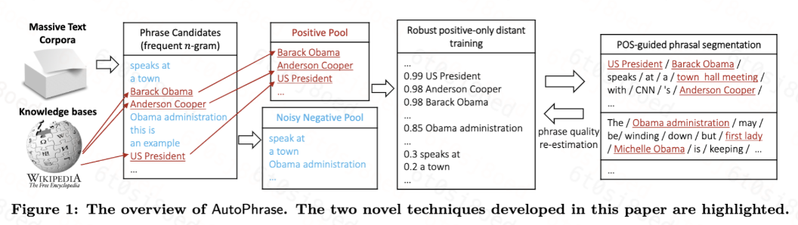
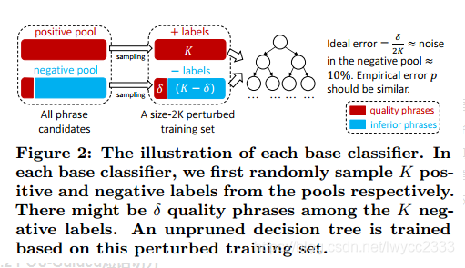
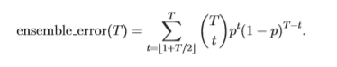
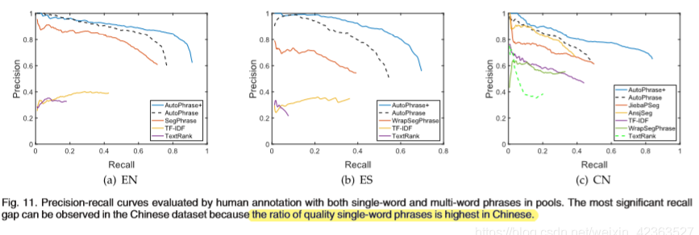

# 【关于 AutoPhrase】那些你不知道的事

> 作者：杨夕 </br>
> 论文：AutoPhrase: Automated Phrase Mining from Massive Text Corpora</br>
> 会议：IEEE</br>
> 论文地址：https://arxiv.org/abs/1702.04457</br>
> 源码 C++ 版本：https://github.com/shangjingbo1226/AutoPhrase</br>
> 源码 Python 版本：https://github.com/luozhouyang/AutoPhraseX</br>
> 个人github：https://github.com/km1994/nlp_paper_study </br>
> NLP百面百搭：https://github.com/km1994/NLP-Interview-Notes</br>

## 一、前言

- 什么是 Phrase Mining？

答：Phrase Mining 作为文本分析的基本任务之一，旨在从文本语料库中提取高质量的短语。

- Phrase Mining 有何用途？

短语挖掘在各种任务中都很重要，例如信息提取/检索、分类法构建和主题建模。

- Phrase Mining 现状？

大多数现有方法依赖于复杂的、训练有素的语言分析器，因此在没有额外但昂贵的适应的情况下，可能在新领域和流派的文本语料库上表现不佳。

虽然也有一些数据驱动的方法来从大量特定领域的文本中提取短语。

- Phrase Mining 存在问题？

1. 非 自动化
2. 需要人类专家来设计规则或标记短语
3. 依赖于 语言分析器
4. 应用到新的领域效果不好

- 论文方法 ？

1. 提出 **新框架 AutoPhrase**：用于自动短语挖掘，利用大量的高质量短语，性能提高。
2. 开发 **POS-Guided短语分割**：当 POS 标记器可用时，该模型在词性 (POS) 标签中结合了浅层句法信息以进一步提高性能。

- 论文效果 ？

AutoPhrase可以支持任何语言，只要该语言中有通用知识库。与当下最先进的方法比较，新方法在跨不同领域和语言的5个实际数据集上的有效性有了显著提高。

## 二、什么是 Phrase Mining？

- 介绍：在给定语料库(如研究论文和新闻)中自动提取高质量短语(如科学术语和一般实体名称)的过程。

```s
    输入：语料库（特定语言和特定领域的文本单词序列，长度任意）和知识库
    输出：一个按质量递减排列的短语列表
```

- 需要满足以下特性
  - 流行性：质量短语要多次出现在给定的文本库中
  - 信息性：如果该短语表示特定的主题或概念，则它是提供信息的
  - 独立性：在给定的文档中，高质量的单字短语很可能是完整的语义单元

## 三、AutoPhrase 方法介绍



### 3.1 Robust Positive-Only Distant Training

#### 3.1.1 动机

传统的 Phrase Mining 方法 需要利用人工评估 每一个质量短语的质量分数；

#### 3.1.2 方法介绍

利用已有的知识库（如Wikipedia）做远程监督训练

#### 3.1.3 思路

##### 3.1.3.1 利用输入语料和知识库 构建 训练样本池

1. 对 输入语料 进行 n-gram 处理，然后 筛选出 高频n-gram；
2. 对于 高频n-gram，判断 其是否在 公共知识库（例如维基百科）中：
   1. 若在，将其 加入 positive pool 中；
   2. 若不在，将其 加入 用于填充嘈杂的 negative pool 中；

##### 3.1.3.2 负样本去躁、训练分类器

- 动机：在 第一步中，主要 通过 判断 高频n-gram 是否在 公共知识库（例如维基百科）中，来判定 其 是不是 高质量的 Phrase，但是这种方式 会 遗漏掉一些 不存在于公共知识库 的高质量短语，那么如何解决该问题呢？
- 解决方法：构建一个 集成分类器（本文采用随机森林），来平均T独立训练的基分类器的结果，以减低 噪声对训练结果的影响



1. 对每一个基本分类器，从 positive pool 和 negative pool 各抽取 K 个样本，即2K个样本作为一个扰动数据集
2. 在扰动数据集上用不经过裁剪的决策树进行训练，假设在扰动数据集上负样本的噪音个数为δ，只要不存在特征完全相同的正样本和负样本，模型在扰动数据集上能够取得100%准确率，由于δ是噪音，所以最理想的准确率是1-δ/2K(在论文中，δ/2K 约等于10%，所以最佳准确率为90%，就是每个基分类器完全过拟合的情况下准确率是90%)
3. 随机森林中的决策树判断比例作为分数（投票比例）



##### 3.1.3.3 计算 评估score

对输入语料中的高频n-gram进行分类，得到n-gram是质量短语的评估score

### 3.2 POS-Guided Phrasal Segmentation

#### 3.2.1 动机

虽然 可以利用 评估score 来评估 高质量 Phrase ，但是如何才能保证其准确性呢？

#### 3.2.2 核心思想

- 目标：利用 POS 来提升 抽取的 Phrase 的 准确性

```s
    eg：如果连续三个名词相连，那么很有可能是高质量短语，名词+动词大概率不是一个质量短语(主谓结构)
```

- 核心思想：

1. 根据 POS 进行分割，将文本划分成若干个短语（有点类似中文分词得意思，只不过分的是短语，因为前面我们得到的 n-gram 可能是一个不成词没有意义的序列）

```s
    输入：词性序列Ω、第一次质量短语评估的score
    输出：根据 POS 分割的边界序列B
```

2. 利用 极大似然法 进行分割

在给定 POS 序列Ω 的情况下，每个片段是高质量短语的概率乘积是最大的，那么就是最优分割


### 3.3 短语质量评估score修正

经过POS-Guided分割之后，对短语质量进行第二次评估，修正第一次评估的score，选取修正后的score比较高的作为质量短语输出

## 四、Complexity Analysis

框架中最耗时的部分如n-gram、特征提取、POS短语分割的时间复杂度，均为O(||)，并假设短语中最大单词是一个小常熟，其中||是语料中单词的总数。因此，每个组件可以以无固定的方式通过短语或句子分组进行合并。

## 五、实验结果

实验部分，采用相似的人工注释，不同的是，从每种方法的返回短语中随机抽取了500个Wiki-uncovered短语。因此，就有了新的EN，ES，CN数据集，类内关系超过0.9。

从图中可以看出明显的优势，在中文数据集中可以观察到最显着的recall间隔，因为中文中优质单词短语的比例最高。



## 六、结论

本篇文章 提出了 Automated Phrase Mining 框架，其中运用两种新的刚发：远程训练和POS短语分割，实验表明AutoPhrase优于其他短语分割的方法并且支持多种语言，此外单个词短语10%-30%的召回中效果较好。


## 参考

1. [AutoPhrase: Automated Phrase Mining from Massive Text Corpora](https://arxiv.org/abs/1702.04457)
2. [Automated Phrase Mining from Massive Text Corpora 论文解读](https://www.cnblogs.com/zhangkl/p/14325589.html)
4. [Automated Phrase Mining from Massive 论文笔记](https://blog.csdn.net/lwycc2333/article/details/88313866)
5. [谈谈医疗健康领域的Phrase Mining](https://zhuanlan.zhihu.com/p/69361556)


